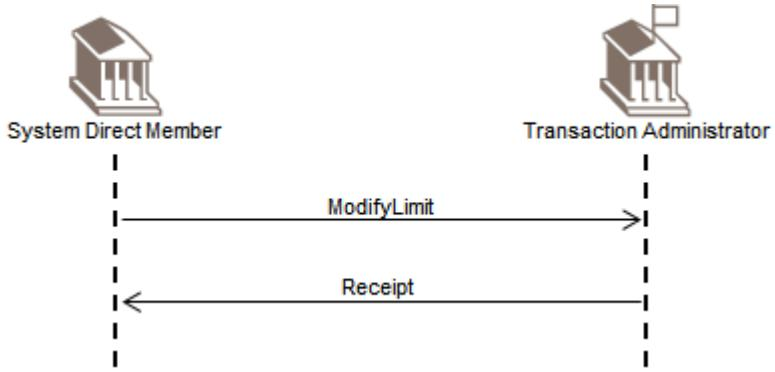
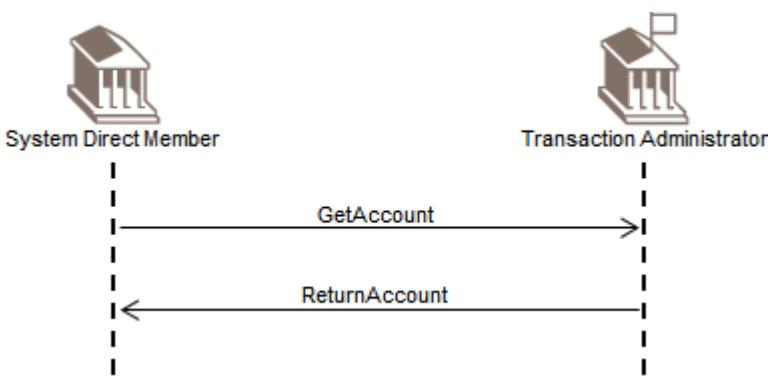
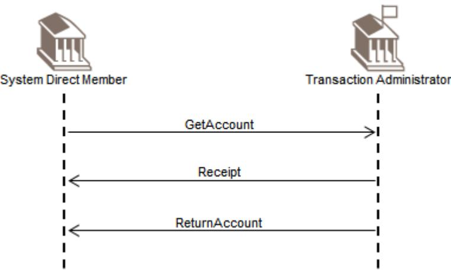
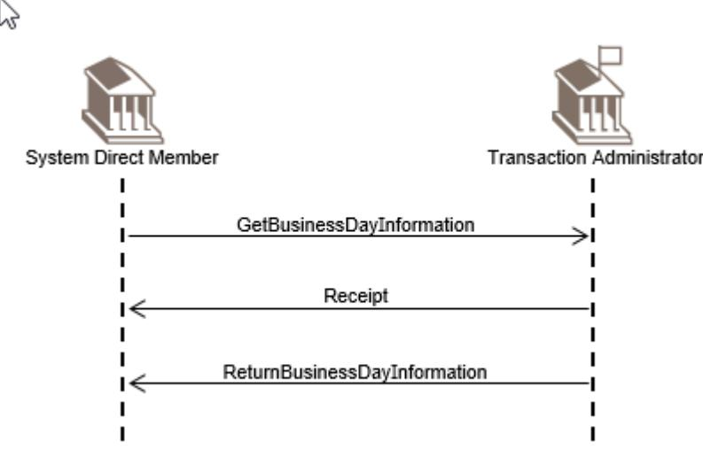

ISO 20022

Cash Management - Maintenance 2024 - 2025

Message Definition Report - Part 1

Approved by the Payments SEG on 4 February 2025

This document provides information about the use of the messages for Cash Management and includes, for example, business scenarios and messages flows.

February 2025

Table of Contents

[Table of Contents 2](#page-0-0)

[1 Introduction 5](#page-1-0)

- [1.1 Terms and Definitions 5](#page-1-1)
- [1.2 Abbreviations and Acronyms 5](#page-1-2)
- [1.3 Document Scope and Objectives 5](#page-2-0)
- [1.4 References 6](#page-2-1)
- [2 Scope and Functionality 7](#page-3-0)
- [2.1 Background 7](#page-3-1)
- [2.2 Scope 7](#page-3-2)
- [3 BusinessRoles and Participants 10](#page-8-0)
- [3.1 Participants and BusinessRoles Definitions 10](#page-8-1)
- [3.2 BusinessRoles and Participants Table 11](#page-10-0)
- [4 BusinessProcess Description 12](#page-10-1)
- [5 BusinessTransactions 13](#page-11-0)
- [5.1 How to use the Cash Management Messages 13](#page-11-1)
- [5.2 Liquidity Management 17](#page-16-0)
- [5.3 Transaction 18](#page-18-0)
- [5.4 Limit management 20](#page-20-0)
- [5.5 Reservation management BusinessTransactions 23](#page-23-0)
- [5.6 Account management 26](#page-26-0)
- [5.7 System Status 27](#page-28-0)
- [5.8 Standing Orders BusinessTransactions 33](#page-34-0)

[6 Revision Record 37](#page-38-0)

Preliminary Note

The Message Definition Report (MDR) is made of three parts:

MDR Part 1

This describes the contextual background required to understand the functionality of the proposed message set. Part 1 is produced by the submitting organisation that developed or maintained the message set in line with an MDR Part 1 template provided by the ISO 20022 Registration Authority (RA) on [www.iso20022.org](http://www.iso20022.org).

#### MDR Part 2

This is the detailed description of each message definition of the message set. Part 2 is produced by the RA using the model developed by the submitting organisation.

#### MDR Part 3

This is an extract if the ISO 20022 Business Model describing the business concepts used in the message set. Part 3 is an Excel document produced by the RA.

# **Introduction**

### **Terms and Definitions**

The following terms are reserved words defined in ISO 20022 Edition 2013 – Part1. When used in this document, the UpperCamelCase notation is followed.

| Term                | Definition                                                                                                                                                                                                                                        |
|---------------------|---------------------------------------------------------------------------------------------------------------------------------------------------------------------------------------------------------------------------------------------------|
| BusinessRole        | Functional role played by a business actor in a particular BusinessProcess or BusinessTransaction.                                                                                                                                             |
| Participant         | Involvement of a BusinessRole in a BusinessTransaction.                                                                                                                                                                                           |
| BusinessProcess     | Definition of the business activities undertaken by BusinessRoles within a BusinessArea whereby each BusinessProcess fulfils one type of business activity and whereby a BusinessProcess may include and extend other BusinessProcesses. |
| BusinessTransaction | Particular solution that meets the communication requirements and the interaction requirements of a particular BusinessProcess and BusinessArea.                                                                                            |
| MessageDefinition   | Formal description of the structure of a message instance.                                                                                                                                                                                        |

### **Abbreviations and Acronyms**

The following is a list of abbreviations and acronyms used in the document.

| Abbreviation/Acronyms | Definition                    |
|-----------------------|-------------------------------|
| camt                  | Cash Management business area |

## **Document Scope and Objectives**

This document is the first part of the Cash Management Message Definition Report (MDR) that describes the BusinessTransactions and underlying message set. For the sake of completeness, the document may also describe BusinessActivities that are not in the scope of the business processes covered in this document.

This document describes the following:

- the BusinessProcess scope •
- the BusinessRoles involved in these BusinessProcesses •

The main objectives of this document are as follows:

- to provide information about the messages that support the business processes •
- to explain the BusinessProcesses and BusinessActivities these messages have addressed •
- to give a high level description of BusinessProcesses and the associated BusinessRoles •
- to document the BusinessTransactions •

The messages definitions are specified in Message Definition Report Part 2.

## **References**

| Document                                                                                     | Version | Date       | Author |
|----------------------------------------------------------------------------------------------|---------|------------|--------|
| Cash Management Business Justification #9, endorsed by the Payments SEG with comments     |         | 2005-11-04 | SWIFT  |
| Cash Management Maintenance Proposal                                                         |         | 2017-11-10 | SWIFT  |
| ISO 20022 Maintenance Change Request (MCR #170) document (Payments Maintenance 2020/2021) |         | 2019-08-31 | SWIFT  |

| ISO 20022 Maintenance Change Request (MCR #208) document (Payments Maintenance 2022/2023) | 2022 | 2022-08-31 | SWIFT |
|----------------------------------------------------------------------------------------------|------|------------|-------|
| ISO 20022 Maintenance Change Request (MCR #234) document (Payments Maintenance 2023/2024) | 2023 | 2023-08-31 | SWIFT |
| ISO 20022 Maintenance Change Request (MCR #252) document (Payments Maintenance 2024/2025) |      | 2024-08-31 | Swift |

# **Scope and Functionality**

## **Background**

This Message Definition Report covers a set of thirty-five ISO 20022 MessageDefinitions, developed by SWIFT in close collaboration with cash market infrastructures and cash service providers and approved by the ISO 20022 Payments Standards Evaluation Group (SEG) in February 2025.

These MessageDefinitions are specifically designed to support payment transactions intraday in real-time to address the increase regulatory pressure on managing settlement risk, monitoring the centralisation of liquidity management and treasury functions and the integration of securities settlement systems with payment settlement systems.

## **Scope**

In recent years, the need for financial institutions to manage payment transactions intra-day in real-time across currencies has become a reality. Financial institutions face growing volumes in domestic and cross-border real-time payment settlement systems. They must have the means to adequately address the following areas of concern: the increased regulatory pressure on managing settlement risk, monitoring the centralisation of liquidity management and treasury functions and the integration of securities settlement systems with payment settlement systems.

Clients that are not financial institutions, in turn, will be expressing similar needs, and expect their service providers to offer such capabilities. These needs translate into a requirement to have the ability to obtain near real-time information on account balances and transactions held with account servicing institutions, whether they are individual financial institutions or clearing and settlement systems. It may also require more advanced services, such as the ability to cancel, suspend or modify, in near real-time, payment transactions with service providers and settlement systems, in order to better manage risk and liquidity.

In addition to the implementation of payment-processing applications that are capable of operating in a real-time environment, and account owners implementing risk and liquidity management applications capable of using the information provided, solutions will be required to transport and deliver the information.

The solutions available to the banking industry to address these needs, are currently proving unsatisfactory, either due to a lack of standardisation in the case of proprietary solutions, or due to the lack of suitable standards and real-time capabilities in the case of industry solutions, such as SWIFT's FIN messaging.

Driven by the aforementioned business rationale, SWIFT has developed the Cash Management set of messages. This Message Definition Report describes a standardised message set, covering the cash management business area, cash reporting transaction management and the exchange of information on the cash side of financial transactions.

The scope of the Cash Management messages set is very varied. It ranges from information on transactions and balances to actions to manage flow of transactions submitted by the member to the transaction administrator, but also from information on the system status and features to actions to manage the liquidity and reservation limits.

These messages may be exchanged at pre-agreed times, upon request of the account owner or at the initiative of the account servicing institution, that is either triggered by a request from the account owner ('pull' mechanism), or initiated by the account servicing institution ('push' mechanism).

All the messages in the Cash Management set have a common purpose: to cater for the exchange of information between an account owner and its account servicing institution.

It is important to realise that the term 'account owner' can refer either to a financial institution, or to a corporate customer or to a private individual, and that the term 'account servicing institutioni is referring to either a financial institution or to a clearing system operator.

Taking this into account, it seems logical to infer that a '(direct) member' can be simply an account owner that is entitled to input transactions on its own behalf and/or on behalf of its customers, and that a 'transaction administrator' is the account servicing institution.Groups of MessageDefinitions and Functionality

#### **Groups**

The messages of this Cash Management message set can be classified in four different categories:

- Information messages: the real query and response messages, where the member sends a request for information about balances, transactions, limits and business data (for example, membership, day profiles, exchange rates) and the service provider sends a reply. •
- Action messages: sent by a member to request modifications or cancellations of transactions held at the account servicing institution, alter some characteristics of the transactions (for example, their priority) and upload business data (for example, limits, users' profiles). •
- Warnings messages: used by the service provider to warn users on an ad-hoc basis (for example, warning messages, temporary suspension of service). •
- Administration messages: used by the service provider to broadcast information to users, based on regular events (cut-off events, profiles of operational day) •

#### **Account Management**

| MessageDefinition | Message Identifier |
|-------------------|--------------------|
|                   |                    |

| GetAccount    | camt.003 |
|---------------|----------|
| ReturnAccount | camt.004 |

#### **Transaction Management**

| MessageDefinition | Message Identifier |
|-------------------|--------------------|
| GetTransaction    | camt.005           |
| ReturnTransaction | camt.006           |
| ModifyTransaction | camt.007           |
| CancelTransaction | camt.008           |

#### **Limit Management**

| MessageDefinition | Message Identifier |
|-------------------|--------------------|
| GetLimit          | camt.009           |
| ReturnLimit       | camt.010           |
| ModifyLimit       | camt.011           |
| DeleteLimit       | camt.012           |
| CreateLimit       | camt.101           |

#### **Member Management**

| MessageDefinition | Message Identifier |
|-------------------|--------------------|
| GetMember         | camt.013           |
| ReturnMember      | camt.014           |
| ModifyMember      | camt.015           |
| CreateMember      | camt.104           |

#### **System Status Management**

| MessageDefinition                | Message Identifier |
|----------------------------------|--------------------|
| GetCurrencyExchangeRate          | camt.016           |
| ReturnCurrencyExchangeRate       | camt.017           |
| GetBusinessDayInformation        | camt.018           |
| ReturnBusinessDayInformation     | camt.019           |
| GetGeneralBusinessInformation    | camt.020           |
| ReturnGeneralBusinessInformation | camt.021           |
| Receipt                          | camt.025           |

#### **Reservation Management**

| MessageDefinition | Message Identifier |
|-------------------|--------------------|
| GetReservation    | camt.046           |
| ReturnReservation | camt.047           |
| ModifyReservation | camt.048           |
| DeleteReservation | camt.049           |
| CreateReservation | camt.103           |

#### **Liquidity Management**

| MessageDefinition       | Message Identifier |
|-------------------------|--------------------|
| LiquidityCreditTransfer | camt.050           |
| LiquidityDebitTransfer  | camt.051           |
| BackupPayment           | camt.023           |

#### **Standing Order Management**

| MessageDefinition   | Message Identifier |
|---------------------|--------------------|
| GetStandingOrder    | camt.069           |
| ReturnStandingOrder | camt.070.          |

| DeleteStandingOrder | camt.071 |
|---------------------|----------|
| ModifyStandingOrder | camt.024 |
| CreateStandingOrder | camt.102 |

### **Functionality**

See Message Definition Report Part 2 for the message scopes and formats.

# **BusinessRoles and Participants**

A BusinessRole represents an entity (or a class of entities) of the real world, physical or legal, a person, a group of persons, a corporation. Examples of BusinessRoles: "Financial Institution", "Automated Clearing House", "Central Securities Depository".

A Participant is a functional role performed by a BusinessRole in a particular BusinessProcess or BusinessTransaction. Examples of Participants: the "user" of a system, "debtor", "creditor", "investor".

The relationship between BusinessRoles and Participants is many-to-many. One BusinessRole can be involved as different Participants at different moments in time or at the same time. Examples of BusinessRoles: "user", "debtor", "creditor", "investor". Different BusinessRoles can be involved as the same Participant.

In the context of Cash Management the high-level BusinessRoles and typical Participants can be represented as follows:

## **Participants and BusinessRoles Definitions**

| Description                           | Definition                                                                                      |
|---------------------------------------|-------------------------------------------------------------------------------------------------|
| System Member                         | Party that instructs the executing/servicing party to process and maintain a standing order. |
| System / Transaction Administrator | Party that processes, monitors and reports on standing orders received from the member.      |

#### Business Roles

| Description                          | Definition                                                                                                                                                                                                                                                                                                                                                                                                                                                                                                                                 |
|--------------------------------------|--------------------------------------------------------------------------------------------------------------------------------------------------------------------------------------------------------------------------------------------------------------------------------------------------------------------------------------------------------------------------------------------------------------------------------------------------------------------------------------------------------------------------------------------|
| Corporate                            | Most common form of business organisation, and one which is chartered by a state and given many legal rights as an entity separate from its owners, characterised by the limited liability of its owners, the issuance of shares of easily transferable stock, and its existence as a going concern.                                                                                                                                                                                                                           |
| Cash Provider                        | Financial institution in which money is kept for savings, commercial purposes, invested, supplied for loans, or exchanged. A cash provider is licensed by a government and its primary activity is to process payments and lend money. A cash provider does most or all of the following: receives demand deposits and time deposits, honors instruments drawn on them, and pays interest on them; discounts notes, makes loans, and invests in securities; collects checks, drafts, and notes; certifies depositor's |
|                                      | checks; and issues drafts and cashier's checks.                                                                                                                                                                                                                                                                                                                                                                                                                                                                                            |
| Settlement Agent                     | National central bank or a private bank used to settle the cash leg of financial instruments: it provides the cash account to support the settlement of the transactions (trade, forex, securities) of another financial institution in central bank money.                                                                                                                                                                                                                                                                       |
| Market Infrastructure             | A multilateral system among participating financial institutions, including the operator of the system, used for the purposes of recording, clearing, or settling payments, securities, derivatives, or other financial transactions                                                                                                                                                                                                                                                                                              |
| Automated Clearing House (ACH) | Payment system that clears cash transfers and settles the proceeds in a lump sum, usually on a multilateral netting basis.                                                                                                                                                                                                                                                                                                                                                                                                              |

| Real Time Gross Settlement System (RTGS) | Payment system that simultaneously clears individual transfers and settles them in central bank money.                                                                                                                                                                                                     |
|------------------------------------------------|---------------------------------------------------------------------------------------------------------------------------------------------------------------------------------------------------------------------------------------------------------------------------------------------------------------|
| Central Securities Depositories (CSD)       | Infrastructure that, holds or controls, the holding of physical or dematerialised financial instruments belonging to all, or a large portion of, the investors in a securities market. This affects the centralised transfer of ownership of such securities by entries on its books and records. |

## **BusinessRoles and Participants Table**

| BusinessRole          | Participant System Member | Participant Transaction Administrator/System |
|-----------------------|------------------------------|-------------------------------------------------|
| Cash Provider         | X                            |                                                 |
| Settlement Agent      | X                            |                                                 |
| Corporate             | X                            |                                                 |
| Market Infrastructure | X                            | X                                               |
| RTGS                  |                              | X                                               |
| ACH                   | X                            | X                                               |
| CSD                   |                              | X                                               |

# **BusinessProcess Description**

This diagram represents the high level BusinessProcesses.

# **BusinessTransactions**

This section describes the typical exchanges of information in the context of a BusinessTransaction.

## **How to use the Cash Management Messages**

### **Selecting the appropriate Get/Return Messages**

The Cash Management messages provide a high degree of flexibility. It is up to each particular system (be it a centralised system, a market infrastructure, or an account owneraccount servicer relationship) to define its own solution by identifying:

- which messages are allowed •
- the level of complexity allowed per message •

This flexible approach results in a broad framework that can be considered as a toolbox. The framework needs to be constrained, taking into account factors such as the existing business needs and the current processes and capabilities of the systems. All these features will determine the particular combination of elements that define a particular implementation. At the same time, they also define the areas of potential evolution in the future.

### **Pull Mode versus Push Mode**

The Get/Return messages have been designed in pairs: a Get message is replied to by a Return message. This concept implies that the interaction between the transaction administrator and the member is normally in pull mode where the member initiates the information flow by sending a request in the form of a Get message.

Return messages can however also be sent without a previous Get message. This is called push mode. The push of information can take place either at pre-agreed times or as a warning or alarm when a problem has occurred.

### **Building a Get Message**

A Get message needs to identify the search criteria, that is, the criteria that the transaction administrator will use to retrieve requested information, and the return criteria, that is, the type of information that the member expects in the reply.

The full list of possible criteria is described in the individual message definitions but that these criteria can be further restricted in any particular implementation. 1.

The build-up of a Get message consists of the following three steps:

Step 1 - Selection of the Search Criteria

Each Get message definition describes a potential set of search criteria. These search criteria can be combined. The more search criteria used, the more refined the Get message will be. When different search criteria are combined, these have to be interpreted as an 'AND' operator, for example, if balance information is requested based on the currency of the account AND on the value date, only the balances meeting both criteria at the same time will be returned.

Step 2 - Search Criteria Value Selection

For each used search criterion, the value(s) that will be used to retrieve information must be defined.

Each value may be expressed as:

- a discrete value, for example, a date, an amount, an account identifier, an indicator (true versus false, credit versus debit) •
- corresponding to the logical operator 'EQUAL TO', •
- a set of values corresponding to more complex logical operators, for example, values from x to y both inclusive, less than or equal to x, greater than or equal to x, etc. •

When the same search criterion is used more than once, (that is, when different values for the same search criterion are requested), these must be interpreted as an 'OR' operator. For example, a matching transaction may be selected on search criterion status with value 1 OR value 2. In this case, all transactions with the specific status value 1 OR value 2 will be returned.

Step 3 - Return Criteria

The generic design of the Get messages lets the account owner select the type of information that should be returned by the account servicer (return criteria).

In systems where this selection is not allowed, a default content of the return message will be pre-defined. In systems where this selection is allowed, some return data is by default mandatory (like the identification of the object).

It is not necessary to specifically request this data in the return criteria section of the Get message.

Example of a Get message:

Step 1 : Two attributes of a transaction that could be used as search criteria are the status of the entry and the value date of the transaction. •

- Step 2 : We may be interested only in those transactions that are still pending or have been settled (status) and whose value dates are between July 1, 2017 and July 4, 2017. •
- Step 3 : We may want to know the amounts and who originated those transactions with the features mentioned in steps 1 and 2. •

So our final query would be: 'For all payment transactions where the status is pending or settled and the value date is between July 1, 2017 and July 4, 2017, get the identification of the originator and the transaction amount.'

#### **Building a Return Message**

The Return message contains the result of the Get message processing. Depending on the success or failure of the processing, the Return message may or may not contain an error notification.

As explained earlier, Return messages could also be sent spontaneously by the transaction administrator. 1.

The agreement between the parties may stipulate, where relevant, the size and the maximum number of items to be returned within the Return message. The maximum size of the Return message, or the maximum number of occurrences allowed, have to take into account technical constraints, such as the maximum payload size on the communication network. These characteristics are considered external to the standards design and are therefore not explained in this document.

#### **Features of Get and Return Messages**

Reconciling Get and Return Messages

The reconciliation of the Get and Return messages takes place via the QueryReference element of the Return message.

This element contains the message identification of the Get message to which it is replying and, optionally the name of the query.

Reusing a Query

In all the Get messages, an element NewQueryName makes it possible to assign a name to the particular combination of search and return criteria that are included in the message. This name may then be used in the element QueryName of subsequent Get messages to simply refer to this combination. Thanks to this option, the account owner may define a query either by selecting the appropriate search and return criteria, or by referring to a previous query by its name.

This allows the execution of routine queries, ie, the regular submission of Get messages that have the same desired output.

### **Controlling the Quantity of Returned Information**

In all Get messages, an element QueryType makes it possible to limit the returned information to changes compared to the information returned in a preceding Return message.

This option should only be used in relation to a query sent previously with the same search criteria/same query name. 1.

#### Using Error Codes

Errors may be expressed at two different levels of the Return message:

If the Get message could not be processed at all, the error code will be the only relevant information in the Return message, and no retrieved information will be returned.

#### Example 1

The Get message was correct but the search criteria were not consistent with the agreed service defined between the parties.

#### Example 2

A general error occurred at the account servicer's side (the service was temporarily not available, for instance).

If the Get message could be processed but some specific problems were encountered, the error code will be added to the information that has been retrieved based on (a part of) the search criteria set.

#### Example 1

One of the search criteria was not processed, such as a valid account number not belonging to the requestor.

The error codes are not part of the standard, since they will be defined in the agreement between the account owner and the account servicer.

List of potential error codes (FIN-inspired)

The following list contains error codes used in the FIN Reject/Return mechanism, which may be considered when defining the error code list for a given service.

The list is provided for illustration purposes only. It is not exhaustive and should only be regarded as a suggestion for the format and content of error codes to be used. 1.

Code Reason

| Code | Description                                                                                   |
|------|-----------------------------------------------------------------------------------------------|
| AC01 | Format of the account number specified is not correct.                                        |
| AC02 | Format of the account number specified is non-numeric.                                        |
| AC03 | Format of the account number specified is not valid for local Sort/National Clearing Code. |
| AC04 | Account number specified has been closed on the Receiver's books.                             |

| AC05 | Account number specified is not a valid account at the account with institution.                        |  |  |  |  |
|------|---------------------------------------------------------------------------------------------------------|--|--|--|--|
| AC06 | Account specified is blocked, prohibiting posting of transactions against it.                           |  |  |  |  |
| AM01 | Specified transaction/message amount is equal to zero.                                                  |  |  |  |  |
| AM02 | Specified transaction/message amount is greater than allowed maximum.                                   |  |  |  |  |
| AM03 | Specified transaction/message amount is in a non-processable currency outside of existing agreement. |  |  |  |  |
| AM04 | Amount of funds available to cover specified transaction/message amount is insufficient.             |  |  |  |  |
| AM05 | This transaction/message appears to have been duplicated.                                               |  |  |  |  |
| AM06 | Specified transaction amount is less than agreed minimum.                                               |  |  |  |  |
| AM07 | Amount specified in transaction/message has been blocked by regulatory authorities.                  |  |  |  |  |
| AM08 | Specified charges amount is not as agreed between Sender and Receiver.                                  |  |  |  |  |
| BE01 | Specification of beneficiary is not consistent with associated account number.                          |  |  |  |  |
| BE02 | Beneficiary specified is not known at associated Sort/National Clearing code.                           |  |  |  |  |
| BE03 | Beneficiary specified no longer exists in the books.                                                    |  |  |  |  |
| BE04 | Specification of beneficiary address, which is required for payment, is missing/not correct.         |  |  |  |  |
| BE05 | Party who initiated the transaction/message is not recognised by the beneficiary.                       |  |  |  |  |

| AG01 | No agreement is on file at the Receiver for affecting the associated transaction/ message. |  |  |  |  |  |
|------|-----------------------------------------------------------------------------------------------|--|--|--|--|--|
| AG02 | Bank operation code specified in the transaction/message is not valid for Receiver.           |  |  |  |  |  |
| DT01 | Invalid date (for example, wrong settlement date).                                            |  |  |  |  |  |
| MS01 | Reason has not been specified due to sensitivities.                                           |  |  |  |  |  |
| PY01 | Unknown account with institution.                                                             |  |  |  |  |  |
| RF01 | Transaction reference is not unique within the message.                                       |  |  |  |  |  |
| RC01 | Routing code specified in the transaction/message has an incorrect format.                    |  |  |  |  |  |
| RC02 | Routing code specified in the transaction/message is not numeric.                             |  |  |  |  |  |
| RC03 | Routing code specified in the transaction/message is not valid for local clearing.            |  |  |  |  |  |
| RC04 | Routing code specified in the transaction/message refers to a closed branch.                  |  |  |  |  |  |
| TM01 | Associated transaction/message was received after agreed processing cut-off time.          |  |  |  |  |  |

## **Liquidity Management**

Transfers are processed only when the balance in the account to be debited is sufficient to pass the liquidity transfer instruction and remain positive. Based on the criteria received within the LiquidityCreditTransfer message, the transaction administrator will execute or reject the requested transfer through the Receipt (camt.025) message. 1.

In principle, the transaction administrator may send a Receipt message as a reply to the liquidity transfer request. To verify the outcome of the request, the member may submit a request to query on the status of the transaction and / or the account message with the appropriate search criteria.

### **Liquidity Credit Transfer**

The transaction administrator (which can be a financial institution, a matching engine or a settlement engine) is in charge of providing the members with the ability to manage their liquidity.

At any time during the operating hours of the system, a member can request the transaction administrator to execute the transfer of funds between two accounts that the transaction administrator maintains for the member. For this, the member can send a LiquidityCreditTransfer message to the transaction administrator. In this message, the member will identify the accounts involved in the transfer. The transaction administrator process the request and reply with a Receipt message that may contain the status of the request.

### **Liquidity Debit Transfer**

The transaction administrator (which can be a financial institution, a matching engine or a settlement engine) is in charge of providing the members with the ability to manage their liquidity.

At any time during the operating hours of the system, a member can request the transaction administrator to execute the transfer of funds between two accounts that the transaction administrator maintains for the member. For this, the member can send a LiquidityDebitTransfer message to the transaction administrator. In this message, the member will identify the accounts involved in the transfer. The transaction administrator will process the request and reply with a Receipt message that may contain the status of the request.

### **Backup Payment Scenario**

The transaction administrator (which can be a financial institution, a matching engine or a settlement engine) is in charge of providing the members with the ability to manage their liquidity.

At any time during the operating hours of the system, a member can request the transaction administrator to transfer funds from the member to another participant in the system in case the user is in recovery mode. The transaction administrator will reply with a Receipt message that may contain the status of the request.

## **Transaction**

#### **Get/Return Transaction**

At any time during operating hours of a system, a (direct) member can query the transaction administrator (which can be a financial institution, a matching engine or a settlement engine) to get information about payment instructions held at the transaction administrator.

The member initiates the exchange by sending a GetTransaction message to the transaction administrator. The transaction administrator replies with a ReturnTransaction message that will contain either the response to the criteria expressed in the GetTransaction message, or an error indication.

#### **Get/Return Transaction Receipt**

At any time during operating hours of a system, a (direct) member can query the transaction administrator (which can be a financial institution, a matching engine or a settlement engine) to get information about payment instructions held at the transaction administrator.

The member initiates the exchange by sending a GetTransaction message to the transaction administrator. If the transaction administrator cannot process the query received immediately, it will reply to the member with a Receipt message where it can indicate the status of the request. Later on, the transaction administrator will reply with a ReturnTransaction message that will contain either the response to the criteria expressed in the GetTransaction message, or an error indication. To close the cycle, the member can submit a Receipt message to the transaction administrator.

#### **Cancel Transaction Scenario**

At any time during operating hours of a system, a (direct) member can query the transaction administrator (which can be a financial institution, a matching engine or a settlement engine) to get information about payment instructions held at the transaction administrator.

The member initiates the exchange by sending a GetTransaction message to the transaction administrator. If the transaction administrator cannot process the query received immediately, it will reply to the member with a Receipt message where it can indicate the status of the request. Later on, the transaction administrator will reply with a ReturnTransaction message that will contain either the response to the criteria expressed in the GetTransaction message, or an error indication. To close the cycle, the member can submit a Receipt message to the transaction administrator.

### **Modify Transaction Scenario**

At any time during operating hours of a system, a (direct) member can request the transaction administrator (which can be a financial institution, a matching engine or a settlement engine) to modify one or more features of a payment instruction it has submitted and which is held at the transaction administrator. For this, the member can send a ModifyTransaction message to the transaction administrator. The transaction administrator will reply with a Receipt message that may contain the status of the request.

## **Limit management**

There are two purposes in establishing limits: to help members to make more efficient use of their liquidity and to facilitate risk management.

When limits are reached, the transaction administrator stops posting transactions to the account and puts them in a queue. The transaction administrator will resume processing the transactions held in the queue when the account balance of the member becomes sufficient to allow for the transactions to be executed while remaining within the limits.

Limits set by members are expressed as a maximum net position, and are managed by the transaction administrator. At any time during the day, the transaction administrator can ensure that the net position resulting from all incoming and outgoing transactions for a given member will not go over the fixed limit.

Limits are set by a member of the system either with regard to another specific member (bilateral limit) or with regard to all other participants (multilateral limit). As a result, there can be a maximum of one multilateral limit and as many bilateral limits as members of the system.

For a bilateral limit, a member always needs to identify the counterparty to which it applies. 1.

#### **Get/Return Limit**

The transaction administrator (which can be a financial institution, a matching engine or a settlement engine) is in charge of providing the members with information related to the limit it manages for them.

At any time during the operating hours of the system, a member can request information about a particular limit it has set and which is managed by the transaction administrator.

For this, the member can initiate the exchange by sending a GetLimit message to the transaction administrator. The transaction administrator replies with a ReturnLimit message that will contain either the response to the criteria expressed in the GetLimit message, or an error indication.

#### **Get/Return Limit Receipt**

The transaction administrator (which can be a financial institution, a matching engine or a settlement engine) is in charge of providing the members with information related to the limit it manages for them.

At any time during the operating hours of the system, a member can request information of one or more limits it has set and which is managed by the transaction administrator. For this, the member can initiate the exchange by sending a GetLimit message to the transaction administrator.

If the transaction administrator cannot process the query received immediately, it will reply to the member with a Receipt message where it can indicate the status of the request. Later on, the transaction administrator will reply with a ReturnLimit message that will contain either the response to the criteria expressed in the GetLimit message, or an error indication. To close the cycle, the member can submit a Receipt message to the transaction administrator.

#### **Create Limit Scenario**

The transaction administrator (which can be a financial institution, a matching engine or a settlement engine) is in charge of providing the members with information related to the limit it manages for them.

At any time during the operating hours of the system, a member can request the creation of a new limit which will be managed by the transaction administrator. For this, the member can send a CreateLimit message to the transaction administrator. In this message, the member will provide all of the limit details that are required to setup the limit in the system. The transaction administrator will reply with a Receipt message that may contain the status of the request.

### **Delete Limit Scenario**

The transaction administrator (which can be a financial institution, a matching engine or a settlement engine) is in charge of providing the members with information related to the limit it manages for them.

At any time during the operating hours of the system, a member can request the deletion of one particular limit it has set and which is managed by the transaction administrator. For

this, the member can send a Delete Limit message to the transaction administrator. In this message, the member will identify the limit it wants to have deleted. The transaction administrator will reply with a Receipt message that may contain the status of the request.

### **Modify Limit Scenario**

The transaction administrator (which can be a financial institution, a matching engine or a settlement engine) is in charge of providing the members with information related to the limit it manages for them.

At any time during the operating hours of the system, a member can request the modification of one particular limit it has set and which is managed by the transaction administrator. For this, the member can send a ModifyLimit message to the transaction administrator. In this message, the member will identify the limit it wants to have modified. The transaction administrator will reply with a Receipt message that may contain the status of the request.

### **Reservation management BusinessTransactions**

The purpose of establishing reservations facilities is to ensure part of the liquidity on the account will be used exclusively for specific cash flow operations.

The system may define multiple reservation types as defined through a separate external code set.

The reservation can be effected directly by the member, who has the possibility to :

- reset the reserved liquidity to zero •
- change the reservation amount during the day with immediate effect •
- input a default reservation amount for the following day(s); valid until a new reservation amount is requested •

#### **Get/Return Reservation Scenario**

The transaction administrator (which can be a financial institution, a matching engine or a settlement engine) is in charge of providing the members with information related to the reservation facilities it manages for them.

At any time during the operating hours of the system, a member can request information about a particular reservation facility it has set and which is managed by the transaction administrator.

For this, the member can initiate the exchange by sending a GetReservation message to the transaction administrator. The transaction administrator replies with a ReturnReservation message that will contain either the response to the criteria expressed in the GetReservation message, or an error indication.

#### **Get/Return Reservation Receipt**

The transaction administrator (which can be a financial institution, a matching engine or a settlement engine) is in charge of providing the members with information related to the reservation facilities it manages for them.

At any time during the operating hours of the system, a member can request information of one or more reservation facility it has set and which is managed by the transaction administrator. For this, the member can initiate the exchange by sending a GetReservation message to the transaction administrator.

If the transaction administrator cannot process the query received immediately, it will reply to the member with a Receipt message where it can indicate the status of the request. Later on, the transaction administrator will reply with a ReturnReservation message that will contain either the response to the criteria expressed in the GetReservation message, or an error indication.

To close the cycle, the member can submit a Receipt message to the transaction administrator.

#### **Create Reservation Scenario**

The transaction administrator (which can be a financial institution, a matching engine or a settlement engine) is in charge of providing the members with information related to the reservation facility it manages for them.

At any time during the operating hours of the system, a member can request the creation of a reservation facility and which is managed by the transaction administrator. For this, the member can send a CreateReservation message to the transaction administrator. In this message, the member will identify the reservation facility it wants to create. The transaction administrator will reply with a Receipt message that may contain the status of the request.

#### **Modify Reservation Scenario**

The transaction administrator (which can be a financial institution, a matching engine or a settlement engine) is in charge of providing the members with information related to the reservation facility it manages for them.

At any time during the operating hours of the system, a member can request the modification of the reservation facility it has set and which is managed by the transaction administrator. For this, the member can send a ModifyReservation message to the transaction administrator. In this message, the member will identify the reservation facility it wants to have modified. The transaction administrator will reply with a Receipt message that may contain the status of the request.

#### **Delete Reservation Scenario**

The transaction administrator (which can be a financial institution, a matching engine or a settlement engine) is in charge of providing the members with information related to the reservation facility it manages for them.

At any time during the operating hours of the system, a member can request the deletion of a reservation facility it has set and which is managed by the transaction administrator. For this, the member can send a DeleteReservation message to the transaction administrator. In this message, the member will identify the reservation facility it wants to have deleted.

The transaction administrator will reply with a Receipt message that may contain the status of the request.

### **Account management**

#### **Get/Return Account**

At any time during operating hours of a system, a (direct) member can query the transaction administrator (which can be a financial institution, a matching engine or a settlement engine) to get information about the balances of the account(s) that the transaction administrator maintains for the member.

The member initiates the exchange by sending a GetAccount message to the transaction administrator.

The transaction administrator replies with a ReturnAccount message that will contain either the response to the criteria expressed in the GetAccount message, or an error indication.

#### **Get/Return Account Receipt**

At any time during operating hours of a system, a (direct) member can query the transaction administrator (which can be a financial institution, a matching engine or a settlement engine) to get information about the balances of the account(s) that the transaction administrator maintains for the member. The member initiates the exchange by sending a GetAccount message to the transaction administrator.

If the transaction administrator cannot process the query received immediately, it will reply to the member with a Receipt message where it can indicate the status of the request.

Later on, the transaction administrator will reply with a ReturnAccount message that will contain either the response to the criteria expressed in the GetAccount message, or an error indication.

To close the cycle, the member can submit a Receipt message to the transaction administrator.

## **System Status**

### **Business Day Information**

The transaction administrator is in charge of providing the members with business information. The term business day information covers all information related to the management of the system that is, not related to the transactions or requests created in the system. The type of business information available can vary depending on the system.

The member can request information about the static data of the system through a series of criteria, corresponding to the known information stored within the transaction administrator. Based on the criteria received within the request, the transaction administrator will select items that match the request and report them to the requester.

The transaction administrator may also send a ReturnBusinessDayInformation message with pre-defined information at times previously agreed with the member or to warn the member about a particular problem that may have arisen and which needs attention.

#### **Get/Return Business Day Information**

The transaction administrator (which can be a financial institution, a matching engine or a settlement engine) is in charge of providing the members with general business information related to foreseen or unexpected events affecting the system.

At any time during the operating hours of the system, a member can query the transaction administrator to get information about a broadcast-type message previously sent by the transaction administrator. For this, the member can initiate the exchange by sending a GetBusinessDayInformation message to the transaction administrator. The transaction administrator replies with a ReturnBusinessDayInformation message that will contain either the response to the criteria expressed in the GetBusinessDayInformation message, or an error indication.

#### **Get/Return Business Day Information Receipt**

The transaction administrator (which can be a financial institution, a matching engine or a settlement engine) is in charge of providing the members with general business information related to foreseen or unexpected events affecting the system.

At any time during the operating hours of the system, a member can query the transaction administrator to get information about a broadcast-type message previously sent by the transaction administrator. For this, the member can initiate the exchange by sending a GetBusinessDayInformation message to the transaction administrator.

If the transaction administrator cannot process the query received immediately, it will reply to the member with a Receipt message where it can indicate the status of the request.

Later on, the transaction administrator will reply with a ReturnBusinessDayInformation message that will contain either the response to the criteria expressed in the GetBusinessDayInformation message, or an error indication.

To close the cycle, the member can submit a Receipt message to the transaction administrator.

#### **Currency Exchange Rate**

The transaction administrator is in charge of providing the members with business information. The term business information covers all information related to the management of the system that is, not related to the transactions or requests created in the system. The type of business information available can vary depending on the system.

When a system manages a pool of accounts in various currencies for a member, it needs to maintain currency exchange details between the various currencies and the reporting on base currency. The reporting on base currency is used to calculate the actual position of the members in terms of aggregate limits and balances. It also allows the system to contain risk within defined and agreed boundaries.

The currency exchange details can be fixed for the entire operational day or regularly updated according to near real-time market feeds.

The member can request information about a currency exchange operation through a series of criteria, corresponding to the known information stored within the transaction administrator. Based on the criteria received within the request, the transaction administrator will select items that will match with the request and report them to the requestor.

The transaction administrator may also send a Return Currency Exchange Rate message with pre-defined information at times previously agreed with the member or to warn the member about a particular problem that may have arisen and which needs the member(s) attention.

#### **Get/Return Currency Exchange Rate**

The transaction administrator (which can be a financial institution, a matching engine or a settlement engine) is in charge of providing the members with business information related to the management of the system, not related to the transactions created in the system. This business information can refer, for instance, to the details of currency exchanges between various currencies.

At any time during the operating hours of the system, a member can query the transaction administrator to get information about the data related to a currency exchange operation. For this, the member can initiate the exchange by sending a GetCurrencyExchangeRate message to the transaction administrator.

The transaction administrator replies with a ReturnCurrencyExchangeRate message that will contain either the response to the criteria expressed in the GetCurrencyExchangeRate message, or an error indication.

#### **Get/Return Currency Exchange Rate Receipt**

The transaction administrator (which can be a financial institution, a matching engine or a settlement engine) is in charge of providing the members with business information related to the management of the system, not related to the transactions created in the system. This business information can refer, for instance, to the details of currency exchanges between various currencies.

At any time during the operating hours of the system, a member can query the transaction administrator to get information about the data related to a currency exchange operation. For this, the member can initiate the exchange by sending a GetCurrencyExchangeRate message to the transaction administrator.

If the transaction administrator cannot process the query received immediately, it will reply to the member with a Receipt message where it can indicate the status of the request.

Later on, the transaction administrator will reply with a ReturnCurrencyExchangeRate message that will contain either the response to the criteria expressed in the GetCurrencyExchangeRate message, or an error indication. To close the cycle, the member can submit a Receipt message to the transaction administrator.

#### **General Business Information**

The transaction administrator can send general business information messages to the members, which may request further action from them. General business information can contain either, static data announcing foreseen events affecting the system, or dynamic data, warning or notifying about unexpected events.

This type of information can be transmitted in either of the two following ways:

#### **Get/Return General Business Information Scenario**

The transaction administrator (which can be a financial institution, a matching engine or a settlement engine) is in charge of providing the members with business information related to the management of the system, not related to the transactions created in the system.

At any time during the operating hours of the system, a member can query the transaction administrator to get information about different types of administrative data linked to the system.

For this, the member can initiate the exchange by sending a GetGeneralBusinessInformation message to the transaction administrator. The transaction administrator replies with a ReturnGeneralBusinessInformation message that will contain either the response to the criteria expressed in the GetGeneralBusinessInformation message, or an error indication.

#### **Get/Return General Business Information Receipt**

The transaction administrator (which can be a financial institution, a matching engine or a settlement engine) is in charge of providing the members with business information related to the management of the system, not related to the transactions created in the system.

At any time during the operating hours of the system, a member can query the transaction administrator to get information about different types of administrative data linked to the system. For this, the member can initiate the exchange by sending a GetGeneralBusinessInformation message to the transaction administrator.

If the transaction administrator cannot process the query received immediately, it will reply to the member with a Receipt message where it can indicate the status of the request.

Later on, the transaction administrator will reply with a ReturnGeneralBusinessInformation message that will contain either the response to the criteria expressed in the GetGeneralBusinessInformation message, or an error indication. To close the cycle, the member can submit a Receipt message to the transaction administrator.

#### **Get/Return Member Scenario**

The transaction administrator (which can be a financial institution, a matching engine or a settlement engine) is in charge of providing the members with business information related to the management of the system, not related to the transactions created in the system.

At any time during the operating hours of the system, a member can query the transaction administrator to get information about the membership of the system. For this, the member can initiate the exchange by sending a GetMember message to the transaction administrator. The transaction administrator replies with a ReturnMember message that will contain either the response to the criteria expressed in the GetMember message, or an error indication.

#### **Get/Return Member Receipt**

The transaction administrator (which can be a financial institution, a matching engine or a settlement engine) is in charge of providing the members with business information related to the management of the system, not related to the transactions created in the system.

At any time during the operating hours of the system, a member can query the transaction administrator to get information about the membership of the system. For this, the member can initiate the exchange by sending a GetMember message to the transaction administrator. If the transaction administrator cannot process the query received immediately, it will reply to the member with a Receipt message where it can indicate the status of the request.

Later on, the transaction administrator will reply with a ReturnMember message that will contain either the response to the criteria expressed in the GetMember message, or an error indication.

To close the cycle, the member can submit a Receipt message to the transaction administrator.

### **Create Member Scenario**

The transaction administrator (which can be a financial institution, a matching engine or a settlement engine) is in charge of providing the members with business information related to the management of the system, not related to the transactions created in the system.

At any time during the operating hours of the system, a member can request the creation of the information that the transaction administrator maintains related to the member. For this, the member can send a ModifyMember message to the transaction administrator. The transaction administrator will reply with a Receipt message that may contain the status of the request.

#### **Modify Member Scenario**

The transaction administrator (which can be a financial institution, a matching engine or a settlement engine) is in charge of providing the members with business information related to the management of the system, not related to the transactions created in the system.

At any time during the operating hours of the system, a member can request the modification of the information that the transaction administrator maintains related to the member. For this, the member can send a ModifyMember message to the transaction administrator. The transaction administrator will reply with a Receipt message that may contain the status of the request.

### **Standing Orders BusinessTransactions**

Standing orders trigger a transfer of funds between two accounts belonging to the member in the books of the transaction administrator.

Standing orders are permanent transfer orders input by the member into the system. They allow the member to move funds from outside the system into its accounts with the

transaction administrator that are used for specific purposes (for example, the settlement account for RTGS operations), objective of these transfers being for example to provide sufficient liquidity for the start of operations at the beginning of the business day.

The standing order may be pre-set by the system and the necessary amount necessary left to the discretion of the members, or the transaction administrator may effect a calculation and a call for funds for efficient use of the liquidity.

#### **Get/Return Standing Order Scenario**

At any time during operating hours of a system, a (direct) member can query the transaction administrator (which can be a financial institution, a matching engine or a settlement engine) to get information about the standing orders that are defined for the account(s) that the transaction administrator maintains for the member.

The member initiates the exchange by sending a GetStandingOrder message to the transaction administrator.

The transaction administrator replies with a ReturnStandingOrder message that will contain either the response to the criteria expressed in the GetStandingOrder message, or an error indication.

#### **Get/Return Standing Order Receipt**

At any time during operating hours of a system, a (direct) member can query the transaction administrator (which can be a financial institution, a matching engine or a settlement engine) to get information about the standing orders that are defined for the account(s) that the transaction administrator maintains for the member. The member initiates the exchange by sending a GetStandingOrder message to the transaction administrator.

If the transaction administrator cannot process the query received immediately, it will reply to the member with a Receipt message where it can indicate the status of the request.

Later on, the transaction administrator will reply with a ReturnStandingOrder message that will contain either the response to the criteria expressed in the GetStandingOrder message, or an error indication.

To close the cycle, the member can submit a Receipt message to the transaction administrator.

### **Create Standing Order Scenario**

The transaction administrator (which can be a financial institution, a matching engine or a settlement engine) is in charge of providing the members with the ability to manage their liquidity.

At any time during the operating hours of the system, a member can request the transaction administrator to create a new standing order for the transfer of funds between two accounts that the transaction administrator maintains for the member.

For this, the member can send a CreateStandingOrder message to the transaction administrator. The transaction administrator will reply with a Receipt message that may contain the status of the request.

### **Modify Standing Order Scenario**

The transaction administrator (which can be a financial institution, a matching engine or a settlement engine) is in charge of providing the members with the ability to manage their liquidity.

At any time during the operating hours of the system, a member can request the transaction administrator to modify a standing order for the transfer of funds between two accounts that the transaction administrator maintains for the member.

For this, the member can send a ModifyStandingOrder message to the transaction administrator. The transaction administrator will reply with a Receipt message that may contain the status of the request.

#### **Delete Standing Order Scenario**

The transaction administrator (which can be a financial institution, a matching engine or a settlement engine) is in charge of providing the members with information related to the reservation facility it manages for them.

At any time during the operating hours of the system, a member can request the deletion of a standing order for the transfer of the funds between two accounts that the transaction administrator maintains for the member. For this, the member can send a DeleteStandingOrder message to the transaction administrator. In this message, the member will identify the standing order it wants to have deleted.

The transaction administrator will reply with a Receipt message that may contain the status of the request.

# **Revision Record**

| Revision | Date             | Author          | Description                     | Sections affected |
|----------|------------------|-----------------|---------------------------------|----------------------|
| 1.0      | December 2024 | Swift           | Draft version for SEG review | All                  |
| 2.0      | February 2025    | ISO 20022 RA | Approved version                | All                  |

Disclaimer:

Although the Registration Authority has used all reasonable efforts to ensure accuracy of the contents of the iso20022.org website and the information published thereon, the Registration Authority assumes no liability whatsoever for any inadvertent errors or omissions that may appear thereon. Moreover, the information is provided on an "as is" basis. The Registration Authority disclaims all warranties and conditions, either express or implied, including but not limited to implied warranties of merchantability, title, noninfringement and fitness for a particular purpose.

The Registration Authority shall not be liable for any direct, indirect, special or consequential damages arising out of the use of the information published on the iso20022.org website, even if the Registration Authority has been advised of the possibility of such damages.

Intellectual Property Rights:

The ISO 20022 MessageDefinitions described in this document were contributed by SWIFT. The ISO 20022 IPR policy is available at www.ISO20022.org > About ISO 20022 > Intellectual Property Rights.