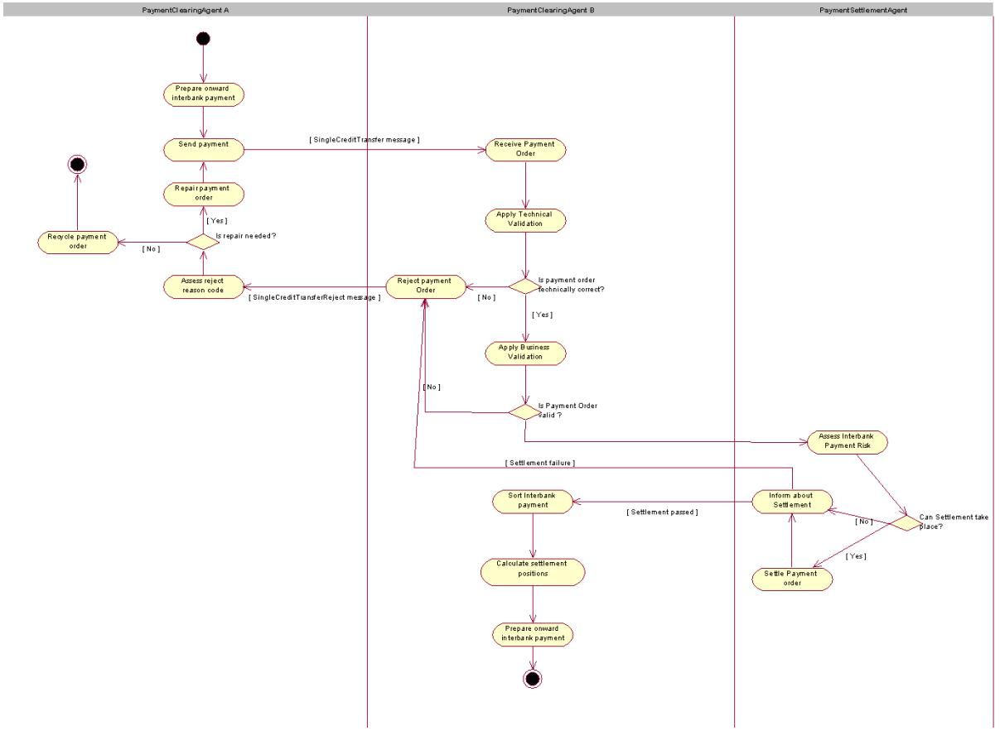
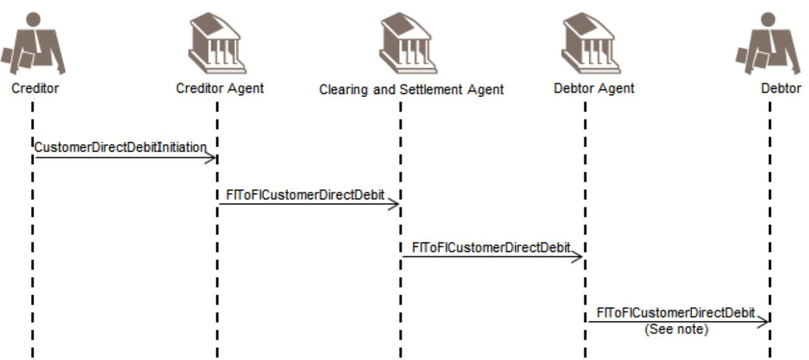

ISO 20022

Payments Clearing and Settlement - Maintenance 2024 - 2025

Message Definition Report Part 1

Approved by the Payments SEG on 4 February 2025

This document provides information about the use of the messages for Payments Clearing and Settlement and includes, for example, business scenarios and messages flows.

February 2025

<span id="page-0-0"></span>Table of Contents

[Table of Contents 2](#page-0-0)

[1 Introduction 5](#page-1-0)

- [1.1 Terms and Definitions 5](#page-1-1)
- [1.2 Abbreviations and Acronyms 5](#page-2-0)
- [1.3 Document Scope and Objectives 5](#page-3-0)

[1.4 References 6](#page-3-1)

- [2 Scope and Functionality 7](#page-4-0)
- [2.1 Background 7](#page-4-1)
- [2.2 Scope 7](#page-5-0)
- [2.3 Groups of MessageDefinitions and Functionality 7](#page-5-1)
- [3 BusinessRoles and Participants 9](#page-6-0)
- [3.1 Participants and BusinessRoles Definitions 9](#page-6-1)
- [3.2 BusinessRoles and Participants Table 10](#page-8-0)
- [4 BusinessProcess Description 11](#page-9-0)
- [4.1 Credit Transfer 11](#page-9-1)
- [4.2 Direct Debit 14](#page-14-0)
- [5 Description of BusinessActivities 17](#page-16-0)
- [5.1 Credit Transfer 17](#page-17-0)
- [5.2 Direct Debit 19](#page-19-0)
- [6 BusinessTransactions 24](#page-24-0)
- [6.1 Credit Transfer 24](#page-25-0)
- [6.2 Direct Debit 47](#page-50-0)
- [7 Business Examples 63](#page-67-0)
- [7.1 FIToFIPaymentStatusReport pacs.002.001.15 63](#page-67-1)
- [7.2 FIToFICustomerDirectDebit pacs.003.001.11 66](#page-73-0)

[7.3 PaymentReturn pacs.004.001.14 - 1 71](#page-81-0)

[7.4 PaymentReturn pacs.004.001.14 - 2 77](#page-90-0)

[7.5 FIToFIPaymentReversal pacs.007.001.13 85](#page-104-0)

[7.6 FIToFICustomerCreditTransfer pacs.008.001.13 - 1 89](#page-111-0)

[7.7 FIToFICustomerCreditTransfer pacs.008.001.13 - 2 113](#page-150-0)

[7.8 FinancialInstitutionCreditTransfer pacs.009.001.12 - 1 123](#page-167-0)

[7.9 FinancialInstitutionCreditTransfer pacs.009.001.12 - 2 130](#page-179-0)

[7.10 FinancialInstitutionDirectDebit pacs.010.001.06 140](#page-194-0)

[7.11 FIToFIPaymentStatusRequest - pacs.028.001.06 143](#page-200-0)

[8 Revision Record 149](#page-208-0)

Preliminary Note

The Message Definition Report (MDR) is made of three parts:

MDR Part 1

This describes the contextual background required to understand the functionality of the proposed message set. Part 1 is produced by the submitting organisation that developed or maintained the message set in line with an MDR Part 1 template provided by the ISO 20022 Registration Authority (RA) on [www.iso20022.org](http://www.iso20022.org).

MDR Part 2

This is the detailed description of each message definition of the message set. Part 2 is produced by the RA using the model developed by the submitting organisation.

MDR Part 3

This is an extract if the ISO 20022 Business Model describing the business concepts used in the message set. Part 3 is an Excel document produced by the RA.

# <span id="page-1-0"></span>**Introduction**

# <span id="page-1-1"></span>**Terms and Definitions**

The following terms are reserved words defined in ISO 20022 Edition 2013 – Part1. When used in this document, the UpperCamelCase notation is followed.

| Term         | Definition                                                                                            |
|--------------|-------------------------------------------------------------------------------------------------------|
| BusinessRole | Functional role played by a business actor in a particular<br>BusinessProcess or BusinessTransaction. |

| Participant         | Involvement of a BusinessRole in a BusinessTransaction.                                                                                                                                                                                           |
|---------------------|---------------------------------------------------------------------------------------------------------------------------------------------------------------------------------------------------------------------------------------------------|
| BusinessProcess     | Definition of the business activities undertaken by BusinessRoles<br>within a BusinessArea whereby each BusinessProcess fulfils one<br>type of business activity and whereby a BusinessProcess may<br>include and extend other BusinessProcesses. |
| BusinessTransaction | Particular solution that meets the communication requirements and<br>the interaction requirements of a particular BusinessProcess and<br>BusinessArea.                                                                                            |
| MessageDefinition   | Formal description of the structure of a message instance.                                                                                                                                                                                        |

## <span id="page-2-0"></span>**Abbreviations and Acronyms**

The following is a list of abbreviations and acronyms used in the document.

| Abbreviation/Acronyms | Definition                        |  |  |
|-----------------------|-----------------------------------|--|--|
| MDR                   | Message Definition Report         |  |  |
| MCR                   | Maintenance change request        |  |  |
| SEG                   | Standards Evaluation Group        |  |  |
| FI                    | Financial Institution             |  |  |
| XML                   | eXtensible Mark-up Language       |  |  |
| IBAN                  | International Bank Account Number |  |  |
| BIC                   | Business Identifier Code          |  |  |
| ACH                   | Automated Clearing House          |  |  |

| DD   | Direct Debit                |
|------|-----------------------------|
| RTGS | Real time gross settlement  |
| MRI  | Mandate Related Information |
| Ect. | Etcetera                    |

# <span id="page-3-0"></span>**Document Scope and Objectives**

This document is the first part of the Payments Clearing and Settlement Message Definition Report (MDR) that describes the BusinessTransactions and underlying message set. For the sake of completeness, the document may also describe BusinessActivities that are not in the scope of the business processes covered in this document.

This document describes the following:

- the BusinessProcess scope •
- the BusinessRoles involved in these BusinessProcesses •

The main objectives of this document are as follows:

- to provide information about the messages that support the BusinessProcesses •
- to explain the BusinessProcesses and BusinessActivities these messages have addressed •
- to give a high level description of BusinessProcesses and the associated BusinessRoles •
- to document the BusinessTransactions •
- to provide business examples •

The MessageDefinitions are specified in Message Definition Report Part 2.

# <span id="page-3-1"></span>**References**

| Document                                                           | Version | Date       | Author |
|--------------------------------------------------------------------|---------|------------|--------|
| ISO 20022 Business Justification #6 – (single) credit<br>transfers | 2006    | 09-09-2005 | SWIFT  |
| ISO 20022 Business Justification #5 - Direct Debits                | 2006    | 08-09-2006 | SWIFT  |

| ISO 20022 Business Justification #8 – (bulk) credit<br>transfers                             | 2006 | 08-09-2006 | SWIFT |
|----------------------------------------------------------------------------------------------|------|------------|-------|
| ISO 20022 Business Justification #85 - Financial<br>Institution Direct Debit                 | 2014 | 31-07-2014 | SWIFT |
| ISO 20022 Business Justification #110 - Payment Status<br>Request                            | 2016 | 11-07-2016 | SWIFT |
| ISO 20022 Maintenance Change Request (MCR #170)<br>document (Payments Maintenance 2020/2021) | 2020 | 31-08-2020 | SWIFT |
| ISO 20022 Maintenance Change Request (MCR #208)<br>document (Payments Maintenance 2022/2023) | 2022 | 31-08-2022 | SWIFT |
| ISO 20022 Maintenance Change Request (MCR #234)<br>document (Payments Maintenance 2023/2024) | 2023 | 31-08-2023 | SWIFT |
| ISO 20022 Maintenance Change Request (MCR #252)<br>document (Payments Maintenance 2024/2025) | 2024 | 31-08-2024 | Swift |

# <span id="page-4-0"></span>**Scope and Functionality**

# <span id="page-4-1"></span>**Background**

This Message Definition Report covers a set of eight MessageDefinitions developed by SWIFT and approved by the ISO 20022 Payments Standards Evaluation Group (SEG) in February 2025.

These messages are specifically designed to support the clearing and settlement of credit transfers, direct debits and reversals directly between banks or across an automated clearing house (ACH) and real time gross settlement systems (RTGS).

In 2015, the FinancialInstitutionDirectDebit message was added as a result of reverse engineering the existing SWIFT FIN MT 204 Financial Markets Direct Debit Message in order to bridge the gap detected at the occasion of the migration of several market infrastructures worldwide from their SWIFT FIN portfolio of messages (MT 103, MT 103+, MT 202, MT 204, MT 900, MT 910) to ISO 20022.

In 2016, the FIToFIPaymentStatusRequest message was added to accommodate the need, initially identified for real time payments, to launch an investigation on a previously sent payment instruction, where an (expected) FIToFIPaymentStatusReport message is missing.

# <span id="page-5-0"></span>**Scope**

The scope is the set of messages used between financial institutions for the clearing and settlement of payment transactions.

## <span id="page-5-1"></span>**Groups of MessageDefinitions and Functionality**

## **Instruction Messages**

The FIToFICustomerCreditTransfer message is used to move funds from a debtor account to a creditor.

The FIToFICustomerDirectDebit message is used to collect funds from a debtor account for a creditor.

The FinancialInstitutionCreditTransfer message is used to move funds from a debtor account to a creditor, where both debtor and creditor are financial institutions.

The FinancialInstitutionDirectDebit message is used to collect funds from a debtor account for a creditor, where both debtor and creditor are financial institutions.

| MessageDefinition                  | Message Identifier |
|------------------------------------|--------------------|
| FIToFICustomerCreditTransfer       | pacs.008           |
| FIToFICustomerDirectDebit          | pacs.003           |
| FinancialInstitutionCreditTransfer | pacs.009           |
| FinancialInstitutionDirectDebit    | pacs.010           |

## **Related Messages**

The FIToFIPaymentReversal message is used to reverse a payment previously executed.

The PaymentReturn message is used to undo a payment previously settled.

The FIToFIPaymentStatusReport message is used to inform on the positive or negative status of an instruction (either single or file) and to report on a pending instruction.

The FIToFIPaymentStatusRequest message is used to request a FIToFIPaymentStatusReport message containing information on the status of a previously sent instruction.

| MessageDefinition          | Message Identifier |
|----------------------------|--------------------|
| FIToFIPaymentReversal      | pacs.007           |
| PaymentReturn              | pacs.004           |
| FIToFIPaymentStatusReport  | pacs.002           |
| FIToFIPaymentStatusRequest | pacs.028           |

# <span id="page-6-0"></span>**BusinessRoles and Participants**

A BusinessRole represents an entity (or a class of entities) of the real world, physical or legal, a person, a group of persons, a corporation. Examples of BusinessRoles: "Financial Institution", "Automated Clearing House", "Central Securities Depository".

A Participant is a functional role performed by a BusinessRole in a particular BusinessProcess or BusinessTransaction. Examples of Participants: the "user" of a system, "debtor", "creditor", "investor".

The relationship between BusinessRoles and Participants is many-to-many. One BusinessRole can be involved as different Participants at different moments in time or at the same time. Examples of BusinessRoles: "user", "debtor", "creditor", "investor". Different BusinessRoles can be involved as the same Participant.

In the context of Payments Clearing and Settlement the high-level BusinessRoles and typical Participants can be represented as follows:

# <span id="page-6-1"></span>**Participants and BusinessRoles Definitions**

Participants

| Description | Definition                                                                                                                                            |
|-------------|-------------------------------------------------------------------------------------------------------------------------------------------------------|
| Debtor      | Party that owes an amount of money to the (ultimate) creditor. In<br>the context of the payment model, the debtor is also the debit<br>account owner. |
| Creditor    | Party to which an amount of money is due. In the context of the<br>payment model, the creditor is also the credit account owner.                      |

| Ultimate Debtor                                   | Ultimate party that owes an amount of money to the (ultimate)<br>creditor.                                                                                                                                                                    |
|---------------------------------------------------|-----------------------------------------------------------------------------------------------------------------------------------------------------------------------------------------------------------------------------------------------|
| Ultimate Creditor                                 | Ultimate party to which an amount of money is due.                                                                                                                                                                                            |
| Debtor agent                                      | Financial institution servicing an account for the debtor.                                                                                                                                                                                    |
| Creditor Agent                                    | Financial institution servicing an account for the creditor.                                                                                                                                                                                  |
| Forwarding Agent                                  | Financial institution that receives the instruction from the<br>initiating party and forwards it to the next agent in the payment<br>chain for execution.                                                                                     |
| Initiating Party                                  | Party initiating the payment to an agent. In the payment context,<br>this can either be the debtor (in a credit transfer), the creditor (in<br>a direct debit), or a party that initiates the payment on behalf of<br>the debtor or creditor. |
| Account Owner                                     | Party that legally owns the account.                                                                                                                                                                                                          |
| Account Servicer                                  | Party that manages the account on behalf of the account owner,<br>that is manages the registration and booking of entries on the<br>account, calculates balances on the account and provides<br>information about the account.                |
| Payment Clearing<br>Agent (Instructing<br>Agent)  | Agent that instructs the next party in the payment chain to carry<br>out the payment/instruction.                                                                                                                                             |
| Payment Settlement<br>Agent (Instructed<br>Agent) | Agent that executes the instruction upon the request of the<br>previous party in the chain (either an agreement party, or a<br>clearing agent).                                                                                               |
| Intermediary Agent                                | Agent between the debtor's agent and the creditor's agent. There<br>can be several intermediary agents specified for the execution of<br>a payment.                                                                                           |

BusinessRoles

| Description           | Definition                                                        |
|-----------------------|-------------------------------------------------------------------|
| Financial Institution | Organisation established primarily to provide financial services. |
| Clearing System       | Specifies the system which plays a role in the clearing process.  |
| Party                 | Entity involved in a payment.                                     |

# <span id="page-8-0"></span>**BusinessRoles and Participants Table**

| BusinessRole      | Financial Institution | Clearing System | Party |
|-------------------|-----------------------|-----------------|-------|
| Debtor            |                       |                 | X     |
| Creditor          |                       |                 | X     |
| Ultimate Debtor   |                       |                 | X     |
| Ultimate Creditor |                       |                 | X     |
| Debtor Agent      | X                     | X               |       |
| Creditor Agent    | X                     | X               |       |
| Forwarding Agent  | X                     | X               |       |
| Initiating Party  |                       |                 | X     |
| Account Owner     | X                     |                 | X     |
| Account Servicer  | X                     | X               |       |

| Payment Clearing Agent   | X | X |  |
|--------------------------|---|---|--|
| Payment Settlement Agent | X | X |  |
| Intermediary Agent       | X | X |  |

# <span id="page-9-0"></span>**BusinessProcess Description**

# <span id="page-9-1"></span>**Credit Transfer**

This diagram pictures the high level end-to-end payments BusinessProcesses for the credit transfer.

Accept Inter-Bank Payment

| Item               | Description                                                                                                |
|--------------------|------------------------------------------------------------------------------------------------------------|
| Definition         | Payment acceptance includes the check of the validation of the payment<br>and the payment risk assessment. |
| Trigger            | Receipt of the payment order.                                                                              |
| Pre<br>conditions  | Clearing agent has received the payment order.                                                             |
| Post<br>conditions | Payment has been accepted or rejected.                                                                     |
| Role               | Financial institution                                                                                      |

#### Asses Interbank Payment Risk

| Item | Description |
|------|-------------|
|------|-------------|

| Definition         | Settlement agent undertakes the necessary risk checks in order to process<br>the payment further, for example, embargo, sufficient credit, cover<br>received, system limits. |
|--------------------|------------------------------------------------------------------------------------------------------------------------------------------------------------------------------|
| Trigger            | Receipt of the payment order.                                                                                                                                                |
| Pre<br>conditions  | The settlement agent has received the payment order.                                                                                                                         |
| Post<br>conditions | Payment has been accepted or rejected.                                                                                                                                       |
| Role               | Financial Institution                                                                                                                                                        |

#### Validate Interbank Payment

| Item               | Description                                                                                                                                                                             |
|--------------------|-----------------------------------------------------------------------------------------------------------------------------------------------------------------------------------------|
| Definition         | Clearing agent undertakes the necessary content checks in order to process<br>the payment further. For example, authenticate the remitting party,<br>validate syntax, confirm the SLAs. |
| Trigger            | Receipt of the payment order.                                                                                                                                                           |
| Pre<br>conditions  | The clearing agent has received the payment order.                                                                                                                                      |
| Post<br>conditions | Payment has been accepted or rejected. If accepted, the instructed<br>payment is ready for the risk assessment or is executable.                                                        |
| Role               | Financial Institution                                                                                                                                                                   |

#### Authorise Interbank Payment

| Item | Description |  |
|------|-------------|--|
|------|-------------|--|

| Definition         | Authorisation of a payment order by the payment clearing agent. This is an<br>extension of the sub-process of the 'Accept Interbank Payment' process.<br>An authorisation may be implicit if the system where the payment is<br>generated has been approved to generate payments, as the preceding<br>procedures are deemed satisfactory secure. The system will then generate a<br>digital signature without manual intervention.<br>An authorisation may be explicit, if procedures require human approval. |
|--------------------|---------------------------------------------------------------------------------------------------------------------------------------------------------------------------------------------------------------------------------------------------------------------------------------------------------------------------------------------------------------------------------------------------------------------------------------------------------------------------------------------------------------|
| Trigger            | A payment order has been created.                                                                                                                                                                                                                                                                                                                                                                                                                                                                             |
| Pre<br>conditions  | Accept payment process is completed and waits for authorisation if required<br>by the payment clearing agent.                                                                                                                                                                                                                                                                                                                                                                                                 |
| Post<br>conditions | Payment order is authorised.                                                                                                                                                                                                                                                                                                                                                                                                                                                                                  |
| Role               | Financial Institution                                                                                                                                                                                                                                                                                                                                                                                                                                                                                         |

#### Clear Interbank Payment

| Item               | Description                                                                                                                                                                                                                                                                  |
|--------------------|------------------------------------------------------------------------------------------------------------------------------------------------------------------------------------------------------------------------------------------------------------------------------|
| Definition         | Preparation of the payment information by the payment clearing agent for<br>the next clearing agent in the interbank chain. This process of preparing<br>payment information can be divided into the sub-processes 'Sort payment'<br>and 'prepare onward interbank payment'. |
| Trigger            | Payment execution date is reached.                                                                                                                                                                                                                                           |
| Pre<br>conditions  | Payment is accepted.                                                                                                                                                                                                                                                         |
| Post<br>conditions | Next clearing agent is determined.                                                                                                                                                                                                                                           |
| Role               | Clearing system or financial institution                                                                                                                                                                                                                                     |

| Item               | Description                                                                                                                                                                                                                                                                                |
|--------------------|--------------------------------------------------------------------------------------------------------------------------------------------------------------------------------------------------------------------------------------------------------------------------------------------|
| Definition         | Clearing agent determines the next clearing agent or creditor/debtor for the<br>payment. The clearing agent identification is done by the previous party or<br>selected by the current agent (tables). The last clearing agent is determined<br>by the creditor/debtor's account servicer. |
| Trigger            | •<br>The payment must be instructed to the next party .                                                                                                                                                                                                                                    |
| Pre<br>conditions  | Payment is accepted.                                                                                                                                                                                                                                                                       |
| Post<br>conditions | Next clearing agent is determined.                                                                                                                                                                                                                                                         |
| Role               | Financial institution                                                                                                                                                                                                                                                                      |

#### Calculate the Settlement Positions

| Item               | Description                                                                                                                                                                                                                                                                                                                                  |
|--------------------|----------------------------------------------------------------------------------------------------------------------------------------------------------------------------------------------------------------------------------------------------------------------------------------------------------------------------------------------|
| Definition         | Clearing agent applies the payment amount to the debit party and credit<br>party's clearing positions. For multiple payments, it is equivalent to calculate<br>the sub-settlement positions. The calculation may be done continuously or<br>at certain times through bilateral netting. The settlement may be delegated<br>to a third party. |
| Trigger            | Payment has been accepted.                                                                                                                                                                                                                                                                                                                   |
| Pre<br>conditions  | Payment is executable.                                                                                                                                                                                                                                                                                                                       |
| Post<br>conditions | Payment amount is applied to the debit and credit party.                                                                                                                                                                                                                                                                                     |
| Role               | Financial institution                                                                                                                                                                                                                                                                                                                        |

| Item               | Description                                                                                                                                                                                 |
|--------------------|---------------------------------------------------------------------------------------------------------------------------------------------------------------------------------------------|
| Definition         | Clearing agent collects the information necessary to remit the payment to<br>the next party (clearing and/or settlement agent). Then the clearing agent<br>remits the payment to the party. |
| Trigger            | Payment must be instructed to the next party.                                                                                                                                               |
| Pre<br>conditions  | Money has been received.                                                                                                                                                                    |
| Post<br>conditions | The onward payment is ready.                                                                                                                                                                |
| Role               | Financial institution                                                                                                                                                                       |

#### Settle Interbank Payment

| Item               | Description                                                                                                                                                                                      |
|--------------------|--------------------------------------------------------------------------------------------------------------------------------------------------------------------------------------------------|
| Definition         | Settlement agent performs the transfer of cash between the debit party<br>and the credit party.                                                                                                  |
| Trigger            | Payment execution date in the payment is reached.                                                                                                                                                |
| Pre<br>conditions  | Instructed payment is executable (all information is there to process the<br>payment and the payment validity has been checked) and the settlement<br>agent is identified by the clearing agent. |
| Post<br>conditions | Transfer of ownership is performed between the debit party and credit<br>party.                                                                                                                  |
| Role               | Financial institution                                                                                                                                                                            |

Generate Regulatory Reporting Information

| Item               | Description                                                                                                                                                                                                                                         |
|--------------------|-----------------------------------------------------------------------------------------------------------------------------------------------------------------------------------------------------------------------------------------------------|
| Definition         | Forwarding party or debtor agent selects the information from the payment<br>transaction necessary to meet regulatory reporting requirements, if<br>necessary, for example, balance of payments reporting, reporting on<br>money-laundering issues. |
| Trigger            | Payment meets the regulatory reporting criteria.                                                                                                                                                                                                    |
| Pre<br>conditions  | There are regulatory reporting requirements.                                                                                                                                                                                                        |
| Post<br>conditions | Information for the regulatory reporting has been extracted based on<br>information in the payment.                                                                                                                                                 |
| Role               | Financial institution                                                                                                                                                                                                                               |

# <span id="page-14-0"></span>**Direct Debit**

This diagram pictures the high level BusinessProcesses for the direct debit.

#### Process direct debit

| Item              | Description                                                                                                                                                                                                                                                                                                                                                                                               |
|-------------------|-----------------------------------------------------------------------------------------------------------------------------------------------------------------------------------------------------------------------------------------------------------------------------------------------------------------------------------------------------------------------------------------------------------|
| Definition        | The creditor's agent (or creditor if it is a financial institution direct debit)<br>sends the message to the clearing system in line with the clearing cycle.<br>The clearing system forwards the message to the debtor's agent<br>immediately for information purposes only and processes the direct debit in<br>accordance with the settlement cycle, to initiate the debit to the debtor's<br>account. |
| Trigger           | Release of direct debit instructions to the instructed agent.                                                                                                                                                                                                                                                                                                                                             |
| Pre<br>conditions | Direct debit instructions received and successfully validated.                                                                                                                                                                                                                                                                                                                                            |

| Post<br>conditions | Forwarded direct debit instructions.    |
|--------------------|-----------------------------------------|
| Role               | Financial institution / clearing system |

Process Reject

| Item               | Description                                                                                                                                                                                               |
|--------------------|-----------------------------------------------------------------------------------------------------------------------------------------------------------------------------------------------------------|
| Definition         | Reconciles reject with the original direct debit instructions and identifies the<br>reason for rejection. If the reject results from a formatting error, correct<br>the data and resubmit for processing. |
| Trigger            | Reconciliation of the reject.                                                                                                                                                                             |
| Pre<br>conditions  | Reject received.                                                                                                                                                                                          |
| Post<br>conditions | Reconciled reject.                                                                                                                                                                                        |
| Role               | Financial institution                                                                                                                                                                                     |

#### Process Return/Request for Refund

| Item       | Description                                                                                                                                                                                                                                                                                                                                                                                                                                                                                                                                                                          |
|------------|--------------------------------------------------------------------------------------------------------------------------------------------------------------------------------------------------------------------------------------------------------------------------------------------------------------------------------------------------------------------------------------------------------------------------------------------------------------------------------------------------------------------------------------------------------------------------------------|
| Definition | Returns are individual debits that have reached the debtor's agent and have<br>been settled at the inter-bank level, but the debtor's agent is then unable to<br>make the collection for one of a number of reasons, for example, account<br>closed, no funds, customer dead, etc.<br>The debtor has the unconditional right during "n" days after a debit to<br>instruct its bank to revoke the debit. Following that instruction the debtor's<br>account is credited by its bank and the debit is returned electronically<br>through the clearing process to the creditor's agent. |
| Trigger    | Return of a direct debit / request for refund.                                                                                                                                                                                                                                                                                                                                                                                                                                                                                                                                       |

| Pre<br>conditions  | Settled direct debit instruction subject for return / refund. |
|--------------------|---------------------------------------------------------------|
| Post<br>conditions | Returned direct debit instruction / requested refund.         |
| Role               | Financial institution or party                                |

#### Process Reversal

| Item               | Description                                                                                                                                                                                                                                                                                             |
|--------------------|---------------------------------------------------------------------------------------------------------------------------------------------------------------------------------------------------------------------------------------------------------------------------------------------------------|
| Definition         | The direct debit reversal will contain sufficient information which allows the<br>debtor's agent to identify it as a "reversal' of a particular direct debit. The<br>debtor's agent will credit debtor's account under quotation of the original<br>direct debit reference and the reason for reversal. |
| Trigger            | Accounting and reporting of the direct debit reversal instruction                                                                                                                                                                                                                                       |
| Pre<br>conditions  | Direct debit reversal received and successfully validated                                                                                                                                                                                                                                               |
| Post<br>conditions | Reversed direct debit instruction                                                                                                                                                                                                                                                                       |
| Role               | Financial institution                                                                                                                                                                                                                                                                                   |

The process cancellation/revocation is out of scope. 1.

# <span id="page-16-0"></span>**Description of BusinessActivities**

This section presents the different BusinessActivities within each BusinessProcess. The BusinessActivities of a process are described with activity diagrams.

Legend

| Symbol | Name | Definition |
|--------|------|------------|
|--------|------|------------|

| Start Point             | Shows where the lifecycle of the business process<br>commences. |
|-------------------------|-----------------------------------------------------------------|
| End Point               | Shows where the lifecycle of the business process may<br>ends.  |
| Lozenge (or<br>diamond) | Indicates that a choice between several actions can be<br>made. |
| Bar                     | Indicates that several actions are initiated in parallel.       |

# <span id="page-17-0"></span>**Credit Transfer**



The agents in this activity diagram are called PaymentClearingAgent and PaymentSettlementAgent in generic terms. In more concrete examples, these will be replaced by the most relevant agents, for example, debtor agent, creditor agent and intermediary agent.

| Step                                      | Description                                                                                                                                                                                                                                                                                      | Initiator              |
|-------------------------------------------|--------------------------------------------------------------------------------------------------------------------------------------------------------------------------------------------------------------------------------------------------------------------------------------------------|------------------------|
| Prepare<br>onward<br>interbank<br>payment | The PaymentClearingAgent prepares the<br>outgoing payment instruction and selects the<br>next PaymentClearingAgent and/or the<br>clearing channel through which the payment<br>instruction will be cleared and/or settled.                                                                       | PaymentClearingAgent A |
| Send<br>payment                           | The PaymentClearingAgent sends out the<br>payment instruction to the selected channel/<br>PaymentClearingAgent.                                                                                                                                                                                  | PaymentClearingAgent A |
| Assess<br>reject<br>reason code           | The PaymentClearingAgent assesses the reject<br>reason code provided by the rejecting<br>PaymentClearingAgent.                                                                                                                                                                                   | PaymentClearingAgent A |
| Repair<br>payment<br>order                | The PaymentClearingAgent reformats/<br>supplements the original payment order for<br>re-submission to the appropriate clearing<br>channel/PaymentClearingAgent.                                                                                                                                  | PaymentClearingAgent A |
| Recycle<br>payment<br>order               | The PaymentClearingAgent recycles the<br>rejected payment order. Recycling can be by<br>downgrading the STP level under which the<br>payment order can be cleared and settled, or<br>selecting another channel for clearing and<br>settling the payment.                                         | PaymentClearingAgent A |
| Receive<br>payment<br>order               | The PaymentClearingAgent acknowledges<br>receipt of the payment order (technical) and<br>proceeds to next step.                                                                                                                                                                                  | PaymentClearingAgent B |
| Apply<br>technical<br>validation          | The PaymentClearingAgent applies technical<br>validation on the payment order. Technical<br>validation may comprise syntactic validation<br>(conformance of the payment order with its<br>technical definition), semantic validation<br>( message, through to technical content<br>consistency). | PaymentClearingAgent B |

| Apply<br>business<br>validation           |                                                                                                                                                                                                                            | PaymentClearingAgent B |
|-------------------------------------------|----------------------------------------------------------------------------------------------------------------------------------------------------------------------------------------------------------------------------|------------------------|
| Reject<br>payment<br>order                | The PaymentClearingAgent rejects the<br>payment order to the preceding<br>PaymentClearingAgent and appends a relevant<br>reject reason code explaining the reason for<br>the reject.                                       | PaymentClearingAgent B |
| Sort<br>interbank<br>payment              |                                                                                                                                                                                                                            | PaymentClearingAgent B |
| Calculate<br>settlement<br>positions      |                                                                                                                                                                                                                            | PaymentClearingAgent B |
| Prepare<br>onward<br>interbank<br>payment | The PaymentClearingAgent prepares the<br>outgoing payment instruction and selects the<br>next PaymentClearingAgent and/or the<br>clearing channel through which the payment<br>instruction will be cleared and/or settled. | PaymentClearingAgent B |
| Assess<br>interbank<br>payment<br>risk    |                                                                                                                                                                                                                            | PaymentSettlementAgent |
| Settle<br>payment<br>order                |                                                                                                                                                                                                                            | PaymentSettlementAgent |
| Inform<br>about<br>settlement             |                                                                                                                                                                                                                            | PaymentSettlementAgent |

# <span id="page-19-0"></span>**Direct Debit**

Some base definitions of direct debit terms:

Direct Debit: Direct Debit(s) results in cash transfers between debtors and creditors through infrastructures or correspondent banks. They may •

be exchanged as single instructions but are traditionally grouped following some common characteristics and, for convenience or efficiency reasons, exchanged in a batch mode.

- Mandate: This is the authorisation / expression of consent given by the Debtor allowing a specified creditor to originate Direct Debit instructions for debiting the specified Debtor's account in accordance with the relevant Direct Debit scheme rules and, if applicable, the mandate details. •
- Reject: Rejects are individual debits or files of debits that are rejected due to technical reasons, e.g. invalid format, wrong IBAN check digit. Rejects take place prior to interbank settlement if the creditor's agent, the debtor's agent or any other agent in the chain is not able to process the individual debit or files of debits. •
- Request for Cancellation: A request by the creditor to cancel a Direct Debit instruction prior to the interbank settlement •
- Revocation: A request by the creditor to revoke a Direct Debit Payment order prior to the acceptance by the creditor's Agent. •
- Reversal: The creditor initiates a reversal instruction after settlement, when a paid Direct Debit should not have been processed. Consequently, the debtor will be credited back. •
- Refusal by the Debtor: One of the Debtor's right to refuse either any Direct Debit transaction to be debited on its account, or one Direct Debit, once pre-noticed by a creditor. •
- Return: Returns are individual debits that have reached the Debtor's Agent and have been settled at the interbank level, but the Debtor's Agent is then unable to make the collection for one of a number of reasons e.g. account closed, no funds, customer dead, account does not accept Direct Debit, etc. •
- Refund: Refund is the process to claim for reimbursement of a Direct Debit for any reason after settlement and within a defined period ("n" days). A refund instruction is initiated by the Debtor. •

## **Direct debit instruction**


| Step                                  | Description                                                                                                                                                                                                                                                                                                                                           | Initiator                        |
|---------------------------------------|-------------------------------------------------------------------------------------------------------------------------------------------------------------------------------------------------------------------------------------------------------------------------------------------------------------------------------------------------------|----------------------------------|
| Forward 1st/<br>1off Direct<br>Debit  | The creditor agent (or creditor for financial institution<br>direct debits) sends the message to the clearing system in<br>line with the clearing cycle. The clearing system forwards<br>the message to the debtor agent and processes the direct<br>debit in accordance with the settlement cycle, to initiate<br>the debit to the Debtor's account. | Creditor<br>Agent or<br>Creditor |
| Reject Direct<br>Debit<br>instruction | Reject prior to interbank settlement by creditor agent or its<br>processing agent. Rejections can happen for a number of<br>reasons, some of which are defined by the scheme rules<br>and some of which are due to specific controls defined by<br>the creditor agent or any other agents in the chain.                                               | Creditor<br>Agent                |
| Process B2B<br>reject                 | The creditor agent reconciles the Direct Debit reject with<br>the original Direct Debit instructions and assesses the<br>reason causing the reject e.g. formatting error, value date<br>incompatibility, invalid bank operation code, etc.                                                                                                            | Creditor<br>Agent                |
| Correct and<br>resubmit               | In case of formatting issues the creditor agent corrects the<br>data and resubmits it for processing.                                                                                                                                                                                                                                                 | Creditor<br>Agent                |
| Reject Direct<br>Debit<br>instruction | The debtor agent may reject the instruction due to a<br>number of reasons (e.g. missing account for debtor,<br>missing agreement with the debtor to accept Direct Debits.                                                                                                                                                                             | Debtor<br>Agent                  |

| Return Direct<br>Debit<br>Instruction            | Returns are individual debits that have reached the debtor<br>agent and have been settled at the interbank level, but the<br>debtor agent is then unable to make the collection for one<br>of a number of reasons e.g. account closed, no funds<br>available, etc.<br>Detailed Direct Debit Return activity diagram available<br>below.                                    | Debtor<br>Agent |
|--------------------------------------------------|----------------------------------------------------------------------------------------------------------------------------------------------------------------------------------------------------------------------------------------------------------------------------------------------------------------------------------------------------------------------------|-----------------|
| Report Direct<br>Debit<br>Settlement<br>Proceeds | Process that includes the calculation of the settlement<br>positions and transmission of the settlement information to<br>the settlement agent.                                                                                                                                                                                                                            | ACH             |
| Request<br>Refund                                | The debtor has the unconditional right during "n" days<br>after a debit to instruct its bank to revoke the debit.<br>Following that instruction, the debtor account is credited<br>by his bank and the debit is returned electonically through<br>the clearing process to the creditor agent.<br>Detailed request refund Direct Debit activity diagram<br>available below. | Debtor          |

## **Return Direct Debit**


## **Request Refund Direct Debit**


## **Direct Debit Reversal**

The creditor initiates a reversal instruction after settlement, when a paid Direct Debit should not have been processed. If the reversal instruction is accepted, consequently the Debtor will be credited back.


| Step                                                        | Description                                                                                                                                                                                                            | Initiator |
|-------------------------------------------------------------|------------------------------------------------------------------------------------------------------------------------------------------------------------------------------------------------------------------------|-----------|
| Request reversal<br>of the Direct<br>Debit payment<br>order | The creditor identifies the original direct debit<br>instruction (or a file of direct debit instructions) and<br>generates an offsetting transaction in favor of the<br>debtor under quotation of the reversal reason. | Creditor  |

| Process request<br>for reversal and<br>submit reversal<br>to the clearing                                                                                                                                                                                                            | The creditor agent identifies the original direct debit<br>instruction and generates an offsetting clearing<br>transaction in favor of the debtor. Subject transaction<br>is submitted to the instructed agent for settlement<br>under quotation of the original direct debit reference<br>and the reversal reason. | Creditor<br>Agent       |
|--------------------------------------------------------------------------------------------------------------------------------------------------------------------------------------------------------------------------------------------------------------------------------------|---------------------------------------------------------------------------------------------------------------------------------------------------------------------------------------------------------------------------------------------------------------------------------------------------------------------|-------------------------|
| Reject reversal                                                                                                                                                                                                                                                                      | Rejects are individual transactions/messages or<br>batches that are rejected prior to interbank settlement.                                                                                                                                                                                                         | Instructed<br>Agent/ACH |
| Process B2B<br>rejected reversal                                                                                                                                                                                                                                                     | The creditor agent reconciles the reject with the<br>original instruction and assesses the reason causing<br>the reject e.g. formatting error, due date<br>incompatibility or invalid bank operation code.                                                                                                          | Creditor<br>Agent       |
| Clear Direct<br>Debit Reversal                                                                                                                                                                                                                                                       | Preparation of the payment information for the next<br>agent in the chain (in accordance with the agreed and<br>published settlement cycle). The process includes the<br>calculation of the settlement positions and<br>transmission of the files to the next agent.                                                | ACH                     |
| The debtor may return the direct debit reversal based<br>on a number of reasons (e.g. account number invalid).<br>Return Direct<br>The debtor agent returns the transaction in line with<br>Debit Reversal<br>the clearing rules and specifications via the Instructed<br>Agent/ACH. |                                                                                                                                                                                                                                                                                                                     | Debtor<br>Agent         |
| Settle Direct<br>Debit Reversal<br>Proceeds                                                                                                                                                                                                                                          | The settlement agent performs the transfer of funds<br>from the credit party to the debit party (in accordance<br>with the agreed and published settlement cycle).                                                                                                                                                  | Settlement<br>Agent     |

# <span id="page-24-0"></span>**BusinessTransactions**

This section describes the message flows based on the activity diagrams documented above. It shows the typical exchanges of information in the context of a BusinessTransaction.

When relevant, messages from other business areas, which are necessary for a complete understanding of the transaction, are shown on the BusinessTransaction diagrams:

| Message                       | Number   |
|-------------------------------|----------|
| CustomerDirectDebitInitiation | Pain.008 |

# <span id="page-25-0"></span>**Credit Transfer**

## **FIToFICustomerCreditTransfer**

An FIToFICustomerCreditTransfer message is the inter-bank movement of an amount from a party bank account (the debtor account) to a beneficiary party (the creditor).

FIToFICustomerCreditTransfer messages result in one or more cash transfers between debtors and creditors through correspondent banks or infrastructures. They may be exchanged as single or grouped instructions following certain common characteristics and, for convenience or efficiency reasons, exchanged in a batch mode. The processing of credit transfers may differ from country to country and system to system.

Depending on the scenario, there might be an agent between the debtor agent and the creditor agent. This agent can be an intermediary agent or a reimbursement agent. The narrative will describe more in detail the agent role.

In scenarios where the receiving agent services an account for the sending agent, the scenario also includes the case where the sending agent has an account with a branch/head office of the receiving agent and will indicate that the receiving agent can reimburse itself at this institution. The sending agent has to be aware of an intra-group agreement allowing this.

A payment clearing and settlement system could occur between debtor agent and creditor agent (or between any other agents). The clearing process where the clearing agent after being informed on the transaction prepares and sends the payment information to the settlement agent (if different) is out of scope and will not be described. This process includes the calculation of the settlement positions and transmission of files to the settlement agent. The settlement agent transfers the funds from the debtor agent to the creditor agent in accordance with the settlement cycle and based on the settlement report provided by the clearing agent.

Only messages concerning the interbank credit transfer are illustrated in the sequence diagrams. The original contracts between the debtor and the creditor (for example order and invoice) and the CustomerCreditTransferInitiation message by the debtor are out of scope and are therefore not included in the diagram.

## **Debtor Agent and Creditor Agent are Correspondents**

The debtor agent and creditor agent are correspondents in the currency of the transaction.


The scenario caters for the debtor agent servicing an account for the creditor agent and vice versa. It also covers the case where debtor agent and creditor agent are linked directly across a payment clearing and settlement system.

The debtor agent sends the FIToFICustomerCreditTransfer message to the creditor agent.

The creditor agent optionally confirms the processability of the FIToFICustomerCreditTransfer instruction by sending a positive FIToFIPaymentStatusReport message to the debtor agent.

Out of Scope

0

- The 'On Us' scenario where the debtor agent is also the creditor agent •
- Reporting (BankToCustomerDebitCreditNotification ('notification'), BankToCustomerAccountReport and BankToCustomerStatement ('statement') messages) •

## **Debtor Agent and Creditor Agent are not Correspondents - 1**

There is an intermediary agent between the debtor agent and creditor agent (the so-called 3-party serial payment).


The scenario also covers the payment clearing system case where the agent between the debtor agent and the creditor agent is a clearing and/or settlement agent.

For sake of simplicity, the scenario is limited to one intermediary agent between the debtor agent and the creditor agent.

The debtor agent sends the FIToFICustomerCreditTransfer message to the Intermediary agent.

The Intermediary agent optionally confirms the processability of the FIToFICustomerCreditTransfer by sending a positive FIToFIPaymentStatusReport message to the debtor agent.

The intermediary agent forwards the FIToFICustomerCreditTransfer message to the creditor agent.

The creditor agent optionally confirms the processability of the FIToFICustomerCreditTransfer instruction by sending a positive FIToFIPaymentStatusReport message to the intermediary agent.

Out of Scope

- The intermediary agent may send a status update to the debtor agent. •
- Reporting (BankToCustomerDebitCreditNotification ('notification'), BankToCustomerAccountReport and BankToCustomerStatement ('statement') messages) •

#### **Debtor Agent and Creditor Agent are not Correspondents - 2**

The debtor agent and the creditor agent are not correspondents in the currency of the transaction. There is a reimbursement agent between them (so-called 3-party cover payment).


For the sake of simplicity, it is assumed that the debtor agent and the creditor agent have the same reimbursement agent. The FIToFICustomerCreditTransfer instruction will be covered through a separate FinancialInstitutionCreditTransfer message sent to the reimbursement agent (illustrated under the FinancialInstitutionCreditTransfer section).

The debtor agent sends the FIToFICustomerCreditTransfer message to the creditor agent.

The creditor agent optionally confirms the processability of the FIToFICustomerCreditTransfer instruction by sending a positive FIToFIPaymentStatusReport message to the debtor agent.

The debtor agent sends a FinancialInstitutionCreditTransfer message to the reimbursement agent.

The reimbursement agent optionally confirms the processability of the FinancialInstitutionCreditTransfer by sending a positive FIToFIPaymentStatusReport message to the debtor agent.

Out of Scope

Reporting (BankToCustomerDebitCreditNotification ('notification'), BankToCustomerAccountReport and BankToCustomerStatement ('statement') messages) •

## **Negative FIToFIPaymentStatusReport with FIToFICustomerCreditTransfer**

The negative FIToFIPaymentStatusReport message is used, point to point between two parties, to report about the negative processability of an instruction, that is, to report about the rejection of the instruction, and is used to:

- Reject an FIToFICustomerCreditTransfer •
- Reject a FinancialInstitutionCreditTransfer •

The negative FIToFIPaymentStatusReport message is sent before settlement.

After settlement, the correct message to be used is the PaymentReturn message, the BankToCustomerDebitCreditNotification message ('notification') and/or the BankToCustomerAccountReport/ BankToCustomerStatement message ('statement'). Different options are illustrated in the sequence diagram.

## **Debtor Agent and Creditor Agent are Direct Correspondents**

Negative FIToFIPaymentStatusReport messages are exchanged when rejecting an instruction.


This scenario covers the case where the creditor agent (or a branch/head office of the creditor agent) services an account for the debtor agent. In the cases where the debtor agent services an account for the creditor agent and in the case of clearing system payments, the creditor agent will inform about the non-processability by using a PaymentReturn message.

The debtor agent sends the FIToFICustomerCreditTransfer message to the creditor agent.

The creditor agent sends a negative FIToFIPaymentStatusReport message to inform the debtor agent about the non-processability of the FIToFICustomerCreditTransfer instruction (for example, due to missing or incorrect information).

Whenever possible, the debtor agent might try to repair and re-submit the instruction. Depending on what has been agreed with the debtor, the debtor agent may inform the debtor of the repair with an updated FIToFIPaymentStatusReport message. 1.

### **Debtor Agent and Creditor Agent are not Correspondents - 1**

There is an intermediary agent between the debtor agent and creditor agent (so-called 3 party Serial payment). Negative FIToFIPaymentStatusReport messages are exchanged when rejecting an instruction.


The scenario covers the case where the creditor agent (or branch/head office of creditor agent) services an account for the intermediary agent. In the cases where the intermediary agent services an account for the creditor agent or they are linked through a payment clearing system, the creditor agent will inform about the non-processability by using a PaymentReturn message.

The debtor agent sends the FIToFICustomerCreditTransfer message to the intermediary agent.

The intermediary agent may optionally confirm the processability of the FIToFICustomerCreditTransfer instruction by sending a positive FIToFIPaymentStatusReport message to the debtor agent.

The intermediary agent forwards the FIToFICustomerCreditTransfer message to the creditor agent.

The creditor agent sends a negative FIToFIPaymentStatusReport message to inform the intermediary agent about the non-processability of the FIToFICustomerCreditTransfer instruction (for example due to missing/incorrect information).

The intermediary agent might try to repair and re-submit the instruction when possible and inform the debtor agent with an updated FIToFIPaymentStatusReport accordingly. 1.

#### Case A

The intermediary agent has not yet booked the instruction on the account of the debtor agent.

The intermediary agent forwards the negative FIToFIPaymentStatusReport message to inform the debtor agent about the non-processability of the FIToFICustomerCreditTransfer instruction.

#### Case B

The intermediary agent has booked the instruction on the account of the debtor agent.

The intermediary agent sends a PaymentReturn message including the Return reason to the debtor agent to inform the debtor agent about the non-processability of the FIToFICustomerCreditTransfer instruction.

#### **Debtor Agent and Creditor Agent are not Correspondents - 2**

The debtor agent and creditor agent are not correspondents in the currency of the transaction. There is a reimbursement agent between them (so-called 3-party cover payment). Negative FIToFIPaymentStatusReport messages are exchanged when rejecting an instruction.


Under this scenario, the intermediary agent between the debtor agent and creditor agent has to be seen as a reimbursement agent.

For the sake of simplicity, it is assumed that debtor agent and creditor agent have the same reimbursement agent. In scope: The debtor agent sends the FIToFICustomerCreditTransfer message to the creditor agent.

The creditor agent optionally confirms the processability of the FIToFICustomerCreditTransfer instruction by sending a positive FIToFIPaymentStatusReport message to the debtor agent.

The debtor agent sends a FinancialInstitutionCreditTransfer to the reimbursement agent.

The reimbursement agent sends a negative FIToFIPaymentStatusReport message to inform the debtor agent about the non-processability of the FinancialInstitutionCreditTransfer instruction (for example due to missing/ incorrect information).

The debtor agent repairs the cover FinancialInstitutionCreditTransfer instruction and resends it to the reimbursement agent.

The reimbursement agent optionally confirms the processability of the FinancialInstitutionCreditTransfer instruction by sending a positive FIToFIPaymentStatusReport message to the debtor agent.

If for whatever reason the FinancialInstitutionCreditTransfer cannot be repaired and processed, the debtor agent will issue an FIToFIPaymentCancellationRequest message for the FIToFICustomerCreditTransfer message to the creditor agent. 1.

## **PaymentReturn with FIToFICustomerCreditTransfer**

The PaymentReturn message is sent by an instructed agent to the previous party in the payment chain when a payment cannot be executed due to an administrative reason (for example non existing/closed account) or banking reason (for example insufficient funds).

### **Debtor Agent and the Creditor Agent are Correspondents**

A return is exchanged after settlement has taken place.


The scenario covers the case where the debtor agent services an account for the creditor agent and the case where debtor agent and creditor agent are linked through a payment clearing system.

Where the creditor agent services an account for the debtor agent, the creditor agent will inform about the non- processability of the instruction by using a negative FIToFIPaymentStatusReport (status Reject) message.

The debtor agent sends the FIToFICustomerCreditTransfer message to the creditor agent.

The creditor agent sends a PaymentReturn message to inform the debtor agent about the non-processability of the FIToFICustomerCreditTransfer instruction including the return reason (for example due to missing/incorrect information/closed account...).

The debtor agent optionally confirms the processability of the PaymentReturn message by sending a positive FIToFIPaymentStatusReport message to the creditor agent.

Whenever possible, the debtor agent might try to repair and re-submit the instruction. Depending on what has been agreed it may inform the 1.

debtor about the repair with an updated FIToFIPaymentStatusReport message.

Out of Scope

Reporting (BankToCustomerDebitCreditNotification ('notification'), BankToCustomerAccountReport and BankToCustomerStatement ('statement') messages) •

## **Debtor Agent and Creditor Agent are not Correspondents - 1**

There is an intermediary agent between the debtor agent and creditor agent (so-called 3 party serial payment). A return is exchanged after settlement has taken place.


The scenario covers the case where the intermediary agent services an account for the creditor agent or the case where the intermediary agent and the creditor agent are linked through a payment clearing system.

If the creditor agent services an account for the intermediary agent, the creditor agent will inform about the non-processability with a negative FIToFIPaymentStatusReport (status Reject) message.

Depending on whether settlement has taken place or not, the intermediary agent might report to the debtor agent with a negative FIToFIPaymentStatusReport or a PaymentReturn message.

The debtor agent sends the FIToFICustomerCreditTransfer message to the intermediary agent.

The intermediary agent optionally confirms the processability of the FIToFICustomerCreditTransfer by sending a positive FIToFIPaymentStatusReport message to the debtor agent.

The intermediary agent forwards the FIToFICustomerCreditTransfer message to the creditor agent.

The creditor agent sends a PaymentReturn message to inform the intermediary agent about the non- processability of the FIToFICustomerCreditTransfer (for example due to missing/ incorrect information) including the return reason.

The intermediary agent optionally confirms the receipt of the PaymentReturn message by sending a positive FIToFIPaymentStatusReport message to the creditor agent.

The intermediary agent might try to repair and re-submit the instruction when possible and inform the debtor agent with an updated FIToFIPaymentStatusReport message accordingly. 1.

The intermediary agent forwards the PaymentReturn message including the return reason to the debtor agent to inform the debtor agent about the non-processability of the FIToFICustomerCreditTransfer instruction.

The debtor agent optionally confirms the receipt of the PaymentReturn message by sending a positive FIToFIPaymentStatusReport message to the intermediary agent.

The debtor agent might try to repair and re-submit the instruction when possible and inform the debtor with an updated FIToFIPaymentStatusReport message accordingly. 1.

Out of Scope

Reporting (BankToCustomerDebitCreditNotification ('notification'), BankToCustomerAccountReport and BankToCustomerStatement ('statement') messages) •

### **Debtor Agent and Creditor Agent are not Correspondents - 2**

The debtor agent and creditor agent are not correspondents in the currency of the transaction. There is an instructed reimbursement agent between them (so-called 3-party cover payment). A return is exchanged after settlement has taken place.


For sake of simplicity, it is assumed that the debtor agent and the creditor agent have the same reimbursement agent.

The debtor agent sends the FIToFICustomerCreditTransfer message to the creditor agent.

The debtor agent sends a FinancialInstitutionCreditTransfer message to the reimbursement agent.

The reimbursement agent optionally confirms the processability of the FinancialInstitutionCreditTransfer instruction by sending a positive FIToFIPaymentStatusReport message to the debtor agent.

The creditor agent cannot apply the payment instruction (for example creditor account closed) and sends a PaymentReturn message to inform the debtor agent about the nonprocessability of the FIToFICustomerCreditTransfer instruction including the return reason.

This PaymentReturn message exceptionally will not move funds, but will inform about the movement of funds (as was the case with the original FIToFICustomerCreditTransfer). The funds will be moved with the FinancialInstitutionCreditTransfer sent by the creditor agent as described below. 1.

The debtor agent optionally confirms the receipt of the PaymentReturn message by sending a positive FIToFIPaymentStatusReport message to the creditor agent.

The creditor agent sends a FinancialInstitutionCreditTransfer message to the reimbursement agent.

The reimbursement agent optionally confirms the processability of the FinancialInstitutionCreditTransfer instruction by sending a positive FIToFIPaymentStatusReport message to the creditor agent.

If the creditor agent is not aware that inter-bank settlement has taken place, it might send a negative FIToFIPaymentStatusReport message to the debtor agent. It is assumed though, that once it finds out that settlement did take place (through BankToCustomerDebitCreditNotification ('notification') and/or BankToCustomerAccountReport/ BankToCustomerStatement message ('statement') from the reimbursement agent) the creditor agent will return the funds by sending a FinancialInstitutionCreditTransfer to the reimbursement agent. 1.

Out of Scope

Reporting (BankToCustomerDebitCreditNotification ('notification'), BankToCustomerAccountReport and BankToCustomerStatement ('statement') messages) •

Debtor Agent sends FIToFIPaymentStatusRequest

In the previous scenarios, the (optional) possibility of confirming the processability of the FIToFICustomerCreditTransfer via a FIToFIPaymentStatusReport was always mentioned/ included. In some schemes, especially referring to real-time payments, the receipt of this FIToFIPaymentStatusReport is crucial within a certain timeframe. In the case the FIToFIPaymentStatusReport is not received within the required timeframe, a reminder shall be launched by sending an FIToFIPaymentStatusRequest. This message requests to receive a FITFIPaymentStatusReport message. The reply message to the

FIToFIPaymentStatusRequest shall be a FIToFIPaymentStatusReport referring to the original payment instruction.


Sending an FIToFIPaymentStatusRequest is possible in all FIToFICustomerCreditTransfer scenarios described before (section 6.1.1, 6.1.2 and 6.1.3), if no 'final' status is received yet in a FIToFIPaymentStatusReport message. 1.

## **FinancialInstitutionCreditTransfer**

A FinancialInstitutionCreditTransfer message is the inter-bank movement of an amount from a party bank account (the debtor) to a beneficiary party (the creditor) where all parties are financial institutions.

FinancialInstitutionCreditTransfer messages result in cash transfers between debtors and creditors through correspondent banks or infrastructures. They may be exchanged as single instructions or grouped following certain common characteristics and, for convenience or efficiency reasons, exchanged in a batch mode. The processing of credit transfers may differ from country to country and system to system.

Depending on the scenario, there might be an agent between the debtor agent and the creditor agent. This agent can be an intermediary agent or a reimbursement agent. The narrative will describe more in detail the agent role.

In scenarios where the receiving agent services an account for the sending agent, the scenario also includes the case where the sending agent has an account with a branch/head office of the receiving agent and will indicate that the receiving agent can reimburse itself at this institution. The sending agent has to be aware of an intra-group agreement allowing this.

A payment clearing and settlement system could occur between debtor agent and creditor agent (or between any other agents). The clearing process where the clearing agent after being informed on the transaction prepares and sends the payment information to the settlement agent (if different) is out of scope and will not be described. This process includes the calculation of the settlement positions and transmission of files to the settlement agent. The settlement agent transfers the funds from the debtor agent to the creditor agent in accordance with the settlement cycle and based on the settlement report provided by the clearing agent.

Only the messages in the scope of interbank credit transfer are illustrated in the BusinessTransactions (sequence diagrams). The original contracts between the debtor and the creditor, for example, forex, inter-bank loans, and securities transactions, are out of scope and are not included in the diagrams.

## **Debtor and Creditor are Correspondents**

| <b>Debtor</b> | <b>Debtor Agent</b> | Intermediary Agent 1 or Instructed or | <b>Creditor Agent</b> | Creditor |
|---------------|---------------------|---------------------------------------|-----------------------|----------|
|               |                     | Instructing Reimbursement Agent       |                       |          |
|               |                     |                                       |                       |          |
|               |                     |                                       |                       |          |
|               |                     |                                       |                       |          |
|               |                     | FinancialInstitutionCreditTransfer    |                       |          |
|               |                     |                                       |                       |          |
|               |                     |                                       |                       |          |
|               |                     |                                       |                       |          |
|               |                     | FIToFIPaymentStatusReport             |                       |          |
|               |                     |                                       |                       |          |
|               |                     |                                       |                       |          |
|               |                     |                                       |                       |          |

The scenario covers the case where the creditor services an account for the debtor, that is, the debtor agent. In scope: the debtor sends the FinancialInstitutionCreditTransfer message to the creditor.

The creditor optionally confirms the processability of the FinancialInstitutionCreditTransfer by sending a positive FIToFIPaymentStatusReport message to the debtor.

Out of Scope

- Reporting (BankToCustomerDebitCreditNotification ('notification'), BankToCustomerAccountReport and BankToCustomerStatement ('statement') messages). •
- If the debtor services an account for the creditor, that is, the creditor agent, then instead of sending a FinancialInstitutionCreditTransfer message, the debtor will send a BankToCustomerDebitCreditNotification message ('notification') and/or BankToCustomerAccountReport/ BankToCustomerStatement message ('statement'). •

#### **Debtor and Creditor Agent are Correspondents**


The scenario covers both cases where the debtor services an account for the creditor agent and where the creditor agent services an account for the debtor.

The debtor sends the FinancialInstitutionCreditTransfer message to the creditor agent.

The creditor agent optionally confirms the processability of the FinancialInstitutionCreditTransfer by sending a positive FIToFIPaymentStatusReport message to the debtor.

Out of Scope

Reporting (BankToCustomerDebitCreditNotification ('notification'), BankToCustomerAccountReport and BankToCustomerStatement ('statement') messages). •

### **Debtor Agent and Creditor are Correspondents**


The scenario covers the case where the creditor services an account for the debtor agent.

The debtor sends the FinancialInstitutionCreditTransfer message to the debtor agent.

The debtor agent optionally confirms the processability of the FinancialInstitutionCreditTransfer instruction by sending a positive FIToFIPaymentStatusReport message to the debtor.

The debtor agent forwards the FinancialInstitutionCreditTransfer message to the creditor.

The creditor optionally confirms the processability of the FinancialInstitutionCreditTransfer by sending a positive FIToFIPaymentStatusReport message to the debtor agent.

Out of Scope

- Reporting (BankToCustomerDebitCreditNotification ('notification'), BankToCustomerAccountReport and BankToCustomerStatement ('statement') messages) •
- If the debtor agent services an account for the creditor, that is, the creditor agent, then instead of sending a FinancialInstitutionCreditTransfer message, the debtor agent will send a BankToCustomerDebitCreditNotification message ('notification') and/or BankToCustomerAccountReport/ BankToCustomerStatement message ('statement'). •

### **Debtor Agent and Creditor Agent are Correspondents**


The scenario includes both cases where the debtor agent services an account for the creditor agent and vice versa. In scope: The debtor sends the FinancialInstitutionCreditTransfer message to the debtor agent.

The debtor agent optionally confirms the processability of the FinancialInstitutionCreditTransfer instruction by sending a positive FIToFIPaymentStatusReport message to the debtor.

The debtor agent forwards the FinancialInstitutionCreditTransfer message to the creditor agent.

The creditor agent optionally confirms the processability of the FinancialInstitutionCreditTransfer instruction by sending a positive FIToFIPaymentStatusReport message to the debtor agent.

Out of Scope

Reporting (BankToCustomerDebitCreditNotification ('notification'), BankToCustomerAccountReport and BankToCustomerStatement ('statement') messages). •

### **Debtor Agent and Creditor Agent are Not Correspondents**

There is an intermediary agent between the debtor agent and creditor agent.


For sake of simplicity only one intermediary agent has been illustrated. The scenario also caters for clearing payments with direct communication with the Clearing and settlement agent.

The debtor sends the FinancialInstitutionCreditTransfer message to the debtor agent.

The debtor agent optionally confirms the processability of the FinancialInstitutionCreditTransfer instruction by sending a positive FIToFIPaymentStatusReport message to the debtor.

The debtor agent forwards the FinancialInstitutionCreditTransfer message to the intermediary agent.

The intermediary agent optionally confirms the processability of the FinancialInstitutionCreditTransfer instruction by sending a positive FIToFIPaymentStatusReport message to the debtor agent.

The intermediary agent forwards the FinancialInstitutionCreditTransfer message to the creditor agent.

The creditor agent optionally confirms the processability of the FinancialInstitutionCreditTransfer instruction by sending a positive FIToFIPaymentStatusReport message to the intermediary agent.

Out of Scope

Reporting (BankToCustomerDebitCreditNotification ('notification'), BankToCustomerAccountReport and BankToCustomerStatement ('statement') messages) •

## **Negative FIToFIPaymentStatusReport with FinancialInstitutionCreditTransfer**

The negative FIToFIPaymentStatusReport message is used, point to point between two parties, to report about the negative processability of an instruction, that is, to report about the rejection of the instruction, and is used to:

- Reject a FIToFICustomerCreditTransfer •
- Reject a FinancialInstitutionCreditTransfer •

The negative FIToFIPaymentStatusReport message is sent before Settlement.

After Settlement, the correct message to be used is the PaymentReturn message, the BankToCustomerDebitCreditNotification message ('notification') and/or the BankToCustomerAccountReport/ BankToCustomerStatement message ('statement'). Different options are illustrated in the message flow.

## **Debtor and Creditor are Correspondents**

Negative FIToFIPaymentStatusReport messages are exchanged when rejecting an instruction.


The scenario covers the case where the creditor services an account for the debtor, that is, the debtor agent.

For cases where the debtor services an account for the creditor, or the debtor and creditor are linked through a clearing and settlement system, the creditor will inform about the nonprocessability of the instruction, by using a PaymentReturn message.

The debtor sends the FinancialInstitutionCreditTransfer message to the creditor.

The creditor sends a negative FIToFIPaymentStatusReport message to inform the debtor about the non- processability of the FinancialInstitutionCreditTransfer instruction (for example due to missing/incorrect information).

### **Debtor and Creditor Agent are Correspondents**

Negative FIToFIPaymentStatusReport messages are exchanged when rejecting an instruction.


The scenario covers the case where the creditor agent services an account for the debtor.

In cases where the debtor services an account for the creditor agent, or debtor and creditor agent are linked through a clearing and settlement system, the creditor agent will inform about the non-processability of the instruction by using a PaymentReturn message.

The debtor sends the FinancialInstitutionCreditTransfer message to the creditor agent.

The creditor agent sends a negative FIToFIPaymentStatusReport message to inform the debtor about the non-processability of the FinancialInstitutionCreditTransfer instruction (for example due to missing/incorrect information).

#### **Debtor Agent and Creditor are Correspondents**

Negative FIToFIPaymentStatusReport messages are exchanged when rejecting an instruction.


The scenario covers the case where the creditor services an account for the debtor agent.

In cases where the debtor agent services an account for the creditor, or debtor agent and creditor are linked through a clearing and settlement system, the creditor will inform about the non-processability of the instruction by using a PaymentReturn message.

The debtor sends the FinancialInstitutionCreditTransfer message to the debtor agent.

The debtor agent optionally confirms the processability of the FinancialInstitutionCreditTransfer instruction by sending a positive FIToFIPaymentStatusReport message to the debtor.

The debtor agent forwards the FinancialInstitutionCreditTransfer instruction to the creditor.

The creditor sends a negative FIToFIPaymentStatusReport message to inform the debtor agent about the non-processability of the FinancialInstitutionCreditTransfer instruction.

The debtor agent might try to correct and re-submit the instruction and inform the debtor about this correction with an updated FIToFIPaymentStatusReport message. If the status is now positive, no further action is required but the debtor might be informed on the positive outcome through a positive FIToFIPaymentStatusReport message. 1.

Out of Scope

Reporting (BankToCustomerDebitCreditNotification ('notification'), BankToCustomerAccountReport and BankToCustomerStatement ('statement') messages) •

### **Debtor Agent and Creditor Agent are Correspondents**

Negative FIToFIPaymentStatusReport messages are exchanged when rejecting an instruction.


The scenario covers the case where the creditor agent services an account for the debtor agent.

In cases where the debtor agent services an account for the creditor agent, or debtor agent and creditor agent are linked through a clearing and settlement system, the creditor agent will inform on the non-processability of the instruction by using a PaymentReturn message.

The debtor sends the FinancialInstitutionCreditTransfer message to the debtor agent.

The debtor agent optionally confirms the processability of the FinancialInstitutionCreditTransfer instruction by sending a positive FIToFIPaymentStatusReport message to the debtor.

The debtor agent forwards the FinancialInstitutionCreditTransfer message to the creditor agent.

The creditor agent sends a negative FIToFIPaymentStatusReport message to inform the debtor agent about the non-processability of the FinancialInstitutionCreditTransfer instruction.

The debtor agent might try to correct and re-submit the instruction and inform the debtor about this correction with an updated FIToFIPaymentStatusReport message. If status is now positive no further action is required, but the debtor might be informed on the positive outcome through a positive FIToFIPaymentStatusReport message. 1.

Out of Scope

Reporting (BankToCustomerDebitCreditNotification ('notification'), BankToCustomerAccountReport and BankToCustomerStatement ('statement') messages). •

### **Debtor Agent and Creditor Agent Not Correspondents**

Negative FIToFIPaymentStatusReport messages are exchanged when rejecting an instruction.


For sake of simplicity only one intermediary agent has been added. The scenario covers the case where the creditor agent services an account for the intermediary agent.

In cases where the intermediary agent services an account for the creditor agent (including clearing payments where the intermediary agent is a central Clearing and/or settlement

agent), the creditor agent will inform about the non- processability of the instruction by using a PaymentReturn message.

The debtor sends the FinancialInstitutionCreditTransfer message to the debtor agent.

The debtor agent optionally confirms the processability of the FinancialInstitutionCreditTransfer instruction by sending a positive FIToFIPaymentStatusReport message to the debtor.

The debtor agent forwards the FinancialInstitutionCreditTransfer message to the intermediary agent.

The intermediary agent optionally confirms the processability of the FinancialInstitutionCreditTransfer instruction by sending a positive FIToFIPaymentStatusReport message to the debtor agent.

The intermediary agent forwards the FinancialInstitutionCreditTransfer message to the creditor agent.

The creditor agent sends a negative FIToFIPaymentStatusReport message to inform the intermediary agent about the non-processability of the FinancialInstitutionCreditTransfer instruction.

The intermediary agent might try to correct and re-submit the instruction and inform the debtor agent about this correction with an updated FIToFIPaymentStatusReport message. If status is now positive, no further action is required, but the debtor agent might be informed on the positive outcome through a positive FIToFIPaymentStatusReport message. 1.

The intermediary agent sends a PaymentReturn message to the debtor agent.

The debtor agent might try to correct and re-submit the instruction and inform the debtor about this correction with an updated FIToFIPaymentStatusReport message. If Status is now positive, no further action is required, but the debtor might be informed on the positive outcome through a positive FIToFIPaymentStatusReport message. 1.

Out of Scope

(BankToCustomerDebitCreditNotification ('notification'), BankToCustomerAccountReport and BankToCustomerStatement ('statement') messages) •

## **PaymentReturn with FinancialInstitutionCreditTransfer**

The PaymentReturn message is sent by an instructed agent to the previous party in the payment chain when a payment cannot be executed due to an administrative reason (for example, non existing/closed account) or banking reason (for example, insufficient funds).

## **Debtor and Creditor are direct Correspondents**

A return is exchanged after settlement has taken place.


The scenario covers the case where the debtor services an account for the creditor, that is, the creditor agent, and the case where the debtor and the creditor are linked through a payment clearing system.

For cases where the creditor services an account for the debtor, the creditor will inform about the non-processability of the instruction by using a negative FIToFIPaymentStatusReport (status Reject) message.

The debtor sends the FinancialInstitutionCreditTransfer message to the creditor.

The creditor sends a PaymentReturn message including the return reason to inform the debtor about the non- processability of the FinancialInstitutionCreditTransfer instruction (for example due to missing/incorrect information). In scope: The debtor optionally confirms the receipt of the PaymentReturn message by sending a positive FIToFIPaymentStatusReport message to the creditor.

Out of Scope

Reporting (BankToCustomerDebitCreditNotification ('notification'), BankToCustomerAccountReport and BankToCustomerStatement ('statement') messages) •

The case where the debtor and the creditor agent are correspondents is very similar. Therefore, it is not illustrated. The scenario would cover the case where the debtor services an account for the creditor agent and the case where the debtor and the creditor agent are linked through a clearing and settlement system.

If the creditor agent services an account for the debtor, the creditor agent will inform about the non- processability of the instruction by using a negative FIToFIPaymentStatusReport message to reject the instruction.

## **Debtor Agent and Creditor are Correspondents**

The debtor agent and the creditor are correspondents. A return is exchanged after settlement has taken place.


The scenario covers the case where the debtor agent services an account for the creditor and where the debtor agent and the creditor are linked through a payment clearing system.

If the creditor services an account for the debtor agent, the creditor will inform about the non- processability of the instruction by using a negative FIToFIPaymentStatusReport (status Reject) message.

The debtor sends the FinancialInstitutionCreditTransfer message to the debtor agent.

The debtor agent optionally confirms the processability of the FinancialInstitutionCreditTransfer instruction by sending a positive FIToFIPaymentStatusReport message to the debtor.

The debtor agent forwards the FinancialInstitutionCreditTransfer message to the creditor.

If the debtor agent services an account for the creditor, that is, is also the creditor agent, the debtor agent will send a BankToCustomerDebitCreditNotification ('notification') and/or BankToCustomerAccountReport/ BankToCustomerStatement ('statement') message instead of forwarding the FinancialInstitutionCreditTransfer message. In scope: The creditor sends a PaymentReturn message including the return reason to inform the debtor agent about the non-processability of the FinancialInstitutionCreditTransfer instruction (for example due to missing/incorrect information).

Whenever possible, the debtor agent might try to repair and re-submit the instruction. Depending on what has been agreed it may inform the debtor of the repair with an updated FIToFIPaymentStatusReport message. 1.

The debtor agent optionally confirms the receipt of the PaymentReturn message by sending a positive FIToFIPaymentStatusReport message to the creditor.

Out of Scope

Reporting (BankToCustomerDebitCreditNotification ('notification'), BankToCustomerAccountReport and BankToCustomerStatement ('statement') messages) •

## **Debtor Agent and Creditor Agent are Correspondents**

A return is exchanged after settlement has taken place.


The scenario covers the case where the debtor agent services an account for the creditor agent and where the debtor agent and the creditor agent are linked through a payment clearing system.

If the creditor agent services an account for the debtor agent, the creditor agent will inform about the non-processability of the instruction by using a negative FIToFIPaymentStatusReport (status Reject) message.

The debtor sends the FinancialInstitutionCreditTransfer message to the debtor agent.

The debtor agent optionally confirms the processability of the FinancialInstitutionCreditTransfer instruction by sending a positive FIToFIPaymentStatusReport message to the debtor.

The debtor agent forwards the FinancialInstitutionCreditTransfer message to the creditor agent.

The creditor agent sends a PaymentReturn message to inform the debtor agent about the non-processability of the FinancialInstitutionCreditTransfer instruction (for example due to missing/incorrect information).

Whenever possible, the debtor agent might try to repair and re-submit the instruction. Depending on what has been agreed it may inform the debtor about the repair with an updated FIToFIPaymentStatusReport message. 1.

Out of Scope

Reporting (BankToCustomerDebitCreditNotification ('notification'), BankToCustomerAccountReport and BankToCustomerStatement ('statement') messages). •

## **Debtor Agent and Creditor Agent are Not Correspondents**

A return is exchanged after settlement has taken place.


For sake of simplicity, only one intermediary agent has been added.

The scenario covers the case where the intermediary agent services an account for the creditor agent or the case where the intermediary agent and the creditor agent are linked through a payment clearing system.

If the creditor agent services an account for the intermediary agent, the creditor agent will inform about the non-processability of the instruction by using a negative FIToFIPaymentStatusReport (status Reject) message. In scope: The debtor sends the FinancialInstitutionCreditTransfer message to the debtor agent.

The debtor agent optionally confirms the processability of the FinancialInstitutionCreditTransfer instruction by sending a positive FIToFIPaymentStatusReport message to the debtor.

The debtor agent forwards the FinancialInstitutionCreditTransfer to the intermediary agent.

The intermediary agent optionally confirms the processability of the FinancialInstitutionCreditTransfer instruction by sending a positive FIToFIPaymentStatusReport message to the debtor agent.

The intermediary agent forwards the FinancialInstitutionCreditTransfer instruction to the creditor agent.

The creditor agent sends a PaymentReturn message including the return reason to inform the intermediary agent about the non-processability of the FinancialInstitutionCreditTransfer instruction (for example due to missing/ incorrect information).

Whenever possible, the intermediary agent might try to repair and resubmit the instruction. Depending on what has been agreed it may inform the debtor agent of the repair with an updated FIToFIPaymentStatusReport message. 1.

The intermediary agent optionally confirms the receipt of the PaymentReturn message by sending a positive FIToFIPaymentStatusReport message to the creditor agent.

The intermediary agent forwards the PaymentReturn message including the return reason to the debtor agent to inform the debtor agent about the non-processability of the FinancialInstitutionCreditTransfer instruction.

Whenever possible, the debtor agent might try to repair and re-submit the instruction. Depending on what has been agreed it may inform the debtor about the repair with an updated FIToFIPaymentStatusReport message. 1.

The debtor agent optionally confirms the receipt of the PaymentReturn message by sending a positive FIToFIPaymentStatusReport message to the intermediary agent.

Out of Scope

Reporting (BankToCustomerDebitCreditNotification ('notification'), BankToCustomerAccountReport and BankToCustomerStatement ('statement') messages) •

## **Debtor sends FIToFIPaymentStatusRequest**

In the previous scenarios, the (optional) possibility of confirming the processability of the FinancialInstitutionCreditTransfer via a FIToFIPaymentStatusReport was always mentioned/ included. In some schemes, especially referring to real-time payments, the receipt of this FIToFIPaymentStatusReport is crucial within a certain timeframe. In this case, if the FIToFIPaymentStatusReport is not received within the required timeframe, a reminder shall be launched by sending an FIToFIPaymentStatusRequest. The reply message to the FIToFIPaymentStatusRequest shall be a FIToFIPaymentStatusReport referring to the original payment instruction.


Sending an FIToFIPaymentStatusRequest is possible in all FinancialInstitutionCreditTransfer scenarios described before (section 6.1.5, 6.1.6, 6.1.7), if no 'final' status is received yet in a FIToFIPaymentStatusReport message. 1.

## <span id="page-50-0"></span>**Direct Debit**

## **FIToFICustomerDirectDebit**

A direct debit is a request for payment of an amount to be collected from a party bank account (the debtor account) by an originator (the creditor). The amounts and dates of collections may vary.

Direct debits result in cash transfers between debtor and creditor through infrastructures or correspondent banks. They may be exchanged as single instructions but are traditionally grouped following some common characteristics and, for convenience or efficiency reasons, exchanged in a batch mode.

Direct debits are processed in different ways from country to country, especially regarding the handling of the mandate (when it exists) given by the debtor to the creditor.

The CustomerDirectDebitInitiation message is sent by the Initiating party (creditor) to the forwarding agent or creditor agent. It is used to request single or bulk collection(s) of cash from one or various debtor account(s) to a creditor. The CustomerDirectDebitInitiation is only shown in the diagram for information purpose. The focus of this document is on the interbank processing of the FIToFICustomerDirectDebit message.

The FIToFICustomerDirectDebit message is sent by a financial institution to another financial institution, directly or through a Clearing System. It is used to clear direct debit instructions, initiated by non-financial institution customers.



As added value to customers, some debtor agents send the instructions (simplified version) to their customers, the debtors, for example, if prenotifications are not used in a scheme 1.

The original mandate between the debtor and the creditor and the mandate management itself are identified as being out of scope and are therefore not included in the diagram. Some information on possible mandate management information flow is available below.

The mandate is the authorisation/expression of consent given by the debtor, allowing a specified creditor to originate direct debit instructions to debit a specified debtor account in accordance with the relevant Direct Debit Scheme Rules and, if applicable, the mandate details.

A valid/authorised mandate represents the debtor agreement:

- to authorise the creditor to issue direct debit instruction(s) to the debtor account, and; •
- to instruct the debtor agent to act upon the creditor direct debit instruction. •
- In some cases, the debtor agent is unaware of the Mandate and simply acts upon the direct debit instruction. A mandate can be an electronic mandate or a mandate in paper form. In case of a paper mandate the creditor dematerialises the mandate upon the mandate presentation in paper form. Dematerialised mandate data are referred to as the Mandate Related Information (MRI) only and are not to be considered as the mandate document. The original mandate remains subject for archiving and reference for any legal matter. 1.

Prior to the sending of a direct debit instruction, the creditor may notify the debtor of the amount and date on which the direct debit instruction will be presented to the debtor agent for debit. This notification may be sent together with or separately from other commercial documents (for example, an invoice).

There are two types of pre-notifications:

- Schedule of payments for a number of subsequent direct debits for an agreed period of time. •
- Individual advises of a direct debit subject for collection on a specified value date only. In the case of a recurrent direct debit. This requires an update for each individual recurrent direct debit prior to its collection. •

The debtor will reconcile the pre-notification with the signed/authorised mandate and where relevant other records (such as account payable items, contract details or subscription agreement). The debtor ensures the account is covered with subject amount.

The creditor sends the CustomerDirectDebitInitiation message to its agent (the creditor agent), together with the Mandate Related Information when requested by the scheme.

The creditor agent sends an FIToFICustomerDirectDebit message to the Clearing and settlement agent, in line with the clearing cycle. The Mandate Related Information (MRI) is also transported, when requested by the scheme.

The clearing and settlement agent send the FIToFICustomerDirectDebit message, together with the Mandate Related Information (MRI), when requested by the scheme, to the debtor agent.

The information provided includes the net position to be debited, the party to be debited, the net position to be credited, the party to be credited and the value date.

The settlement is executed by the settlement agent, in accordance with the settlement cycle, based on the settlement report provided by the clearing agent. The settlement agent performs the transfer of funds from the debtor agent to the creditor agent.

Out of scope

- The debtor agent could optionally forward the direct debit instruction (simplified version) to the debtor (for example, in case pre-notifications are not used in a Scheme). •
- If clearing and settlement is carried out by two parties, the clearing agent prepares and sends the payment information for the settlement agent (in accordance with the agreed and published settlement cycle). The process includes the calculation of the settlement positions and transmission of the files to the settlement agent. •
- Reporting (BankToCustomerDebitCreditNotification ('notification'), BankToCustomerAccountReport and BankToCustomerStatement ('statement') messages) to the debtors and creditors. Timing may vary depending on market practices and value added services provided by some agents that are before or after settlement. •

## **FIToFIPaymentStatusReport with Direct Debit**

The negative FIToFIPaymentStatusReport message is sent by the receiver of an instruction to inform the sender of the instruction about the negative processability of the instruction.

The negative FIToFIPaymentStatusReport message is to be sent before settlement. Indeed, after settlement, the correct message to be used is the PaymentReturn message.

#### **CreditorNegative FIToFIPaymentStatusReport initiated by Clearing and Settlement Agent**

A negative FIToFIPaymentStatusReport message is initiated by the clearing and settlement agent to reject an FIToFICustomerDirectDebit message.

Whenever possible the creditor agent will correct/complement the instruction and re-submit. Consequently he would not send a negative CustomerPaymentStatusReport to the creditor. However, depending on what has been agreed between the creditor and its agent, the creditor agent may inform its customer about the repair, for example, value date.


\* Information: If the creditor agent books after collection, for example, the cycle is 3 days, then the CustomerPaymentStatusReport message is to be used. If the creditor agent books immediately and the instruction is rejected in the interbank leg, then the creditor needs to be informed of a payment return

The creditor sends the CustomerDirectDebitInitiation message to its agent (the creditor agent).

The creditor agent confirms the processability of the CustomerDirectDebitInitiation instruction by sending a positive CustomerPaymentStatusReport message to the creditor.

The creditor agent sends an FIToFICustomerDirectDebit message to the clearing and settlement agent, in line with the clearing cycle. The Mandate Related Information (MRI) is also transported, when applicable.

If information is missing and inter-bank settlement has not taken place yet, the clearing and settlement agent informs the creditor agent about the non processability of the FIToFICustomerDirectDebit instruction. The creditor agent may inform his customer, the creditor, about the negative processing of the CustomerDirectDebitInitiation instruction by using a negative CustomerPaymentStatusReport message, a BankToCustomerDebitCreditNotification message ('notification') or through a BankToCustomerAccountReport/BankToCustomerStatement message ('statement').

Before sending a negative CustomerPaymentStatusReport message to its customer, it is assumed that the creditor agent will try to correct the CustomerDirectDebitInitiation message information and re-submit an 1.

FIToFICustomerDirectDebit message to the clearing and settlement agent. In this case the creditor will not be involved.

#### **Negative FIToFIPaymentStatusReport Initiated by Debtor Agent**

A negative FIToFIPaymentStatusReport message is initiated by the debtor agent to reject the FIToFICustomerDirectDebit message. (After settlement the correct message to be used by the debtor agent is the PaymentReturn message.

Whenever possible the creditor agent will correct/complement the instruction and re-submit. Consequently he would not send a negative CustomerPaymentStatusReport to the creditor. However, depending on what has been agreed between the creditor and its agent, the creditor agent may inform its customer about the repair, for example, value date.


\* Information: If the creditor agent books after collection, for example, the cycle is 3 days, then the CustomerPaymentStatusReport message is to be used. If the creditor agent books immediately and the instruction is rejected in the interbank leg, then the creditor needs to be informed of a payment return.

The creditor sends a CustomerDirectDebitInitiation message to its agent (the creditor agent).

The creditor agent confirms the processability of the CustomerDirectDebitInitiation instruction by sending a CustomerPaymentStatusReport message to the creditor.

The creditor agent sends an FIToFICustomerDirectDebit message to the clearing and settlement agent, in line with the clearing cycle. The Mandate Related Information (MRI) is also transported, when applicable.

The clearing and settlement agent confirms the processability of the FIToFICustomerDirectDebit instruction by sending an FIToFIPaymentStatusReport message to the creditor agent.

The clearing and settlement agent sends an FIToFICustomerDirectDebit message, optionally with the Mandate Related Reference (MRI) to the debtor agent immediately for information purposes only.

If settlement has not yet taken place, the debtor agent may send a negative FIToFIPaymentStatusReport message to the clearing and settlement agent, to inform it about the rejection of the FIToFICustomerDirectDebit instruction. This negative FIToFIPaymentStatusReport message may subsequently be forwarded to the creditor agent. The creditor agent may inform its customer, the creditor, about the negative processing of the CustomerDirectDebitInitiation instruction by using a CustomerPaymentStatusReport message, a BankToCustomerDebitCreditNotification message ('notification') or through a BankToCustomerAccountReport/ BankToCustomerStatement message ('statement').

## **Positive FI To FI Payment Status Report with Direct Debit**

The positive FIToFIPaymentStatusReport message is sent by the receiver of an instruction to inform the receiver that the instruction received (either single or grouped) is processable.

A positive FIToFIPaymentStatusReport message can also be used to confirm the processability of a PaymentReturn message or an FIToFIPaymentReversal message.

The positive FIToFIPaymentStatusReport message is also meant to be generic to ensure reusability with other Payments Instruments.

The FIToFIPaymentStatusReport messages are exchanged, point to point between two parties, optionally and as per bilateral agreements and may be complemented by an BankToCustomerDebitCreditNotification message ('notification') and/or BankToCustomerAccountReport/BankToCustomerStatement message ('statement').


The positive CustomerPaymentStatusReport and FIToFIPaymentStatusReport messages are optional. •

- As added value service to creditors, some banks may update CustomerPaymentStatusReport messages to inform creditors about the status of transactions during their lifecycle. •
- Mixed CustomerPaymentStatusReport and FIToFIPaymentStatusReport messages may be exchanged, that is, 'partially accepted' on group level, indicated that the group contains a mix of accepted, pending and/ or rejected transactions. •

#### **FIToFIPaymentStatusReport to confirm Processability of FIToFICustomerDirectDebit instruction**

In this scenario, the FIToFIPaymentStatusReport message is used to confirm the processability of a FIToFICustomerDirectDebit instruction.

The creditor agent sends an FIToFICustomerDirectDebit message to the clearing and settlement agent, in line with the clearing cycle. The Mandate Related Information (MRI) is also transported, when applicable.

The clearing and settlement agent confirms the processability of the FIToFICustomerDirectDebit instruction by sending a positive FIToFIPaymentStatusReport message to the creditor agent.

The clearing and settlement agent sends an FIToFICustomerDirectDebit message, together with potentially the Mandate Related Information (MRI) to the debtor agent immediately for information purposes only.

The debtor agent sends a positive FIToFIPaymentStatusReport message to the clearing and settlement agent. This positive status message may subsequently be forwarded to the creditor agent.

## **PaymentReturn with Direct Debit**

A PaymentReturn message is initiated by the debtor agent and sent to the previous party in the payment chain when a debit cannot be executed due to an administrative reason (for example non existing/closed account) or due to a banking reason (for example insufficient funds).

The PaymentReturn message is also the message to be used by the debtor agent following the receipt of a refund request by the debtor (out of scope) as it is assumed that the refund request will be done through a non-automated tool (for example phone/fax) and is not part of the scope.

In this case, the PaymentReturn message will contain a code to indicate that it is triggered by a request for refund by the debtor.

## **PaymentReturn Initiated by Debtor Agent**

If booking of the original instruction on the creditor account has already taken place, the return of funds will be notified to the creditor through return information included in the BankToCustomerNotification message (notification) and/or the BankToCustomerAccountReport or the BankToCustomerStatement message (Statement).


The creditor initiates the direct debit (for example by sending) the CustomerDirectDebitInitiation message to its agent (the creditor agent).

The creditor agent confirms the processability of the instruction by sending for example a positive CustomerPaymentStatusReport to the creditor.

The creditor agent sends an FIToFICustomerDirectDebit message to the clearing and settlement agent, in line with the clearing cycle. The Mandate Related Information (MRI) is also transported, when applicable.

The clearing and settlement agent confirms the processability of the FIToFICustomerDirectDebit instruction by sending a positive FIToFIPaymentStatusReport message to the creditor agent.

The clearing and settlement agent sends an FIToFICustomerDirectDebit message, together with potentially the Mandate Related Reference (MRI) to the debtor agent immediately for information purposes only.

The debtor agent sends a positive FIToFIPaymentStatusReport message to the clearing and settlement agent.

If the debtor agent is unable to make the collection from the debtor Account for one or several reasons (insufficient funds, customer deceased...), It will initiate a PaymentReturn message, and route it through the clearing and settlement agent to the creditor agent, giving the reason for the Return.

The clearing and settlement agent optionally confirms the receipt of the PaymentReturn message by sending a positive FIToFIPaymentStatusReport message to the debtor agent. The clearing and settlement agent forwards the PaymentReturn message to the creditor agent.

If clearing and settlement is carried out by two parties, the clearing agent prepares the (returned) payment information for the settlement agent (the net position to be debited, the party to be debited, the net position to be credited, the party to be credited and the value date) in accordance with the agreed and published settlement cycle. The settlement agent performs the transfer of cash from the credit party to the debit party (in accordance with the agreed published settlement cycle). (Out of scope and not illustrated).

The creditor agent may, optionally, confirm receipt of the PaymentReturn message to the clearing agent. Depending on agreements between the creditor and the creditor agent, the creditor may be informed either through a negative CustomerPaymentStatusReport message, or through a BankToCustomerDebitCreditNotification message ('notification') and/ or BankToCustomerAccountReport/BankToCustomerStatement message ('statement') about the funds return and thus the debit on its account.

#### **Refund by the Debtor**

(The PaymentReturn process can be triggered by refund request by the debtor or initiated by the debtor agent).

This scenario is similar to the previous scenario, except that the PaymentReturn instruction by the debtor agent to the clearing and settlement agent is triggered by a Refund Request by the debtor to its agent, the debtor agent (in a non-automated manner). In this case, the PaymentReturn message will contain a code indicating that it was triggered by a request for refund by the debtor.

## **FIToFIPaymentReversal with Direct Debit**

The creditor can initiate a CustomerPaymentReversal message, after settlement, when a paid direct debit should not have been processed.

The creditor agent will, in turn, initiate an FIToFIPaymentReversal for the next agent in the payment chain. Consequently, the debtor will be credited.

The creditor agent may be the originator of a payment reversal - it will in this case initiate a FIToFIPaymentReversal message. 1.

The creditor sends (for example) a CustomerDirectDebitInitiation message to its agent (the creditor agent). (Only potential messages, part of the direct debit scope are illustrated in the sequence diagram).


The creditor agent can confirm the processability of the CustomerDirectDebitInitiation instruction by sending a positive CustomerPaymentStatusReport message to the creditor.

The creditor agent sends an FIToFICustomerDirectDebit message to the clearing and settlement agent, in line with the clearing cycle. The Mandate Related Information (MRI) is also transported, when applicable.

The clearing and settlement agent confirms the processability of the FIToFICustomerDirectDebit instruction by sending a positive FIToFIPaymentStatusReport message to the creditor agent.

The clearing and settlement agent sends an FIToFICustomerDirectDebit message, together with potentially the Mandate Related Reference (MRI) to the debtor agent immediately for information purposes only.

The debtor agent sends a positive FIToFIPaymentStatusReport message to the clearing and settlement agent. The creditor realises this was a duplicated CustomerDirectDebitInitiation instruction. It now wants to send a CustomerPaymentReversal message. It identifies the original CustomerDirectDebitInitiation message (or a file of direct debit instructions) and generates an offsetting transaction in favour of the debtor, under the quotation of the reversal reasons. The creditor agent may confirm the receipt of the CustomerPaymentReversal message by sending a positive CustomerPaymentStatusReport message to the creditor.

An FIToFIPaymentReversal message is submitted by the creditor agent to the clearing and settlement agent for settlement, under quotation of the original direct debit reference and the reason for the reversal for example, in case of duplicated direct debit instruction.

The clearing agent confirms the processability of the reversal by sending a positive FIToFIPaymentStatusReport message to the creditor agent.

The clearing and settlement agent forwards the FIToFIPaymentReversal message to the debtor agent immediately for information purposes only.

If clearing and settlement is carried out by two parties, the clearing agent prepares the payment information for the settlement agent (in accordance with the agreed and published settlement cycle). That process includes the calculation of the settlement positions.

The information provided to the settlement agent is the net position to be debited, the party to be debited, the net position to the credited, the party to be credited and the value date (Out of Scope).

The settlement agent performs the transfer of funds from the credit party to the debit party (in accordance with the agreed and published settlement cycle) (out of scope).

A positive FIToFIPaymentStatusReport message can optionally be initiated by the debtor agent and sent to the clearing and settlement agent to confirm the processability of the reversal message.

It may exceptionally occur that a PaymentReturn message and an FIToFIPaymentReversal message would cross each other, but this could only be avoided through value-added monitoring services that could be offered by the scheme manager and/or might provoke exceptions/ investigation handling. 1.

## **Creditor Agent sends FIToFIPaymentStatusRequest**

In the previous scenarios, the (optional) possibility of confirming the processability of the FIToFICustomerDirectDebit via a FIToFIPaymentStatusReport was always mentioned/ included. In some payment schemes, especially referring to real-time payments, the receipt of this FIToFIPaymentStatusReport is crucial within a certain timeframe. In this case, if the FIToFIPaymentStatusReport is not received within the required timeframe, a reminder shall be launched by sending an FIToFIPaymentStatusRequest. The reply message to the FIToFIPaymentStatusRequest shall be a FIToFIPaymentStatusReport referring to the original payment instruction.


Sending an FIToFIPaymentStatusRequest is possible in all FinancialInstitutionCreditTransfer scenarios described before (section 6.2.2, 6.2.3, 6.2.4, 6.2.5), if no 'final' status is received yet in a FIToFIPaymentStatusReport message. 1.

## **FinancialInstitutionDirectDebit**

A FinancialInstitutionDirectDebit message is the interbank instruction to collect an amount via direct debit from (one or more) party bank account(s) (the Debtor Account(s)) in favour of one or more beneficiary party(ies) (the creditor(s)) where all parties are financial institutions.

FinancialInstitutionDirectDebits result in cash transfers between Debtor(s) and creditor(s) in the books of the debtor agent or through correspondent banks.

If there are different transactions, they can be grouped per creditor in a CreditInstruction, but one message can potentially contain multiple credit instructions for different creditors.

This is represented in the message by putting the creditor and debtor details on a different level (CreditInstruction block can contain multiple DirectDebitTransactionInformation blocks). This makes the FinancialInstitutionDirectDebit message different from the other (pacs) messages in this business area, but is necessary to have the equivalent of the MT 204 (allowing for 1 beneficiary institution, but multiple debit institutions).

The FinancialInstitutionDirectDebit message is sent to the debtor agent. It is used to clear direct debit instructions, initiated by a financial institution creditor.

#### **Creditor and Debtor Agent are correspondents**

The scenario covers the case where the debtor agent services an account for the creditor and for the debtor(s). For sake of simplicity, only 1 Debtor is represented in the sequence diagram.


The creditor sends the FinancialInstitutionDirectDebit message to the debtor agent. Creditor and debtor agent are correspondents in the currency of the transaction and by sending the message the creditor requests to credit the amount on his account with the debtor agent

The debtor agent (optionally) confirms the processability of the FinancialInstitutionDirectDebit by sending a positive FIToFIPaymentStatusReport.

Out of Scope

- Reporting (BankToCustomerDebitCreditNotification ('notification'), BankToCustomerAccountReport and BankToCustomerStatement ('statement') messages). •
- Some debtor agents potentially send the instruction to the debtor(s) for information (and value added) services. (Pre)Notifications are not included. •
- The mandate/agreements related to the direct debit flows are not taken into account for the purpose of this document. •

If the FinancialInstitutionDirectDebit cannot be processed by the debtor agent, a negative FIToFIPaymentsStatusReport message is sent back to the creditor before settlement.

### **Creditor Agent and Debtor Agent are correspondents**

The scenario covers the case where the creditor has the authority to request Direct Debits to the debtor agent in the currency of the transaction, but requests to move the funds to an account the creditor owns at another bank (the creditor agent).


The creditor requests with a FinancialInstitutionDirectDebit message to move the amount(s) to the account with the creditor agent. This creditor agent and the debtor agent are correspondents in the currency of the transaction(s).

The debtor agent (optionally) confirms the processability of the FinancialInstitutionDirectDebit by sending a positive FIToFIPaymentStatusReport.

The debtor agent sends the FinancialInstitutionCreditTransfer to the creditor agent to move the funds to the creditor.

The creditor agent (optionally) confirms the processability of the FinancialInstitutionCreditTransfer by sending a positive FIToFIPaymentStatusReport.

Out of Scope

- Reporting (BankToCustomerDebitCreditNotification ('notification'), BankToCustomerAccountReport and BankToCustomerStatement ('statement') messages). •
- Some debtor agents potentially send the instruction to the debtor(s) for information (and value added) services. (Pre)Notifications are not included. •
- The mandate/agreements related to the direct debit flows are not taken into account for the purpose of this document. •

If the FinancialInstitutionDirectDebit cannot be processed by the debtor agent, a negative FIToFIPaymentsStatusReport message is sent back to the creditor before settlement and no FinancialInstitutionCreditTransfer will be sent to the creditor agent.

#### **Creditor Agent and Debtor Agent are not correspondents**

The scenario covers the case where the creditor has the authority to request direct debits to the debtor agent in the currency of the transaction(s), but requests to move the funds to an account the creditor owns at another bank (the creditor agent). The debtor agent and the creditor agent are not correspondents in the currency of the transaction(s), but have a common correspondent (the intermediary agent).

Althought the FinancialInstitutionDirectDebit allows for multiple intermediary agents, for sake of simplicity only one intermediary agent has been illustrated.


The creditor sends the FinancialInstitutionDirectDebit message to the debtor agent to request the move of funds to his account with the creditor agent, through an intermediary agent.

The debtor agent (optionally) confirms the processability of the FinancialInstitutionDirectDebit by sending a positive FIToFIPaymentStatusReport.

The debtor agent sends the FinancialInstitutionCreditTransfer to the intermediary agent to move the funds to the creditor.

The intermediary agent optionally confirms the processability of the FinancialInstitutionTransfer by sending a positive FIToFIPaymentStatusReport message to the debtor agent.

The intermediary agent forwards the FinancialInstitutionCreditTransfer message to the creditor agent.

The creditor agent optionally confirms the processability of the FinancialInstitutionCreditTransfer instruction by sending a positive FIToFIPaymentStatusReport message.

Out of Scope

- Reporting (BankToCustomerDebitCreditNotification ('notification'), BankToCustomerAccountReport and BankToCustomerStatement ('statement') messages). •
- Some debtor agents potentially send the instruction to the debtor(s) for information (and value added) services. (Pre)Notifications are not included. •
- The mandate/agreements related to the direct debit flows are not taken into account for the purpose of this document. •

If the FinancialInstitutionDirectDebit cannot be processed by the debtor agent, a negative FIToFIPaymentsStatusReport message is sent back to the creditor before settlement and no FinancialInstitutionCreditTransfer will be sent to the intermediary agent.

#### **Payment Return in a FinancialInstitutionDirectDebit scenario**

The scenario covers the case where the creditor has the authority to request direct debits to the debtor agent in the currency of the transaction(s), but creditor (nor creditor agent) and debtor agent are not correspondents in the currency of the transaction(s). For sake of simplicity only one intermediary agent has been illustrated.


The creditor sends the FinancialInstitutionDirectDebit message to the debtor agent to request the move of funds to his account with the creditor agent, through an intermediary agent.

The debtor agent (optionally) confirms the processability of the FinancialInstitutionDirectDebit by sending a positive FIToFIPaymentStatusReport.

The intermediary agent forwards the FinancialInstitutionCreditTransfer message to the creditor agent.

The creditor agent cannot process the FinancialInstitutionCreditTransfer and sends a negative FIToFIPaymentStatusReport message to the intermediary agent.

If the settlement had already taken place, the intermediary agent sends a PaymentReturn message to the debtor agent.

The debtor agent optionally confirms the processability of the PaymentReturn message by sending a postitive FIToFIPaymentStatusReport message to the intermediary agent.

The debtor agent optionally informs the creditor with a negative FIToFIPaymentStatusReport message.

Whenever possible, the intermediary agent or debtor agent might try to repair and re-submit the instruction and may inform the creditor agent with an updated FIToFIPaymentStatusReport. 1.

- Reporting (BankToCustomerDebitCreditNotification ('notification'), BankToCustomerAccountReport and BankToCustomerStatement ('statement') messages). •
- Some debtor agents potentially send the instruction to the debtor(s) for information (and value added) services. (Pre)Notifications are not included. •
- The mandate/agreements related to the direct debit flows are not taken into account for the purpose of this document. •

## **FIToFIPaymentReversal with Direct Debit**

After the scenario described in 6.2.6.1, the creditor may realises (for example) that the FinancialInstitutionDirectDebit instruction was a duplicate.


The creditor can initiate an FIToFIPaymentReversal message, after settlement, when a paid direct debit should not have been processed.

The debtor agent can confirm the processability of the FIToFIPaymentReversal by sending a positive FITFIPaymentsStatusReport to the creditor.

## **Creditor sends FIToFIPaymentStatusRequest**

In the previous scenarios, the (optional) possibility of confirming the processability of the FinancialInstitutionDirectDebit via a FIToFIPaymentStatusReport was always mentioned/ included. In some payment schemes, especially referring to real-time payments, the receipt of this FIToFIPaymentStatusReport is crucial within a certain timeframe. In this case, if the FIToFIPaymentStatusReport is not received within the required timeframe, a reminder shall be launched by sending an FIToFIPaymentStatusRequest. The reply message to the FIToFIPaymentStatusRequest shall be a FIToFIPaymentStatusReport referring to the original payment instruction.


Sending an FIToFIPaymentStatusRequest is possible in all FinancialInstitutionCreditTransfer scenarios described before (section 6.2.7.2, 6.2.7.2, 6.2.7.3, 6.2.7.4), if no 'final' status is received yet in a FIToFIPaymentStatusReport message. 1.

# <span id="page-67-0"></span>**Business Examples**

# <span id="page-67-1"></span>**FIToFIPaymentStatusReport pacs.002.001.15**

#### Description

On 28 June 2015, ABABUS23 received a FIToFICustomerDirectDebit message from AAAAUS29. On 29 June 2015, ABABUS23 rejects the FIToFICustomerDirectDebit message by sending a FIToFIPaymentStatusReport message to AAAAUS29, referring to the original instruction and indicating the reason for the rejection.

#### Related Message Examples

The FIToFICustomerDirectDebit instruction from AAAAUS29 to ABABUS23 is included in the business example section of the FIToFICustomerDirectDebit message.

As AAAUS29 has not yet credited the account of its customer, Virgay, in turn, AAAAUS29 will send a CustomerPaymentStatusReport to inform Virgay of the rejection. This example is included in the business example section of the PaymentStatusReport message in the Payments Initiation Message Reference Guide.

Business Data

PaymentStatusReport from ABABUS23 to AAAAUS29:

| Element      | <xmltag></xmltag> | Content |
|--------------|-------------------|---------|
| Group Header | <grphdr></grphdr> |         |

| MessageIdentification              | <msgid></msgid>                         | ABABUS23-<br>STATUS-456/04 |
|------------------------------------|-----------------------------------------|----------------------------|
| CreationDateTime                   | <credttm></credttm>                     | 2015-06-29T09:56:00        |
| InstructingAgent                   | <instgagt></instgagt>                   |                            |
| FinancialInstitutionIdentification | <fininstnid></fininstnid>               |                            |
| BICFI                              | <bicfi></bicfi>                         | ABABUS23                   |
| InstructedAgent                    | <instdagt></instdagt>                   |                            |
| FinancialInstitutionIdentification | <fininstnid></fininstnid>               |                            |
| BICFI                              | <bicfi></bicfi>                         | AAAAUS29                   |
| OriginalGroupInformationAndStatus  | <orgnlgrpinfandsts></orgnlgrpinfandsts> |                            |
| OriginalMessageIdentification      | <orgnlmsgid></orgnlmsgid>               | AAAA100628-123v            |
| OriginalMessageNameIdentification  | <orgnlmsgnmid></orgnlmsgnmid>           | pacs.003.001.11            |
| OriginalCreationDateAndTime        | <orgnlcredttm></orgnlcredttm>           | 2015-06-28T10:05:00        |
| TransactionInformationAndStatus    | <txinfandsts></txinfandsts>             |                            |
| StatusIdentification               | <stsid></stsid>                         | AB/8568                    |
| OriginalEndToEndIdentification     | <orgnlendtoendid></orgnlendtoendid>     | VA060327/0123              |

| OriginalTransactionIdentification | <orgnltxid></orgnltxid>                   | AAAAUS29/100628/ad458 |
|-----------------------------------|-------------------------------------------|-----------------------|
| TransactionStatus                 | <txsts></txsts>                           | RJCT                  |
| StatusReasonInformation           | <stsrsninf></stsrsninf>                   |                       |
| Originator                        | <orgtr></orgtr>                           |                       |
| Identification                    | <id></id>                                 |                       |
| OrganisationIdentification        | <orgid></orgid>                           |                       |
| AnyBIC                            | <anybic></anybic>                         | ABABUS23              |
| Reason                            | <rsn></rsn>                               |                       |
| Code                              | <cd></cd>                                 | AM05                  |
| OriginalTransactionReference      | <orgnltxref></orgnltxref>                 |                       |
| InterbankSettlementAmount         | <rtrdintrbksttlmamt></rtrdintrbksttlmamt> | USD 1025              |
| InterbankSettlementDate           | <intrbksttlmdt></intrbksttlmdt>           | 2015-06-28            |
| RequestedCollectionDate           | <reqdcolltndt></reqdcolltndt>             | 2015-07-13            |
| MandateRelatedInformation         | <mndtrltdinf></mndtrltdinf>               |                       |
| MandateIdentification             | <mndtid></mndtid>                         | VIRGAY123             |
| DirectDebitMandate                | <drctdbtmndt></drctdbtmndt>               |                       |

| Debtor         | <dbtr></dbtr>       |               |
|----------------|---------------------|---------------|
| Name           | <nm></nm>           | Jones         |
| PostalAddress  | <pstladr></pstladr> |               |
| StreetName     | <strtnm></strtnm>   | Hudson Street |
| BuildingNumber | <bldgnb></bldgnb>   | 19            |
| PostCode       | <pstcd></pstcd>     | NJ 07302      |
| TownName       | <twnnm></twnnm>     | Jersey City   |
| Country        | <ctry></ctry>       | US            |
| Creditor       | <cdtr></cdtr>       | Virgay        |
| Name           | <name></name>       |               |
| PostalAddress  | <pstladr></pstladr> |               |
| StreetName     | <strtnm></strtnm>   | Virginia Lane |
| BuildingNumber | <bldgnb></bldgnb>   | 36            |
| PostCode       | <pstcd></pstcd>     | NJ 07311      |
| TownName       | <twnnm></twnnm>     | Jersey City   |
| Country        | <ctry></ctry>       | US            |

Message Instance

<FIToFIPmtStsRpt>

<GrpHdr>

<MsgId>ABABUS23-STATUS-456/04</MsgId>

<CreDtTm>2015-06-29T09:56:00</CreDtTm>

<InstgAgt>

<FinInstnId>

<BICFI>ABABUS23</BICFI>

</FinInstnId>

</InstgAgt>

<InstdAgt>

<FinInstnId>

<BICFI>AAAAUS29</BICFI>

</FinInstnId>

</InstdAgt>

</GrpHdr>

<OrgnlGrpInfAndSts>

<OrgnlMsgId>AAAA100628-123v</OrgnlMsgId>

<OrgnlMsgNmId>pacs.003.001.11</OrgnlMsgNmId>

<OrgnlCreDtTm>2015-06-28T10:05:00</OrgnlCreDtTm>

</OrgnlGrpInfAndSts>

<TxInfAndSts>

<StsId>AB/8568</StsId>

<OrgnlEndToEndId>VA060327/0123</OrgnlEndToEndId>

<OrgnlTxId>AAAAUS29/100628/ad458</OrgnlTxId>

<TxSts>RJCT</TxSts>

<StsRsnInf>

<Orgtr>

<Id>

<OrgId>

<AnyBIC>ABABUS23</AnyBIC>

</OrgId>

</Id>

</Orgtr>

<Rsn>

<Cd>AM05</Cd>

</Rsn>

</StsRsnInf>

<OrgnlTxRef>

<IntrBkSttlmAmt Ccy="USD">1025</IntrBkSttlmAmt>

<IntrBkSttlmDt>2015-06-28</IntrBkSttlmDt>

<ReqdColltnDt>2015-07-13</ReqdColltnDt>

<MndtRltdInf>

<DrctDbtMndt>

<MndtId>VIRGAY123</MndtId>

</DrctDbtMndt>

</MndtRltdInf>

<Dbtr>

<Pty>

<Nm>Jones</Nm>

<PstlAdr>

<StrtNm>Hudson Street</StrtNm>

<BldgNb>19</BldgNb>

<PstCd>NJ 07302</PstCd>

<TwnNm>Jersey City</TwnNm>

<Ctry>US</Ctry>

</PstlAdr>

</Pty>

</Dbtr>

<Cdtr>

<Pty>

<Nm>Virgay</Nm>

<PstlAdr>

<StrtNm>Virginia Lane</StrtNm>

<BldgNb>36</BldgNb>

<PstCd>NJ 07311</PstCd>

<TwnNm>Jersey City</TwnNm>

<Ctry>US</Ctry>

</PstlAdr>

</Pty>

</Cdtr>

</OrgnlTxRef>

</TxInfAndSts>

</FIToFIPmtStsRpt>

## <span id="page-73-0"></span>**FIToFICustomerDirectDebit pacs.003.001.11**

Description

On 28 June 2015, following the receipt of a CustomerDirectDebitInitiation message from its customer Virgay, AAAAUS29 in its turn sends an FIToFICustomerDirectDebit message to ABABUS23, the common correspondent for AAAAUS29 and BBBBUS39, the agent of debtor Jones.

AAAAUS29 instructs ABABUS23, under Service Level CTRV - 356, to collect USD 1025 from account 123456, owned by Jones, the debtor, and serviced by BBBBUS39. The mandate related information is also provided: the mandate reference is VIRGAY123 and the mandate was signed by Jones on 13 July 2008. The last collection is due to take place on 13 July 2015. The payment is for life insurance. The requested collection date is 13 July 20102 and charges related to the handling of the instruction are shared between the creditor and the debtor.

The CustomerDirectDebitInitiation instruction sent by Virgay to AAAAUS29 is documented in the business example section of the CustomerDirectDebitInitiation message in the Payments Initiation Message Reference Guide. 1.

Business Data

FIToFICustomerDirectDebit from AAAAUS29 to ABABUS23:

| Element               | <xmltag></xmltag>   | Content             |
|-----------------------|---------------------|---------------------|
| Group Header          | <grphdr></grphdr>   |                     |
| MessageIdentification | <msgid></msgid>     | AAAA100628-123v     |
| CreationDateTime      | <credttm></credttm> | 2015-06-28T10:05:00 |

| NumberOfTransactions               | <nboftxs></nboftxs>             | 1          |
|------------------------------------|---------------------------------|------------|
| InterbankSettlementDate            | <intrbksttlmdt></intrbksttlmdt> | 2015-06-28 |
| Settlement Information             | <sttlminf></sttlminf>           |            |
| Settlement Method                  | <sttlmmtd></sttlmmtd>           | INDA       |
| PaymentTypeInformation             | <pmttpinf></pmttpinf>           |            |
| InstructionPriority                | <instrprty></instrprty>         | NORM       |
| ServiceLevel                       | <svclvl></svclvl>               |            |
| Proprietary                        | <prtry></prtry>                 | CTRV-356   |
| SequenceType                       | <seqtp></seqtp>                 | RCUR       |
| InstructingAgent                   | <instgagt></instgagt>           |            |
| FinancialInstitutionIdentification | <fininstnid></fininstnid>       |            |
| BICFI                              | <bicfi></bicfi>                 | AAAAUS29   |
| InstructedAgent                    | <instdagt></instdagt>           |            |
| FinancialInstitutionIdentification | <fininstnid></fininstnid>       |            |
| BICFI                              | <bicfi></bicfi>                 | ABABUS23   |
| DirectDebitTransactionInformation  | <drctdbttxinf></drctdbttxinf>   |            |

| Payment Identification     | <pmtid></pmtid>                   |                       |
|----------------------------|-----------------------------------|-----------------------|
| EndToEndIdentification     | <endtoendid></endtoendid>         | VA060713/0123         |
| Transaction Identification | <txid></txid>                     | AAAAUS29/100628/ad458 |
| InterbankSettlementAmount  | <intrbksttlmamt></intrbksttlmamt> | USD 1025              |
| InstructedAmount           | <instdamt></instdamt>             | USD 1025              |
| ChargeBearer               | <chrgbr></chrgbr>                 | SHAR                  |
| RequestedCollectionDate    | <reqdcolltndt></reqdcolltndt>     | 2015-07-13            |
| DirectDebitTransaction     | <drctdbttx></drctdbttx>           |                       |
| MandateRelatedInformation  | <mndtrltdinf></mndtrltdinf>       |                       |
| MandateIdentification      | <mndtid></mndtid>                 | VIRGAY123             |
| DateOfSignature            | <dtofsgntr></dtofsgntr>           | 2008-07-13            |
| FinalCollectionDate        | <fnlcolltndt></fnlcolltndt>       | 2015-07-13            |
| Frequency Type             | <frqcy><tp></tp></frqcy>          | YEAR                  |
| Creditor                   | <cdtr></cdtr>                     |                       |
| Name                       | <nm></nm>                         | Virgay                |
| PostalAddress              | <pstladr></pstladr>               |                       |

| StreetName                        | <strtnm></strtnm>         | Virginia Lane |
|-----------------------------------|---------------------------|---------------|
| BuildingNumber                    | <bldgnb></bldgnb>         | 36            |
| PostCode                          | <pstcd></pstcd>           | NJ 07311      |
| TownName                          | <twnnm></twnnm>           | Jersey City   |
| Country                           | <ctry></ctry>             | US            |
| CreditorAccount                   | <cdtracct></cdtracct>     |               |
| Identification                    | <id></id>                 |               |
| Other                             | <othr></othr>             |               |
| Identification                    | <id></id>                 | 789123        |
| CreditorAgent                     | <cdtragt></cdtragt>       |               |
| FinancialInsitutionIdentification | <fininstnid></fininstnid> |               |
| BICFI                             | <bicfi></bicfi>           | AAAAUS29      |
| Debtor                            | <dbtr></dbtr>             |               |
| Name                              | <nm></nm>                 | Jones         |
| PostalAddress                     | <pstladr></pstladr>       |               |
| StreetName                        | <strtnm></strtnm>         | Hudson Street |

| BuildingNumber                    | <bldgnb></bldgnb>         | 19                                   |
|-----------------------------------|---------------------------|--------------------------------------|
| PostCode                          | <pstcd></pstcd>           | NJ 07302                             |
| TownName                          | <twnnm></twnnm>           | Jersey City                          |
| Country                           | <ctry></ctry>             | US                                   |
| DebtorAccount                     | <dbtracct></dbtracct>     |                                      |
| Identification                    | <id></id>                 |                                      |
| Other                             | <othr></othr>             |                                      |
| Identification                    | <id></id>                 | 123456                               |
| DebtorAgent                       | <dbtragt></dbtragt>       |                                      |
| FinancialInsitutionIdentification | <fininstnid></fininstnid> |                                      |
| BICFI                             | <bicfi></bicfi>           | BBBBUS39                             |
| Purpose                           | <purp></purp>             |                                      |
| Code                              | <cd></cd>                 | LIFI                                 |
| RemittanceInformation             | <rmtinf></rmtinf>         |                                      |
| Unstructured                      | <ustrd></ustrd>           | LIFE INSURANCE PAYMENT/<br>JULY 2015 |

Message Instance

<FIToFICstmrDrctDbt>

<GrpHdr>

<MsgId>AAAA100628-123v</MsgId>

<CreDtTm>2015-06-28T10:05:00</CreDtTm>

<NbOfTxs>1</NbOfTxs>

<IntrBkSttlmDt>2015-06-28</IntrBkSttlmDt>

<SttlmInf>

<SttlmMtd>INDA</SttlmMtd>

</SttlmInf>

<PmtTpInf>

<InstrPrty>NORM</InstrPrty>

<SvcLvl>

<Prtry>CTRV-356</Prtry>

</SvcLvl>

<SeqTp>RCUR</SeqTp>

</PmtTpInf>

<InstgAgt>

<FinInstnId>

<BICFI>AAAAUS29</BICFI>

</FinInstnId>

</InstgAgt>

<InstdAgt>

<FinInstnId>

<BICFI>ABABUS23</BICFI>

</FinInstnId>

</InstdAgt>

</GrpHdr>

<DrctDbtTxInf>

<PmtId>

<EndToEndId>VA060713/0123</EndToEndId>

<TxId>AAAAUS29/100628/ad458</TxId>

</PmtId>

<IntrBkSttlmAmt Ccy="USD">1025</IntrBkSttlmAmt>

<InstdAmt Ccy="USD">1025</InstdAmt>

<ChrgBr>SHAR</ChrgBr>

<ReqdColltnDt>2015-07-13</ReqdColltnDt>

<DrctDbtTx>

<MndtRltdInf>

<MndtId>VIRGAY123</MndtId>

<DtOfSgntr>2008-07-13</DtOfSgntr>

<FnlColltnDt>2015-07-13</FnlColltnDt>

<Frqcy><Tp>YEAR</Tp></Frqcy>

</MndtRltdInf>

</DrctDbtTx>

<Cdtr>

<Nm>Virgay</Nm>

<PstlAdr>

<StrtNm>Virginia Lane</StrtNm>

<BldgNb>36</BldgNb>

<PstCd>NJ 07311</PstCd>

<TwnNm>Jersey City</TwnNm>

<Ctry>US</Ctry>

</PstlAdr>

</Cdtr>

<CdtrAcct>

<Id>

<Othr>

<Id>789123</Id>

</Othr>

</Id>

</CdtrAcct>

<CdtrAgt>

<FinInstnId>

<BICFI>AAAAUS29</BICFI>

</FinInstnId>

</CdtrAgt>

<Dbtr>

<Nm>Jones</Nm>

<PstlAdr>

<StrtNm>Hudson Street</StrtNm>

<BldgNb>19</BldgNb>

<PstCd>NJ 07302</PstCd>

<TwnNm>Jersey City</TwnNm>

<Ctry>US</Ctry>

</PstlAdr>

</Dbtr>

<DbtrAcct>

<Id>

<Othr>

<Id>123456</Id>

</Othr>

</Id>

</DbtrAcct>

<DbtrAgt>

<FinInstnId>

<BICFI>BBBBUS39</BICFI>

</FinInstnId>

</DbtrAgt>

<Purp>

<Cd>LIFI</Cd>

</Purp>

<RmtInf>

<Ustrd>LIFE INSURANCE PAYMENT/JULY 2015</Ustrd>

</RmtInf>

</DrctDbtTxInf>

</FIToFICstmrDrctDbt>

## <span id="page-81-0"></span>**PaymentReturn pacs.004.001.14 - 1**

This example covers two PaymentReturn messages. The first PaymentReturn message is sent by CCCC Bank to BBBB Bank. The second PaymentReturn message is sent by BBBB Bank to AAAA Bank.

## **First PaymentReturn**

#### Description

On receipt of an FIToFIPaymentCancellationRequest message from BBBB Bank, CCCC Bank checks with Seed Inc. whether it is willing to return the credited funds. Seed Inc. accepts to return the amount credited onto its account (EUR 74850) without requesting compensation. CCCC Bank sends a PaymentReturn message to BBBB Bank.

#### Business Data

PaymentReturn from CCCC Bank to BBBB Bank:

| Element               | <xmltag></xmltag>     | Content             |
|-----------------------|-----------------------|---------------------|
| Group Header          | <grphdr></grphdr>     |                     |
| MessageIdentification | <msgid></msgid>       | CCCC/151122-PR007   |
| CreationDateTime      | <credttm></credttm>   | 2015-11-22T10:37:00 |
| NumberOfTransactions  | <nboftxs></nboftxs>   | 1                   |
| SettlementInformation | <sttlminf></sttlminf> |                     |
| SettlementMethod      | <sttlmmtd></sttlmmtd> | CLRG                |
| ClearingSystem        | <clrsys></clrsys>     |                     |
| Proprietary           | <prtry></prtry>       | CBJ                 |
| InstructingAgent      | <instgagt></instgagt> |                     |

| FinancialInstitutionIdentification | <fininstnid></fininstnid>                   |                              |
|------------------------------------|---------------------------------------------|------------------------------|
| BICFI                              | <bicfi></bicfi>                             | CCCCIE2D                     |
| InstructedAgent                    | <instdagt></instdagt>                       |                              |
| FinancialInstitutionIdentification | <fininstnid></fininstnid>                   |                              |
| BICFI                              | <bicfi></bicfi>                             | BBBBIE2D                     |
| OriginalGroupInformation           | <orgnlgrpinf></orgnlgrpinf>                 |                              |
| OriginalMessageIdentification      | <orgnlmsgid></orgnlmsgid>                   | BBBB/151109-CBJ056           |
| OriginalMessageNameIdentification  | <orgnlmsgnmid></orgnlmsgnmid>               | pacs.008.001.12              |
| OriginalCreationDateTime           | <orgnlcredttm></orgnlcredttm>               | 2015-11-09T10:13:00          |
| TransactionInformation             | <txinf></txinf>                             |                              |
| ReturnIdentification               | <rtrid></rtrid>                             | CCCC/151122-PR007/1          |
| OriginalInstructionIdentification  | <orgnlinstrid></orgnlinstrid>               | BBBB/151109-<br>CBJ056/1     |
| OriginalEndToEndIdentification     | <orgnlendtoendid></orgnlendtoendid>         | CROPS/SX-25T/<br>2015-10-13  |
| OriginalTransactionIdentification  | <orgnltxid></orgnltxid>                     | AAAA/151109-CCT/<br>EUR443/1 |
| OriginalInterbankSettlementAmount  | <orgnlintrbksttlmamt></orgnlintrbksttlmamt> | EUR 74900                    |

| ReturnedInterbankSettlementAmount  | <rtrdintrbksttlmamt></rtrdintrbksttlmamt> | EUR 74750                                                   |
|------------------------------------|-------------------------------------------|-------------------------------------------------------------|
| InterbankSettlementDate            | <intrbksttlmdt></intrbksttlmdt>           | 2015-11-22                                                  |
| ReturnedInstructedAmount           | <rtrdinstdamt></rtrdinstdamt>             | EUR 74850                                                   |
| ChargeBearer                       | <chrgbr></chrgbr>                         | CRED                                                        |
| ChargesInformation                 | <chrgsinf></chrgsinf>                     |                                                             |
| Amount                             | <amt></amt>                               | EUR 100                                                     |
| Agent                              | <agt></agt>                               |                                                             |
| FinancialInstitutionIdentification | <fininstid></fininstid>                   |                                                             |
| BICFI                              | <bicfi></bicfi>                           | CCCCIE2D                                                    |
| ReturnReasonInformation            | <rtrrsninf></rtrrsninf>                   |                                                             |
| Originator                         | <orgtr></orgtr>                           |                                                             |
| Name                               | <nm></nm>                                 | Seed Inc.                                                   |
| Reason                             | <rsn></rsn>                               |                                                             |
| Code                               | <cd></cd>                                 | NARR                                                        |
| AdditionalInformation              | <addtlinf></addtlinf>                     | RETURN AFTER<br>ACCEPTED PAYMENT<br>CANCELLATION<br>REQUEST |

Message Instance

<PmtRtr>

<GrpHdr>

<MsgId>CCCC/151122-PR007</MsgId>

<CreDtTm>2015-11-22T10:37:00</CreDtTm>

<NbOfTxs>1</NbOfTxs>

<SttlmInf>

<SttlmMtd>CLRG</SttlmMtd>

<ClrSys>

<Prtry>CBJ</Prtry>

</ClrSys>

</SttlmInf>

<InstgAgt>

<FinInstnId>

<BICFI>CCCCIE2D</BICFI>

</FinInstnId>

</InstgAgt>

<InstdAgt>

<FinInstnId>

<BICFI>BBBBIE2D</BICFI>

</FinInstnId>

</InstdAgt>

</GrpHdr>

<OrgnlGrpInf>

<OrgnlMsgId>BBBB/151109-CBJ056</OrgnlMsgId>

<OrgnlMsgNmId>pacs.008.001.12</OrgnlMsgNmId>

<OrgnlCreDtTm>2015-11-09T10:13:00</OrgnlCreDtTm>

</OrgnlGrpInf>

<TxInf>

<RtrId>CCCC/151122-PR007</RtrId>

<OrgnlInstrId>BBBB/151109-CBJ056/1</OrgnlInstrId>

<OrgnlEndToEndId>CROPS/SX-25T/2015-10-13</OrgnlEndToEndId>

<OrgnlTxId>AAAA/151109-CCT/EUR443/1</OrgnlTxId>

<OrgnlIntrBkSttlmAmt Ccy="EUR">74900</OrgnlIntrBkSttlmAmt>

<RtrdIntrBkSttlmAmt Ccy="EUR">74750</RtrdIntrBkSttlmAmt>

<IntrBkSttlmDt>2015-11-22</IntrBkSttlmDt>

<RtrdInstdAmt Ccy="EUR">74850</RtrdInstdAmt>

<ChrgBr>CRED</ChrgBr>

<ChrgsInf>

<Amt Ccy="EUR">100</Amt>

<Agt>

<FinInstnId>

<BICFI>CCCCIE2D</BICFI>

</FinInstnId>

</Agt>

</ChrgsInf>

<RtrRsnInf>

<Orgtr>

<Nm>Seed Inc.</Nm>

</Orgtr>

<Rsn>

```
<Cd>NARR</Cd>
```
</Rsn>

<AddtlInf>RETURN AFTER ACCEPTED PAYMENT CANCELLATION REQUEST</AddtlInf>

</RtrRsnInf>

</TxInf>

</PmtRtr>

## **Second PaymentReturn**

#### Description

On receipt of the payment return message from CCCC Bank, BBBB Bank deducts processing charges for the return message, credits the account of AAAA Bank and forwards the payment return message to AAAA Bank.

Business Data

PaymentReturn from BBBB Bank to AAAA Bank:

| Element | <xmltag></xmltag> | Content |
|---------|-------------------|---------|
|---------|-------------------|---------|

| Group Header                       | <grphdr></grphdr>             |                            |
|------------------------------------|-------------------------------|----------------------------|
| MessageIdentification              | <msgid></msgid>               | BBBB/151122-PR05           |
| CreationDateTime                   | <credttm></credttm>           | 2015-11-22T11:15:00        |
| NumberOfTransactions               | <nboftxs></nboftxs>           | 1                          |
| SettlementInformation              | <sttlminf></sttlminf>         |                            |
| SettlementMethod                   | <sttlmmtd></sttlmmtd>         | INGA                       |
| InstructingAgent                   | <instgagt></instgagt>         |                            |
| FinancialInstitutionIdentification | <fininstnid></fininstnid>     |                            |
| BICFI                              | <bicfi></bicfi>               | BBBBIE2D                   |
| InstructedAgent                    | <instdagt></instdagt>         |                            |
| FinancialInstitutionIdentification | <fininstnid></fininstnid>     |                            |
| BICFI                              | <bicfi></bicfi>               | AAAAGB2L                   |
| OriginalGroupInformation           | <orgnlgrpinf></orgnlgrpinf>   |                            |
| OriginalMessageIdentification      | <orgnlmsgid></orgnlmsgid>     | AAAA/151109-CCT/<br>EUR443 |
| OriginalMessageNameIdentification  | <orgnlmsgnmid></orgnlmsgnmid> | pacs.008.001.12            |

| OriginalCreationDateTime           | <orgnlcredttm></orgnlcredttm>               | 2015-11-09T10:03:13          |
|------------------------------------|---------------------------------------------|------------------------------|
| TransactionInformation             | <txinf></txinf>                             |                              |
| ReturnIdentification               | <rtrid></rtrid>                             | BBBB/151122-PR05/1           |
| OriginalInstructionIdentification  | <orgnlinstrid></orgnlinstrid>               | AAAA/151109-CCT/<br>EUR443/1 |
| OriginalEndToEndIdentification     | <orgnlendtoendid></orgnlendtoendid>         | CROPS/SX-25T/<br>2015-10-13  |
| OriginalTransactionIdentification  | <orgnltxid></orgnltxid>                     | AAAA/151109-CCT/<br>EUR443/1 |
| OriginalInterbankSettlementAmount  | <orgnlintrbksttlmamt></orgnlintrbksttlmamt> | EUR 75000                    |
| ReturnedInterbankSettlementAmount  | <rtrdintrbksttlmamt></rtrdintrbksttlmamt>   | EUR 74650                    |
| InterbankSettlementDate            | <intrbksttlmdt></intrbksttlmdt>             | 2015-11-22                   |
| ReturnedInstructedAmount           | <rtrdinstdamt></rtrdinstdamt>               | EUR 74850                    |
| ChargeBearer                       | <chrgbr></chrgbr>                           | CRED                         |
| ChargesInformation                 | <chrgsinf></chrgsinf>                       |                              |
| Amount                             | <amt></amt>                                 | EUR 100                      |
| Agent                              | <agt></agt>                                 |                              |
| FinancialInstitutionIdentification | <fininstid></fininstid>                     |                              |

| BICFI                              | <bicfi></bicfi>                   | CCCCIE2D                                                    |
|------------------------------------|-----------------------------------|-------------------------------------------------------------|
| ChargesInformation                 | <chrgsinf></chrgsinf>             |                                                             |
| Amount                             | <amt></amt>                       | EUR 100                                                     |
| Agent                              | <agt></agt>                       |                                                             |
| FinancialInstitutionIdentification | <fininstid></fininstid>           |                                                             |
| BICFI                              | <bicfi></bicfi>                   | BBBBIE2D                                                    |
| ReturnReasonInformation            | <rtrrsninf></rtrrsninf>           |                                                             |
| Originator                         | <orgtr></orgtr>                   |                                                             |
| Name                               | <nm></nm>                         | Seed Inc.                                                   |
| Reason                             | <rsn></rsn>                       |                                                             |
| Code                               | <cd></cd>                         | NARR                                                        |
| AdditionalReturnReasonInformation  | <addtlrtrrsninf></addtlrtrrsninf> | RETURN AFTER<br>ACCEPTED PAYMENT<br>CANCELLATION<br>REQUEST |

Message Instance

<PmtRtr>

<GrpHdr>

<MsgId>BBBB/151122-PR05</MsgId>

<CreDtTm>2015-11-22T11:15:00</CreDtTm>

<NbOfTxs>1</NbOfTxs>

<SttlmInf>

<SttlmMtd>INGA</SttlmMtd>

</SttlmInf>

<InstgAgt>

<FinInstnId>

<BICFI>BBBBIE2D</BICFI>

</FinInstnId>

</InstgAgt>

<InstdAgt>

<FinInstnId>

<BICFI>AAAAGB2L</BICFI>

</FinInstnId>

</InstdAgt>

</GrpHdr>

<OrgnlGrpInf>

<OrgnlMsgId>AAAA/151109-CCT/EUR443</OrgnlMsgId>

<OrgnlMsgNmId>pacs.008.001.12</OrgnlMsgNmId>

<OrgnlCreDtTm>2015-11-09T10:03:13</OrgnlCreDtTm>

</OrgnlGrpInf>

<TxInf>

<RtrId>BBBB/151122-PR05/1</RtrId>

<OrgnlInstrId>AAAA/151109-CCT/EUR443/1</OrgnlInstrId>

<OrgnlEndToEndId>CROPS/SX-25T/2015-10-13</OrgnlEndToEndId>

<OrgnlTxId>AAAA/151109-CCT/EUR443/1</OrgnlTxId>

<OrgnlIntrBkSttlmAmt Ccy="EUR">75000</OrgnlIntrBkSttlmAmt>

<RtrdIntrBkSttlmAmt Ccy="EUR">74650</RtrdIntrBkSttlmAmt>

<IntrBkSttlmDt>2015-11-22</IntrBkSttlmDt>

<RtrdInstdAmt Ccy="EUR">74850</RtrdInstdAmt>

<ChrgBr>CRED</ChrgBr>

<ChrgsInf>

- <Amt Ccy="EUR">100</Amt>
- <Agt>

<FinInstnId>

<BICFI>CCCCIE2D</BICFI>

</FinInstnId>

</Agt>

</ChrgsInf>

<ChrgsInf>

<Amt Ccy="EUR">100</Amt>

<Agt>

<FinInstnId>

<BICFI>BBBBIE2D</BICFI>

</FinInstnId>

</Agt>

</ChrgsInf>

<RtrRsnInf>

<Orgtr>

<Nm>Seed Inc.</Nm>

</Orgtr>

<Rsn>

<Cd>NARR</Cd>

</Rsn>

<AddtlInf>RETURN AFTER ACCEPTED PAYMENT CANCELLATION REQUEST</AddtlInf>

</RtrRsnInf>

</TxInf>

</PmtRtr>

# <span id="page-90-0"></span>**PaymentReturn pacs.004.001.14 - 2**

This example covers two PaymentReturn messages. The first PaymentReturn message is sent by BBBBUS39 to ABABUS23. The second PaymentReturn message is sent by ABABUS23 to AAAAUS29.

## **First PaymentReturn**

Description

On 28 June 2015, upon receipt of a direct debit instruction received from ABABUS23 for the collection of USD 1025, and after having checked the instruction, BBBBUS39 realises that the account specified for debtor Jones does not allow direct debits. BBBBUS39 therefore decides to send a PaymentReturn message to ABABUS23, specifying the reason, and taking charges for USD 50.

#### Business Data

#### PaymentReturn from BBBBUS39 to ABABUS23:

| Element                            | <xmltag></xmltag>           | Content                  |
|------------------------------------|-----------------------------|--------------------------|
| Group Header                       | <grphdr></grphdr>           |                          |
| MessageIdentification              | <msgid></msgid>             | BBBBUS39-<br>RETURN-0213 |
| CreationDateTime                   | <credttm></credttm>         | 2015-06-29T11:15:00      |
| NumberOfTransactions               | <nboftxs></nboftxs>         | 1                        |
| SettlementInformation              | <sttlminf></sttlminf>       |                          |
| Settlement Method                  | <sttlmmtd></sttlmmtd>       | INGA                     |
| InstructingAgent                   | <instgagt></instgagt>       |                          |
| FinancialInstitutionIdentification | <fininstnid></fininstnid>   |                          |
| BICFI                              | <bicfi></bicfi>             | BBBBUS39                 |
| InstructedAgent                    | <instdagt></instdagt>       |                          |
| FinancialInstitutionIdentification | <fininstnid></fininstnid>   |                          |
| BICFI                              | <bicfi></bicfi>             | ABABUS23                 |
| OriginalGroupInformation           | <orgnlgrpinf></orgnlgrpinf> |                          |

| OriginalMessageIdentification      | <orgnlmsgid></orgnlmsgid>                 | ABABUS23-589cd      |
|------------------------------------|-------------------------------------------|---------------------|
| OriginalMessageName Identification | <orgnlmsgnmid></orgnlmsgnmid>             | pacs.003.001.11     |
| OriginalCreationDateAndTime        | <orgnlcredttm></orgnlcredttm>             | 2015-06-28T15:02:00 |
| TransactionInformation             | <txinf></txinf>                           |                     |
| ReturnIdentification               | <rtnid></rtnid>                           | AB/RETURN765        |
| OriginalEndToEndIdentification     | <orgnlendtoend></orgnlendtoend>           | VA060327/0123       |
| ReturnedInterbankSettlementAmount  | <rtrdintrbksttlmamt></rtrdintrbksttlmamt> | USD 975             |
| InterbankSettlementDate            | <intrbksttlmdt></intrbksttlmdt>           | 2015-07-29          |
| ChargeBearer                       | <chrgbr></chrgbr>                         | CRED                |
| ChargesInformation                 | <chrgsinf></chrgsinf>                     |                     |
| Amount                             | <amt></amt>                               | USD 50              |
| Agent                              | <agt></agt>                               |                     |
| FinancialInstitutionidentification | <fininstnid></fininstnid>                 |                     |
| BICFI                              | <bicfi></bicfi>                           | BBBBUS39            |
| ReturnReasonInformation            | <rtrrsninf></rtrrsninf>                   |                     |
| Originator                         | <orgtr></orgtr>                           |                     |

| Identification               | <id></id>                         |               |
|------------------------------|-----------------------------------|---------------|
| OrganisationIdentification   | <orgid></orgid>                   |               |
| AnyBIC                       | <anybic></anybic>                 | BBBBUS39      |
| Reason                       | <rtrrsn></rtrrsn>                 |               |
| Code                         | <cd></cd>                         | AG01          |
| OriginalTransactionReference | <orgnltxref></orgnltxref>         |               |
| InterbankSettlementAmount    | <intrbksttlmamt></intrbksttlmamt> | USD 1025      |
| InterbankSettlementDate      | <intrbksttlmdt></intrbksttlmdt>   | 2015-06-28    |
| RequestedCollectionDate      | <reqdcolltndt></reqdcolltndt>     | 2015-07-13    |
| MandateRelatedInformation    | <mndtrltdinf></mndtrltdinf>       |               |
| DirectDebitMandate           | <drctdbtmndt></drctdbtmndt>       |               |
| MandateIdentification        | <mndtid></mndtid>                 | VIRGAY123     |
| Debtor                       | <dbtr></dbtr>                     |               |
| Name                         | <nm></nm>                         | Jones         |
| PostalAddress                | <pstladr></pstladr>               |               |
| StreetName                   | <strtnm></strtnm>                 | Hudson Street |

| BuildingNumber | <bldgnb></bldgnb>   | 19            |
|----------------|---------------------|---------------|
| PostCode       | <pstcd></pstcd>     | NJ 07302      |
| TownName       | <twnnm></twnnm>     | Jersey City   |
| Country        | <ctry></ctry>       | US            |
| Creditor       | <cdtr></cdtr>       |               |
| Name           | <nm></nm>           | Virgay        |
| PostalAddress  | <pstladr></pstladr> |               |
| StreetName     | <strtnm></strtnm>   | Virginia Lane |
| BuildingNumber | <bldgnb></bldgnb>   | 36            |
| PostCode       | <pstcd></pstcd>     | NJ 07311      |
| TownName       | <twnnm></twnnm>     | Jersey City   |
| Country        | <ctry></ctry>       | US            |

Message Instance

- <PmtRtr>
- <GrpHdr>
- <MsgId>BBBBUS39-RETURN-0123</MsgId>

<CreDtTm>2015-06-29T11:15:00</CreDtTm>

<NbOfTxs>1</NbOfTxs>

- <SttlmInf>
- <SttlmMtd>INGA</SttlmMtd>

</SttlmInf>

<InstgAgt>

<FinInstnId>

<BICFI>BBBBUS39</BICFI>

</FinInstnId>

</InstgAgt>

<InstdAgt>

<FinInstnId>

<BICFI>ABABUS23</BICFI>

</FinInstnId>

</InstdAgt>

</GrpHdr>

<OrgnlGrpInf>

<OrgnlMsgId>ABABUS23-589cd</OrgnlMsgId>

<OrgnlMsgNmId>pacs.003.001.11</OrgnlMsgNmId>

<OrgnlCreDtTm>2015-06-28T15:02:00</OrgnlCreDtTm>

</OrgnlGrpInf>

<TxInf>

<RtrId>AB/RETURN765</RtrId>

<OrgnlInstrId>VA060327/0123</OrgnlInstrId>

<RtrdIntrBkSttlmAmt Ccy="USD">975</RtrdIntrBkSttlmAmt>

<IntrBkSttlmDt>2015-07-29</IntrBkSttlmDt>

<ChrgBr>CRED</ChrgBr>

<ChrgsInf>

<Amt Ccy="USD">50</Amt>

<Agt>

<FinInstnId>

<BICFI>BBBBUS39</BICFI>

</FinInstnId>

</Agt>

</ChrgsInf>

<RtrRsnInf>

<Orgtr>

<Id>

<OrgId>

<AnyBIC>BBBBUS39</AnyBIC>

</OrgId>

</Id>

</Orgtr>

<Rsn>

<Cd>AG01</Cd>

</Rsn>

</RtrRsnInf>

<OrgnlTxRef>

<IntrBkSttlmAmt Ccy="USD">1025</IntrBkSttlmAmt>

<IntrBkSttlmDt>2015-06-28</IntrBkSttlmDt>

<ReqdColltnDt>2015-07-13</ReqdColltnDt>

<MndtRltdInf>

<DrctDbtMndt>

<MndtId>VIRGAY123</MndtId>

</DrctDbtMndt>

</MndtRltdInf>

<Dbtr>

<Pty>

<Nm>Jones</Nm>

<PstlAdr>

<StrtNm>Hudson Street</StrtNm>

<BldgNb>19</BldgNb>

<PstCd>NJ 07302</PstCd>

<TwnNm>Jersey City</TwnNm>

<Ctry>US</Ctry>

</PstlAdr>

</Pty>

</Dbtr>

<Cdtr>

<Pty>

<Nm>Virgay</Nm>

<PstlAdr>

<StrtNm>Virginia Lane</StrtNm>

<BldgNb>36</BldgNb>

<PstCd>NJ 07311</PstCd>

<TwnNm>Jersey City</TwnNm>

<Ctry>US</Ctry>

</PstlAdr>

</Pty>

</Cdtr>

</OrgnlTxRef>

</TxInf>

</PmtRtr>

## **Second PaymentReturn**

Description

On 29 June 2015, upon receipt of a PaymentReturn message from BBBBUS39, ABABUS23 forwards the PaymentReturn instruction to AAAAUS29, the account servicer for creditor Virgay. It forwards the reason for the return and takes USD 35 for charges. Virgay will be informed about the debit on its account through its statement.

Business Data

PaymentReturn from ABABUS23 to AAAAUS29:

| Element               | <xmltag></xmltag>     | Content             |
|-----------------------|-----------------------|---------------------|
| Group Header          | <grphdr></grphdr>     |                     |
| MessageIdentification | <msgid></msgid>       | ABABUS23RETURN-546  |
| CreationDateTime      | <credttm></credttm>   | 2015-06-29T13:28:00 |
| NumberOfTransactions  | <nboftxs></nboftxs>   | 1                   |
| SettlementInformation | <sttlminf></sttlminf> |                     |

| Settlement Method                  | <sttlmmtd></sttlmmtd>                     | INGA                |
|------------------------------------|-------------------------------------------|---------------------|
| InstructingAgent                   | <instgagt></instgagt>                     |                     |
| FinancialInstitutionIdentification | <fininstnid></fininstnid>                 |                     |
| BICFI                              | <bicfi></bicfi>                           | ABABUS23            |
| InstructedAgent                    | <instdagt></instdagt>                     |                     |
| FinancialInstitutionIdentification | <fininstnid></fininstnid>                 |                     |
| BICFI                              | <bicfi></bicfi>                           | AAAAUS29            |
| OriginalGroupInformation           | <orgnlgrpinf></orgnlgrpinf>               |                     |
| OriginalMessageIdentification      | <orgnlmsgid></orgnlmsgid>                 | AAAA060327-123v     |
| OriginalMessageName Identification | <orgnlmsgnmid></orgnlmsgnmid>             | pacs.003.001.11     |
| OriginalCreationDateAndTime        | <orgnlcredttm></orgnlcredttm>             | 2015-06-28T10:05:00 |
| TransactionInformation             | <txinf></txinf>                           |                     |
| ReturnIdentification               | <rtnid></rtnid>                           | ABABUS23/RETURN765  |
| OriginalEndToEndIdentification     | <orgnlendtoend></orgnlendtoend>           | VA060327/0123       |
| ReturnedInterbankSettlementAmount  | <rtrdintrbksttlmamt></rtrdintrbksttlmamt> | USD 1110            |
| InterbankSettlementDate            | <intrbksttlmdt></intrbksttlmdt>           | 2015-06-29          |

| ChargeBearer                       | <chrgbr></chrgbr>         | CRED     |
|------------------------------------|---------------------------|----------|
| ChargesInformation                 | <chrgsinf></chrgsinf>     |          |
| Amount                             | <amt></amt>               | USD 50   |
| Agent                              | <agt></agt>               |          |
| FinancialInstitutionidentification | <fininstnid></fininstnid> |          |
| BICFI                              | <bicfi></bicfi>           | BBBBUS39 |
| ChargesInformation                 | <chrgsinf></chrgsinf>     |          |
| Amount                             | <amt></amt>               | USD 35   |
| Agent                              | <agt></agt>               |          |
| FinancialInstitutionidentification | <fininstnid></fininstnid> |          |
| BICFI                              | <bicfi></bicfi>           | ABABUS23 |
| ReturnReasonInformation            | <rtrrsninf></rtrrsninf>   |          |
| Originator                         | <orgtr></orgtr>           |          |
| Identification                     | <id></id>                 |          |
| OrganisationIdentification         | <orgid></orgid>           |          |
| AnyBIC                             | <anybic></anybic>         | BBBBUS39 |

| Reason                       | <rtrrsn></rtrrsn>                 |               |
|------------------------------|-----------------------------------|---------------|
| Code                         | <cd></cd>                         | AG01          |
| OriginalTransactionReference | <orgnltxref></orgnltxref>         |               |
| InterbankSettlementAmount    | <intrbksttlmamt></intrbksttlmamt> | USD 1025      |
| InterbankSettlementDate      | <intrbksttlmdt></intrbksttlmdt>   | 2015-06-28    |
| RequestedCollectionDate      | <reqdcolltndt></reqdcolltndt>     | 2015-07-13    |
| MandateRelatedInformation    | <mndtrltdinf></mndtrltdinf>       |               |
| DirectDebitMandate           | <drctdbtmndt></drctdbtmndt>       |               |
| MandateIdentification        | <mndtid></mndtid>                 | VIRGAY123     |
| Debtor                       | <dbtr></dbtr>                     |               |
| Name                         | <nm></nm>                         | Jones         |
| PostalAddress                | <pstladr></pstladr>               |               |
| StreetName                   | <strtnm></strtnm>                 | Hudson Street |
| BuildingNumber               | <bldgnb></bldgnb>                 | 19            |
| PostCode                     | <pstcd></pstcd>                   | NJ 07302      |
| TownName                     | <twnnm></twnnm>                   | Jersey City   |

| Country        | <ctry></ctry>       | US            |
|----------------|---------------------|---------------|
| Creditor       | <cdtr></cdtr>       |               |
| Name           | <name></name>       | Virgay        |
| PostalAddress  | <pstladr></pstladr> |               |
| StreetName     | <strtnm></strtnm>   | Virginia Lane |
| BuildingNumber | <bldgnb></bldgnb>   | 36            |
| PostCode       | <pstcd></pstcd>     | NJ 07311      |
| TownName       | <twnnm></twnnm>     | Jersey City   |
| Country        | <ctry></ctry>       | US            |

Message Instance

<PmtRtr>

<GrpHdr>

<MsgId>ABABUS23RETURN-546</MsgId>

<CreDtTm>2015-06-29T13:28:00</CreDtTm>

<NbOfTxs>1</NbOfTxs>

- <SttlmInf>
- <SttlmMtd>INGA</SttlmMtd>
- </SttlmInf>
- <InstgAgt>
- <FinInstnId>
- <BICFI>ABABUS23</BICFI>
- </FinInstnId>
- </InstgAgt>

<InstdAgt>

<FinInstnId>

<BICFI>AAAAUS29</BICFI>

</FinInstnId>

</InstdAgt>

</GrpHdr>

<OrgnlGrpInf>

<OrgnlMsgId>AAAA060327-123v</OrgnlMsgId>

<OrgnlMsgNmId>pacs.003.001.11</OrgnlMsgNmId>

<OrgnlCreDtTm>2015-06-28T10:05:00</OrgnlCreDtTm>

</OrgnlGrpInf>

<TxInf>

<RtrId>ABABUS23/RETURN765</RtrId>

<RtrdIntrBkSttlmAmt Ccy="USD">1110</RtrdIntrBkSttlmAmt>

<IntrBkSttlmDt>2015-06-29</IntrBkSttlmDt>

<ChrgBr>CRED</ChrgBr>

<ChrgsInf>

<Amt Ccy="USD">50</Amt>

<Agt>

<FinInstnId>

<BICFI>BBBBUS39</BICFI>

</FinInstnId>

</Agt>

</ChrgsInf>

<ChrgsInf>

<Amt Ccy="USD">35</Amt>

<Agt>

<FinInstnId>

<BICFI>ABABUS23</BICFI>

</FinInstnId>

</Agt>

</ChrgsInf>

<RtrRsnInf>

<Orgtr>

<Id>

<OrgId>

<AnyBIC>BBBBUS39</AnyBIC>

</OrgId>

</Id>

</Orgtr>

<Rsn>

<Cd>AG01</Cd>

</Rsn>

</RtrRsnInf>

<OrgnlTxRef>

<IntrBkSttlmAmt Ccy="USD">1025</IntrBkSttlmAmt>

<IntrBkSttlmDt>2015-06-28</IntrBkSttlmDt>

<ReqdColltnDt>2015-07-13</ReqdColltnDt>

<MndtRltdInf>

<DrctDbtMndt>

<MndtId>VIRGAY123</MndtId>

</DrctDbtMndt>

</MndtRltdInf>

<Dbtr>

<Pty>

<Nm>Jones</Nm>

<PstlAdr>

<StrtNm>Hudson Street</StrtNm>

<BldgNb>19</BldgNb>

<PstCd>NJ 07302</PstCd>

<TwnNm>Jersey City</TwnNm>

<Ctry>US</Ctry>

</PstlAdr>

</Pty>

</Dbtr>

<Cdtr>

<Pty>

<Nm>Virgay</Nm>

<PstlAdr>

<StrtNm>Virginia Lane</StrtNm>

<BldgNb>36</BldgNb>

<PstCd>NJ 07311</PstCd>

<TwnNm>Jersey City</TwnNm>

<Ctry>US</Ctry>

</PstlAdr>

</Pty>

</Cdtr>

</OrgnlTxRef>

</TxInf>

</PmtRtr>

## <span id="page-104-0"></span>**FIToFIPaymentReversal pacs.007.001.13**

Description

On 6 July 2015, AAAAUS29 finds out that the FIToFICustomerDirectDebit message it sent to ABABUS23 on 28 June 2015, for the collection of USD 1025 from debtor Jones, was a duplicated payment instruction. As the requested collection date was 13 July 2015, AAAAUS29 decides to send an FIToFIPaymentReversal message to its correspondent ABABUS23, giving the reason for the reversal.

Any potential charges related to the reversal will be settled outside of the message, that is as part of the monthly billing process.

The FIToFICustomerDirectDebit instruction from AAAAUS29 to ABABUS23 is included in the business example section of the FIToFICustomerDirectDebit message. 1.

Business Data

FIToFIPaymentReversal from AAAAUS29 to ABABUS23:

| Element               | <xmltag></xmltag> | Content                    |
|-----------------------|-------------------|----------------------------|
| Group Header          | <grphdr></grphdr> |                            |
| MessageIdentification | <msgid></msgid>   | AAAAUS29-REVERSAL/<br>0012 |

| CreationDateTime                   | <credttm></credttm>             | 2015-07-06T10:35:00 |
|------------------------------------|---------------------------------|---------------------|
| NumberOfTransactions               | <nboftxs></nboftxs>             | 1                   |
| InterbankSettlementDate            | <intrbksttlmdt></intrbksttlmdt> | 2015-07-06          |
| SettlementInformation              | <sttlminf></sttlminf>           |                     |
| SettlementMethod                   | <sttlmmtd></sttlmmtd>           | INDA                |
| InstructingAgent                   | <instgagt></instgagt>           |                     |
| FinancialInstitutionIdentification | <fininstnid></fininstnid>       |                     |
| BICFI                              | <bicfi></bicfi>                 | AAAAUS29            |
| InstructedAgent                    | <instdagt></instdagt>           |                     |
| FinancialInstitutionIdentification | <fininstnid></fininstnid>       |                     |
| BICFI                              | <bicfi></bicfi>                 | ABABUS23            |
| OriginalGroupInformation           | <orgnlgrpinf></orgnlgrpinf>     |                     |
| OriginalMessageIdentification      | <orgnlmsgid></orgnlmsgid>       | AAAA120628-123v     |
| OriginalMessageNameIdentification  | <orgnlmsgnmid></orgnlmsgnmid>   | pacs.003.001.11     |
| OriginalCreationDateAndTime        | <orgnlcredttm></orgnlcredttm>   | 2015-06-28T10:05:00 |
| TransactionInformation             | <txinf></txinf>                 |                     |

| ReversalIdentification            | <rvslid></rvslid>                         | AAAAUS29_REV2563          |
|-----------------------------------|-------------------------------------------|---------------------------|
| OriginalEndToEndIdentification    | <orgnlendtoend></orgnlendtoend>           | VA060327/0123             |
| OriginalTransactionIdentification | <orgnltxid></orgnltxid>                   | AAAAUS29/150628/<br>ad458 |
| ReversedInterbankSettlementAmount | <rvsdintrbksttlmamt></rvsdintrbksttlmamt> | USD 1025                  |
| ReversedInstructedAmount          | <rvsdinstdamt></rvsdinstdamt>             | USD 1025                  |
| ReversalReasonInformation         | <rvslrsninf></rvslrsninf>                 |                           |
| Originator                        | <orgtr></orgtr>                           |                           |
| Identification                    | <id></id>                                 |                           |
| OrganisationIdentification        | <orgid></orgid>                           |                           |
| AnyBIC                            | <anybic></anybic>                         | AAAAUS29                  |
| Reason                            | <rsn></rsn>                               |                           |
| Code                              | <cd></cd>                                 | AM05                      |
| OriginalTransactionReference      | <orgnltxref></orgnltxref>                 |                           |
| InterbankSettlementAmount         | <intrbksttlmamt></intrbksttlmamt>         | USD 1025                  |
| InterbankSettlementDate           | <intrbksttlmdt></intrbksttlmdt>           | 2015-06-28                |

| RequestedCollectionDate   | <reqdcolltndt></reqdcolltndt> | 2015-07-13    |
|---------------------------|-------------------------------|---------------|
| MandateRelatedInformation | <mndtrltdinf></mndtrltdinf>   |               |
| DirectDebitMandate        | <drctdbtmndt></drctdbtmndt>   |               |
| MandateIdentification     | <mndtid></mndtid>             | VIRGAY123     |
| Debtor                    | <dbtr></dbtr>                 |               |
| Name                      | <nm></nm>                     | Jones         |
| PostalAddress             | <pstladr></pstladr>           |               |
| StreetName                | <strtnm></strtnm>             | Hudson Street |
| BuildingNumber            | <bldgnb></bldgnb>             | 19            |
| PostCode                  | <pstcd></pstcd>               | NJ 07302      |
| TownName                  | <twnnm></twnnm>               | Jersey City   |
| Country                   | <ctry></ctry>                 | US            |
| DebtorAccount             | <dbtracct></dbtracct>         |               |
| Identification            | <id></id>                     |               |
| Other                     | <othr></othr>                 |               |
| Identification            | <id></id>                     | 123456        |

| DebtorAgent                        | <dbtragt></dbtragt>       |               |
|------------------------------------|---------------------------|---------------|
| FinancialInstitutionIdentification | <fininstnid></fininstnid> |               |
| BICFI                              | <bicfi></bicfi>           | BBBBUS39      |
| Creditor                           | <cdtr></cdtr>             |               |
| Name                               | <nm></nm>                 | Virgay        |
| PostalAddress                      | <pstladr></pstladr>       |               |
| StreetName                         | <strtnm></strtnm>         | Virginia Lane |
| BuildingNumber                     | <bldgnb></bldgnb>         | 36            |
| PostCode                           | <pstcd></pstcd>           | NJ 07311      |
| TownName                           | <twnnm></twnnm>           | Jersey City   |
| Country                            | <ctry></ctry>             | US            |

Message Instance

<FIToFIPmtRvsl>

<GrpHdr>

<MsgId>AAAAUS29-REVERSAL/0012</MsgId>

<CreDtTm>2015-07-06T10:35:00</CreDtTm>

<NbOfTxs>1</NbOfTxs>

<IntrBkSttlmDt>2015-07-06</IntrBkSttlmDt>

<SttlmInf>

<SttlmMtd>INDA</SttlmMtd>

</SttlmInf>

<InstgAgt>

<FinInstnId>

<BICFI>AAAAUS29</BICFI>

</FinInstnId>

</InstgAgt>

<InstdAgt>

<FinInstnId>

<BICFI>ABABUS23</BICFI>

</FinInstnId>

</InstdAgt>

</GrpHdr>

<OrgnlGrpInf>

<OrgnlMsgId>AAAA120628-123v</OrgnlMsgId>

<OrgnlMsgNmId>pacs.003.001.11</OrgnlMsgNmId>

<OrgnlCreDtTm>2015-06-28T10:05:00</OrgnlCreDtTm>

</OrgnlGrpInf>

<TxInf>

<RvslId>AAAAUS29\_REV2563</RvslId>

<OrgnlEndToEndId>VA060327/0123</OrgnlEndToEndId>

<OrgnlTxId>AAAAUS29/150628/ad458</OrgnlTxId>

<RvsdIntrBkSttlmAmt Ccy="USD">1025</RvsdIntrBkSttlmAmt>

<RvsdInstdAmt Ccy="USD">1025</RvsdInstdAmt>

<RvslRsnInf>

<Orgtr>

<Id>

<OrgId>

```
<AnyBIC>AAAAUS29</AnyBIC>
```
</OrgId>

</Id>

</Orgtr>

<Rsn>

<Cd>AM05</Cd>

</Rsn>

</RvslRsnInf>

<OrgnlTxRef>

<IntrBkSttlmAmt Ccy="USD">1025</IntrBkSttlmAmt>

<IntrBkSttlmDt>2015-06-28</IntrBkSttlmDt>

<ReqdColltnDt>2015-07-13</ReqdColltnDt>

<MndtRltdInf>

<DrctDbtMndt>

<MndtId>VIRGAY123</MndtId>

</DrctDbtMndt>

</MndtRltdInf>

<Dbtr>

<Pty>

<Nm>Jones</Nm>

<PstlAdr>

<StrtNm>Hudson Street</StrtNm>

<BldgNb>19</BldgNb>

<PstCd>NJ 07302</PstCd>

<TwnNm>Jersey City</TwnNm>

<Ctry>US</Ctry>

</PstlAdr>

</Pty>

</Dbtr>

<DbtrAcct>

<Id>

<Othr>

<Id>123456</Id>

</Othr>

</Id>

</DbtrAcct>

<DbtrAgt>

<FinInstnId>

<BICFI>BBBBUS39</BICFI>

</FinInstnId>

</DbtrAgt>

<Cdtr>

<Pty>

<Nm>Virgay</Nm>

<PstlAdr>

<StrtNm>Virginia Lane</StrtNm>

<BldgNb>36</BldgNb>

<PstCd>NJ 07311</PstCd>

<TwnNm>Jersey City</TwnNm>

<Ctry>US</Ctry>

</PstlAdr>

</Pty>

</Cdtr>

</OrgnlTxRef>

</TxInf>

</FIToFIPmtRvsl>

## <span id="page-111-0"></span>**FIToFICustomerCreditTransfer pacs. 008.001.13 - 1**

This example covers four FIToFICustomerCreditTransfer messages sent by BBBBUS33.

- The first FIToFICustomerCreditTransfer message is sent to AAAAGB2L. •
- The second FIToFICustomerCreditTransfer message is sent to EEEEDEFF. •
- The third FIToFICustomerCreditTransfer is sent to BBBBUS66 •

A fourth FIToFICustomerCreditTransfer message, sent by EEEEDEFF to DDDDBEBB, is also shown.

Description

BBBB Bank, New York, has received a payment initiation from its client ABC Corporation, New York, that holds an account 00125574999 with them for payment of the following invoices:

Invoice 1

An invoice with number 4562, dated 08 September 2015 from DEF Electronics, London: 10 million JPY needs to be paid to DEF Electronics account 23683707994215 with AAAA Bank, London (AAAAGB2L). ABC Corporation assigns reference ABC/4562/2015-09-08 to the payment. Payment transaction charges are shared between ABC Corporation and DEF Electronics.

Invoice 2

An invoice with number ABC-13679, dated 15 September 2015 from GHI Semiconductors, Brussels: 500,000 EUR needs to be paid to GHI Semiconductors account BE30001216371411 with DDDD Bank, Belgium (DDDDBEBB). ABC Corporation assigns reference ABC/ABC-13679/2015-09-15 to the payment. The accounts receivable department of GHI Semiconductors needs to be advised when the funds have been credited to the account on telephone number +32/2/2222222. GHI Semiconductors will bear all payment transaction charges.

#### Invoice 3

An invoice with number 987-AC, dated 27 September 2015 from their branch ABC Corporation, California: 1 million USD needs to be paid on the branch account 4895623 with BBBB Bank, San Francisco (BBBBUS66). ABC assigns reference ABC/987-AC/2015-09-27 to the payment. Payment transaction charges are shared.

#### Related Message Examples

ABC Corporation sent a CustomerCreditTransferInitiation message containing the 3 transactions to BBBB Bank. This is illustrated in the CustomerCreditTransferInitiation business example section of the Payments Initiation Message Reference Guide.

To process the three payment instructions, BBBB Bank sends three FIToFICustomerCreditTransfer messages:

- A first message to AAAA Bank, London (AAAAGB2L). As the banks do not have a JPY account relationship, the payment is processed using the cover method. The JPY correspondent of BBBB Bank is CCCC Bank, Tokyo (CCCCJPJT). The JPY correspondent of AAAA Bank, London is AAAA Bank, Tokyo (AAAAJPJT). For the reimbursement instruction sent by BBBB Bank to its JPY correspondent CCCC Bank, please refer to the FinancialInstitutionCreditTransfer business example 1. 1.
- A second message to its EUR correspondent EEEE Bank, Frankfurt (EEEEDEFF) where BBBB Bank has multiple accounts, for payment to DDDDBEBB. BBBB Bank specifies that account 29314569847 should be used for reimbursement. 2.

BBBB Bank has also received a payment order from their client Mr. Jones requesting to pay a 5 thousand EUR insurance premium by 30 September 2006 for contract ZZ/JO/164794 to ZZ Insurances, Frankfurt on their account DE89370400440532014000 with EEEEDEFF. Charges will be shared between the parties. BBBB Bank decides to include the latter 2 transactions in one FIToFICustomerCreditTransfer message.

A third message is send to its branch BBBB Bank, San Francisco and instructs its branch to credit the account of ABC Corporation California in their books, account number 4895623. 1.

## **First FIToFICustomerCreditTransfer**

#### Business Data

The first FIToFICustomerCreditTransfer message, from BBBBUS33 to AAAAGB2L:

| Element | <xmltag></xmltag> | Content |
|---------|-------------------|---------|
|---------|-------------------|---------|

| Group Header                       | <grphdr></grphdr>                     |                             |
|------------------------------------|---------------------------------------|-----------------------------|
| MessageIdentification              | <msgid></msgid>                       | BBBB/150928-CCT/JPY/<br>123 |
| CreationDateTime                   | <credttm></credttm>                   | 2015-09-28T16:00:00         |
| NumberOfTransactions               | <nboftxs></nboftxs>                   | 1                           |
| SettlementInformation              | <sttlminf></sttlminf>                 |                             |
| SettlementMethod                   | <sttlmmtd></sttlmmtd>                 | COVE                        |
| InstructingReimbursementAgent      | <instgrmbrsmntagt></instgrmbrsmntagt> |                             |
| FinancialInstitutionIdentification | <fininstnid></fininstnid>             |                             |
| BICFI                              | <bicfi></bicfi>                       | CCCCJPJT                    |
| InstructedReimbursementAgent       | <instdrmbrsmntagt></instdrmbrsmntagt> |                             |
| FinancialInstitutionIdentification | <fininstnid></fininstnid>             |                             |
| BICFI                              | <bicfi></bicfi>                       | AAAAJPJT                    |
| InstructingAgent                   | <instgagt></instgagt>                 |                             |
| FinancialInstitutionIdentification | <fininstnid></fininstnid>             |                             |
| BICFI                              | <bicfi></bicfi>                       | BBBBUS33                    |

| InstructedAgent                          | <instdagt></instdagt>             |                               |
|------------------------------------------|-----------------------------------|-------------------------------|
| FinancialInstitutionIdentification       | <fininstnid></fininstnid>         |                               |
| BICFI                                    | <bicfi></bicfi>                   | AAAAGB2L                      |
| CreditTransferTransactionInforma<br>tion | <cdttrftxinf></cdttrftxinf>       |                               |
| PaymentIdentification                    | <pmtid></pmtid>                   |                               |
| InstructionIdentification                | <instrid></instrid>               | BBBB/150928-CCT/JPY/<br>123/1 |
| EndToEndIdentification                   | <endtoendid></endtoendid>         | ABC/4562/2015-09-08           |
| Transaction Identification               | <txid></txid>                     | BBBB/150928-CCT/JPY/<br>123/1 |
| PaymentTypeInformation                   | <pmttpinf></pmttpinf>             |                               |
| InstructionPriority                      | <instrprty></instrprty>           | NORM                          |
| InterbankSettlementAmount                | <intrbksttlmamt></intrbksttlmamt> | JPY 10000000                  |
| InterbankSettlementDate                  | <intrbksttlmdt></intrbksttlmdt>   | 2015-09-29                    |
| AcceptanceDateTime                       | <accptncdttm></accptncdttm>       | 2015-09-28T15:45:00           |
| ChargeBearer                             | <chrgbr></chrgbr>                 | SHAR                          |
| Debtor                                   | <dbtr></dbtr>                     |                               |

| Name                               | <nm></nm>                 | ABC Corporation |
|------------------------------------|---------------------------|-----------------|
| PostalAddress                      | <pstladr></pstladr>       |                 |
| StreetName                         | <strtnm></strtnm>         | Times Square    |
| BuildingNumber                     | <bldgnb></bldgnb>         | 7               |
| PostCode                           | <pstcd></pstcd>           | NY 10036        |
| TownName                           | <twnnm></twnnm>           | New York        |
| Country                            | <ctry></ctry>             | US              |
| DebtorAccount                      | <dbtracct></dbtracct>     |                 |
| Identification                     | <id></id>                 |                 |
| Other                              | <othr></othr>             |                 |
| Identification                     | <id></id>                 | 00125574999     |
| DebtorAgent                        | <dbtragt></dbtragt>       |                 |
| FinancialInstitutionIdentification | <fininstnid></fininstnid> |                 |
| BICFI                              | <bicfi></bicfi>           | BBBBUS33        |
| CreditorAgent                      | <cdtragt></cdtragt>       |                 |
| FinancialInstitutionIdentification | <fininstnid></fininstnid> |                 |

| BICFI           | <bicfi></bicfi>       | AAAAGB2L                |
|-----------------|-----------------------|-------------------------|
| Creditor        | <cdtr></cdtr>         |                         |
| Name            | <name></name>         | DEF Electronics         |
| PostalAddress   | <pstladr></pstladr>   |                         |
| StreetName      | <strtnm></strtnm>     | Mark Lane               |
| BuildingNumber  | <bldgnb></bldgnb>     | 55                      |
| PostCode        | <pstcd></pstcd>       | EC3R7NE                 |
| TownName        | <twnnm></twnnm>       | London                  |
| Country         | <ctry></ctry>         | GB                      |
| AddressLine     | <adrline></adrline>   | Corn Exchange 5th Floor |
| CreditorAccount | <cdtracct></cdtracct> |                         |
| Identification  | <id></id>             |                         |
| Other           | <othr></othr>         |                         |
| Identification  | <id></id>             | 23683707994215          |
| Purpose         | <purp></purp>         |                         |
| Code            | <cd></cd>             | GDDS                    |

| RemittanceInformation       | <rmtinf></rmtinf>         |            |
|-----------------------------|---------------------------|------------|
| Structured                  | <strd></strd>             |            |
| ReferredDocumentInformation | <rfrddocinf></rfrddocinf> |            |
| Type                        | <type></type>             |            |
| CodeOrProprietary           | <cdorprty></cdorprty>     |            |
| Code                        | <cd></cd>                 | CINV       |
| Number                      | <nb></nb>                 | 4562       |
| RelatedDate                 | <rltddt></rltddt>         |            |
| Type                        | <tp></tp>                 |            |
| Code                        | <cd></cd>                 | INDA       |
| Date                        | <dt></dt>                 | 2015-09-08 |

Message Instance

<FIToFICstmrCdtTrf>

<GrpHdr>

<MsgId>BBBB/150928-CCT/JPY/123</MsgId>

<CreDtTm>2015-09-28T16:00:00</CreDtTm>

<NbOfTxs>1</NbOfTxs>

<SttlmInf>

<SttlmMtd>COVE</SttlmMtd>

<InstgRmbrsmntAgt>

<FinInstnId>

<BICFI>CCCCJPJT</BICFI>

</FinInstnId>

</InstgRmbrsmntAgt>

<InstdRmbrsmntAgt>

<FinInstnId>

<BICFI>AAAAJPJT</BICFI>

</FinInstnId>

</InstdRmbrsmntAgt>

</SttlmInf>

<InstgAgt>

<FinInstnId>

<BICFI>BBBBUS33</BICFI>

</FinInstnId>

</InstgAgt>

<InstdAgt>

<FinInstnId>

<BICFI>AAAAGB2L</BICFI>

</FinInstnId>

</InstdAgt>

</GrpHdr>

<CdtTrfTxInf>

<PmtId>

<InstrId>BBBB/150928-CCT/JPY/123/1</InstrId>

<EndToEndId>ABC/4562/2015-09-08</EndToEndId>

<TxId>BBBB/150928-CCT/JPY/123/1</TxId>

</PmtId>

<PmtTpInf>

<InstrPrty>NORM</InstrPrty>

</PmtTpInf>

<IntrBkSttlmAmt Ccy="JPY">10000000</IntrBkSttlmAmt>

<IntrBkSttlmDt>2015-09-29</IntrBkSttlmDt>

<ChrgBr>SHAR</ChrgBr>

<Dbtr>

<Nm>ABC Corporation</Nm>

<PstlAdr>

<StrtNm>Times Square</StrtNm>

<BldgNb>7</BldgNb>

<PstCd>NY 10036</PstCd>

<TwnNm>New York</TwnNm>

<Ctry>US</Ctry>

</PstlAdr>

</Dbtr>

<DbtrAcct>

<Id>

<Othr>

<Id>00125574999</Id>

</Othr>

</Id>

</DbtrAcct>

<DbtrAgt>

<FinInstnId>

<BICFI>BBBBUS33</BICFI>

</FinInstnId>

</DbtrAgt>

<CdtrAgt>

<FinInstnId>

<BICFI>AAAAGB2L</BICFI>

</FinInstnId>

</CdtrAgt>

<Cdtr>

<Nm>DEF Electronics</Nm>

<PstlAdr>

<StrtNm>Mark Lane</StrtNm>

<BldgNb>55</BldgNb>

<PstCd>EC3R7NE</PstCd>

<TwnNm>London</TwnNm>

<Ctry>GB</Ctry>

<AdrLine>Corn Exchange 5th Floor</AdrLine>

</PstlAdr>

</Cdtr>

<CdtrAcct>

<Id>

<Othr>

<Id>23683707994215</Id>

</Othr>

</Id>

</CdtrAcct>

<Purp>

<Cd>GDDS</Cd>

</Purp>

<RmtInf>

<Strd>

<RfrdDocInf>

<Tp>

<CdOrPrtry>

<Cd>CINV</Cd>

</CdOrPrtry>

</Tp>

<Nb>4562</Nb>

<RltdDt>

<Tp>

<Cd>INDA</Cd>

</Tp>

<Dt>2015-09-08</Dt>

</RltdDt>

</RfrdDocInf>

</Strd>

</RmtInf>

</CdtTrfTxInf>

#### </FIToFICstmrCdtTrf>

## **Second FIToFICustomerCreditTransfer**

Business Data

The second FIToFICustomerCreditTransfer, from BBBBUS33 to EEEEDEFF:

| Element                        | <xmltag></xmltag>                       | Content                     |
|--------------------------------|-----------------------------------------|-----------------------------|
| Group Header                   | <grphdr></grphdr>                       |                             |
| MessageIdentification          | <msgid></msgid>                         | BBBB/150928-CCT/EUR/<br>912 |
| CreationDateTime               | <credttm></credttm>                     | 2015-09-28T16:01:00         |
| NumberOfTransactions           | <nboftxs></nboftxs>                     | 2                           |
| TotalInterbankSettlementAmount | <ttlintrbksttlmamt></ttlintrbksttlmamt> | EUR 504.500                 |
| InterbankSettlementDate        | <intrbksttlmdt></intrbksttlmdt>         | 2015-09-29                  |
| SettlementInformation          | <sttlminf></sttlminf>                   |                             |
| SettlementMethod               | <sttlmmtd></sttlmmtd>                   | INDA                        |
| SettlementAccount              | <sttlmacct></sttlmacct>                 |                             |
| Identification                 | <id></id>                               |                             |
| Other                          | <othr></othr>                           |                             |
| Identification                 | <id< td=""><td>29314569847</td></id<>   | 29314569847                 |

| InstructingAgent                     | <instgagt></instgagt>             |                               |
|--------------------------------------|-----------------------------------|-------------------------------|
| FinancialInstitutionIdentification   | <fininstnid></fininstnid>         |                               |
| BICFI                                | <bicfi></bicfi>                   | BBBBUS33                      |
| InstructedAgent                      | <instdagt></instdagt>             |                               |
| FinancialInstitutionIdentification   | <fininstnid></fininstnid>         |                               |
| BICFI                                | <bicfi></bicfi>                   | EEEEDEFF                      |
| CreditTransferTransactionInformation | <cdttrftxinf></cdttrftxinf>       |                               |
| PaymentIdentification                | <pmtid></pmtid>                   |                               |
| InstructionIdentification            | <instrid></instrid>               | BBBB/150928-CCT/EUR/<br>912/1 |
| EndToEndIdentification               | <endtoendid></endtoendid>         | ABC/<br>ABC-13679/2015-09-15  |
| Transaction Identification           | <txid></txid>                     | BBBB/150928-CCT/EUR/<br>912/1 |
| PaymentTypeInformation               | <pmttpinf></pmttpinf>             |                               |
| InstructionPriority                  | <instrprty></instrprty>           | NORM                          |
| InterbankSettlementAmount            | <intrbksttlmamt></intrbksttlmamt> | EUR 499.500                   |
| InstructedAmount                     | <instdamt></instdamt>             | EUR 500.000                   |

| ChargeBearer                       | <chrgbr></chrgbr>         | CRED            |
|------------------------------------|---------------------------|-----------------|
| ChargesInformation                 | <chrgsinf></chrgsinf>     |                 |
| Amount                             | <amt></amt>               | EUR 500         |
| Agent                              | <agt></agt>               |                 |
| FinancialInstitutionIdentification | <fininstnid></fininstnid> |                 |
| BICFI                              | <bicfi></bicfi>           | BBBBUS33        |
| Debtor                             | <dbtr></dbtr>             |                 |
| Name                               | <nm></nm>                 | ABC Corporation |
| PostalAddress                      | <pstladr></pstladr>       |                 |
| StreetName                         | <strtnm></strtnm>         | Times Square    |
| BuildingNumber                     | <bldgnb></bldgnb>         | 7               |
| PostCode                           | <pstcd></pstcd>           | NY 10036        |
| TownName                           | <twnnm></twnnm>           | New York        |
| Country                            | <ctry></ctry>             | US              |
| DebtorAccount                      | <dbtracct></dbtracct>     |                 |
| Identification                     | <id></id>                 |                 |

| Other                              | <othr></othr>             |                    |
|------------------------------------|---------------------------|--------------------|
| Identification                     | <id></id>                 | 00125574999        |
| DebtorAgent                        | <dbtragt></dbtragt>       |                    |
| FinancialInstitutionIdentification | <fininstnid></fininstnid> |                    |
| BICFI                              | <bicfi></bicfi>           | BBBBUS33           |
| CreditorAgent                      | <cdtragt></cdtragt>       |                    |
| FinancialInstitutionIdentification | <fininstnid></fininstnid> |                    |
| BICFI                              | <bicfi></bicfi>           | DDDDBEBB           |
| Creditor                           | <cdtr></cdtr>             |                    |
| Name                               | <name></name>             | GHI Semiconductors |
| PostalAddress                      | <pstladr></pstladr>       |                    |
| StreetName                         | <strtnm></strtnm>         | Avenue Brugmann    |
| BuildingNumber                     | <bldgnb></bldgnb>         | 415                |
| PostCode                           | <pstcd></pstcd>           | 1180               |
| TownName                           | <twnnm></twnnm>           | Brussels           |
| Country                            | <ctry></ctry>             | BE                 |

| CreditorAccount             | <cdtracct></cdtracct>       |                  |
|-----------------------------|-----------------------------|------------------|
| Identification              | <id></id>                   |                  |
| IBAN                        | <iban></iban>               | BE30001216371411 |
| Purpose                     | <purp></purp>               |                  |
| Code                        | <cd></cd>                   | GDDS             |
| RemittanceInformation       | <rmtinf></rmtinf>           |                  |
| Structured                  | <strd></strd>               |                  |
| ReferredDocumentInformation | <rfrddocinf></rfrddocinf>   |                  |
| Type                        | <rfrddoctype></rfrddoctype> |                  |
| CodeOrProprietary           | <cdorprty></cdorprty>       |                  |
| Code                        | <cd></cd>                   | CINV             |
| Number                      | <nb></nb>                   | ABC-13679        |
| RelatedDate                 | <rltddt></rltddt>           |                  |
| Type                        | <tp></tp>                   |                  |
| Code                        | <cd></cd>                   | INDA             |
| Date                        | <dt></dt>                   | 2015-09-15       |

| CreditTransferTransactionInformation | <cdttrftxinf></cdttrftxinf>       |                               |
|--------------------------------------|-----------------------------------|-------------------------------|
| PaymentIdentification                | <pmtid></pmtid>                   |                               |
| InstructionIdentification            | <instrid></instrid>               | BBBB/150928-CCT/EUR/<br>912/2 |
| EndToEndIdentification               | <endtoendid></endtoendid>         | BBBB/150928-ZZ/JO/<br>164794  |
| TransactionIdentification            | <txid></txid>                     | BBBB/150928-CCT/EUR/<br>912/2 |
| PaymentTypeInformation               | <pmttpinf></pmttpinf>             |                               |
| InstructionPriority                  | <instrprty></instrprty>           | NORM                          |
| InterbankSettlementAmount            | <intrbksttlmamt></intrbksttlmamt> | EUR 5000                      |
| ChargeBearer                         | <chrgbr></chrgbr>                 | SHAR                          |
| Debtor                               | <dbtr></dbtr>                     |                               |
| Name                                 | <name></name>                     | Mr. Jones                     |
| PostalAddress                        | <pstladr></pstladr>               |                               |
| StreetName                           | <strtnm></strtnm>                 | 16th Street                   |
| BuildingNumber                       | <bldgnb></bldgnb>                 | 30                            |
| PostCode                             | <pstcd></pstcd>                   | NY 10023                      |

| TownName                           | <twnnm></twnnm>           | New York               |
|------------------------------------|---------------------------|------------------------|
| Country                            | <ctry></ctry>             | US                     |
| DebtorAccount                      | <dbtracct></dbtracct>     |                        |
| Identification                     | <id></id>                 |                        |
| Other                              | <othr></othr>             |                        |
| Identification                     | <id></id>                 | 00125583145            |
| DebtorAgent                        | <dbtragt></dbtragt>       |                        |
| FinancialInstitutionIdentification | <fininstnid></fininstnid> |                        |
| BICFI                              | <bicfi></bicfi>           | BBBBUS33               |
| CreditorAgent                      | <cdtragt></cdtragt>       |                        |
| FinancialInstitutionIdentification | <fininstnid></fininstnid> |                        |
| BICFI                              | <bicfi></bicfi>           | EEEEDEFF               |
| Creditor                           | <cdtr></cdtr>             |                        |
| Name                               | <name></name>             | ZZ Insurances          |
| PostalAddress                      | <pstladr></pstladr>       |                        |
| StreetName                         | <strtnm></strtnm>         | Friedrich-Ebert-Anlage |

| BuildingNumber        | <bldgnb></bldgnb>     | 2-14                   |
|-----------------------|-----------------------|------------------------|
| PostCode              | <pstcd></pstcd>       | D-60 325               |
| TownName              | <twnnm></twnnm>       | Frankfurt am Main      |
| Country               | <ctry></ctry>         | DE                     |
| AddressLine           | <adrline></adrline>   | City Haus 1 10th Floor |
| CreditorAccount       | <cdtracct></cdtracct> |                        |
| Identification        | <id></id>             |                        |
| IBAN                  | <iban></iban>         | DE89370400440532014000 |
| RemittanceInformation | <rmtinf></rmtinf>     |                        |
| Unstructured          | <ustrd></ustrd>       | Contract ZZ/JO/164794  |

Message Instance

<FIToFICstmrCdtTrf>

<GrpHdr>

<MsgId>BBBB/150928-CT/EUR/912</MsgId>

<CreDtTm>2015-09-28T16:01:00</CreDtTm>

<NbOfTxs>2</NbOfTxs>

<TtlIntrBkSttlmAmt Ccy="EUR">504500</TtlIntrBkSttlmAmt>

<IntrBkSttlmDt>2015-09-29</IntrBkSttlmDt>

<SttlmInf>

<SttlmMtd>INDA</SttlmMtd>

<SttlmAcct>

<Id>

<Othr>

<Id>29314569847</Id>

</Othr>

</Id>

</SttlmAcct>

</SttlmInf>

<InstgAgt>

<FinInstnId>

<BICFI>BBBBUS33</BICFI>

</FinInstnId>

</InstgAgt>

<InstdAgt>

<FinInstnId>

<BICFI>EEEEDEFF</BICFI>

</FinInstnId>

</InstdAgt>

</GrpHdr>

<CdtTrfTxInf>

<PmtId>

<InstrId>BBBB/150928-CCT/EUR/912/1</InstrId>

<EndToEndId>ABC/ABC-13679/2015-09-15</EndToEndId>

<TxId>BBBB/150928-CCT/EUR/912/1</TxId>

</PmtId>

<PmtTpInf>

<InstrPrty>NORM</InstrPrty>

</PmtTpInf>

<IntrBkSttlmAmt Ccy="EUR">499500</IntrBkSttlmAmt>

<InstdAmt Ccy="EUR">500000</InstdAmt>

<ChrgBr>CRED</ChrgBr>

<ChrgsInf>

<Amt Ccy="EUR">500</Amt>

<Agt>

<FinInstnId>

<BICFI>BBBBUS33</BICFI>

</FinInstnId>

</Agt>

</ChrgsInf>

<Dbtr>

<Nm>ABC Corporation</Nm>

<PstlAdr>

<StrtNm>Times Square</StrtNm>

<BldgNb>7</BldgNb>

<PstCd>NY 10036</PstCd>

<TwnNm>New York</TwnNm>

<Ctry>US</Ctry>

</PstlAdr>

</Dbtr>

<DbtrAcct>

<Id>

<Othr>

<Id>00125574999</Id>

</Othr>

</Id>

</DbtrAcct>

<DbtrAgt>

<FinInstnId>

<BICFI>BBBBUS33</BICFI>

</FinInstnId>

</DbtrAgt>

<CdtrAgt>

<FinInstnId>

<BICFI>DDDDBEBB</BICFI>

</FinInstnId>

</CdtrAgt>

<Cdtr>

<Nm>GHI Semiconductors</Nm>

<PstlAdr>

<StrtNm>Avenue Brugmann</StrtNm>

<BldgNb>415</BldgNb>

<PstCd>1180</PstCd>

<TwnNm>Brussels</TwnNm>

<Ctry>BE</Ctry>

</PstlAdr>

</Cdtr>

<CdtrAcct>

<Id>

<IBAN>BE30001216371411</IBAN>

</Id>

</CdtrAcct>

<Purp>

<Cd>GDDS</Cd>

</Purp>

<RmtInf>

<Strd>

<RfrdDocInf>

<Tp>

<CdOrPrtry>

<Cd>CINV</Cd>

</CdOrPrtry>

</Tp>

<Nb>ABC-13679</Nb>

<RltdDt>

<Tp>

<Cd>INDA</Cd>

</Tp>

<Dt>2015-09-15</Dt>

</RltdDt>

</RfrdDocInf>

</Strd>

</RmtInf>

</CdtTrfTxInf>

<CdtTrfTxInf>

<PmtId>

<InstrId>BBBB/150928-CCT/EUR/912/2</InstrId>

<EndToEndId>BBBB/150928-ZZ/JO/164794</EndToEndId>

<TxId>BBBB/150928-CCT/EUR/912/2</TxId>

</PmtId>

<PmtTpInf>

<InstrPrty>NORM</InstrPrty>

</PmtTpInf>

<IntrBkSttlmAmt Ccy="EUR">5000</IntrBkSttlmAmt>

<ChrgBr>SHAR</ChrgBr>

<Dbtr>

<Nm>Mr. Jones</Nm>

<PstlAdr>

<StrtNm>16th Street</StrtNm>

<BldgNb>30</BldgNb>

<PstCd>NY10023</PstCd>

<TwnNm>New York</TwnNm>

<Ctry>US</Ctry>

</PstlAdr>

</Dbtr>

<DbtrAcct>

<Id>

<Othr>

<Id>00125583145</Id>

</Othr>

</Id>

</DbtrAcct>

<DbtrAgt>

<FinInstnId>

<BICFI>BBBBUS33</BICFI>

</FinInstnId>

</DbtrAgt>

<CdtrAgt>

<FinInstnId>

<BICFI>EEEEDEFF</BICFI>

</FinInstnId>

</CdtrAgt>

<Cdtr>

<Nm>ZZ Insurances</Nm>

<PstlAdr>

<StrtNm>Friedrich-Ebert-Anlage</StrtNm>

<BldgNb>2-14</BldgNb>

<PstCd>D-60 325</PstCd>

<TwnNm>Frankfurt am Main</TwnNm>

<Ctry>DE</Ctry>

<AdrLine>City Haus 1 10th Floor</AdrLine>

</PstlAdr>

</Cdtr>

<CdtrAcct>

<Id>

<IBAN>DE89370400440532014000</IBAN>

</Id>

</CdtrAcct>

<RmtInf>

<Ustrd>Contract ZZ/JO/164794</Ustrd>

</RmtInf>

</CdtTrfTxInf>

</FIToFICstmrCdtTrf>

## **Third FIToFICustomerCreditTransfer**

Business Data

The third FIToFICustomerCreditTransfer, from BBBBUS33 to BBBBUS66:

| Element                            | <xmltag></xmltag>                       | Content                     |
|------------------------------------|-----------------------------------------|-----------------------------|
| Group Header                       | <grphdr></grphdr>                       |                             |
| MessageIdentification              | <msgid></msgid>                         | BBBB/150928-CCT/USD/<br>897 |
| CreationDateTime                   | <credttm></credttm>                     | 2015-09-28T16:02:00         |
| NumberOfTransactions               | <nboftxs></nboftxs>                     | 1                           |
| TotalInterbankSettlementAmount     | <ttlintrbksttlmamt></ttlintrbksttlmamt> | USD 1.000.000               |
| InterbankSettlementDate            | <intrbksttlmdt></intrbksttlmdt>         | 2015-06-29                  |
| SettlementInformation              | <sttlminf></sttlminf>                   |                             |
| SettlementMethod                   | <sttlmmtd></sttlmmtd>                   | INDA                        |
| InstructingAgent                   | <instgagt></instgagt>                   |                             |
| FinancialInstitutionIdentification | <fininstnid></fininstnid>               |                             |
| BICFI                              | <bicfi></bicfi>                         | BBBBUS33                    |
| InstructedAgent                    | <instdagt></instdagt>                   |                             |
| FinancialInstitutionIdentification | <fininstnid></fininstnid>               |                             |
| BICFI                              | <bicfi></bicfi>                         | BBBBUS66                    |

| CreditTransferTransactionInformation | <cdttrftxinf></cdttrftxinf>       |                             |
|--------------------------------------|-----------------------------------|-----------------------------|
| PaymentIdentification                | <pmtid></pmtid>                   |                             |
| InstructionIdentification            | <instrid></instrid>               | ABC/150928/CCT001/3         |
| EndToEndIdentification               | <endtoendid></endtoendid>         | ABC/987-AC/2015-09-27       |
| Transaction Identification           | <txid></txid>                     | BBBB/150928-CCT/USD/<br>897 |
| PaymentTypeInformation               | <pmttpinf></pmttpinf>             |                             |
| InstructionPriority                  | <instrprty></instrprty>           | NORM                        |
| InterbankSettlementAmount            | <intrbksttlmamt></intrbksttlmamt> | USD 1.000.000               |
| ChargeBearer                         | <chrgbr></chrgbr>                 | SHAR                        |
| Debtor                               | <dbtr></dbtr>                     |                             |
| Name                                 | <nm></nm>                         | ABC Corporation             |
| PostalAddress                        | <pstladr></pstladr>               |                             |
| StreetName                           | <strtnm></strtnm>                 | Times Square                |
| BuildingNumber                       | <bldgnb></bldgnb>                 | 7                           |
| PostCode                             | <pstcd></pstcd>                   | NY 10036                    |

| TownName                           | <twnnm></twnnm>           | New York            |
|------------------------------------|---------------------------|---------------------|
| Country                            | <ctry></ctry>             | US                  |
| DebtorAccount                      | <dbtracct></dbtracct>     |                     |
| Identification                     | <id></id>                 |                     |
| Other                              | <othr></othr>             |                     |
| Identification                     | <id></id>                 | 00125574999         |
| DebtorAgent                        | <dbtragt></dbtragt>       |                     |
| FinancialInstitutionIdentification | <fininstnid></fininstnid> |                     |
| BICFI                              | <bicfi></bicfi>           | BBBBUS33            |
| CreditorAgent                      | <cdtragt></cdtragt>       |                     |
| FinancialInstitutionIdentification | <fininstnid></fininstnid> |                     |
| BICFI                              | <bicfi></bicfi>           | BBBBUS66            |
| Creditor                           | <cdtr></cdtr>             |                     |
| Name                               | <name></name>             | ABC Corporation     |
| Department                         | <dept></dept>             | Treasury department |
| PostalAddress                      | <pstladr></pstladr>       |                     |

| StreetName                  | <strtnm></strtnm>           | Bush Street   |
|-----------------------------|-----------------------------|---------------|
| BuildingNumber              | <bldgnb></bldgnb>           | 13            |
| PostCode                    | <pstcd></pstcd>             | CA 94108      |
| TownName                    | <twnnm></twnnm>             | San Francisco |
| Country                     | <ctry></ctry>               | US            |
| CreditorAccount             | <cdtracct></cdtracct>       |               |
| Identification              | <id></id>                   |               |
| Other                       | <othr></othr>               |               |
| Identification              | <id></id>                   | 4895623       |
| Purpose                     | <purp></purp>               |               |
| Code                        | <cd></cd>                   | INTC          |
| RemittanceInformation       | <rmtinf></rmtinf>           |               |
| Structured                  | <strd></strd>               |               |
| ReferredDocumentInformation | <rfrddocinf></rfrddocinf>   |               |
| Type                        | <rfrddoctype></rfrddoctype> |               |
| CodeOrProprietary           | <cdorprty></cdorprty>       |               |

| Code        | <cd></cd>         | CINV       |
|-------------|-------------------|------------|
| Number      | <nb></nb>         | 987-AC     |
| RelatedDate | <rltddt></rltddt> |            |
| Type        | <tp></tp>         |            |
| Code        | <cd></cd>         | INDA       |
| Date        | <dt></dt>         | 2015-09-27 |

Message Instance

<FIToFICstmrCdtTrf>

<GrpHdr>

<MsgId>BBBB/150928-CCT/USD/897</MsgId>

<CreDtTm>2015-09-28T16:02:00</CreDtTm>

<NbOfTxs>1</NbOfTxs>

<TtlIntrBkSttlmAmt Ccy="USD">1000000</TtlIntrBkSttlmAmt>

<IntrBkSttlmDt>2015-06-29</IntrBkSttlmDt>

<SttlmInf>

<SttlmMtd>INDA</SttlmMtd>

</SttlmInf>

<InstgAgt>

<FinInstnId>

<BICFI>BBBBUS33</BICFI>

</FinInstnId>

</InstgAgt>

<InstdAgt>

<FinInstnId>

<BICFI>BBBBUS66</BICFI>

</FinInstnId>

</InstdAgt>

</GrpHdr>

<CdtTrfTxInf>

<PmtId>

<InstrId>ABC/150928/CCT001/3</InstrId>

<EndToEndId>ABC/987-AC/2015-09-27</EndToEndId>

<TxId>BBBB/150928-CCT/USD/897</TxId>

</PmtId>

<PmtTpInf>

<InstrPrty>NORM</InstrPrty>

</PmtTpInf>

<IntrBkSttlmAmt Ccy="USD">1000000</IntrBkSttlmAmt>

<ChrgBr>SHAR</ChrgBr>

<Dbtr>

<Nm>ABC Corporation</Nm>

<PstlAdr>

<StrtNm>Times Square</StrtNm>

<BldgNb>7</BldgNb>

<PstCd>NY 10036</PstCd>

<TwnNm>New York</TwnNm>

<Ctry>US</Ctry>

</PstlAdr>

</Dbtr>

<DbtrAcct>

<Id>

<Othr>

<Id>00125574999</Id>

</Othr>

</Id>

</DbtrAcct>

<DbtrAgt>

<FinInstnId>

<BICFI>BBBBUS33</BICFI>

</FinInstnId>

</DbtrAgt>

<CdtrAgt>

<FinInstnId>

<BICFI>BBBBUS66</BICFI>

</FinInstnId>

</CdtrAgt>

<Cdtr>

<Nm>ABC Corporation</Nm>

<PstlAdr>

<Dept>Treasury Department</Dept>

<StrtNm>Bush Street</StrtNm>

<BldgNb>13</BldgNb>

<PstCd>CA 94108</PstCd>

<TwnNm>San Francisco</TwnNm>

<Ctry>US</Ctry>

</PstlAdr>

</Cdtr>

<CdtrAcct>

<Id>

<Othr>

<Id>4895623</Id>

</Othr>

</Id>

</CdtrAcct>

<Purp>

<Cd>INTC</Cd>

</Purp>

<RmtInf>

<Strd>

<RfrdDocInf>

<Tp>

<CdOrPrtry>

<Cd>CINV</Cd> </CdOrPrtry> </Tp> <Nb>987-AC</Nb> <RltdDt> <Tp> <Cd>INDA</Cd> </Tp> <Dt>2015-09-27</Dt> </RltdDt> </RfrdDocInf> </Strd> </RmtInf> </CdtTrfTxInf> </FIToFICstmrCdtTrf>

## **Fourth FIToFICustomerCreditTransfer**

Description

On receipt of the message of BBBB Bank, EEEE Bank debits the account of BBBB Bank and credits its customer ZZ Insurances as instructed in the second payment transaction. EEEE Bank creates a new FIToFICustomerCreditTransfer to execute the first payment transaction and sends it to creditor agent DDDDBEBB through the clearing system XYZ of which both banks are members.

Business Data

FIToFICustomerCreditTransfer from EEEEDEFF to DDDDBEBB:

| Element               | <xmltag></xmltag>   | Content             |
|-----------------------|---------------------|---------------------|
| Group Header          | <grphdr></grphdr>   |                     |
| MessageIdentification | <msgid></msgid>     | EEEE/150929-EUR/059 |
| CreationDateTime      | <credttm></credttm> | 12-09-29T09:00:00   |

| NumberOfTransactions                 | <nboftxs></nboftxs>         | 1                        |
|--------------------------------------|-----------------------------|--------------------------|
| SettlementInformation                | <sttlminf></sttlminf>       |                          |
| SettlementMethod                     | <sttlmmtd></sttlmmtd>       | CLRG                     |
| ClearingSystem                       | <clrsys></clrsys>           |                          |
| Proprietary                          | <prtry></prtry>             | XYZ                      |
| InstructingAgent                     | <instgagt></instgagt>       |                          |
| FinancialInstitutionIdentification   | <fininstnid></fininstnid>   |                          |
| BICFI                                | <bicfi></bicfi>             | EEEEDEFF                 |
| InstructedAgent                      | <instdagt></instdagt>       |                          |
| FinancialInstitutionIdentification   | <fininstnid></fininstnid>   |                          |
| BICFI                                | <bicfi></bicfi>             | DDDDBEBB                 |
| CreditTransferTransactionInformation | <cdttrftxinf></cdttrftxinf> |                          |
| PaymentIdentification                | <pmtid></pmtid>             |                          |
| InstructionIdentification            | <instrid></instrid>         | EEEE/150929-EUR/059/1    |
| EndToEndIdentification               | <endtoendid></endtoendid>   | ABC/ABC-13679/2015-09-15 |

| TransactionIdentification          | <txid></txid>                     | BBBB/150928-CCT/EUR/<br>912/1 |
|------------------------------------|-----------------------------------|-------------------------------|
| PaymentTypeInformation             | <pmttpinf></pmttpinf>             |                               |
| InstructionPriority                | <instrprty></instrprty>           | NORM                          |
| InterbankSettlementAmount          | <intrbksttlmamt></intrbksttlmamt> | EUR 499.250                   |
| InterbankSettlementDate            | <intrbksttlmdt></intrbksttlmdt>   | 2015-09-29                    |
| InstructedAmount                   | <instdamt></instdamt>             | EUR 500.000                   |
| ChargeBearer                       | <chrgbr></chrgbr>                 | CRED                          |
| ChargesInformation                 | <chrgsinf></chrgsinf>             |                               |
| Amount                             | <amt></amt>                       | EUR 500                       |
| Agent                              | <agt></agt>                       |                               |
| FinancialInstitutionIdentification | <fininstnid></fininstnid>         |                               |
| BICFI                              | <bicfi></bicfi>                   | BBBBUS33                      |
| ChargesInformation                 | <chrgsinf></chrgsinf>             |                               |
| Amount                             | <amt></amt>                       | EUR 250                       |
| Agent                              | <agt></agt>                       |                               |

| FinancialInstitutionIdentification | <fininstnid></fininstnid> |                 |
|------------------------------------|---------------------------|-----------------|
| BICFI                              | <bicfi></bicfi>           | EEEEDEFF        |
| Debtor                             | <dbtr></dbtr>             |                 |
| Name                               | <nm></nm>                 | ABC Corporation |
| PostalAddress                      | <pstladr></pstladr>       |                 |
| StreetName                         | <strtnm></strtnm>         | Times Square    |
| BuildingNumber                     | <bldgnb></bldgnb>         | 7               |
| PostCode                           | <pstcd></pstcd>           | NY 10036        |
| TownName                           | <twnnm></twnnm>           | New York        |
| Country                            | <ctry></ctry>             | US              |
| DebtorAccount                      | <dbtracct></dbtracct>     |                 |
| Identification                     | <id></id>                 |                 |
| Other                              | <othr></othr>             |                 |
| Identification                     | <id></id>                 | 00125574999     |
| DebtorAgent                        | <dbtragt></dbtragt>       |                 |
| FinancialInstitutionIdentification | <fininstnid></fininstnid> |                 |

| BICFI                              | <bicfi></bicfi>           | BBBBUS33           |
|------------------------------------|---------------------------|--------------------|
| CreditorAgent                      | <cdtragt></cdtragt>       |                    |
| FinancialInstitutionIdentification | <fininstnid></fininstnid> |                    |
| BICFI                              | <bicfi></bicfi>           | DDDDBEBB           |
| Creditor                           | <cdtr></cdtr>             |                    |
| Name                               | <name></name>             | GHI Semiconductors |
| PostalAddress                      | <pstladr></pstladr>       |                    |
| StreetName                         | <strtnm></strtnm>         | Avenue Brugmann    |
| BuildingNumber                     | <bldgnb></bldgnb>         | 415                |
| PostCode                           | <pstcd></pstcd>           | 1180               |
| TownName                           | <twnnm></twnnm>           | Brussels           |
| Country                            | <ctry></ctry>             | BE                 |
| CreditorAccount                    | <cdtracct></cdtracct>     |                    |
| Identification                     | <id></id>                 |                    |
| IBAN                               | <iban></iban>             | BE30001216371411   |
| Purpose                            | <purp></purp>             |                    |

| Code                        | <cd></cd>                 | GDDS       |
|-----------------------------|---------------------------|------------|
| RemittanceInformation       | <rmtinf></rmtinf>         |            |
| Structured                  | <strd></strd>             |            |
| ReferredDocumentInformation | <rfrddocinf></rfrddocinf> |            |
| Type                        | <type></type>             |            |
| CodeOrProprietary           | <cdorprtry></cdorprtry>   |            |
| Code                        | <cd></cd>                 | CINV       |
| Number                      | <nb></nb>                 | ABC-13679  |
| RelatedDate                 | <rltddt></rltddt>         |            |
| Type                        | <tp></tp>                 |            |
| Code                        | <cd></cd>                 | INDA       |
| Date                        | <dt></dt>                 | 2015-09-15 |

Message Instance

<FIToFICstmrCdtTrf>

<GrpHdr>

<MsgId>EEEE/150929-EUR/059</MsgId>

<CreDtTm>2015-09-29T09:00:00</CreDtTm>

<NbOfTxs>1</NbOfTxs>

- <SttlmInf>
- <SttlmMtd>CLRG</SttlmMtd>

<ClrSys>

<Prtry>XYZ</Prtry>

</ClrSys>

</SttlmInf>

<InstgAgt>

<FinInstnId>

<BICFI>EEEEDEFF</BICFI>

</FinInstnId>

</InstgAgt>

<InstdAgt>

<FinInstnId>

<BICFI>DDDDBEBB</BICFI>

</FinInstnId>

</InstdAgt>

</GrpHdr>

<CdtTrfTxInf>

<PmtId>

```
<InstrId>EEEE/150929-EUR/059/1</InstrId>
```
<EndToEndId>ABC/ABC-13679/2015-09-15</EndToEndId>

<TxId>BBBB/150928-CCT/EUR/912/1</TxId>

</PmtId>

<PmtTpInf>

<InstrPrty>NORM</InstrPrty>

</PmtTpInf>

<IntrBkSttlmAmt Ccy="EUR">499250</IntrBkSttlmAmt>

<IntrBkSttlmDt>2015-09-29</IntrBkSttlmDt>

<InstdAmt Ccy="EUR">500000</InstdAmt>

<ChrgBr>CRED</ChrgBr>

<ChrgsInf>

<Amt Ccy="EUR">500</Amt>

<Agt>

<FinInstnId>

<BICFI>BBBBUS33</BICFI>

</FinInstnId>

</Agt>

</ChrgsInf>

<ChrgsInf>

<Amt Ccy="EUR">250</Amt>

<Agt>

<FinInstnId>

<BICFI>EEEEDEFF</BICFI>

</FinInstnId>

</Agt>

</ChrgsInf>

<Dbtr>

<Nm>ABC Corporation</Nm>

<PstlAdr>

<StrtNm>Times Square</StrtNm>

<BldgNb>7</BldgNb>

<PstCd>NY 10036</PstCd>

<TwnNm>New York</TwnNm>

<Ctry>US</Ctry>

</PstlAdr>

</Dbtr>

<DbtrAcct>

<Id>

<Othr>

<Id>00125574999</Id>

</Othr>

</Id>

</DbtrAcct>

<DbtrAgt>

<FinInstnId>

<BICFI>BBBBUS33</BICFI>

</FinInstnId>

</DbtrAgt>

<CdtrAgt>

<FinInstnId>

<BICFI>DDDDBEBB</BICFI>

</FinInstnId>

</CdtrAgt>

<Cdtr>

<Nm>GHI Semiconductors</Nm>

<PstlAdr>

<StrtNm>Avenue Brugmann</StrtNm>

<BldgNb>415</BldgNb>

<PstCd>1180</PstCd>

<TwnNm>Brussels</TwnNm>

<Ctry>BE</Ctry>

</PstlAdr>

</Cdtr>

<CdtrAcct>

<Id>

<IBAN>BE30001216371411</IBAN>

</Id>

</CdtrAcct>

<Purp>

<Cd>GDDS</Cd>

</Purp>

<RmtInf>

<Strd>

<RfrdDocInf>

<Tp>

<CdOrPrtry>

<Cd>CINV</Cd>

</CdOrPrtry>

</Tp>

<Nb>ABC-13679</Nb>

<RltdDt>

<Tp> <Cd>INDA</Cd> </Tp> <Dt>2015-09-15</Dt> </RltdDt> </RfrdDocInf> </Strd> </RmtInf> </CdtTrfTxInf> </FIToFICstmrCdtTrf>

# <span id="page-150-0"></span>**FIToFICustomerCreditTransfer pacs. 008.001.13 - 2**

This example covers two FIToFICustomerCreditTransfer messages. The first FIToFICustomerCreditTransfer message is sent by AAAA Bank to BBBB Bank. The second FIToFICustomerCreditTransfer message is sent by BBBB Bank to CCCC Bank.

## **First FIToFICustomerCreditTransfer**

Description

Biogenetics-Crops, Glasgow, subsidiary of Biogenetics HQ, London, has received an invoice with number SX-25T, dated 13 October 2010 from Seed Inc., Dublin: 75 thousand EUR needs to be paid to the account of Seed Inc. IE29CCCC93115212345678 held at CCCC Bank, Dublin (CCCCIE2D). Transaction charges for the payment are shared between Biogenetics and Seed Inc.

The payment of all Biogenetics invoices is centralised at Biogenetics HQ. It assigns reference CROPS/SX-25T/

2015-10-13 to the payment order and passes it on to AAAA Bank (AAAAGB2L) where it holds the account

46373892034012. AAAA Bank sends the payment to its correspondent BBBB Bank in Dublin (BBBBIE2D).

Business Data

The first FIToFICustomerCreditTransfer, sent by AAAA Bank to BBBB Bank:

| Element      | <xmltag></xmltag> | Content |
|--------------|-------------------|---------|
| Group Header | <grphdr></grphdr> |         |

| MessageIdentification                | <msgid></msgid>             | AAAA/151109-CCT/EUR/443       |
|--------------------------------------|-----------------------------|-------------------------------|
| CreationDateTime                     | <credttm></credttm>         | 2015-11-09T10:09:13           |
| NumberOfTransactions                 | <nboftxs></nboftxs>         | 1                             |
| SettlementInformation                | <sttlminf></sttlminf>       |                               |
| SettlementMethod                     | <sttlmmtd></sttlmmtd>       | INDA                          |
| InstructingAgent                     | <instgagt></instgagt>       |                               |
| FinancialInstitutionIdentification   | <fininstnid></fininstnid>   |                               |
| BICFI                                | <bicfi></bicfi>             | AAAAGB2L                      |
| InstructedAgent                      | <instdagt></instdagt>       |                               |
| FinancialInstitutionIdentification   | <fininstnid></fininstnid>   |                               |
| BICFI                                | <bicfi></bicfi>             | BBBBIE2D                      |
| CreditTransferTransactionInformation | <cdttrftxinf></cdttrftxinf> |                               |
| PaymentIdentification                | <pmtid></pmtid>             |                               |
| InstructionIdentification            | <instrid></instrid>         | AAAA/151109-CCT/EUR/<br>443/1 |
| EndToEndIdentification               | <endtoendid></endtoendid>   | CROPS/SX-25T/2015-10-13       |

| Transaction Identification | <txid></txid>                     | AAAA/151109-CCT/EUR/<br>443/1 |
|----------------------------|-----------------------------------|-------------------------------|
| InterbankSettlementAmount  | <intrbksttlmamt></intrbksttlmamt> | EUR 75.000                    |
| InterbankSettlementDate    | <intrbksttlmdt></intrbksttlmdt>   | 2015-11-09                    |
| InstructedAmount           | <instdamt></instdamt>             | EUR 75.000                    |
| ChargeBearer               | <chrgbr></chrgbr>                 | SHAR                          |
| UltimateDebtor             | <ultmtdbtr></ultmtdbtr>           |                               |
| Name                       | <nm></nm>                         | Biogenetics - CROPS           |
| PostalAddress              | <pstladr></pstladr>               |                               |
| StreetName                 | <strtnm></strtnm>                 | Growth Street                 |
| BuildingNumber             | <bldgnb></bldgnb>                 | 17                            |
| PostCode                   | <pstcd></pstcd>                   | G5 OTW                        |
| TownName                   | <twnnm></twnnm>                   | Glasgow                       |
| Country                    | <ctry></ctry>                     | GB                            |
| Debtor                     | <dbtr></dbtr>                     |                               |
| Name                       | <nm></nm>                         | Biogenetics - HQ              |

| PostalAddress                      | <pstladr></pstladr>       |                |
|------------------------------------|---------------------------|----------------|
| StreetName                         | <strtnm></strtnm>         | Corn Street    |
| BuildingNumber                     | <bldgnb></bldgnb>         | 13             |
| PostCode                           | <pstcd></pstcd>           | W6 8DR         |
| TownName                           | <twnnm></twnnm>           | London         |
| Country                            | <ctry></ctry>             | GB             |
| DebtorAccount                      | <dbtracct></dbtracct>     |                |
| Identification                     | <id></id>                 |                |
| Other                              | <othr></othr>             |                |
| Identification                     | <id></id>                 | 46373892034012 |
| DebtorAgent                        | <dbtragt></dbtragt>       |                |
| FinancialInstitutionIdentification | <fininstnid></fininstnid> |                |
| BICFI                              | <bicfi></bicfi>           | AAAAGB2L       |
| CreditorAgent                      | <cdtragt></cdtragt>       |                |
| FinancialInstitutionIdentification | <fininstnid></fininstnid> |                |
| BICFI                              | <bicfi></bicfi>           | CCCCIE2D       |

| Creditor                    | <cdtr></cdtr>             |                        |
|-----------------------------|---------------------------|------------------------|
| Name                        | <name></name>             | Seed Inc.              |
| PostalAddress               | <pstladr></pstladr>       |                        |
| StreetName                  | <strtnm></strtnm>         | Grain Lane             |
| BuildingNumber              | <bldgnb></bldgnb>         | 27                     |
| TownName                    | <twnnm></twnnm>           | Dublin                 |
| Country                     | <ctry></ctry>             | IE                     |
| CreditorAccount             | <cdtracct></cdtracct>     |                        |
| Identification              | <id></id>                 |                        |
| IBAN                        | <iban></iban>             | IE29CCCC93115212345678 |
| Purpose                     | <purp></purp>             |                        |
| Code                        | <cd></cd>                 | GDDS                   |
| RemittanceInformation       | <rmtinf></rmtinf>         |                        |
| Structured                  | <strd></strd>             |                        |
| ReferredDocumentInformation | <rfrddocinf></rfrddocinf> |                        |
| Type                        | <type></type>             |                        |

| Code        | <cd></cd>         | CINV       |
|-------------|-------------------|------------|
| Number      | <nb></nb>         | SX-25T     |
| RelatedDate | <rltddt></rltddt> |            |
| Type        | <tp></tp>         |            |
| Code        | <cd></cd>         | INDA       |
| Date        | <dt></dt>         | 2015-10-13 |

Message Instance

<FIToFICstmrCdtTrf>

<GrpHdr>

<MsgId>AAAA/151109-CCT/EUR/443</MsgId>

<CreDtTm>2015-11-09T10:09:13</CreDtTm>

<NbOfTxs>1</NbOfTxs>

<SttlmInf>

<SttlmMtd>INDA</SttlmMtd>

</SttlmInf>

<InstgAgt>

<FinInstnId>

<BICFI>AAAAGB2L</BICFI>

</FinInstnId>

</InstgAgt>

<InstdAgt>

<FinInstnId>

<BICFI>BBBBIE2D</BICFI>

</FinInstnId>

</InstdAgt>

</GrpHdr>

<CdtTrfTxInf>

<PmtId>

<InstrId>AAAA/151109-CCT/EUR/443/1</InstrId>

<EndToEndId>CROPS/SX-25T/2015-10-13</EndToEndId>

<TxId>AAAA/151109-CCT/EUR/443/1</TxId>

</PmtId>

<IntrBkSttlmAmt Ccy="EUR">750000</IntrBkSttlmAmt>

<IntrBkSttlmDt>2015-11-09</IntrBkSttlmDt>

<InstdAmt Ccy="EUR">75000</InstdAmt>

<ChrgBr>SHAR</ChrgBr>

<UltmtDbtr>

<Nm>Biogenetics - CROPS</Nm>

<PstlAdr>

<StrtNm>Growth Street</StrtNm>

<BldgNb>17</BldgNb>

<PstCd>G5 OTW</PstCd>

<TwnNm>Glasgow</TwnNm>

<Ctry>GB</Ctry>

</PstlAdr>

</UltmtDbtr>

<Dbtr>

<Nm>Biogenetics - HQ</Nm>

<PstlAdr>

<StrtNm>Corn Street</StrtNm>

<BldgNb>13</BldgNb>

<PstCd>W6 8DR</PstCd>

<TwnNm>London</TwnNm>

<Ctry>GB</Ctry>

</PstlAdr>

</Dbtr>

<DbtrAcct>

<Id>

<Othr>

<Id>46373892034012</Id>

</Othr>

</Id>

</DbtrAcct>

<DbtrAgt>

<FinInstnId>

<BICFI>AAAAGB2L</BICFI>

</FinInstnId>

</DbtrAgt>

<CdtrAgt>

<FinInstnId>

<BICFI>CCCCIE2D</BICFI>

</FinInstnId>

</CdtrAgt>

<Cdtr>

<Nm>Seed Inc.</Nm>

<PstlAdr>

<StrtNm>Grain Lane</StrtNm>

<BldgNb>27</BldgNb>

<TwnNm>Dublin</TwnNm>

<Ctry>IE</Ctry>

</PstlAdr>

</Cdtr>

<CdtrAcct>

<Id>

<IBAN>IE29CCCC93115212345678</IBAN>

</Id>

</CdtrAcct>

<Purp>

<Cd>GDDS</Cd>

</Purp>

<RmtInf>

<Strd>

<RfrdDocInf>

<Tp>

<CdOrPrtry>

<Cd>CINV</Cd>

</CdOrPrtry>

</Tp>

<Nb>SX-25T</Nb>

<RltdDt>

<Tp>

<Cd>INDA</Cd>

</Tp>

<Dt>2015-10-13</Dt>

</RltdDt>

</RfrdDocInf>

</Strd>

</RmtInf>

</CdtTrfTxInf>

```
</FIToFICstmrCdtTrf>
```
## **Second FIToFICustomerCreditTransfer**

#### Description

On receipt of the payment instruction, BBBB Bank debits AAAA Bank account, deducts its processing charges and sends an FIToFICustomerCreditTransfer to CCCC Bank, Dublin across the Irish RTGS system.

#### Business Data

The second FIToFICustomerCreditTransfer, sent by BBBB Bank to CCCC Bank:

| Element               | <xmltag></xmltag>   | Content             |
|-----------------------|---------------------|---------------------|
| Group Header          | <grphdr></grphdr>   |                     |
| MessageIdentification | <msgid></msgid>     | BBBB/151109-CBJO56  |
| CreationDateTime      | <credttm></credttm> | 2015-11-09T10:13:00 |

| NumberOfTransactions                 | <nboftxs></nboftxs>         | 1                       |
|--------------------------------------|-----------------------------|-------------------------|
| SettlementInformation                | <sttlminf></sttlminf>       |                         |
| SettlementMethod                     | <sttlmmtd></sttlmmtd>       | CLRG                    |
| ClearingSystem                       | <clrsys></clrsys>           |                         |
| Proprietary                          | <prtry></prtry>             | CBJ                     |
| InstructingAgent                     | <instgagt></instgagt>       |                         |
| FinancialInstitutionIdentification   | <fininstnid></fininstnid>   |                         |
| BICFI                                | <bicfi></bicfi>             | BBBBIE2D                |
| InstructedAgent                      | <instdagt></instdagt>       |                         |
| FinancialInstitutionIdentification   | <fininstnid></fininstnid>   |                         |
| BICFI                                | <bicfi></bicfi>             | CCCCIE2D                |
| CreditTransferTransactionInformation | <cdttrftxinf></cdttrftxinf> |                         |
| PaymentIdentification                | <pmtid></pmtid>             |                         |
| InstructionIdentification            | <instrid></instrid>         | BBBB/151109-CBJ056/1    |
| EndToEndIdentification               | <endtoendid></endtoendid>   | CROPS/SX-25T/2015-10-13 |

| TransactionIdentification          | <txid></txid>                     | AAAA/151109-CCT/EUR/<br>443/1 |
|------------------------------------|-----------------------------------|-------------------------------|
| InterbankSettlementAmount          | <intrbksttlmamt></intrbksttlmamt> | EUR 74.900                    |
| InterbankSettlementDate            | <intrbksttlmdt></intrbksttlmdt>   | 2015-11-09                    |
| InstructedAmount                   | <instdamt></instdamt>             | EUR 75.000                    |
| ChargeBearer                       | <chrgbr></chrgbr>                 | SHAR                          |
| ChargesInformation                 | <chrgsinf></chrgsinf>             |                               |
| Amount                             | <amt></amt>                       | EUR 100                       |
| Agent                              | <agt></agt>                       |                               |
| FinancialInstitutionIdentification | <fininstnid></fininstnid>         |                               |
| BICFI                              | <bicfi></bicfi>                   | BBBBIE2D                      |
| UltimateDebtor                     | <ultmtdbtr></ultmtdbtr>           |                               |
| Name                               | <nm></nm>                         | Biogenetics - CROPS           |
| PostalAddress                      | <pstladr></pstladr>               |                               |
| StreetName                         | <strtnm></strtnm>                 | Growth Street                 |
| BuildingNumber                     | <bldgnb></bldgnb>                 | 17                            |

| PostCode       | <pstcd></pstcd>       | G5 OTW           |
|----------------|-----------------------|------------------|
| TownName       | <twnnm></twnnm>       | Glasgow          |
| Country        | <ctry></ctry>         | GB               |
| Debtor         | <dbtr></dbtr>         |                  |
| Name           | <nm></nm>             | Biogenetics - HQ |
| PostalAddress  | <pstladr></pstladr>   |                  |
| StreetName     | <strtnm></strtnm>     | Corn Street      |
| BuildingNumber | <bldgnb></bldgnb>     | 13               |
| PostCode       | <pstcd></pstcd>       | W6 8DR           |
| TownName       | <twnnm></twnnm>       | London           |
| Country        | <ctry></ctry>         | GB               |
| DebtorAccount  | <dbtracct></dbtracct> |                  |
| Identification | <id></id>             |                  |
| Other          | <othr></othr>         |                  |
| Identification | <id></id>             | 46373892034012   |
| DebtorAgent    | <dbtragt></dbtragt>   |                  |

| FinancialInstitutionIdentification | <fininstnid></fininstnid> |                        |
|------------------------------------|---------------------------|------------------------|
| BICFI                              | <bicfi></bicfi>           | AAAAGB2L               |
| CreditorAgent                      | <cdtragt></cdtragt>       |                        |
| FinancialInstitutionIdentification | <fininstnid></fininstnid> |                        |
| BICFI                              | <bicfi></bicfi>           | CCCCIE2D               |
| Creditor                           | <cdtr></cdtr>             |                        |
| Name                               | <name></name>             | Seed Inc.              |
| PostalAddress                      | <pstladr></pstladr>       |                        |
| StreetName                         | <strtnm></strtnm>         | Grain Lane             |
| BuildingNumber                     | <bldgnb></bldgnb>         | 27                     |
| TownName                           | <twnnm></twnnm>           | Dublin                 |
| Country                            | <ctry></ctry>             | IE                     |
| CreditorAccount                    | <cdtracct></cdtracct>     |                        |
| Identification                     | <id></id>                 |                        |
| IBAN                               | <iban></iban>             | IE29CCCC93115212345678 |
| Purpose                            | <purp></purp>             |                        |

| Code                        | <cd></cd>                 | GDDS       |
|-----------------------------|---------------------------|------------|
| RemittanceInformation       | <rmtinf></rmtinf>         |            |
| Structured                  | <strd></strd>             |            |
| ReferredDocumentInformation | <rfrddocinf></rfrddocinf> |            |
| Type                        | <type></type>             |            |
| CodeOrProprietary           | <cdorprty></cdorprty>     |            |
| Code                        | <cd></cd>                 | CINV       |
| Number                      | <nb></nb>                 | SX-25T     |
| RelatedDate                 | <rltddt></rltddt>         |            |
| Type                        | <tp></tp>                 |            |
| Code                        | <cd></cd>                 | INDA       |
| Date                        | <dt></dt>                 | 2015-10-13 |

Message Instance

<FIToFICstmrCdtTrf>

<GrpHdr>

<MsgId>BBBB/151109-CBJO56</MsgId>

<CreDtTm>2015-11-09T10:13:00</CreDtTm>

<NbOfTxs>1</NbOfTxs>

<SttlmInf>

<SttlmMtd>CLRG</SttlmMtd>

<ClrSys>

<Prtry>CBJ</Prtry>

</ClrSys>

</SttlmInf>

<InstgAgt>

<FinInstnId>

<BICFI>BBBBIE2D</BICFI>

</FinInstnId>

</InstgAgt>

<InstdAgt>

<FinInstnId>

<BICFI>CCCCIE2D</BICFI>

</FinInstnId>

</InstdAgt>

</GrpHdr>

<CdtTrfTxInf>

<PmtId>

```
<InstrId>BBBB/151109/-CBJ056/1</InstrId>
```
<EndToEndId>CROPS/SX-25T/2015-10-13</EndToEndId>

```
<TxId>AAAA/151109-CCT/EUR/443/1</TxId>
```
</PmtId>

<IntrBkSttlmAmt Ccy="EUR">74900</IntrBkSttlmAmt>

<IntrBkSttlmDt>2015-11-09</IntrBkSttlmDt>

<InstdAmt Ccy="EUR">75000</InstdAmt>

<ChrgBr>SHAR</ChrgBr>

<ChrgsInf>

```
<Amt Ccy="EUR">100</Amt>
```
<Agt>

<FinInstnId>

<BICFI>BBBBIE2D</BICFI>

</FinInstnId>

</Agt>

</ChrgsInf>

<UltmtDbtr>

<Nm>Biogenetics - CROPS</Nm>

<PstlAdr>

<StrtNm>Growth Street</StrtNm>

<BldgNb>17</BldgNb>

<PstCd>G5 OTW</PstCd>

<TwnNm>Glasgow</TwnNm>

<Ctry>GB</Ctry>

</PstlAdr>

</UltmtDbtr>

<Dbtr>

<Nm>Biogenetics - HQ</Nm>

<PstlAdr>

<StrtNm>Corn Street</StrtNm>

<BldgNb>13</BldgNb>

<PstCd>W6 8DR</PstCd>

<TwnNm>London</TwnNm>

<Ctry>GB</Ctry>

</PstlAdr>

</Dbtr>

<DbtrAcct>

<Id>

<Othr>

<Id>46373892034012</Id>

</Othr>

</Id>

</DbtrAcct>

<DbtrAgt>

<FinInstnId>

<BICFI>AAAAGB2L</BICFI>

</FinInstnId>

</DbtrAgt>

<CdtrAgt>

<FinInstnId>

<BICFI>CCCCIE2D</BICFI>

</FinInstnId>

</CdtrAgt>

<Cdtr>

<Nm>Seed Inc.</Nm>

<PstlAdr>

<StrtNm>Grain Lane</StrtNm>

<BldgNb>27</BldgNb>

<TwnNm>Dublin</TwnNm>

<Ctry>IE</Ctry>

</PstlAdr>

</Cdtr>

<CdtrAcct>

<Id>

<IBAN>IE29CCCC93115212345678</IBAN>

</Id>

</CdtrAcct>

<Purp>

<Cd>GDDS</Cd>

</Purp>

<RmtInf>

<Strd>

<RfrdDocInf>

<Tp>

<CdOrPrtry>

<Cd>CINV</Cd>

</CdOrPrtry>

</Tp>

<Nb>SX-25T</Nb>

<RltdDt>

<Tp>

<Cd>INDA</Cd>

</Tp>

<Dt>2015-10-13</Dt>

</RltdDt>

</RfrdDocInf>

</Strd>

</RmtInf>

</CdtTrfTxInf>

</FIToFICstmrCdtTrf>

# <span id="page-167-0"></span>**FinancialInstitutionCreditTransfer pacs. 009.001.12 - 1**

This example covers two FinancialInstitutionCreditTransfer messages. The first FinancialInstitutionCreditTransfer message is sent by BBBB Bank to CCCC Bank. The second FinancialInstitutionCreditTransfer message is sent by CCCCJPJT to AAAAJPJT.

## **First FinancialInstitutionCreditTransfer**

#### Description

Under business example 1 of the FIToFICustomerCreditTransfer, BBBB Bank, New York (BBBBUS33) sent an FIToFICustomerCreditTransfer message to AAAA Bank (AAAAGB2L) using the cover method as BBBB Bank does not have a JPY account relationship with AAAA Bank. BBBB Bank uses CCCC Bank, Tokyo as its correspondent. AAAA Bank uses AAAA Bank, Tokyo (AAAAJPJT) as its JPY correspondent. Immediately after sending the FIToFICustomerCreditTransfer to AAAA Bank, BBBB Bank sends its correspondent CCCC Bank a FinancialInstitutionCreditTransfer message to cover the customer payment.

#### Business Data

FinancialInstitutionCreditTransfer from BBBB Bank to CCCC Bank:

| Element               | <xmltag></xmltag>   | Content                      |
|-----------------------|---------------------|------------------------------|
| Group Header          | <grphdr></grphdr>   |                              |
| MessageIdentification | <msgid></msgid>     | BBBB/150928-FICT/JPY/<br>430 |
| CreationDateTime      | <credttm></credttm> | 2015-09-28T16:00:00          |
| NumberOfTransactions  | <nboftxs></nboftxs> | 1                            |

| SettlementInformation                | <sttlminf></sttlminf>             |                                |
|--------------------------------------|-----------------------------------|--------------------------------|
| SettlementMethod                     | <sttlmmtd></sttlmmtd>             | INDA                           |
| InstructingAgent                     | <instgagt></instgagt>             |                                |
| FinancialInstitutionIdentification   | <fininstnid></fininstnid>         |                                |
| BICFI                                | <bicfi></bicfi>                   | BBBBUS33                       |
| InstructedAgent                      | <instdagt></instdagt>             |                                |
| FinancialInstitutionIdentification   | <fininstnid></fininstnid>         |                                |
| BICFI                                | <bicfi></bicfi>                   | CCCCJPJT                       |
| CreditTransferTransactionInformation | <cdttrftxinf></cdttrftxinf>       |                                |
| PaymentIdentification                | <pmtid></pmtid>                   |                                |
| InstructionIdentification            | <instrid></instrid>               | BBBB/150928-FICT/JPY/<br>430/1 |
| EndToEndIdentification               | <endtoendid></endtoendid>         | ABC/4562/2015-09-08            |
| Transaction Identification           | <txid></txid>                     | BBBB/150928-CCT/JPY/<br>123/1  |
| InterbankSettlementAmount            | <intrbksttlmamt></intrbksttlmamt> | JPY 10000000                   |
| InterbankSettlementDate              | <intrbksttlmdt></intrbksttlmdt>   | 2015-09-29                     |

| Debtor                             | <dbtr></dbtr>                                              |                 |
|------------------------------------|------------------------------------------------------------|-----------------|
| FinancialInstitutionIdentification | <fininstid></fininstid>                                    |                 |
| BICFI                              | <bicfi></bicfi>                                            | BBBBUS33        |
| CreditorAgent                      | <cdtragt></cdtragt>                                        |                 |
| FinancialInstitutionIdentification | <fininstnid></fininstnid>                                  |                 |
| BICFI                              | <bicfi></bicfi>                                            | AAAAJPJT        |
| Creditor                           | <cdtr></cdtr>                                              |                 |
| FinancialInstitutionIdentification | <fininstnid></fininstnid>                                  |                 |
| BICFI                              | <bicfi></bicfi>                                            | AAAAGB2L        |
| UnderlyingCustomerCreditTransfer   | <undrlygcstmrcdttrf< td=""><td></td></undrlygcstmrcdttrf<> |                 |
| InitiatingParty                    | <initgpty></initgpty>                                      |                 |
| Name                               | <nm></nm>                                                  | ABC Corporation |
| PostalAddress                      | <pstladr></pstladr>                                        |                 |
| Streetname                         | <strtnm></strtnm>                                          | Times Square    |
| BuildingNumber                     | <bldgnb></bldgnb>                                          | 7               |
| Postcode                           | <pstcd></pstcd>                                            | NY 10036        |

| TownName                           | <twnnm></twnnm>           | New York        |
|------------------------------------|---------------------------|-----------------|
| Country                            | <ctry></ctry>             | US              |
| Debtor                             | <dbtr></dbtr>             |                 |
| Name                               | <nm></nm>                 | ABC Corporation |
| PostalAddress                      | <pstladr></pstladr>       |                 |
| Streetname                         | <strtnm></strtnm>         | Times Square    |
| BuildingNumber                     | <bldgnb></bldgnb>         | 7               |
| Postcode                           | <pstcd></pstcd>           | NY 10036        |
| TownName                           | <twnnm></twnnm>           | New York        |
| Country                            | <ctry></ctry>             | US              |
| DebtorAgent                        | <dbtragt></dbtragt>       |                 |
| FinancialInstitutionIdentification | <fininstnid></fininstnid> |                 |
| BICFI                              | <bicfi></bicfi>           | BBBBUS33        |
| CreditorAgent                      | <cdtragt></cdtragt>       |                 |
| FinancialInstitutionIdentification | <fininstnid></fininstnid> |                 |
| BICFI                              | <bicfi></bicfi>           | AAAAGB2L        |

| Creditor                    | <cdtr></cdtr>             |                         |
|-----------------------------|---------------------------|-------------------------|
| Name                        | <nm></nm>                 | DEF Electronics         |
| PostalAddress               | <pstladr></pstladr>       |                         |
| Streetname                  | <strtnm></strtnm>         | Mark Lane               |
| BuildingNumber              | <bldgnb></bldgnb>         | 55                      |
| Postcode                    | <pstcd></pstcd>           | EC3R7NE                 |
| TownName                    | <twnnm></twnnm>           | London                  |
| Country                     | <ctry></ctry>             | GB                      |
| AddressLine                 | <adrline></adrline>       | Corn Exchange 5th Floor |
| CreditorAccount             | <crdtracct></crdtracct>   |                         |
| Identification              | <id></id>                 |                         |
| Other                       | <othr></othr>             |                         |
| Identification              | <id></id>                 | 29683707994815          |
| RemittanceInformation       | <rmtinf></rmtinf>         |                         |
| Structured                  | <strd></strd>             |                         |
| ReferredDocumentInformation | <rfrddocinf></rfrddocinf> |                         |

| Type              | <rfrddoctype></rfrddoctype> |            |
|-------------------|-----------------------------|------------|
| CodeOrProprietary | <cdorprtry></cdorprtry>     |            |
| Code              | <cd></cd>                   | CINV       |
| Number            | <rfrddocnb></rfrddocnb>     | 4562       |
| RelatedDate       | <rltddt></rltddt>           |            |
| Type              | <tp></tp>                   |            |
| Code              | <cd></cd>                   | INDA       |
| Date              | <dt></dt>                   | 2015-09-08 |

Message Instance

<FICdtTrf>

<GrpHdr>

<MsgId>BBBB/150928-FICT/JPY/430</MsgId>

<CreDtTm>2015-09-28T16:00:00</CreDtTm>

<NbOfTxs>1</NbOfTxs>

<SttlmInf>

<SttlmMtd>INDA</SttlmMtd>

</SttlmInf>

<InstgAgt>

<FinInstnId>

<BICFI>BBBBUS33</BICFI>

</FinInstnId>

</InstgAgt>

<InstdAgt>

<FinInstnId>

<BICFI>CCCCJPJT</BICFI>

</FinInstnId>

</InstdAgt>

</GrpHdr>

<CdtTrfTxInf>

<PmtId>

<InstrId>BBBB/150928-FICT/JPY/430/1</InstrId>

<EndToEndId>ABC/4562/2015-09-08</EndToEndId>

<TxId>BBBB/150928-CCT/123/1</TxId>

</PmtId>

<IntrBkSttlmAmt Ccy="JPY">10000000</IntrBkSttlmAmt>

<IntrBkSttlmDt>2015-09-29</IntrBkSttlmDt>

<Dbtr>

<FinInstnId>

<BICFI>BBBBUS33</BICFI>

</FinInstnId>

</Dbtr>

<CdtrAgt>

<FinInstnId>

<BICFI>AAAAJPJT</BICFI>

</FinInstnId>

</CdtrAgt>

<Cdtr>

<FinInstnId>

<BICFI>AAAAGB2L</BICFI>

</FinInstnId>

</Cdtr>

<UndrlygCstmrCdtTrf>

<InitgPty>

<Nm>ABC Corporation</Nm>

<PstlAdr>

<StrtNm>Times Square</StrtNm>

<BldgNb>7</BldgNb>

<PstCd>NY 10036</PstCd>

<TwnNm>New York</TwnNm>

<Ctry>US</Ctry>

</PstlAdr>

</InitgPty>

<Dbtr>

<Nm>ABC Corporation</Nm>

<PstlAdr>

<StrtNm>Times Square</StrtNm>

<BldgNb>7</BldgNb>

<PstCd>NY 10036</PstCd>

<TwnNm>New York</TwnNm>

<Ctry>US</Ctry>

</PstlAdr>

</Dbtr>

<DbtrAgt>

<FinInstnId>

<BICFI>BBBBUS33</BICFI>

</FinInstnId>

</DbtrAgt>

<CdtrAgt>

<FinInstnId>

<BICFI>AAAAGB2L</BICFI>

</FinInstnId>

</CdtrAgt>

<Cdtr>

<Nm>DEF Electronics</Nm>

<PstlAdr>

<StrtNm>Mark Lane</StrtNm>

<BldgNb>55</BldgNb>

<PstCd>EC3RZNE</PstCd>

<TwnNm>London</TwnNm>

<Ctry>GB</Ctry>

<AdrLine>Corn Exchange 5th Floor</AdrLine>

</PstlAdr>

</Cdtr>

<CdtrAcct>

<Id>

<Othr>

<Id>29683707994815</Id>

</Othr>

</Id>

</CdtrAcct>

<RmtInf>

<Strd>

<RfrdDocInf>

<Tp>

<CdOrPrtry>

<Cd>CINV</Cd>

</CdOrPrtry>

</Tp>

<Nb>4562</Nb>

<RltdDt>

<Tp>

<Cd>INDA</Cd>

</Tp>

<Dt>2015-09-08</Dt>

</RltdDt>

</RfrdDocInf>

</Strd>

</RmtInf>

</UndrlygCstmrCdtTrf>

</CdtTrfTxInf>

</FICdtTrf>

## **Second FinancialInstitutionCreditTransfer**

#### Description

On receipt of the instruction of BBBB Bank, CCCC Bank forwards the FinancialInstitutionCreditTransfer to the creditor agent AAAAJPJT. CCCC Bank holds multiple accounts with AAAAJPJT, and specifies that account 3451571 has to be used for reimbursement.

#### Business Data

FinancialInstitutionCreditTransfer from CCCCJPJT to AAAAJPJT:

| Element               | <xmltag></xmltag>       | Content              |
|-----------------------|-------------------------|----------------------|
| Group Header          | <grphdr></grphdr>       |                      |
| MessageIdentification | <msgid></msgid>         | CCCC/150929-FICT/743 |
| CreationDateTime      | <credttm></credttm>     | 2015-09-29T08:00:10  |
| NumberOfTransactions  | <nboftxs></nboftxs>     | 1                    |
| SettlementInformation | <sttlminf></sttlminf>   |                      |
| SettlementMethod      | <sttlmmtd></sttlmmtd>   | INDA                 |
| SettlementAccount     | <sttlmacct></sttlmacct> |                      |
| Identification        | <id></id>               |                      |
| Other                 | <othr></othr>           |                      |
| Identification        | <id></id>               | 3451571              |
| InstructingAgent      | <instgagt></instgagt>   |                      |

| FinancialInstitutionIdentification   | <fininstnid></fininstnid>         |                               |
|--------------------------------------|-----------------------------------|-------------------------------|
| BICFI                                | <bicfi></bicfi>                   | CCCCJPJT                      |
| InstructedAgent                      | <instdagt></instdagt>             |                               |
| FinancialInstitutionIdentification   | <fininstnid></fininstnid>         |                               |
| BICFI                                | <bicfi></bicfi>                   | AAAAJPJT                      |
| CreditTransferTransactionInformation | <cdttrftxinf></cdttrftxinf>       |                               |
| PaymentIdentification                | <pmtid></pmtid>                   |                               |
| InstructionIdentification            | <instrid></instrid>               | CCCC/150929-FICT/743/1        |
| EndToEndIdentification               | <endtoendid></endtoendid>         | ABC/4562/2015-09-08           |
| Transaction Identification           | <txid></txid>                     | BBBB/150928-CCT/JPY/<br>123/1 |
| InterbankSettlementAmount            | <intrbksttlmamt></intrbksttlmamt> | JPY 10000000                  |
| InterbankSettlementDate              | <intrbksttlmdt></intrbksttlmdt>   | 2015-09-29                    |
| Debtor                               | <dbtr></dbtr>                     |                               |
| FinancialInstitutionIdentification   | <fininstid></fininstid>           |                               |
| BICFI                                | <bicfi></bicfi>                   | BBBBUS33                      |

| Creditor                           | <cdtr></cdtr>           |          |
|------------------------------------|-------------------------|----------|
| FinancialInstitutionIdentification | <fininstid></fininstid> |          |
| BICFI                              | <bicfi></bicfi>         | AAAAGB2L |

Message Instance

- <FICdtTrf>
- <GrpHdr>

<MsgId>CCCC/150929-FICT/743</MsgId>

<CreDtTm>2015-09-29T08:00:10</CreDtTm>

<NbOfTxs>1</NbOfTxs>

<SttlmInf>

<SttlmMtd>INDA</SttlmMtd>

<SttlmAcct>

<Id>

<Othr>

<Id>3451571</Id>

</Othr>

</Id>

</SttlmAcct>

</SttlmInf>

<InstgAgt>

<FinInstnId>

<BICFI>CCCCJPJT</BICFI>

</FinInstnId>

</InstgAgt>

<InstdAgt>

<FinInstnId>

<BICFI>AAAAJPJT</BICFI>

</FinInstnId>

</InstdAgt>

</GrpHdr>

<CdtTrfTxInf>

<PmtId>

<InstrId>CCCC/150929-FICT/743/1</InstrId>

<EndToEndId>ABC/4562/2015-09-08</EndToEndId>

<TxId>BBBB/150928-CCT/JPY/123/1</TxId>

</PmtId>

<IntrBkSttlmAmt Ccy="JPY">10000000</IntrBkSttlmAmt>

```
<IntrBkSttlmDt>2015-09-29</IntrBkSttlmDt>
```
<Dbtr>

<FinInstnId>

<BICFI>BBBBUS33</BICFI>

</FinInstnId>

</Dbtr>

<Cdtr>

<FinInstnId>

```
<BICFI>AAAAGB2L</BICFI>
```
</FinInstnId>

</Cdtr>

</CdtTrfTxInf>

</FICdtTrf>

# <span id="page-179-0"></span>**FinancialInstitutionCreditTransfer pacs. 009.001.12 - 2**

This example covers three FinancialInstitutionCreditTransfer messages.

- The first FinancialInstitutionCreditTransfer message is sent by AAAAFRPP to CCCCSESS. •
- The second FinancialInstitutionCreditTransfer message is sent by CCCCSESS to FFFFSESS. •
- The second FinancialInstitutionCreditTransfer message is sent by FFFFSESS to DDDDLULL. •

## **First FinancialInstitutionCreditTransfer**

Description

On 20 October 2015, AAAAFRPP agrees on a foreign exchange deal with BBBBITTT: 100 million SEK is sold against 10,621,575.00 EUR (exchange rate 9.4148). The deal is confirmed with common reference BBBBTT4148AAAAPP.

On the same day AAAAFRPP sends a FinancialInstitutionCreditTransfer message to its SEK correspondent CCCCSESS. They instruct CCCCSESS to debit their account 123456789 with value date 22 October 2015 to pay 100 million SEK to BBBBITTT.

BBBBITTT has communicated the following settlement instructions: the SEK amount is to be credited to the SEK sub- account of their account 995566ZZ876 with DDDDLULL. DDDDLULL owns a SEK account 24538877443 with FFFF Bank (FFFFSESS).

Business Data

The first FinancialInstitutionCreditTransfer message, from AAAAFRPP to CCCCSESS:

| Element               | <xmltag></xmltag>       | Content             |
|-----------------------|-------------------------|---------------------|
| Group Header          | <grphdr></grphdr>       |                     |
| MessageIdentification | <msgid></msgid>         | AAAA/151020-SEK/005 |
| CreationDateTime      | <credttm></credttm>     | 2015-10-20T11:03:00 |
| NumberOfTransactions  | <nboftxs></nboftxs>     | 1                   |
| SettlementInformation | <sttlminf></sttlminf>   |                     |
| SettlementMethod      | <sttlmmtd></sttlmmtd>   | INDA                |
| SettlementAccount     | <sttlmacct></sttlmacct> |                     |
| Identification        | <id></id>               |                     |
| Other                 | <othr></othr>           |                     |
| Identification        | <id></id>               | 123456789           |
| InstructingAgent      | <instgagt></instgagt>   |                     |

| FinancialInstitutionIdentification   | <fininstnid></fininstnid>         |                       |
|--------------------------------------|-----------------------------------|-----------------------|
| BICFI                                | <bicfi></bicfi>                   | AAAAFRPP              |
| InstructedAgent                      | <instdagt></instdagt>             |                       |
| FinancialInstitutionIdentification   | <fininstnid></fininstnid>         |                       |
| BICFI                                | <bicfi></bicfi>                   | CCCCSESS              |
| CreditTransferTransactionInformation | <cdttrftxinf></cdttrftxinf>       |                       |
| PaymentIdentification                | <pmtid></pmtid>                   |                       |
| InstructionIdentification            | <instrid></instrid>               | AAAA/151020-SEK/005/1 |
| EndToEndIdentification               | <endtoendid></endtoendid>         | BBBBTT4148AAAAPP      |
| Transaction Identification           | <txid></txid>                     | AAAA/151020-SEK/005/1 |
| InterbankSettlementAmount            | <intrbksttlmamt></intrbksttlmamt> | SEK 100.000.000       |
| InterbankSettlementDate              | <intrbksttlmdt></intrbksttlmdt>   | 2015-10-22            |
| IntermediaryAgent1                   | <intrmyagt1></intrmyagt1>         |                       |
| FinancialInstitutionIdentification   | <fininstid></fininstid>           |                       |
| BICFI                                | <bicfi></bicfi>                   | FFFFSESS              |
| Debtor                               | <dbtr></dbtr>                     |                       |

| FinancialInstitutionIdentification | <fininstid></fininstid>     |             |
|------------------------------------|-----------------------------|-------------|
| BICFI                              | <bicfi></bicfi>             | AAAAFRPP    |
| CreditorAgent                      | <cdtragt></cdtragt>         |             |
| FinancialInstitutionIdentification | <fininstnid></fininstnid>   |             |
| BICFI                              | <bic></bic>                 | DDDDLULL    |
| CreditorAgentAccount               | <cdtragtacct></cdtragtacct> |             |
| Identification                     | <id></id>                   |             |
| Other                              | <othr></othr>               |             |
| Identification                     | <id></id>                   | 24538877443 |
| Creditor                           | <cdtr></cdtr>               |             |
| FinancialInstitutionIdentification | <fininstnid></fininstnid>   |             |
| BICFI                              | <bicfi></bicfi>             | BBBBITTT    |
| CreditorAccount                    | <cdtracct></cdtracct>       |             |
| Identification                     | <id></id>                   |             |
| Other                              | <othr></othr>               |             |
| Identification                     | <id></id>                   | 995566ZZ876 |

| Currency | <ccy></ccy> | SEK |
|----------|-------------|-----|
|          |             |     |

Message Instance

<FICdtTrf>

<GrpHdr>

<MsgId>AAAA/151020-SEK/005</MsgId>

<CreDtTm>2015-10-20T11:03:00</CreDtTm>

<NbOfTxs>1</NbOfTxs>

<SttlmInf>

<SttlmMtd>INDA</SttlmMtd>

<SttlmAcct>

<Id>

<Othr>

<Id>123456789</Id>

</Othr>

</Id>

</SttlmAcct>

</SttlmInf>

<InstgAgt>

<FinInstnId>

<BICFI>AAAAFRPP</BICFI>

</FinInstnId>

</InstgAgt>

<InstdAgt>

<FinInstnId>

<BICFI>CCCCSESS</BICFI>

</FinInstnId>

</InstdAgt>

</GrpHdr>

<CdtTrfTxInf>

<PmtId>

<InstrId>AAAA/151020-SEK/005/1</InstrId>

<EndToEndId>BBBBTT4148AAAAPP</EndToEndId>

<TxId>AAAA/151020-SEK/005/1</TxId>

</PmtId>

<IntrBkSttlmAmt Ccy="SEK">100000000</IntrBkSttlmAmt>

<IntrBkSttlmDt>2015-10-22</IntrBkSttlmDt>

<IntrmyAgt1>

<FinInstnId>

<BICFI>FFFFSESS</BICFI>

</FinInstnId>

</IntrmyAgt1>

<Dbtr>

<FinInstnId>

<BICFI>AAAAFRPP</BICFI>

</FinInstnId>

</Dbtr>

<CdtrAgt>

<FinInstnId>

<BICFI>DDDDLULL</BICFI>

</FinInstnId>

</CdtrAgt>

<CdtrAgtAcct>

<Id>

<Othr>

<Id>24538877443</Id>

</Othr>

</Id>

</CdtrAgtAcct>

<Cdtr>

<FinInstnId>

<BICFI>BBBBITTT</BICFI>

</FinInstnId>

</Cdtr>

<CdtrAcct>

<Id>

<Othr>

<Id>995566ZZ876</Id>

</Othr>

</Id>

<Ccy>SEK</Ccy>

</CdtrAcct>

</CdtTrfTxInf>

</FICdtTrf>

## **Second FinancialInstitutionCreditTransfer**

Description

On 22 October 2015 CCCC forwards the FinancialInstitutionCreditTransfer to the next party in the chain FFFF through the Swedish RTGS system RIX.

Business Data

The second FinancialInstitutionCreditTransfer message, from CCCCSESS to FFFFSESS:

| Element               | <xmltag></xmltag>     | Content             |
|-----------------------|-----------------------|---------------------|
| Group Header          | <grphdr></grphdr>     |                     |
| MessageIdentification | <msgid></msgid>       | CCCC/151022-SSK/075 |
| CreationDateTime      | <credttm></credttm>   | 2015-10-22T09:00:00 |
| NumberOfTransactions  | <nboftxs></nboftxs>   | 1                   |
| SettlementInformation | <sttlminf></sttlminf> |                     |
| SettlementMethod      | <sttlmmtd></sttlmmtd> | CLRG                |
| ClearingSystem        | <clrsys></clrsys>     |                     |

| Code                                 | <cd></cd>                         | SSK                   |
|--------------------------------------|-----------------------------------|-----------------------|
| InstructingAgent                     | <instgagt></instgagt>             |                       |
| FinancialInstitutionIdentification   | <fininstnid></fininstnid>         |                       |
| BICFI                                | <bicfi></bicfi>                   | CCCCSESS              |
| InstructedAgent                      | <instdagt></instdagt>             |                       |
| FinancialInstitutionIdentification   | <fininstnid></fininstnid>         |                       |
| BICFI                                | <bicfi></bicfi>                   | FFFFSESS              |
| CreditTransferTransactionInformation | <cdttrftxinf></cdttrftxinf>       |                       |
| PaymentIdentification                | <pmtid></pmtid>                   |                       |
| InstructionIdentification            | <instrid></instrid>               | CCCC/151022-SSK/075/1 |
| EndToEndIdentification               | <endtoendid></endtoendid>         | BBBBTT4148AAAAPP      |
| Transaction Identification           | <txid></txid>                     | AAAA/151020-SEK/005/1 |
| InterbankSettlementAmount            | <intrbksttlmamt></intrbksttlmamt> | SEK 100.000.000       |
| InterbankSettlementDate              | <intrbksttlmdt></intrbksttlmdt>   | 2015-10-22            |
| Debtor                               | <dbtr></dbtr>                     |                       |
| FinancialInstitutionIdentification   | <fininstid></fininstid>           |                       |

| BICFI                              | <bicfi></bicfi>           | AAAAFRPP    |
|------------------------------------|---------------------------|-------------|
| CreditorAgent                      | <cdtragt></cdtragt>       |             |
| FinancialInstitutionIdentification | <fininstid></fininstid>   |             |
| BICFI                              | <bicfi></bicfi>           | DDDDLULL    |
| CreditorAgentAccount               | <cdtragacct></cdtragacct> |             |
| Identification                     | <id></id>                 |             |
| Other                              | <othr></othr>             |             |
| Identification                     | <id></id>                 | 24538877443 |
| Creditor                           | <cdtr></cdtr>             |             |
| FinancialInstitutionIdentification | <fininstid></fininstid>   |             |
| BICFI                              | <bicfi></bicfi>           | BBBBITTT    |
| CreditorAccount                    | <cdtracct></cdtracct>     |             |
| Identification                     | <id></id>                 |             |
| Other                              | <othr></othr>             |             |
| Identification                     | <id></id>                 | 995566ZZ876 |
| Currency                           | <ccy></ccy>               | SEK         |

Message Instance

<FICdtTrf>

<GrpHdr>

<MsgId>CCCC/151022-SSK/075</MsgId>

<CreDtTm>2015-10-22T09:00:00</CreDtTm>

<NbOfTxs>1</NbOfTxs>

<SttlmInf>

<SttlmMtd>CLRG</SttlmMtd>

<ClrSys>

<Cd>SSK</Cd>

</ClrSys>

</SttlmInf>

<InstgAgt>

<FinInstnId>

<BICFI>CCCCSESS</BICFI>

</FinInstnId>

</InstgAgt>

<InstdAgt>

<FinInstnId>

<BICFI>FFFFSESS</BICFI>

</FinInstnId>

</InstdAgt>

</GrpHdr>

<CdtTrfTxInf>

<PmtId>

<InstrId>CCCC/151022-SSK/075/1</InstrId>

<EndToEndId>BBBBTT4148AAAAPP</EndToEndId>

<TxId>AAAA/151020-SEK/005/1</TxId>

</PmtId>

<IntrBkSttlmAmt Ccy="SEK">100000000</IntrBkSttlmAmt>

<IntrBkSttlmDt>2015-10-22</IntrBkSttlmDt>

<Dbtr>

<FinInstnId>

<BICFI>AAAAFRPP</BICFI>

</FinInstnId>

</Dbtr>

<CdtrAgt>

<FinInstnId>

<BICFI>DDDDLULL</BICFI>

</FinInstnId>

</CdtrAgt>

<CdtrAgtAcct>

<Id>

<Othr>

<Id>24538877443</Id>

</Othr>

</Id>

</CdtrAgtAcct>

<Cdtr>

<FinInstnId>

<BICFI>BBBBITTT</BICFI>

</FinInstnId>

</Cdtr>

<CdtrAcct>

<Id>

<Othr>

<Id>995566ZZ876</Id>

</Othr>

</Id>

<Ccy>SEK</Ccy>

</CdtrAcct>

</CdtTrfTxInf>

</FICdtTrf>

## **Third FinancialInstitutionCreditTransfer**

Description

FFFF sends a FinancialInstitutionCreditTransfer to the next party which is the creditor agent DDDD, Luxemburg, for whom they service a SEK account. On receipt, DDDD will credit the SEK account of its client BBBBITTT.

#### Business Data

The third FinancialInstitutionCreditTransfer message, from FFFFSESS to DDDDLULL:

| Element                            | <xmltag></xmltag>         | Content             |
|------------------------------------|---------------------------|---------------------|
| Group Header                       | <grphdr></grphdr>         |                     |
| MessageIdentification              | <msgid></msgid>           | FFFF/151022-SEK/110 |
| CreationDateTime                   | <credttm></credttm>       | 2015-10-22T10:11:00 |
| NumberOfTransactions               | <nboftxs></nboftxs>       | 1                   |
| SettlementInformation              | <sttlminf></sttlminf>     |                     |
| SettlementMethod                   | <sttlmmtd></sttlmmtd>     | INGA                |
| SettlementAccount                  | <sttlmacct></sttlmacct>   |                     |
| Identification                     | <id></id>                 |                     |
| Other                              | <othr></othr>             |                     |
| Identification                     | <id></id>                 | 24538877443         |
| InstructingAgent                   | <instgagt></instgagt>     |                     |
| FinancialInstitutionIdentification | <fininstnid></fininstnid> |                     |
| BICFI                              | <bicfi></bicfi>           | FFFFSESS            |

| InstructedAgent                      | <instdagt></instdagt>             |                       |
|--------------------------------------|-----------------------------------|-----------------------|
| FinancialInstitutionIdentification   | <fininstnid></fininstnid>         |                       |
| BICFI                                | <bicfi></bicfi>                   | DDDDLULL              |
| CreditTransferTransactionInformation | <cdttrftxinf></cdttrftxinf>       |                       |
| PaymentIdentification                | <pmtid></pmtid>                   |                       |
| InstructionIdentification            | <instrid></instrid>               | FFFF/151022-SEK/110/1 |
| EndToEndIdentification               | <endtoendid></endtoendid>         | BBBBTT4148AAAAPP      |
| Transaction Identification           | <txid></txid>                     | AAAA/151020-SEK/005/1 |
| InterbankSettlementAmount            | <intrbksttlmamt></intrbksttlmamt> | SEK 100.000.000       |
| InterbankSettlementDate              | <intrbksttlmdt></intrbksttlmdt>   | 2015-10-22            |
| Debtor                               | <dbtr></dbtr>                     |                       |
| FinancialInstitutionIdentification   | <fininstid></fininstid>           |                       |
| BICFI                                | <bicfi></bicfi>                   | AAAAFRPP              |
| DebtorAgent                          | <dbtragt></dbtragt>               |                       |
| FinancialInstitutionIdentification   | <fininstid></fininstid>           |                       |
| BICFI                                | <bicfi></bicfi>                   | CCCCSESS              |

| Creditor                           | <cdtr></cdtr>           |             |
|------------------------------------|-------------------------|-------------|
| FinancialInstitutionIdentification | <fininstid></fininstid> |             |
| BICFI                              | <bicfi></bicfi>         | BBBBITTT    |
| CreditorAccount                    | <cdtracct></cdtracct>   |             |
| Identification                     | <id></id>               |             |
| Other                              | <othr></othr>           |             |
| Identification                     | <id></id>               | 995566ZZ876 |
| Currency                           | <ccy></ccy>             | SEK         |

Message Instance

<FICdtTrf>

<GrpHdr>

<MsgId>FFFF/151022-SEK/110</MsgId>

<CreDtTm>2015-10-22T10:11:00</CreDtTm>

<NbOfTxs>1</NbOfTxs>

<SttlmInf>

<SttlmMtd>INGA</SttlmMtd>

<SttlmAcct>

<Id>

<Othr>

<Id>245388877443</Id>

</Othr>

</Id>

</SttlmAcct>

</SttlmInf>

<InstgAgt>

<FinInstnId>

<BICFI>FFFFSESS</BICFI>

</FinInstnId>

</InstgAgt>

<InstdAgt>

<FinInstnId>

<BICFI>DDDDLULL</BICFI>

</FinInstnId>

</InstdAgt>

</GrpHdr>

<CdtTrfTxInf>

<PmtId>

<InstrId>FFFF/151022-SEK/110/1</InstrId>

<EndToEndId>BBBBTT4148AAAAPP</EndToEndId>

<TxId>AAAA/151020-SEK/005/1</TxId>

</PmtId>

<IntrBkSttlmAmt Ccy="SEK">100000000</IntrBkSttlmAmt>

<IntrBkSttlmDt>2015-10-22</IntrBkSttlmDt>

<Dbtr>

<FinInstnId>

<BICFI>AAAAFRPP</BICFI>

</FinInstnId>

</Dbtr>

<DbtrAgt>

<FinInstnId>

<BICFI>CCCCSESS</BICFI>

</FinInstnId>

</DbtrAgt>

<Cdtr>

<FinInstnId>

<BICFI>BBBBITTT</BICFI>

</FinInstnId>

</Cdtr>

<CdtrAcct>

<Id>

<Othr>

<Id>995566ZZ876</Id>

</Othr>

</Id>

<Ccy>SEK</Ccy>

</CdtrAcct>

</CdtTrfTxInf>

</FICdtTrf>

# <span id="page-194-0"></span>**FinancialInstitutionDirectDebit pacs. 010.001.06**

#### Description

Bank MMMM instructs Bank NNNN to debit the account of Bank PPPP for 2500 EUR and Bank OOOO for 5000 EUR in favour of its account at Bank QQQQ with value date 21 November 2015.

Business Data

The FinancialInstitutionDirectDebit message, from Bank MMMMBEBB to Bank NNNNDEFF:

| Element               | <xmltag></xmltag>     | Content                   |
|-----------------------|-----------------------|---------------------------|
| Group Header          | <grphdr></grphdr>     |                           |
| MessageIdentification | <msgid></msgid>       | MMMM/151121 PPPP_OOOO_EUR |
| CreationDateTime      | <credttm></credttm>   | 2015-11-20T16:00:00       |
| NumberOfTransactions  | <nboftxs></nboftxs>   | 2                         |
| InstructingAgent      | <instgagt></instgagt> |                           |

| FinancialInstitutionIdentification | <fininstnid></fininstnid>   |                                   |
|------------------------------------|-----------------------------|-----------------------------------|
| BICFI                              | <bicfi></bicfi>             | MMMMBEBB                          |
| InstructedAgent                    | <instdagt></instdagt>       |                                   |
| FinancialInstitutionIdentification | <fininstnid></fininstnid>   |                                   |
| BICFI                              | <bicfi></bicfi>             | NNNNDEFF                          |
| CreditInstruction                  | <cdttrftxinf></cdttrftxinf> |                                   |
| CreditIdentification               | <cdtid></cdtid>             | MMMM/151121<br>PPPP_OOOO_EUR_7500 |
| BatchBooking                       | <btchbookg></btchbookg>     | true                              |
| creditor agent                     | <cdtragt></cdtragt>         |                                   |
| FinancialInstitutionIdentification | <fininstnid></fininstnid>   |                                   |
| BICFI                              | <bicfi></bicfi>             | QQQQFRPP                          |
| creditor agentAccount              | <cdtragtacct></cdtragtacct> |                                   |
| Identification                     | <id></id>                   |                                   |
| IBAN                               | <iban></iban>               | DE89370400440532013000            |
| creditor                           | <cdtr></cdtr>               |                                   |

| FinancialInstitutionIdentification | <fininstnid></fininstnid>         |                                   |
|------------------------------------|-----------------------------------|-----------------------------------|
| BICFI                              | <bicfi></bicfi>                   | MMMMBEBB                          |
| creditorAccount                    | <cdtracct></cdtracct>             |                                   |
| Identification                     | <id></id>                         |                                   |
| IBAN                               | <iban></iban>                     | FR1420041010050500013M02606       |
| DirectDebitTransactionInformation  | <drctdbttxinf></drctdbttxinf>     |                                   |
| PaymentIdentification              | <pmtid></pmtid>                   |                                   |
| InstructionIdentification          | <instrid></instrid>               | MMMM/151121<br>PPPP_OOOO_EUR_2500 |
| EndToEndIdentification             | <endtoendid></endtoendid>         | REFERENCE0001                     |
| Transaction Identification         | <txid></txid>                     | PPPP _2500                        |
| InterbankSettlementAmount          | <intrbksttlmamt></intrbksttlmamt> | EUR2500                           |
| InterbankSettlementDate            | <intrbksttlmdt></intrbksttlmdt>   | 2015-11-21                        |
| debtor                             | <dbtr></dbtr>                     |                                   |
| FinancialInstitutionIdentification | <fininstid></fininstid>           |                                   |
| BICFI                              | <bicfi></bicfi>                   | PPPPDKKK                          |

| debtor agent                       | <dbtragt></dbtragt>               |                                   |
|------------------------------------|-----------------------------------|-----------------------------------|
| FinancialInstitutionIdentification | <fininstid></fininstid>           |                                   |
| BICFI                              | <bicfi></bicfi>                   | NNNNDEFF                          |
| DirectDebitTransactionInformation  | <drctdbttxinf></drctdbttxinf>     |                                   |
| PaymentIdentification              | <pmtid></pmtid>                   |                                   |
| InstructionIdentification          | <instrid></instrid>               | MMMM/151121<br>PPPP_OOOO_EUR_5000 |
| EndToEndIdentification             | <endtoendid></endtoendid>         | REFERENCE0002                     |
| Transaction Identification         | <txid></txid>                     | OOOO_5000                         |
| InterbankSettlementAmount          | <intrbksttlmamt></intrbksttlmamt> | EUR5000                           |
| InterbankSettlementDate            | <intrbksttlmdt></intrbksttlmdt>   | 2015-11-21                        |
| debtor                             | <dbtr></dbtr>                     |                                   |
| FinancialInstitutionIdentification | <fininstid></fininstid>           |                                   |
| BICFI                              | <bicfi></bicfi>                   | OOOOATWW                          |
| debtor agent                       | <dbtragt></dbtragt>               |                                   |
| FinancialInstitutionIdentification | <fininstid></fininstid>           |                                   |

| BICFI                                         | <bicfi></bicfi> | NNNNDEFF |
|-----------------------------------------------|-----------------|----------|
| Message Instance                              |                 |          |
| <fidrctdbt></fidrctdbt>                       |                 |          |
| <grphdr></grphdr>                             |                 |          |
| <msgid>MMMM/151121 PPPP_OOOO_EUR</msgid>      |                 |          |
| <credttm>2015-11-20T16:00:00</credttm>        |                 |          |
| <nboftxs>2</nboftxs>                          |                 |          |
| <instgagt></instgagt>                         |                 |          |
| <fininstnid></fininstnid>                     |                 |          |
| <bicfi>MMMMBEBB</bicfi>                       |                 |          |
|                                               |                 |          |
|                                               |                 |          |
| <instdagt></instdagt>                         |                 |          |
| <fininstnid></fininstnid>                     |                 |          |
| <bicfi>NNNNDEFF</bicfi>                       |                 |          |
|                                               |                 |          |
|                                               |                 |          |
|                                               |                 |          |
| <cdtinstr></cdtinstr>                         |                 |          |
| <cdtid>MMMM/151121 PPPP_OOOO_EUR_7500</cdtid> |                 |          |
| <btchbookg>true</btchbookg>                   |                 |          |
| <cdtragt></cdtragt>                           |                 |          |
| <fininstnid></fininstnid>                     |                 |          |
| <bicfi>QQQQFRPP</bicfi>                       |                 |          |
|                                               |                 |          |
|                                               |                 |          |
| <cdtragtacct></cdtragtacct>                   |                 |          |
| <id></id>                                     |                 |          |
| <iban>DE89370400440532013000</iban>           |                 |          |
|                                               |                 |          |
|                                               |                 |          |

<Cdtr>

<FinInstnId>

<BICFI>MMMMBEBB</BICFI>

</FinInstnId>

</Cdtr>

<CdtrAcct>

<Id>

<IBAN>FR1420041010050500013M02606</IBAN>

</Id>

</CdtrAcct>

<DrctDbtTxInf>

<PmtId>

<InstrId>MMMM/151121 PPPP\_OOOO\_EUR\_2500</InstrId>

<EndToEndId>REFERENCE0001</EndToEndId>

<TxId>PPPP \_2500</TxId>

</PmtId>

<IntrBkSttlmAmt Ccy="EUR">2500</IntrBkSttlmAmt>

<IntrBkSttlmDt>2015-11-21</IntrBkSttlmDt>

<Dbtr>

<FinInstnId>

<BICFI>PPPPDKKK</BICFI>

</FinInstnId>

</Dbtr>

<DbtrAgt>

<FinInstnId>

<BICFI>NNNNDEFF</BICFI>

</FinInstnId>

</DbtrAgt>

</DrctDbtTxInf>

<DrctDbtTxInf>

<PmtId>

<InstrId>MMMM/151121 PPPP\_OOOO\_EUR\_5000</InstrId>

<EndToEndId>REFERENCE0002</EndToEndId>

<TxId>OOOO\_5000</TxId>

</PmtId>

<IntrBkSttlmAmt Ccy="EUR">5000</IntrBkSttlmAmt>

<IntrBkSttlmDt>2015-11-21</IntrBkSttlmDt>

<Dbtr>

<FinInstnId>

<BICFI>OOOOATWW</BICFI>

</FinInstnId>

</Dbtr>

<DbtrAgt>

<FinInstnId>

<BICFI>NNNNDEFF</BICFI>

</FinInstnId>

</DbtrAgt>

</DrctDbtTxInf>

</CdtInstr>

</FIDrctDbt>

## <span id="page-200-0"></span>**FIToFIPaymentStatusRequest - pacs. 028.001.06**

#### Description

This example relates to the instruction message in section 7.6.1, a FIToFICustomerCreditTransfer message sent by BBBBUS33 to AAAAGB2L. No FIToFIPaymentStatusReport message was received yet, but BBBBUS33 wants to know the status of the instruction. BBBBUS33 therefore sends a FIToFIPaymentStatusRequest message to request a FIToFIPaymentStatusReport.

#### Business Data

The FIToFIPaymentStatusRequest message, from Bank BBBBUS33 to Bank AAAAGB2L:

| Element               | <xmltag></xmltag> | Content                 |
|-----------------------|-------------------|-------------------------|
| Group Header          | <grphdr></grphdr> |                         |
| MessageIdentification | <msgid></msgid>   | BBBB/150929-CCT/JPY/456 |

| CreationDateTime                   | <credttm></credttm>                 | 2015-09-28T16:06:00                |
|------------------------------------|-------------------------------------|------------------------------------|
| InstructingAgent                   | <instgagt></instgagt>               |                                    |
| FinancialInstitutionIdentification | <fininstnid></fininstnid>           |                                    |
| BICFI                              | <bicfi></bicfi>                     | BBBBUS33                           |
| InstructedAgent                    | <instdagt></instdagt>               |                                    |
| FinancialInstitutionIdentification | <fininstnid></fininstnid>           |                                    |
| BICFI                              | <bicfi></bicfi>                     | AAAAGB2L                           |
| OriginalGroupInformation           | <orgnlgrpinf></orgnlgrpinf>         |                                    |
| OriginalMessageIdentification      | <orgnlmsgid></orgnlmsgid>           | BBBB/150928-CCT/JPY/123            |
| OriginalMessageNameIdentification  | <orgnlmsgnmid></orgnlmsgnmid>       | pacs.008.001.12                    |
| OriginalCreationDateAndTime        | <orgnlcredttm></orgnlcredttm>       | 2015-09-28T16:00:00                |
| TransactionInformation             | <txinf></txinf>                     |                                    |
| StatusRequestIdentification        | <stsreqid></stsreqid>               | BBBB/150928-CCT/JPY/<br>456Request |
| OriginalInstructionIdentification  | <orgnlinstrid></orgnlinstrid>       | BBBB/150928-CCT/JPY/123/1          |
| OriginalEndToEndIdentification     | <orgnlendtoendid></orgnlendtoendid> | ABC/4562/2015-09-08                |

| OriginalTransactionIdentification | <orgnltxid></orgnltxid>           | BBBB/150928-CCT/JPY/123/1 |
|-----------------------------------|-----------------------------------|---------------------------|
| AcceptanceDateTime                | <accptncdttm></accptncdttm>       | 2015-09-28T15:45:00       |
| OriginalTransactionReference      | <orgnltxref></orgnltxref>         |                           |
| InterbankSettlementAmount         | <intrbksttlmamt></intrbksttlmamt> | JPY10000000               |
| InterbankSettlementDate           | <intrbksttlmdt></intrbksttlmdt>   | 2015-09-28                |
| PaymentTypeInformation            | <pmttpinf></pmttpinf>             |                           |
| InstructionPriority               | <instrprty></instrprty>           | NORM                      |
| RemittanceInformation             | <rmtinf></rmtinf>                 |                           |
| Structured                        | <strd></strd>                     |                           |
| ReferredDocumentInformation       | <rfrddocinf></rfrddocinf>         |                           |
| Type                              | <tp></tp>                         |                           |
| CodeOrProprietary                 | <cdorprty></cdorprty>             |                           |
| Code                              | <cd></cd>                         | CINV                      |
| Number                            | <nb></nb>                         | 4562                      |
| RelatedDate                       | <rltddt></rltddt>                 |                           |
| Type                              | <tp></tp>                         |                           |

| Code                               | <cd></cd>                 | INDA            |
|------------------------------------|---------------------------|-----------------|
| Date                               | <dt></dt>                 | 2015-09-08      |
| Debtor                             | <dbtr></dbtr>             |                 |
| Name                               | <nm></nm>                 | ABC Corporation |
| PostalAddress                      | <pstladr></pstladr>       |                 |
| StreetName                         | <strtnm></strtnm>         | Times Square    |
| BuildingNumber                     | <bldgnb></bldgnb>         | 7               |
| PostCode                           | <pstcd></pstcd>           | NY 10036        |
| TownName                           | <twnnm></twnnm>           | New York        |
| Country                            | <ctry></ctry>             | US              |
| DebtorAccount                      | <dbtracct></dbtracct>     |                 |
| Identification                     | <id></id>                 |                 |
| Other                              | <othr></othr>             |                 |
| Identification                     | <id></id>                 | 00125574999     |
| DebtorAgent                        | <dbtragt></dbtragt>       |                 |
| FinancialInstitutionIdentification | <fininstnid></fininstnid> |                 |

| BICFI                              | <bicfi></bicfi>           | BBBBUS33                |
|------------------------------------|---------------------------|-------------------------|
| CreditorAgent                      | <cdtragt></cdtragt>       |                         |
| FinancialInstitutionIdentification | <fininstnid></fininstnid> |                         |
| BICFI                              | <bicfi></bicfi>           | AAAAGB2L                |
| Creditor                           | <cdtr></cdtr>             |                         |
| Name                               | <name></name>             | DEF Electronics         |
| PostalAddress                      | <pstladr></pstladr>       |                         |
| StreetName                         | <strtnm></strtnm>         | Mark Lane               |
| BuildingNumber                     | <bldgnb></bldgnb>         | 55                      |
| PostCode                           | <pstcd></pstcd>           | EC3R7NE                 |
| TownName                           | <twnnm></twnnm>           | London                  |
| Country                            | <ctry></ctry>             | GB                      |
| AddressLine                        | <adrline></adrline>       | Corn Exchange 5th Floor |
| CreditorAccount                    | <cdtracct></cdtracct>     |                         |
| Identification                     | <id></id>                 |                         |
| Other                              | <othr></othr>             |                         |

| Identification | <id></id> | 23683707994215 |
|----------------|-----------|----------------|
|                |           |                |

Message Instance

<FIToFIPmtStsReq>

<GrpHdr>

<MsgId>BBBB/150929-CCT/JPY/456</MsgId>

<CreDtTm>2015-09-28T16:06:00</CreDtTm>

<InstgAgt>

<FinInstnId>

<BICFI>BBBBUS33</BICFI>

</FinInstnId>

</InstgAgt>

<InstdAgt>

<FinInstnId>

<BICFI>AAAAGB2L</BICFI>

</FinInstnId>

</InstdAgt>

</GrpHdr>

<OrgnlGrpInf>

<OrgnlMsgId>BBBB/150928-CCT/JPY/123</OrgnlMsgId>

<OrgnlMsgNmId>pacs.008.001.12 </OrgnlMsgNmId>

<OrgnlCreDtTm>2015-09-28T16:00:00</OrgnlCreDtTm>

</OrgnlGrpInf>

<TxInf>

<StsReqId>BBBB/150928-CCT/JPY/456Request</StsReqId>

<OrgnlInstrId>BBBB/150928-CCT/JPY/123/1</OrgnlInstrId>

<OrgnlEndToEndId>ABC/4562/2015-09-08</OrgnlEndToEndId>

<OrgnlTxId>BBBB/150928-CCT/JPY/123/1</OrgnlTxId>

<AccptncDtTm>2015-09-28T15:45:00</AccptncDtTm>

<OrgnlTxRef>

<IntrBkSttlmAmt Ccy="JPY">10000000</IntrBkSttlmAmt>

<IntrBkSttlmDt>2015-09-28</IntrBkSttlmDt>

<PmtTpInf>

<InstrPrty>NORM</InstrPrty>

</PmtTpInf>

<RmtInf>

<Strd>

<RfrdDocInf>

<Tp>

<CdOrPrtry>

<Cd>CINV</Cd>

</CdOrPrtry>

</Tp>

<Nb>4562</Nb>

<RltdDt>

<Tp>

<Cd>INDA</Cd>

</Tp>

<Dt>2015-09-08</Dt>

</RltdDt>

</RfrdDocInf>

</Strd>

</RmtInf>

<Dbtr>

<Pty>

<Nm>ABC Corporation</Nm>

<PstlAdr>

<StrtNm>Times Square</StrtNm>

<BldgNb>7</BldgNb>

<PstCd>NY 10036</PstCd>

<TwnNm>New York</TwnNm>

<Ctry>US</Ctry>

</PstlAdr>

</Pty>

</Dbtr>

<DbtrAcct>

<Id>

<Othr>

<Id>00125574999</Id>

</Othr>

</Id>

</DbtrAcct>

<DbtrAgt>

<FinInstnId>

<BICFI>BBBBUS33</BICFI>

</FinInstnId>

</DbtrAgt>

<CdtrAgt>

<FinInstnId>

<BICFI>AAAAGB2L</BICFI>

</FinInstnId>

</CdtrAgt>

<Cdtr>

<Pty>

<Nm>DEF Electronics</Nm>

<PstlAdr>

<StrtNm>Mark Lane</StrtNm>

<BldgNb>55</BldgNb>

<PstCd>EC3R7NE</PstCd>

<TwnNm>London</TwnNm>

<Ctry>GB</Ctry>

<AdrLine>Corn Exchange 5th Floor</AdrLine>

</PstlAdr>

</Pty>

</Cdtr>

<CdtrAcct>

<Id>

<Othr>

<Id>23683707994215</Id>

</Othr>

</Id>

</CdtrAcct>

</OrgnlTxRef>

### </TxInf>

</FIToFIPmtStsReq>

# <span id="page-208-0"></span>**Revision Record**

| Revision | Date             | Author          | Description                     | Sections<br>affected |
|----------|------------------|-----------------|---------------------------------|----------------------|
| 1.0      | December<br>2024 | Swift           | Draft version for SEG<br>review | All                  |
| 2.0      | February 2025    | ISO 20022<br>RA | Approved version                | All                  |

Disclaimer:

Although the Registration Authority has used all reasonable efforts to ensure accuracy of the contents of the iso20022.org website and the information published thereon, the Registration Authority assumes no liability whatsoever for any inadvertent errors or omissions that may appear thereon. Moreover, the information is provided on an "as is" basis. The Registration Authority disclaims all warranties and conditions, either express or implied, including but not limited to implied warranties of merchantability, title, noninfringement and fitness for a particular purpose.

The Registration Authority shall not be liable for any direct, indirect, special or consequential damages arising out of the use of the information published on the iso20022.org website, even if the Registration Authority has been advised of the possibility of such damages.

Intellectual Property Rights:

The ISO 20022 MessageDefinitions described in this document were contributed by SWIFT. The ISO 20022 IPR policy is available at www.ISO20022.org > About ISO 20022 > Intellectual Property Rights.