ISO 20022

Payments Initiation - Maintenance 2023 - 2024

Message Definition Report - Part 1

Approved by the Payments SEG on 8th January 2024

This document provides information about the use of the messages for Payments Initiation and includes, for example, business scenarios and messages flows.

March 2024

<span id="page-0-0"></span>Table of Contents

[Table of Contents 2](#page-0-0)

[1 Introduction 5](#page-1-0)

- [1.1 Terms and Definitions 5](#page-1-1)
- [1.2 Abbreviations and Acronyms 5](#page-2-0)
- [1.3 Document Scope and Objectives 6](#page-3-0)

[1.4 References 6](#page-4-0)

- [2 Scope and Functionality 7](#page-5-0)
- [2.1 Background 7](#page-5-1)
- [2.2 Scope 7](#page-5-2)
- [2.3 Groups of MessageDefinitions and Functionality 7](#page-5-3)
- [3 BusinessRoles and Participants 8](#page-6-0)
- [3.1 Participants and BusinessRoles Definitions 8](#page-6-1)
- [3.2 BusinessRoles / Participants Table 9](#page-8-0)
- [4 BusinessProcess Description 10](#page-9-0)
- [4.1 Customer-to-Bank Payment Order 10](#page-9-1)
- [4.2 Customer-to-Bank Direct Debit 14](#page-14-0)
- [5 Description of BusinessActivities 16](#page-16-0)
- [5.1 Customer to Bank Payment Order 16](#page-17-0)
- [5.2 Customer-to-bank Direct Debit 21](#page-22-0)
- [6 BusinessTransactions 23](#page-24-0)
- [6.1 CustomerCreditTransferInitiation 23](#page-24-1)
- [6.2 CustomerCreditTransferInitiation Relay 26](#page-27-0)
- [6.3 CustomerDirectDebitInitiation and FIToFICustomerDirectDebit 29](#page-30-0)
- [6.4 Negative Customer and FIToFIPaymentStatusReport with Direct Debit 31](#page-33-0)
- [6.5 Positive Customer and FIToFIPaymentStatusReport with Direct Debit 34](#page-36-0)

[6.6 PaymentReturn with Direct Debit 35](#page-37-0)

[6.7 Customer Payment Reversal with Direct Debit 37](#page-39-0)

[7 Business Examples 40](#page-41-0)

[7.1 CustomerCreditTransferInitiation pain.001.001.12 40](#page-41-1)

[7.2 CustomerPaymentStatusReport pain.002.001.14 - 1 49](#page-57-0)

[7.3 CustomerPaymentStatusReport pain.002.001.14 - 2 51](#page-60-0)

[7.4 CustomerPaymentReversal pain.007.001.12 55](#page-66-0)

[7.5 CustomerDirectDebitInitiation pain.008.001.11 59](#page-73-0)

[8 Revision Record 67](#page-85-0)

Preliminary Note

The Message Definition Report (MDR) is made of three parts:

MDR Part 1

This describes the contextual background required to understand the functionality of the proposed message set. Part 1 is produced by the submitting organisation that developed or maintained the message set in line with an MDR Part 1 template provided by the ISO 20022 Registration Authority (RA) on [www.iso20022.org](http://www.iso20022.org).

MDR Part 2

This is the detailed description of each message definition of the message set. Part 2 is produced by the RA using the model developed by the submitting organisation.

MDR Part 3

This is an extract if the ISO 20022 Business Model describing the business concepts used in the message set. Part 3 is an Excel document produced by the RA.

# <span id="page-1-0"></span>**Introduction**

# <span id="page-1-1"></span>**Terms and Definitions**

The following terms are reserved words defined in ISO 20022 Edition 2013 – Part1. When used in this document, the UpperCamelCase notation is followed.

| Term         | Definition                                                                                            |
|--------------|-------------------------------------------------------------------------------------------------------|
| BusinessRole | Functional role played by a business actor in a particular<br>BusinessProcess or BusinessTransaction. |
| Participant  | Involvement of a BusinessRole in a BusinessTransaction.                                               |

| BusinessProcess     | Definition of the business activities undertaken by BusinessRoles<br>within a BusinessArea whereby each BusinessProcess fulfils one<br>type of business activity and whereby a BusinessProcess may<br>include and extend other BusinessProcesses. |
|---------------------|---------------------------------------------------------------------------------------------------------------------------------------------------------------------------------------------------------------------------------------------------|
| BusinessTransaction | Particular solution that meets the communication requirements and<br>the interaction requirements of a particular BusinessProcess and<br>BusinessArea.                                                                                            |
| MessageDefinition   | Formal description of the structure of a message instance.                                                                                                                                                                                        |

When a MessageDefinition or message identifier is specified, it should include the variant and version number. However, in this document (except in the business examples section, if present), variant and version numbers are not included. In order to know the correct variant and version number for a MessageDefinition, the related Message Definition Report Part 2 document should be consulted. 1.

# <span id="page-2-0"></span>**Abbreviations and Acronyms**

The following is a list of abbreviations and acronyms used in the document.

| Abbreviation/<br>Acronyms | Definition                                                                    |
|---------------------------|-------------------------------------------------------------------------------|
| ISTH                      | International Standards Team Harmonisation                                    |
| CSTP                      | Corporate Straight Trough Processing Bank Group                               |
| CAG                       | Corporate Advisory Group                                                      |
| ISITC                     | International Securities Association for Institutional Trade<br>Communication |
| IFX                       | Interactive Financial eXchange Forum                                          |
| TWIST                     | Transaction Workflow Innovation Standards Team                                |

| CBI  | Corporate Banking Interbancario   |  |  |
|------|-----------------------------------|--|--|
| OAGi | Open Application Group            |  |  |
| MDR  | Message Definition Report         |  |  |
| MCR  | Maintenance Change Request        |  |  |
| SEG  | Standards Evaluation Group        |  |  |
| FI   | Financial Institution             |  |  |
| XML  | eXtensible Mark-up Language       |  |  |
| IBAN | International Bank Account Number |  |  |
| BIC  | Business Identifier Code          |  |  |
| ACH  | Automated Clearing House          |  |  |
| DD   | Direct Debit                      |  |  |
| MRI  | Mandate Related Information       |  |  |
| etc. | Etcetera                          |  |  |

# <span id="page-3-0"></span>**Document Scope and Objectives**

This document is the first part of the Payments Initiation Message Definition Report (MDR) that describes the BusinessTransactions and underlying message set. For the sake of completeness, the document may also describe BusinessActivities that are not in the scope of the business processes covered in this document.

This document describes the following:

- the BusinessProcess scope •
- the BusinessRoles involved in these BusinessProcesses •

The main objectives of this document are as follows:

- to provide information about the messages that support the BusinessProcesses •
- to explain the BusinessProcesses and BusinessActivities these messages have addressed •
- to give a high level description of BusinessProcesses and the associated BusinessRoles •
- to document the BusinessTransactions •
- to provide business examples •

The MessageDefinitions are specified in Message Definition Report Part 2.

## <span id="page-4-0"></span>**References**

| Document                                                                                           | Version | Date       | Author                                                                      |
|----------------------------------------------------------------------------------------------------|---------|------------|-----------------------------------------------------------------------------|
| Customer to Bank Payment<br>Initiation Business Justification                                      | 2005    | 2005-09-23 | SWIFT, IFX, OAGi & TWIST<br>as part of the IST<br>Harmonization Team (ISTH) |
| ISO 20022 Maintenance Change<br>Request (MCR #170) document<br>(Payments Maintenance<br>2020/2021) | 2020    | 2020-08-31 | SWIFT                                                                       |
| ISO 20022 Maintenance Change<br>Request (MCR #208) document<br>(Payments Maintenance<br>2022/2023) | 2022    | 2022-08-31 | SWIFT                                                                       |
| ISO 20022 Maintenance Change<br>Request (MCR #234) document<br>(Payments Maintenance<br>2023/2024) | 2023    | 2023-08-31 | SWIFT                                                                       |

# <span id="page-5-0"></span>**Scope and Functionality**

# <span id="page-5-1"></span>**Background**

This Message Definition Report covers a set of four MessageDefinitions developed by SWIFT in close collaboration with IFX, TWIST, OAGi and approved by the Payments Standards Evaluation Group (SEG).

These messages are specifically designed to support the customer-to-bank information flow.

# <span id="page-5-2"></span>**Scope**

The scope covers a set of messages, exchanged between a debtor and its bank or between a creditor and its bank, to initiate, collect, manage and monitor payments.

The CustomerCreditTransferInitiation and CustomerDirectDebitInitiation messages described in this document can be used for initiating either multiple payment orders or single transfers.

# <span id="page-5-3"></span>**Groups of MessageDefinitions and Functionality**

## **Groups**

## **Instruction Messages**

CustomerCreditTransferInitiation

This message is used to request movement of funds from the debtor account to a creditor;

CustomerDirectDebitInitiation

This message is used to request the collection(s) of funds from one or more debtor's accounts for a creditor.

| MessageDefinition                | Message Identifier |
|----------------------------------|--------------------|
| CustomerCreditTransferInitiation | pain.001           |
| CustomerDirectDebitInitiation    | pain.008           |

## **Related Messages**

CustomerPaymentReversal

The message is used to reverse a payment previously executed

#### CustomerPaymentStatusReport

This message is used to inform on the positive or negative status of an instruction (either single or file) and to report on a pending instruction.

| MessageDefinition           | Message Identifier |
|-----------------------------|--------------------|
| CustomerPaymentReversal     | pain.007           |
| CustomerPaymentStatusReport | pain.002           |

## **Functionality Groups**

See Message Definition Report Part 2 for the message scopes and formats.

# <span id="page-6-0"></span>**BusinessRoles and Participants**

A BusinessRole represents an entity (or a class of entities) of the real world, physical or legal, a person, a group of persons, a corporation. Examples of BusinessRoles: "Financial Institution", "Automated Clearing House", "Central Securities Depository".

A Participant is a functional role performed by a BusinessRole in a particular BusinessProcess or BusinessTransaction. Examples of Participants: the "user" of a system, "debtor", "creditor", "investor".

The relationship between BusinessRoles and Participants is many-to-many. One BusinessRole can be involved as different Participants at different moments in time or at the same time. Examples of BusinessRoles: "user", "debtor", "creditor", "investor". Different BusinessRoles can be involved as the same Participant.

In the context of Payments Initiation the high-level BusinessRoles and typical Participants can be represented as follows:

# <span id="page-6-1"></span>**Participants and BusinessRoles Definitions**

Participants

| Description | Definition                                                                                                                                            |
|-------------|-------------------------------------------------------------------------------------------------------------------------------------------------------|
| Debtor      | Party that owes an amount of money to the (ultimate) creditor. In<br>the context of the payment model, the debtor is also the debit<br>account owner. |

| Creditor                                         | Party to which an amount of money is due. In the context of the<br>payment model, the creditor is also the credit account owner.                                                                                                              |
|--------------------------------------------------|-----------------------------------------------------------------------------------------------------------------------------------------------------------------------------------------------------------------------------------------------|
| Ultimate Debtor                                  | Ultimate party that owes an amount of money to the (ultimate)<br>creditor.                                                                                                                                                                    |
| Ultimate Creditor                                | Ultimate party to which an amount of money is due.                                                                                                                                                                                            |
| Debtor Agent                                     | Financial institution servicing an account for the debtor.                                                                                                                                                                                    |
| Creditor Agent                                   | Financial institution servicing an account for the creditor.                                                                                                                                                                                  |
| Forwarding Agent                                 | Financial institution that receives the instruction from the<br>initiating party and forwards it to the next agent in the payment<br>chain for execution.                                                                                     |
| Initiating Party                                 | Party initiating the payment to an agent. In the payment context,<br>this can either be the debtor (in a credit transfer), the creditor (in<br>a direct debit), or a party that initiates the payment on behalf of<br>the debtor or creditor. |
| Account Owner                                    | Party that legally owns the account.                                                                                                                                                                                                          |
| Account Servicer                                 | Party that manages the account on behalf of the account owner,<br>that is manages the registration and booking of entries on the<br>account, calculates balances on the account and provides<br>information about the account.                |
| Payment Clearing<br>Agent (Instructing<br>Agent) | Agent that instructs the next party in the payment chain to carry<br>out the payment/instruction.                                                                                                                                             |
| Payment Settlement<br>Agent Instructed<br>Agent) | Agent that executes the instruction upon the request of the<br>previous party in the chain (either an agreement party, or a<br>clearing agent).                                                                                               |

| Intermediary Agent | Agent between the debtor's agent and the creditor's agent. There<br>can be several intermediary agents specified for the execution of<br>a payment. |
|--------------------|-----------------------------------------------------------------------------------------------------------------------------------------------------|
|                    |                                                                                                                                                     |

#### BusinessRoles

| Description           | Definition                                                        |
|-----------------------|-------------------------------------------------------------------|
| Financial Institution | Organisation established primarily to provide financial services. |
| Clearing System       | Specifies the system which plays a role in the clearing process.  |
| Party                 | Entity involved in a payment.                                     |

# <span id="page-8-0"></span>**BusinessRoles / Participants Table**

| Participants      | BusinessRole<br>Financial Institution | BusinessRole<br>Clearing System | BusinessRole<br>Party |
|-------------------|---------------------------------------|---------------------------------|-----------------------|
| Debtor            |                                       |                                 | X                     |
| Creditor          |                                       |                                 | X                     |
| Ultimate Debtor   |                                       |                                 | X                     |
| Ultimate Creditor |                                       |                                 | X                     |
| Debtor Agent      | X                                     | X                               |                       |
| Creditor Agent    | X                                     | X                               |                       |
| Forwarding Agent  | X                                     | X                               |                       |

| Initiating Party         |   |   | X |
|--------------------------|---|---|---|
| Account Owner            | X |   | X |
| Account Servicer         | X | X |   |
| Payment Clearing Agent   | X | X |   |
| Payment Settlement Agent | X | X |   |
| Intermediary Agent       | X | X |   |

# <span id="page-9-0"></span>**BusinessProcess Description**

# <span id="page-9-1"></span>**Customer-to-Bank Payment Order**

This diagram represents the high level BusinessProcesses for the customer-to-bank payment.

Process Customer-to-bank Payment

This BusinessPprocess comprises all underlying sub-processes which are all related to the initiation and handling of customer-to-bank payments. The sub-processes are:

- order customer-to-bank payment •
- accept customer-to-bank payment •
- clear customer-to-bank payment •
- settle customer-to-bank payment •

Order Customer-to-bank payment

| Item       | Description                                                                                                                                                                                                 |
|------------|-------------------------------------------------------------------------------------------------------------------------------------------------------------------------------------------------------------|
| Definition | An initiating party orders to financial institution (debtor agent or forwarding<br>agent) a payment related instruction. This may refer to an underlying<br>business transaction (for example, an invoice). |
| Trigger    | Decision has been made to make a payment (either by a person or a<br>system).                                                                                                                               |

| Pre<br>conditions  | The required (identifying) information is available to make a payment.                                            |
|--------------------|-------------------------------------------------------------------------------------------------------------------|
| Post<br>conditions | The initiation party sends a CustomerCreditTransferInitiation message to<br>the forwarding agent or debtor agent. |
| Role               | Initiating party                                                                                                  |

#### Authorise Customer-to-Bank Payment

| Item               | Description                                                                                                                                                                                                                                                                                                                                                                                                                                                                                                                                                              |
|--------------------|--------------------------------------------------------------------------------------------------------------------------------------------------------------------------------------------------------------------------------------------------------------------------------------------------------------------------------------------------------------------------------------------------------------------------------------------------------------------------------------------------------------------------------------------------------------------------|
| Definition         | The authorisation of a payment order by the initiating party. (An<br>authorisation may be implicit if the system where the payment is generated<br>has been approved to generate payments, as the preceding procedures are<br>deemed satisfactory secure. The system will then generate a digital<br>signature without manual intervention. An authorisation may be explicit, if<br>procedures require human approval. The representation of this approval will<br>be included in the payment order or sent to the forwarding or debtor agent<br>as a separate message.) |
| Trigger            | A payment order has been created.                                                                                                                                                                                                                                                                                                                                                                                                                                                                                                                                        |
| Pre<br>conditions  | The order payment process has completed and waits for authorisation.                                                                                                                                                                                                                                                                                                                                                                                                                                                                                                     |
| Post<br>conditions | The payment order is authorised.                                                                                                                                                                                                                                                                                                                                                                                                                                                                                                                                         |
| Role               | Initiating party                                                                                                                                                                                                                                                                                                                                                                                                                                                                                                                                                         |

## Accept Customer-to-Bank Payment

| Item       | Description                                                                                                                           |
|------------|---------------------------------------------------------------------------------------------------------------------------------------|
| Definition | The payment acceptation includes the checking of the authorisation, the<br>validation of the payment and the process risk assessment. |

| Trigger            | Receipt of a payment order.                      |
|--------------------|--------------------------------------------------|
| Pre<br>conditions  | The Payment has been received                    |
| Post<br>conditions | The payment order has been accepted or rejected. |
| Role               | Debtor agent, forwarding agent or creditor agent |

#### Check Authorisation Customer-to-Bank Payment

| Item               | Description                                                                                                                                                                                                                                                                                                                                                                                                                                                                                                                                                                                                                                                                                                  |
|--------------------|--------------------------------------------------------------------------------------------------------------------------------------------------------------------------------------------------------------------------------------------------------------------------------------------------------------------------------------------------------------------------------------------------------------------------------------------------------------------------------------------------------------------------------------------------------------------------------------------------------------------------------------------------------------------------------------------------------------|
| Definition         | The forwarding or debtor agent checks if initiating party is allowed or<br>entitled to do so as included in the authorisation specifications of the<br>customer profile and the type of payment is in scope. (Authorisation<br>procedures are in some countries required for legal reasons.)<br>(The result of these authorisation procedures can, depending on the<br>authorisation scenario defined, be included in the payment initiation order<br>(for example, one or more signatures included in the payment initiation<br>order), or can result in a dissociated authorisation message, sent by another<br>party than the initiating party, which is referring to the payment initiation<br>message.) |
| Trigger            | Established authorisation procedures.                                                                                                                                                                                                                                                                                                                                                                                                                                                                                                                                                                                                                                                                        |
| Pre<br>conditions  |                                                                                                                                                                                                                                                                                                                                                                                                                                                                                                                                                                                                                                                                                                              |
| Post<br>conditions | The payment will be accepted or rejected for validation and, when<br>applicable, risk assessment.                                                                                                                                                                                                                                                                                                                                                                                                                                                                                                                                                                                                            |
| Role               | Debtor agent or forwarding agent                                                                                                                                                                                                                                                                                                                                                                                                                                                                                                                                                                                                                                                                             |

### Validate Customer-to-Bank-payment

| Item | Description |
|------|-------------|
|------|-------------|

| Definition         | Syntactical check in order to process the payment further.                                                                                  |
|--------------------|---------------------------------------------------------------------------------------------------------------------------------------------|
| Trigger            | Receipt of payment order, positive authorisation check.                                                                                     |
| Pre<br>conditions  | The agent has received the payment order and performed the necessary.<br>Authorisation checks. Validation procedures have been established. |
| Post<br>conditions | The payment will be accepted for risk assessment, if necessary, or is<br>executable.                                                        |
| Role               | Debtor agent or forwarding agent                                                                                                            |

#### Assess Customer-to-Bank-Payment Risk

| Item               | Description                                                                                                                                                                                                                            |
|--------------------|----------------------------------------------------------------------------------------------------------------------------------------------------------------------------------------------------------------------------------------|
| Definition         | Necessary risk checks in order to execute and process the payment further.<br>It can be 'assess static risk', for example, checking of embargo, and 'assess<br>dynamic risk' (check sufficient cash on account, cover received, etc.). |
| Trigger            | The payment has been validated and risk criteria have been established.                                                                                                                                                                |
| Pre<br>conditions  | Receipt of payment order, positive authorisation and validation check.                                                                                                                                                                 |
| Post<br>conditions | The payment or is executable (all information is there to process the<br>payment and the payment risk assessment had been checked).                                                                                                    |
| Role               | Debtor agent or creditor agent                                                                                                                                                                                                         |

### Generate Regulatory Reporting Information

| Item | Description |
|------|-------------|
|------|-------------|

| Definition         | Information from the payment transaction necessary to meet regulatory<br>reporting requirements (for example, balance of payments reporting,<br>reporting on money-laundering issues, etc.). |
|--------------------|----------------------------------------------------------------------------------------------------------------------------------------------------------------------------------------------|
| Trigger            | There are regulatory reporting requirements.                                                                                                                                                 |
| Pre<br>conditions  | The payment meets regulatory reporting criteria.                                                                                                                                             |
| Post<br>conditions | Information for the regulatory reporting has been extracted based in the<br>information in the payment.                                                                                      |
| Role               | Debtor agent                                                                                                                                                                                 |

#### Clear customer-to-bank payment

| Item               | Description                                                                                                                                                                       |
|--------------------|-----------------------------------------------------------------------------------------------------------------------------------------------------------------------------------|
| Definition         | The agent remits the payment and prepares the information for the next<br>agent in the interbank chain by sorting it and releasing it for onward<br>interbank payment processing. |
| Trigger            | Execution date.                                                                                                                                                                   |
| Pre<br>conditions  | The payment is accepted, the next credit party is not the creditor and the<br>next clearing agent is determined.                                                                  |
| Post<br>conditions | Onward interbank payment processing.                                                                                                                                              |
| Role               | Debtor agent                                                                                                                                                                      |

### Settle customer-to-bank payment

| Item | Description |
|------|-------------|
|------|-------------|

| Definition         | Credit transfer between the debit party and the credit party.                                                                    |
|--------------------|----------------------------------------------------------------------------------------------------------------------------------|
| Trigger            | Execution date.                                                                                                                  |
| Pre<br>conditions  | Instructed payment is executable (all information is there to process the<br>payment and the payment validity has been checked). |
| Post<br>conditions | Transfer of ownership is performed between the debit party and the credit<br>party.                                              |
| Role               | Debtor agent                                                                                                                     |

<span id="page-14-0"></span>Customer-to-Bank Direct Debit

This diagram represents the high level BusinessProcesses for the direct debit.

Initiate Collection of Direct Debit

| Item               | Description                                                                                                                                                                                                                                                                                                                                                                                                                                                                                                                                                                                                |
|--------------------|------------------------------------------------------------------------------------------------------------------------------------------------------------------------------------------------------------------------------------------------------------------------------------------------------------------------------------------------------------------------------------------------------------------------------------------------------------------------------------------------------------------------------------------------------------------------------------------------------------|
| Definition         | The creditor will create the first/one-off instruction and send it to its bank.<br>This first/one-off will differ from subsequent (recurrent) transactions:<br>•<br>The first/one-off instruction may be sent a number of days (as defined<br>in the operating rules) in advance of the settlement date.<br>•<br>In addition to the regular debiting information, which may include the<br>unique mandate reference and the creditor identification, the first/<br>one-off debit instruction may also include information that identifies it<br>as a first under a new mandate or as a one-off transaction |
| Trigger            | Initiation of the collection.                                                                                                                                                                                                                                                                                                                                                                                                                                                                                                                                                                              |
| Pre<br>conditions  | Consensus to use as payment method and debtor authorisation to be<br>debited by the creditor, notification of the debtor.                                                                                                                                                                                                                                                                                                                                                                                                                                                                                  |
| Post<br>conditions | Initiated collection of direct debit.                                                                                                                                                                                                                                                                                                                                                                                                                                                                                                                                                                      |
| Role               | Initiating Party                                                                                                                                                                                                                                                                                                                                                                                                                                                                                                                                                                                           |

#### Reject

| Item               | Description                                                                                                                                                                                  |
|--------------------|----------------------------------------------------------------------------------------------------------------------------------------------------------------------------------------------|
| Definition         | Reconciles reject with the original instructions and identifies the reason for<br>rejection. If the reject results from a formatting error, correct the data and<br>resubmit for processing. |
| Trigger            | Reconciliation of the reject.                                                                                                                                                                |
| Pre<br>conditions  | Reject received.                                                                                                                                                                             |
| Post<br>conditions | Reconciled reject.                                                                                                                                                                           |
| Role               | Creditor agent                                                                                                                                                                               |

#### Return/Request for Refund

| Item               | Description                                                                                                                                                                                                                                                                                                                                                                                                                                                                                                                                                                          |
|--------------------|--------------------------------------------------------------------------------------------------------------------------------------------------------------------------------------------------------------------------------------------------------------------------------------------------------------------------------------------------------------------------------------------------------------------------------------------------------------------------------------------------------------------------------------------------------------------------------------|
| Definition         | Returns are individual debits that have reached the debtor's agent and have<br>been settled at the inter-bank level, but the debtor's agent is then unable to<br>make the collection for one of a number of reasons, for example, account<br>closed, no funds, customer dead, etc.<br>The debtor has the unconditional right during "n" days after a debit to<br>instruct its bank to revoke the debit. Following that instruction the debtor's<br>account is credited by his bank and the debit is returned electronically<br>through the clearing process to the creditor's agent. |
| Trigger            | Return of a / request for refund.                                                                                                                                                                                                                                                                                                                                                                                                                                                                                                                                                    |
| Pre<br>conditions  | Settled instruction subject for return / refund.                                                                                                                                                                                                                                                                                                                                                                                                                                                                                                                                     |
| Post<br>conditions | Settled instruction / requested refund.                                                                                                                                                                                                                                                                                                                                                                                                                                                                                                                                              |

| Role | Debtor? |
|------|---------|
|      |         |

#### Reversal

| Item               | Description                                                                                                                                                                            |
|--------------------|----------------------------------------------------------------------------------------------------------------------------------------------------------------------------------------|
| Definition         | Creditor identifies the original instruction (or a file of instructions) and<br>generates an offsetting transaction in favour of the debtor under quotation<br>of the reversal reason. |
| Trigger            | Trigger: reversal of the instruction.                                                                                                                                                  |
| Pre<br>conditions  | Settled instruction subject to reversal (collected in error).                                                                                                                          |
| Post<br>conditions | Reversed instruction.                                                                                                                                                                  |
| Role               | Creditor agent                                                                                                                                                                         |

# <span id="page-16-0"></span>**Description of BusinessActivities**

This section presents the different BusinessActivities within each BusinessProcess. The BusinessActivities of a process are described with activity diagrams.

Legend

| Symbol | Name        | Definition                                                      |
|--------|-------------|-----------------------------------------------------------------|
|        | Start Point | Shows where the lifecycle of the business process<br>commences. |
|        | End Point   | Shows where the lifecycle of the business process may<br>ends.  |

| Lozenge (or<br>diamond) | Indicates that a choice between several actions can be<br>made. |
|-------------------------|-----------------------------------------------------------------|
| Bar                     | Indicates that several actions are initiated in parallel.       |

# <span id="page-17-0"></span>**Customer to Bank Payment Order**

In the customer-to-bank payment order(s), multiple participants can be present.

Simple scenario:

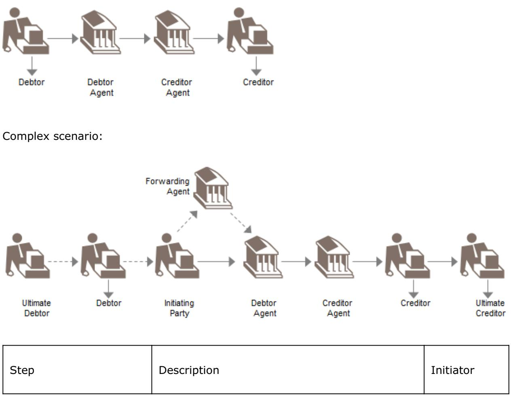

| Prepare, authorise and<br>send payment order(s)<br>(1)                                                                                                    | An initiating party collects the information<br>necessary to initiate a payment to the<br>forwarding or debtor agent.<br>Depending on whether the initiating party is a<br>corporate or an individual, the business<br>information needed in the business process is<br>slightly different.                                                                                                                                                                                                                                                                                                                                                                                                                                                                                                                                                                                                                                                                                                                                                                                                                                                                                                                                                   | Initiating<br>Party/Debtor               |
|-----------------------------------------------------------------------------------------------------------------------------------------------------------|-----------------------------------------------------------------------------------------------------------------------------------------------------------------------------------------------------------------------------------------------------------------------------------------------------------------------------------------------------------------------------------------------------------------------------------------------------------------------------------------------------------------------------------------------------------------------------------------------------------------------------------------------------------------------------------------------------------------------------------------------------------------------------------------------------------------------------------------------------------------------------------------------------------------------------------------------------------------------------------------------------------------------------------------------------------------------------------------------------------------------------------------------------------------------------------------------------------------------------------------------|------------------------------------------|
| Receive payment order<br>and check<br>authentication (2)                                                                                                  | The forwarding agent, if present and debtor<br>agent receive the payment orders from the<br>previous party in the chain.                                                                                                                                                                                                                                                                                                                                                                                                                                                                                                                                                                                                                                                                                                                                                                                                                                                                                                                                                                                                                                                                                                                      | Forwarding<br>Agent /<br>Debtor<br>Agent |
| Technical Validation<br>(3.1), risk assessment<br>(3.2), apply business<br>rules (3.3) and prepare<br>payment orders for<br>onward transmission<br>(3.4). | Necessary checks before processing the<br>payment order further include, for example,<br>syntactical validation.<br>The debtor agent undertakes the necessary<br>risk checks when the execution date is<br>reached, in order to further process the<br>payment. Examples of dynamic risk<br>assessment are: is sufficient cash available,<br>has cover been received, etc.<br>Examples of static risk assessment are: check<br>limits, embargo, money laundering<br>information, etc.<br>The forwarding agent (if any) or debtor agent<br>will check business rules that he has logged for<br>the initiating party sending the file. These<br>business rules include information about the<br>customer's profile: the type of transactions the<br>customer is allowed to send, the authorisation<br>procedures set up between customer and<br>receiving agent, etc.<br>The forwarding agent rebuilds the payment<br>order by:<br>•<br>subtracting the failed/invalid individual<br>payment instructions from the payment<br>orders he received<br>•<br>bulking, if relevant, of several payment<br>orders coming from different initiating<br>parties or agents acting as forwarding<br>agents. The merge criteria are defined by<br>the bank | Forwarding<br>Agent /<br>Debtor<br>Agent |

| Receive (and forward)<br>status report (4) | The initiating party can receive from the<br>forwarding and/or debtor agent different status<br>reports for the payment order.<br>The payment status report can be produced at<br>different stages of the processing and may<br>have a different business value (depending on<br>the checks performed, for example, payment<br>authentication, syntax validation, risk<br>assessment.).<br>In the case of a relay scenario, there may be a<br>duplication of payment status reports when,<br>for example, a first risk analysis report is<br>produced by the agent acting as a forwarding<br>agent and a second risk analysis report be<br>produced by the debtor agent (acting as the<br>executing agent in that case). A payment<br>status report can only cover the rejected items<br>for a given payment order group or encompass<br>both positive and negative, that is, rejections,<br>acknowledgement for the items in the payment<br>order group. It may optionally report on pre<br>agreed repair action taken by the bank.<br>At any stage, the payment status report<br>expresses whether the payment order is<br>accepted for further processing (that is, valid<br>from a syntax, business content, risk analysis<br>point of view) or rejected and the reason for<br>rejection or whether the payment has been<br>repaired and how.<br>Depending on the agreement between the<br>initiating party and the debtor agent (or<br>forwarding agent in relay scenario), the<br>payment orders may be rejected as a whole or<br>partially. The rejection criteria can be fixed as<br>a percentage or an absolute number of<br>individual rejected orders or other agreed<br>criteria.<br>Consequently, if all the payment orders are<br>rejected, a global status can be returned with<br>the global reason.<br>In the case of a relay scenario, where the<br>debtor agent generates the status report, it will<br>first be the forwarding agent that receives the<br>status report. The forwarding agent will then<br>forward the status report to the initiating party.<br>'Send negative status report' and 'Send<br>positive status reports' are subsets of 'send<br>status report'. A negative status report will<br>only include rejected items; a positive status<br>report will include accepted items and repaired<br>items. A 'generic' status report can include a | Initiating<br>Party/<br>Debtor<br>Agent /<br>Forwarding<br>Agent |
|--------------------------------------------|---------------------------------------------------------------------------------------------------------------------------------------------------------------------------------------------------------------------------------------------------------------------------------------------------------------------------------------------------------------------------------------------------------------------------------------------------------------------------------------------------------------------------------------------------------------------------------------------------------------------------------------------------------------------------------------------------------------------------------------------------------------------------------------------------------------------------------------------------------------------------------------------------------------------------------------------------------------------------------------------------------------------------------------------------------------------------------------------------------------------------------------------------------------------------------------------------------------------------------------------------------------------------------------------------------------------------------------------------------------------------------------------------------------------------------------------------------------------------------------------------------------------------------------------------------------------------------------------------------------------------------------------------------------------------------------------------------------------------------------------------------------------------------------------------------------------------------------------------------------------------------------------------------------------------------------------------------------------------------------------------------------------------------------------------------------------------------------------------------------------------------------------------------------------------------------------------------------------------------------------------------------------------------------------------------------------------------------------------------------------------------------|------------------------------------------------------------------|
|--------------------------------------------|---------------------------------------------------------------------------------------------------------------------------------------------------------------------------------------------------------------------------------------------------------------------------------------------------------------------------------------------------------------------------------------------------------------------------------------------------------------------------------------------------------------------------------------------------------------------------------------------------------------------------------------------------------------------------------------------------------------------------------------------------------------------------------------------------------------------------------------------------------------------------------------------------------------------------------------------------------------------------------------------------------------------------------------------------------------------------------------------------------------------------------------------------------------------------------------------------------------------------------------------------------------------------------------------------------------------------------------------------------------------------------------------------------------------------------------------------------------------------------------------------------------------------------------------------------------------------------------------------------------------------------------------------------------------------------------------------------------------------------------------------------------------------------------------------------------------------------------------------------------------------------------------------------------------------------------------------------------------------------------------------------------------------------------------------------------------------------------------------------------------------------------------------------------------------------------------------------------------------------------------------------------------------------------------------------------------------------------------------------------------------------------|------------------------------------------------------------------|

|                                                                                                               | combination of negative and positive status<br>reports.<br>When the initiating party receives a negative<br>status report (containing rejected items),<br>based on the negative status message (reject)<br>from the first or forwarding agent, the<br>initiating party analyses the reason for<br>rejection, corrects the information causing this<br>reject and reverses the payment: he removes<br>the payment from remittance in transit and<br>resets the underlying invoices to payable<br>again.                                                                       |                                          |
|---------------------------------------------------------------------------------------------------------------|------------------------------------------------------------------------------------------------------------------------------------------------------------------------------------------------------------------------------------------------------------------------------------------------------------------------------------------------------------------------------------------------------------------------------------------------------------------------------------------------------------------------------------------------------------------------------|------------------------------------------|
| Confirm acceptance<br>(5.1) and send (5.2),<br>receive and/or forward<br>(5.3) acceptance<br>acknowledgement. | This acceptance acknowledgement signifies<br>that the payment order (subject to prior<br>information received through the various<br>payment status reports) will be processed by<br>the debtor agent and will trigger accounting<br>entries on the debtor/initiating party account<br>maintained at the debtor agent.                                                                                                                                                                                                                                                       | Debtor<br>Agent /<br>Forwarding<br>Agent |
| Reconcile and track<br>payment (6)                                                                            | The initiating party will reconcile events<br>coming from its information system (e.g.<br>account receivables) with external information<br>feeds (e.g. debit advices, account statement,<br>acceptance notification).<br>This process aims at matching both internal<br>and external views and identifying items for<br>which further attention is required.<br>The reconciliation either ends the financial leg<br>of a transaction (from payment inception to<br>payment completion confirmation) when<br>positive or leads to investigations or claims<br>when negative. | Initiating<br>Party /<br>Debtor          |
| Debit account and credit<br>Internal account (7)                                                              | The debtor agent debits the account stipulated<br>as being the debit account in the payment<br>order. This includes currency conversion and<br>charges if needed.<br>The debtor agent, after having successfully<br>debited the debtor's account, credits internal<br>accounts in order to transfer the provision<br>necessary to process the payment order<br>further.                                                                                                                                                                                                      | Debtor<br>Agent                          |

| Send, receive and/or<br>forward debit advice<br>(7.1) | The debit advice, prepared by the debtor<br>agent, notifies the initiating party that the<br>settlement has been performed, that is, that<br>the debit entry has been passed on the<br>account of the debtor/initiating party. The<br>initiating party uses it for the reconciliation of<br>entries vis-à-vis payment orders received/<br>remitted.<br>The initiating party receives a notification from<br>the debtor agent, (possibly through the<br>forwarding agent - if any), that the debit entry<br>has been passed on the account of the debtor<br>(which may or may not be equal to the<br>initiating party).<br>This debit advice will be further used for the<br>reconciliation of entries vis-à-vis payment<br>orders received/remitted.<br>The forwarding agent forwards to the initiating<br>party a notification received from the debtor<br>agent that the debit entry has been passed on<br>the account of the debtor/initiating party.<br>This debit advice will be further used by the<br>initiating party for the reconciliation of entries<br>vis-à-vis payment orders received/remitted. | Debtor<br>Agent /<br>Forwarding<br>Agent |
|-------------------------------------------------------|----------------------------------------------------------------------------------------------------------------------------------------------------------------------------------------------------------------------------------------------------------------------------------------------------------------------------------------------------------------------------------------------------------------------------------------------------------------------------------------------------------------------------------------------------------------------------------------------------------------------------------------------------------------------------------------------------------------------------------------------------------------------------------------------------------------------------------------------------------------------------------------------------------------------------------------------------------------------------------------------------------------------------------------------------------------------------------------------------------------|------------------------------------------|
| Internal bookkeeping<br>(8)                           | The debtor agent debits the internal account<br>where the provision for further processing of<br>the payment order has been blocked. The<br>creditor agent credits the creditor's account in<br>its books.                                                                                                                                                                                                                                                                                                                                                                                                                                                                                                                                                                                                                                                                                                                                                                                                                                                                                                     | Debtor<br>Agent /<br>Creditor<br>Agent   |
| Print Cheques (9)                                     | If the initiating party has asked the debtor<br>agent to issue a cheque to pay the creditor, the<br>debtor agent or creditor agent will print a<br>cheque.                                                                                                                                                                                                                                                                                                                                                                                                                                                                                                                                                                                                                                                                                                                                                                                                                                                                                                                                                     | Debtor<br>Agent /<br>Creditor<br>Agent   |

| Rebuild payment<br>order(s) (10)                              | The debtor agent rebuilds the payment order<br>by:<br>•<br>subtracting the failed/invalid individual<br>payment instructions from the payment<br>orders he received<br>•<br>subtracting, if relevant, the 'on us'<br>individual payment instructions from the<br>payment orders he received<br>•<br>merging, if relevant, of several payment<br>orders coming from different initiating<br>parties or agents acting as forwarding<br>agents. The merge criteria are defined by<br>the bank<br>•<br>re-building a consistent remittance                                                                                                                                                                                                                                                                                                                                                                                                                                                                                                                                                                                                                                                                                                                                                                                                                  | Debtor<br>Agent                          |
|---------------------------------------------------------------|---------------------------------------------------------------------------------------------------------------------------------------------------------------------------------------------------------------------------------------------------------------------------------------------------------------------------------------------------------------------------------------------------------------------------------------------------------------------------------------------------------------------------------------------------------------------------------------------------------------------------------------------------------------------------------------------------------------------------------------------------------------------------------------------------------------------------------------------------------------------------------------------------------------------------------------------------------------------------------------------------------------------------------------------------------------------------------------------------------------------------------------------------------------------------------------------------------------------------------------------------------------------------------------------------------------------------------------------------------|------------------------------------------|
| Send (11) / receive and<br>forward (11.1)<br>execution status | The initiating party optionally receives an<br>execution status report from the debtor agent<br>(possibly through the forwarding agent - if<br>any).<br>The forwarding agent forwards to the initiating<br>party a notification received from the debtor<br>agent that the payment order file has been<br>executed. Depending on the payment method<br>requested and depending on the routing<br>information contained in the payment order:<br>•<br>the creditor(s) has/have been credited in<br>the books of the debtor agent (for 'on-us'<br>payments)<br>•<br>the debtor agent has printed and sent<br>cheques<br>•<br>the debtor agent has sent off the<br>payment orders which need to be further<br>routed in the payment chain (for 'not on<br>us' payments)<br>If the creditor has an account in the books of<br>the debtor agent (which is same as creditor<br>agent then), this execution status is a 'final'<br>execution status (that is, the creditor has been<br>credited by his agent). In the other cases<br>('receive cheques'/and when the creditor has<br>an account at a different agent than the debtor<br>agent), the execution status is not yet 'final' -<br>that is, the execution status does not include<br>the actual confirmation of credit of the creditor<br>by his agent - or cashing of cheque by the<br>beneficiary. | Debtor<br>Agent /<br>Forwarding<br>Agent |

<span id="page-22-0"></span>Customer-to-bank Direct Debit

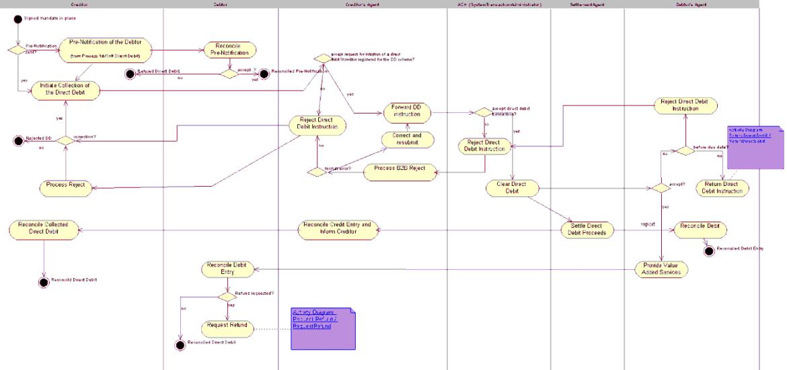

#### Return Direct Debit

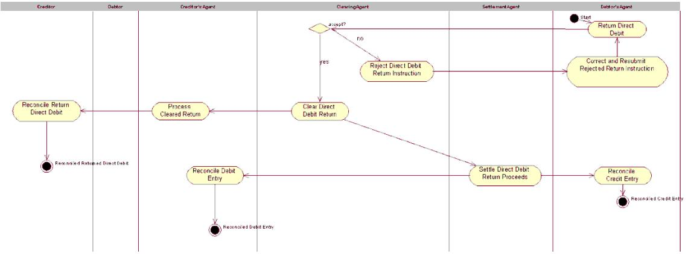

### Request Refund of Direct Debit

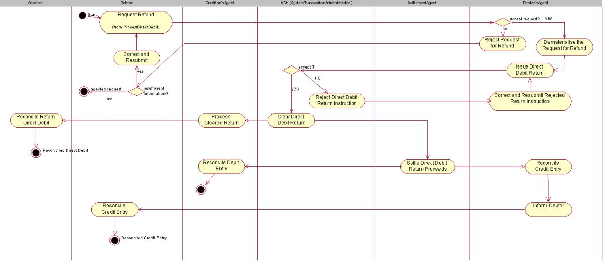

# <span id="page-24-0"></span>**BusinessTransactions**

This section describes the message flows based on the activity diagrams documented above. It shows the typical exchanges of messages in the context of a BusinessTransaction.

# <span id="page-24-1"></span>**CustomerCreditTransferInitiation**

The CustomerCreditTransferInitiation message is sent from the initiating party to the debtor agent. Depending on the service level agreed between the debtor agent and the initiating party, the debtor agent may send a CustomerPaymentStatusReport message to inform the initiating party of the status of the initiation.

A number of additional message flows have been included to illustrate the complete end-toend execution of the CustomerCreditTransferInitiation. However, these messages are out of scope. These message flows are:

Account information from debtor agent to initiating party

Depending on the service level agreed, the debtor agent may provide the initiating party with a BankToCustomerDebitCreditNotification ('notification') and/or BankToCustomerAccountReport/BankToCustomerStatement ('statement') once the payment has been executed and the debit entry has been posted to the debtor account. The logical, chronological sequence for sending these messages is defined by the bank implementing and offering these services.

Interbank clearing and settlement between debtor agent and creditor agent

Depending on the interbank clearing and settlement method chosen, a number of messages may be exchanged between the agent parties in the payment chain.

Account information from creditor agent to creditor

Depending on the service level agreed, the creditor agent may provide the creditor with a BankToCustomerDebitCreditNotification ('notification') and/or BankToCustomerAccountReport/BankToCustomerStatement ('statement') once the payment has been posted to the creditor account. The logical, chronological sequence for sending these messages is defined by the bank implementing and offering these services.

The scenarios below illustrate the different customer roles that can be played on the initiating side of the credit transfer initiation, and on the receiving side of the cash transfer.

On the initiating side, up to three customer roles can be specified: the initiating party, that is, the party sending the message, the debtor, that is the debit account owner, and the ultimate debtor, that is, the party that owes the cash to the creditor as a result of receipt of goods or services.

These three roles can be played by one and the same actor, or they can be played by different actors.

The CustomerCreditTransferInitiation message allows inclusion of the three different roles on the initiating side.

On the receiving side, up to two customer roles can be specified: the creditor, that is, the credit account owner, and the creditor, that is, the party that is the ultimate beneficiary of the cash transfer. These two roles can be played by one and the same actor, or they can be played by different actors.

The CustomerCreditTransferInitiation message allows inclusion of the two different roles on the receiving side.

## **One Actor plays roles of Initiating Party, Debtor and Ultimate Debtor, Second actor plays roles of Creditor and Ultimate Creditor**

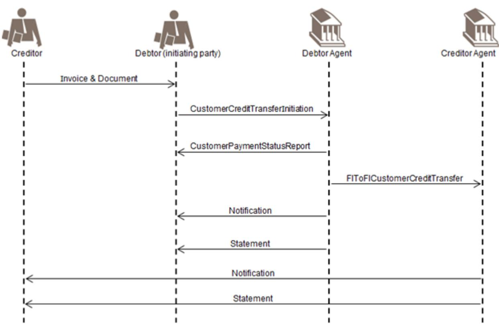

The message is sent by an initiating party to the debtor agent. The actor playing the role of initiating party is the same as the actor playing the role of debtor and ultimate debtor. The actor playing the role of creditor is the same as the actor playing the role of creditor.

## **One actor plays roles of Initiating Party and Debtor, second actor plays role of Ultimate Debtor**

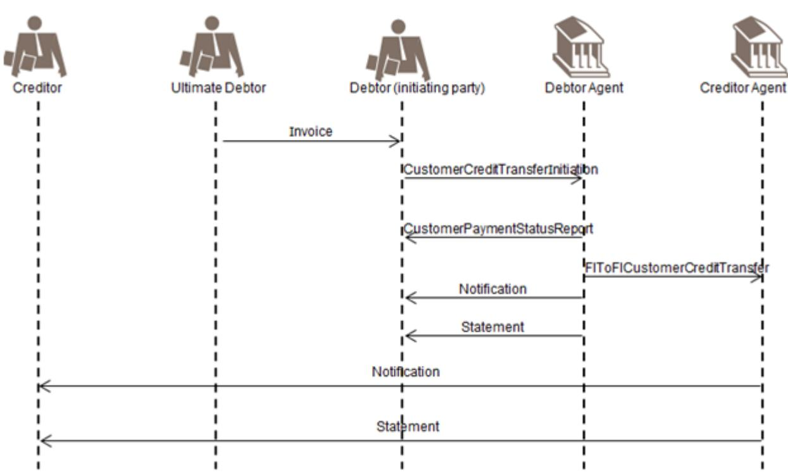

The message is sent by an initiating party to the debtor agent. The actor playing the role of initiating party is the same as the actor playing the role of debtor, but the role of the ultimate debtor is played by a different actor.

## **Three Different actors play the roles of Initiating Party, Debtor and Ultimate Debtor:**

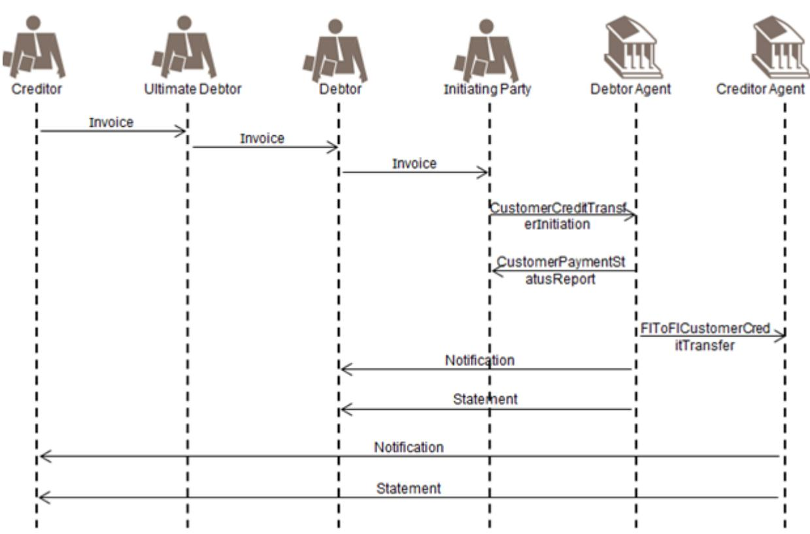

The message is sent by an initiating party to the debtor agent. The actor playing the role of initiating party is different from the actor playing the role of debtor. The role of the ultimate debtor is played by yet another actor.

# <span id="page-27-0"></span>**CustomerCreditTransferInitiation - Relay**

The CustomerCreditTransferInitiation message is sent from the initiating party to the forwarding agent.

Depending on the service level agreed between the forwarding agent and the initiating party, the forwarding agent may send a CustomerPaymentStatusReport message to inform the initiating party of the status of the initiation.

After performing a series of checks, the forwarding agent will forward the CustomerCreditTransferInitiation message to the relevant debtor agent, that is, the agent that will debit the debtor account.

A relay scenario always requires service level agreements between all parties involved, in which obligations and responsibilities for each party are stipulated.

A number of additional message flows have been included to illustrate the complete end-toend execution of the payment initiation. However, these messages are out of scope.

The below scenarios show the different customer roles that can be played on the initiating side of the credit transfer initiation, and on the receiving side of the cash transfer.

On the initiating side, up to three customer roles can be specified: the initiating party, that is., the party sending the message, the debtor, that is, the debit account owner, and the

ultimate debtor, that is, the party that owes the cash to the creditor, as a result of receipt of goods or services.

These three roles can be played by one and the same actor, or they can be played by different actors. The CustomerCreditTransferInitiation message allows inclusion of the three different roles on the initiating side.

On the receiving side, up to two customer roles can be specified: the creditor, that is, the credit account owner, and the creditor, that is, the party that is the ultimate beneficiary of the cash transfer. These two roles can be played by one and the same actor, or they can be played by different actors. The CustomerCreditTransferInitiation message allows inclusion of the two different roles on the receiving side.

## **One actor plays roles of Initiating Party, Debtor and Ultimate Debtor**

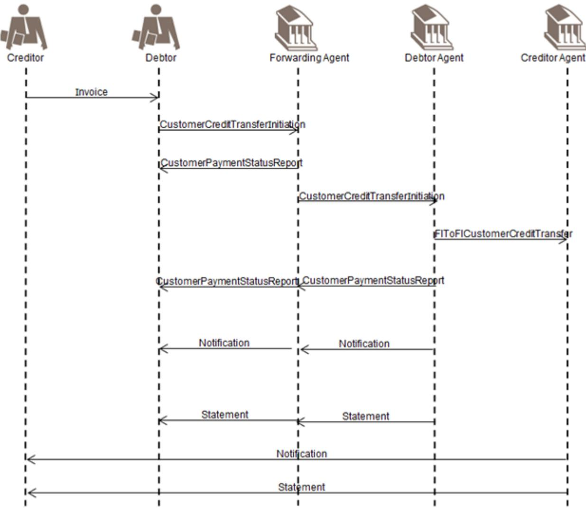

The message is sent by an initiating party to the forwarding agent. The actor playing the role of initiating party is the same as the actor playing the role of debtor and ultimate debtor. This illustrates the scenario in which a company owns accounts abroad and uses a concentrator bank to initiate all its payments. The company plays the role of debtor, ultimate debtor and initiating party and asks the forwarding agent to request the execution of the payment at the debtor agent, that is, the account servicer of the debtor. After performing a series of checks, the forwarding agent will forward the message to the debtor agent.

## **One actor plays roles of Initiating Party and Debtor, Second Actor plays role of Ultimate Debtor**

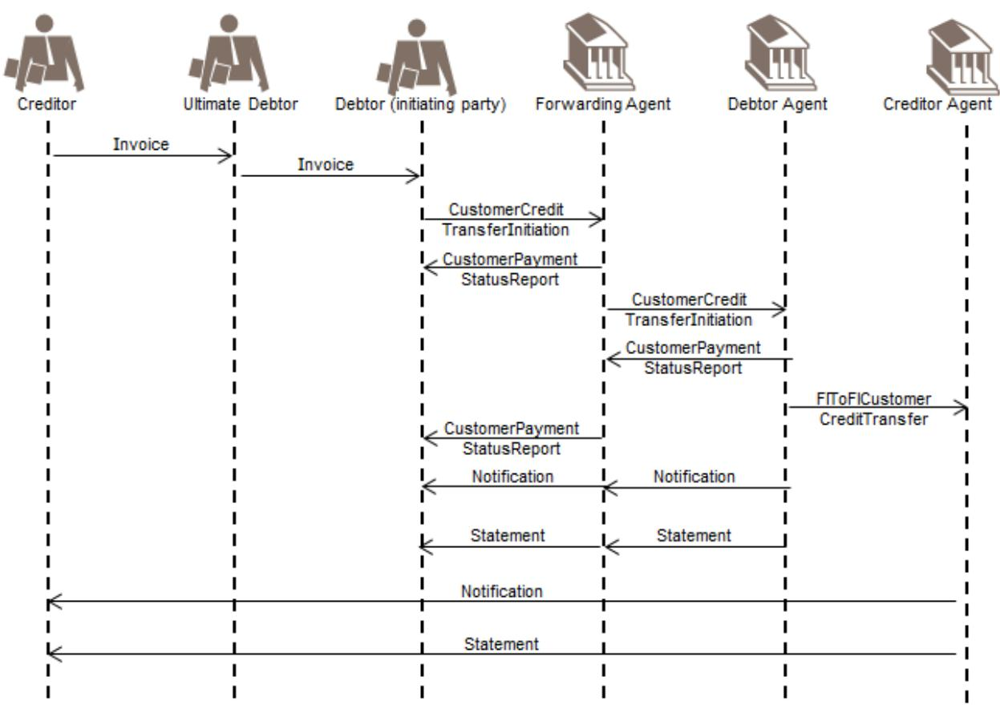

The message is sent by an initiating party to the forwarding agent. The actor playing the role of initiating party is the same as the actor playing the role of debtor, but the role of the ultimate debtor is played by a different actor. This illustrates the scenario in which, for example, a company's head office concentrates all payments from its subsidiaries. The head office plays the role of debtor and initiating party, whilst the subsidiaries play the role of originating parties, in this case ultimate debtor. After performing a series of checks, the forwarding agent will forward the message to the debtor agent.

## **One actor plays roles of Initiating Party and Ultimate Debtor, Second Actor plays role of Debtor**

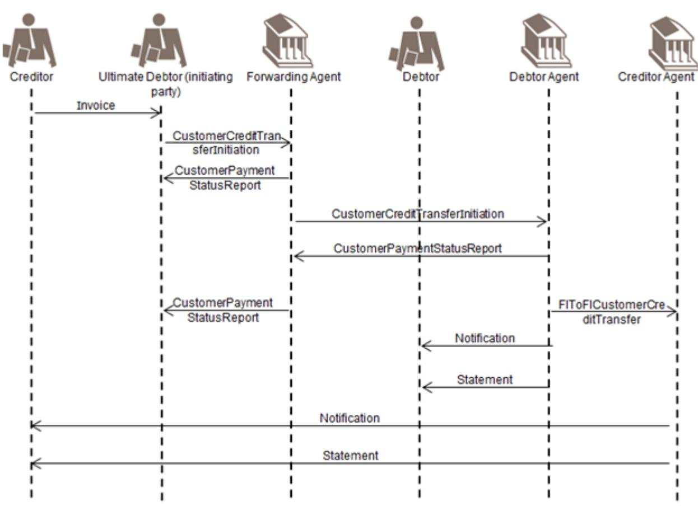

The message is sent by an initiating party to the forwarding agent. The actor playing the role of initiating party is the same as the actor playing the role of ultimate debtor, but the role of the debtor is played by a different actor. This illustrates the scenario in which, for example, a head office initiates the payment, but has agreed with its subsidiary abroad to use the account of the subsidiary for certain payments. After performing a series of checks, the forwarding agent will forward the message to the debtor agent.

# <span id="page-30-0"></span>**CustomerDirectDebitInitiation and FIToFICustomerDirectDebit**

A Direct debit is a request for payment of an amount to be collected from a party bank account (the debtor) by an originator (the creditor). The amounts and dates of collections may vary.

Direct Debits result in cash transfers between debtors and creditors through infrastructures or correspondent banks. They may be exchanged as single instructions but are traditionally grouped following some common characteristics and, for convenience or efficiency reasons, exchanged in a batch mode.

Direct Debits are processed in different ways from country to country, especially regarding the handling of the mandate (when it exists) given by the debtor to the creditor.

The CustomerDirectDebitInitiation message is sent by the initiating party (creditor) to the forwarding agent or creditor agent. It is used to request single or bulk collection(s) of cash from one or various debtor account(s) to a creditor.

The FIToFICustomerDirectDebit message is sent by a financial institution to another financial institution, directly or through a clearing system. It is used to clear Direct Debit instructions, initiated by non-financial institution customers.

Only the messages that are part of the scope of the direct debit are illustrated in the diagram.

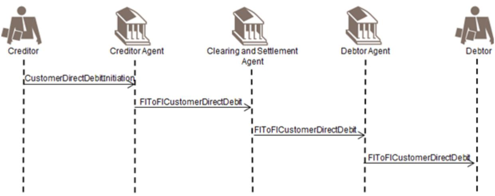

To provide added value to its customer, a debtor agents may send the instruction (simplified version) to its customer, the debtor, for example, when pre-notifications are not used in a scheme.

The original mandate between the debtor and the creditor and the mandate management itself are identified as being out of scope and are therefore not included in the diagram. Some information on possible mandate management information flow is available below.

The mandate is the authorisation/expression of consent given by the debtor, allowing a specified creditor to originate direct debit instructions to debit a specified debtor account in accordance with the relevant direct debit Scheme Rules and, if applicable, the mandate details.

A valid/authorised mandate represents the debtor agreement to:

- authorise the creditor to issue direct debit instruction(s) to the debtor account •
- instruct the debtor agent to act upon the creditor direct debit instruction •
- In some cases, the debtor agent is unaware of the mandate and simply acts upon the direct debit instruction. 1.

A mandate can be an electronic mandate or a mandate in paper form. In case of a paper mandate the creditor dematerialises the mandate upon the mandate presentation in paper form. Dematerialised mandate data are referred to as the Mandate Related Information (MRI) only and are not to be considered as the mandate document. The original mandate remains subject for archiving and reference for any legal matter.

Prior to the sending of a direct debit instruction, the creditor may notify the debtor of the amount and date on which the direct debit instruction will be presented to the debtor agent for debit. This notification may be sent together with or separately from other commercial documents (for example, an invoice).

There are two types of pre-notifications:

- Schedule of payments for a number of subsequent Direct Debits for an agreed period of time. •
- Individual advises of a direct debit subject for collection on a specified value date only. In case of recurrent •

Direct Debit requires an update for each individual recurrent direct debit prior to its collection.

The debtor will reconcile the pre-notification with the signed/authorised mandate and where relevant other records (such as account payable items, contract details or subscription agreement). The debtor ensures the account is covered with subject amount.

The creditor sends the CustomerDirectDebitInitiation message to its agent (the creditor agent), together with the Mandate Related Information when requested by the scheme.

The creditor agent sends an FIToFICustomerDirectDebit message to the clearing and settlement agent, in line with the clearing cycle. The Mandate Related Information (MRI) is also transported, when requested by the scheme.

The clearing and settlement agent sends the FIToFICustomerDirectDebit message, together with the Mandate Related Information (MRI), when requested by the scheme, to the debtor agent.

Out of scope

- Optionally, the debtor agent could forward the direct debit instruction (simplified version) to the debtor (for example, if pre-notifications are not used in a scheme). •
- If the clearing and settlement agent are two parties the clearing agent prepares and sends the payment information for the settlement agent (in accordance with the agreed and published settlement cycle). The process includes the calculation of the settlement positions and transmission of the files to the Settlement Agent. •

The information provided includes the net position to be debited, the party to be debited, the net position to be credited, the party to be credited and the value date.

The clearing agent prepares and sends the payment information for the settlement agent (in accordance with the agreed and published settlement cycle). The process includes the calculation of the settlement positions and transmission of the files to the settlement agent.

The information provided includes the net position to be debited, the party to be debited, the net position to be credited, the party to be credited and the value date.

The settlement is executed by the settlement agent, in accordance with the settlement cycle, based on the settlement report provided by the clearing agent. The settlement agent performs the transfer of funds from the debtor agent to the creditor agent.

Reporting (BankToCustomerDebitCreditNotification message ('notification') and/or BankToCustomerAccountReport/ BankToCustomerStatement message ('statement')) to the debtors and creditors is out of scope. Timing may vary depending on market practices and value added services provided by some agents, that is, before or after settlement.

# <span id="page-33-0"></span>**Negative Customer and FIToFIPaymentStatusReport with Direct Debit**

The negative CustomerPaymentStatusReport message (single or grouped) or FItoFIPaymentStatusReport message (single or grouped) is sent by the receiver of an instruction to inform the sender of the instruction about the negative processability of the instruction.

The negative CustomerPaymentStatusReport message FIToFIPaymentStatusReport message used to reject a direct debit instruction, is to be sent before settlement. After settlement, the correct message to be used is the PaymentReturn message.

## **Negative CustomerPaymentStatusReport - Creditor Agent**

A negative CustomerPaymentStatusReport message is initiated by the creditor agent to reject a CustomerDirectDebitInitiation message. (Only the messages that are part of the scope of the direct debit are illustrated in the diagram):

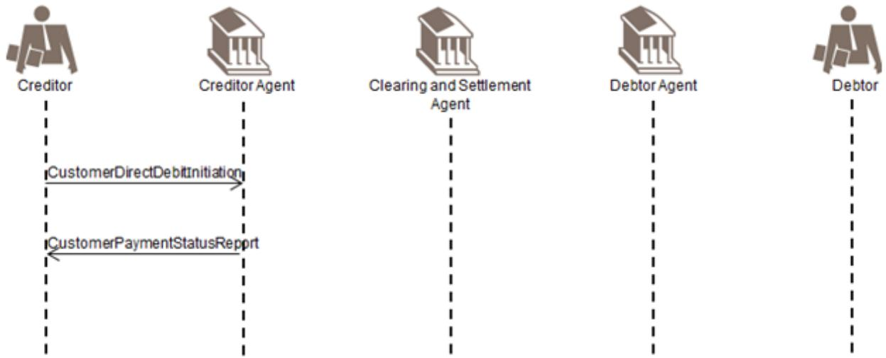

The creditor sends the CustomerDirectDebitInitiation message to its Agent (the creditor agent).

The creditor agent sends a negative CustomerPaymentStatusReport message to the creditor to inform him about the non processability of the CustomerDirectDebitInitiation instruction, for instance due to missing information.

## **Negative CustomerPaymentStatusReport - Clearing And Settlement Agent**

A negative FIToFIPaymentStatusReport message is initiated by the clearing and settlement agent to reject an FIToFICustomerDirectDebit message (only the messages that are part of the scope of the direct debit are illustrated in the diagram):

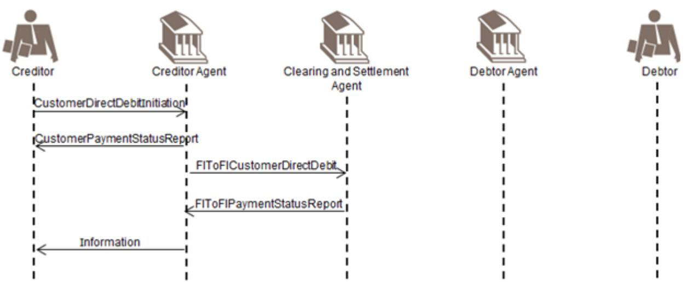

Whenever possible, the creditor agent will correct or complement the instruction and resubmit. If this is the case, the creditor agent would not send a negative CustomerPaymentStatusReport to the creditor. However, depending on what has been agreed between the creditor and its agent, the creditor agent may inform its customer about the repair, for example, value date.

With respect to 'Information' above: If the creditor agent books after collection (that is cycle is 3 days) then the CustomerPaymentStatusReport message is to be used. If the creditor agent books immediately and the instruction is rejected in the interbank leg, then the creditor needs to be informed of a payment return.

The creditor sends the CustomerDirectDebitInitiation message to its Agent (the creditor agent).

The creditor agent confirms the processability of the CustomerDirectDebitInitiation instruction by sending a positive CustomerPaymentStatusReport message to the creditor.

The creditor agent sends an FIToFICustomerDirectDebit message to the clearing and settlement agent, in line with the clearing cycle. The Mandate Related Information (MRI) is also transported, when applicable.

If information is missing and interbank settlement has not taken place yet, the clearing and settlement agent informs the creditor agent about the non processability of the FIToFICustomerDirectDebit instruction. The creditor agent may inform (but not necessarily) his customer, the creditor, about the negative processing of the CustomerDirectDebitInitiation instruction by using a negative CustomerPaymentStatusReport message, a BankToCustomerDebitCreditNotification message ('notification') or through a BankToCustomerAccountReport and/or BankToCustomerStatement message.

Before sending a negative CustomerPaymentStatusReport message to its customer, it is assumed that the creditor agent will try to correct the CustomerDirectDebitInitiation message information and re-submit an FIToFICustomerDirectDebit message to the clearing and settlement agent. In this case the creditor will not be involved. 1.

## **Negative FIToFIPaymentStatusReport - Debtor Agent**

A negative FIToFIPaymentStatusReport message is initiated by the debtor agent to reject the FIToFICustomerDirectDebit message (only the messages that are part of the scope of the direct debit are illustrated in the diagram):

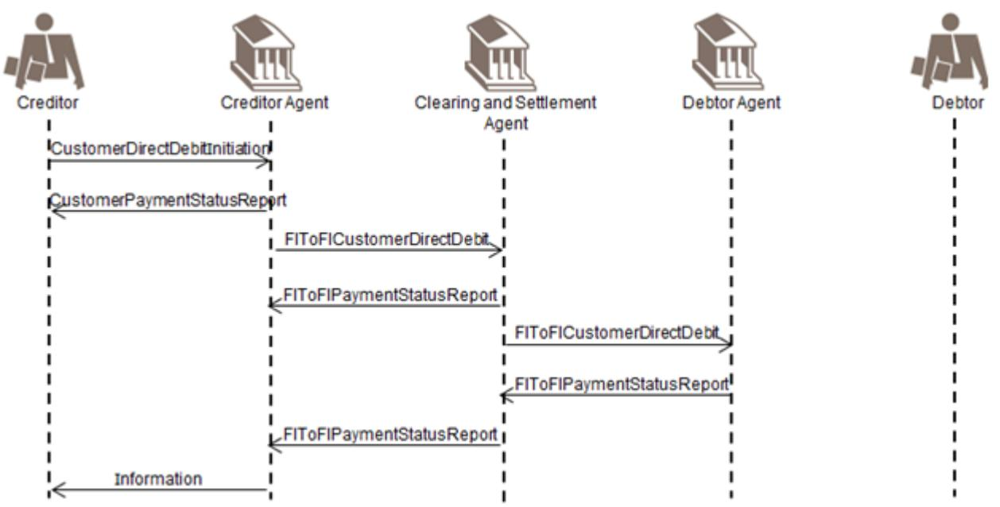

Whenever possible, the creditor agent will correct or complement the instruction and resubmit. If this is the case, the creditor agent would not send a negative CustomerPaymentStatusReport to the creditor. However, depending on what has been agreed between the creditor and its agent, the creditor agent may inform its customer about the repair, for example, value date.

With respect to 'Information' above: if the creditor agent books after collection, for example, cycle is 3 days, then the CustomerPaymentStatusReport message is to be used. If the creditor agent books immediately and the instruction is rejected in the interbank leg, then the creditor needs to be informed of a payment return.

The creditor sends a CustomerDirectDebitInitiation message to its Agent (the creditor agent).

The creditor agent confirms the processability of the CustomerDirectDebitInitiation message by sending a positive

## **CustomerPaymentStatusReport message to the Creditor**

The creditor agent sends an FIToFICustomerDirectDebit message to the clearing and settlement agent, in line with the clearing cycle. The Mandate Related Information (MRI) is also transported, when applicable.

The clearing and settlement agent confirms the processability of the FIToFICustomerDirectDebit message by sending a positive FIToFIPaymentStatusReport message to the creditor agent.

The clearing and settlement agent sends an FIToFICustomerDirectDebit message, optionally with the Mandate Related Reference (MRI), to the debtor agent immediately for information purposes only.

If settlement has not yet taken place, the debtor agent may send a negative FIToFIPaymentStatusReport message to the clearing and settlement agent, to inform him about the rejection of the FIToFICustomerDirectDebitinstruction. This negative FIToFIPaymentStatusReport message may subsequently be forwarded to the creditor agent. The creditor agent may inform (but not necessarily) his customer, the creditor, about the negative processing of the CustomerDirectDebitInitiation instruction by using a CustomerPaymentStatusReport message, a BankToCustomerDebitCreditNotification message ('notification') or through a BankToCustomerAccountReport and/or BankToCustomerStatement message ('statement').

# <span id="page-36-0"></span>**Positive Customer and FIToFIPaymentStatusReport with Direct Debit**

The positive CustomerPaymentStatusReport message (single or grouped) and FIToFIPaymentStatusReport message (single or grouped) is sent by the receiver of an instruction to inform the receiver that the instruction received is processable.

A positive CustomerPaymentStatusReport message or FIToFIPaymentStatusReport message can also be used to confirm the processability of a PaymentReturn message (in case of FIToFI) or a PaymentReversal message.

The positive CustomerPaymentStatusReport message and FIToFIPaymentStatusReport message are also meant to be generic to ensure re-usability with other Payments Instruments.

The CustomerPaymentStatusReport and FIToFIPaymentStatusReport messages are exchanged, point to point between two parties, optionally and as per bilateral agreements and may be complemented by a BankToCustomerDebitCreditNotification message ('notification') and/or BankToCustomerAccountReport/ BankToCustomerStatement message ('statement').

## **Confirmation of Processability of CustomerDirectDebitInitiation**

This scenario shows the use of the CustomerPaymentStatusReport message and FIToFIPaymentStatusReport message to confirm the processability of a CustomerDirectDebitInitiation instruction, followed by an FIToFICustomerDirectDebit message (only the messages that are part of the scope of the direct debit are illustrated in the diagram):

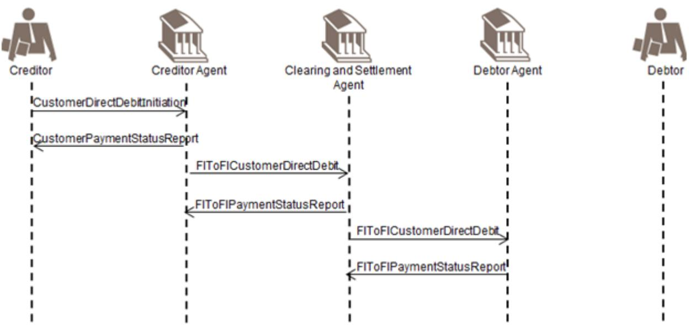

The positive CustomerPaymentStatusReport and FIToFIPaymentStateReport messages are optional.

To provide added value to its creditor, a bank may send a CustomerPaymentStatusReport message with an updated status to inform the creditor about the status of the transaction. The status updates may be provided throughout the life-cycle of the transaction.

A 'mixed' CustomerPaymentStatusReport or FIToFIPaymentStatusReport message may be exchanged, that is, the status is 'partially accepted' at group level, indicating that the group contains a mix of accepted, pending or rejected transactions.

The creditor sends the CustomerDirectDebitInitiation message to its Agent (the creditor agent).

The creditor agent confirms the processability of the CustomerDirectDebitInitiation instruction by sending a positive CustomerPaymentStatusReport message to the creditor.

The creditor agent sends an FIToFICustomerDirectDebit message to the clearing and settlement agent, in line with the clearing cycle. The Mandate Related Information (MRI) is also transported, when applicable.

The clearing and settlement agent confirms the processability of the FIToFICustomerDirectDebit instruction by sending a positive FIToFIPaymentStatusReport message to the creditor agent.

The clearing and settlement agent sends an FIToFICustomerDirectDebit message, optionally with the Mandate Related Information (MRI) to the debtor agent immediately for information purposes only.

The debtor agent sends a positive FIToFIPaymentStatusReport message to the clearing and settlement agent. This positive status message may subsequently be forwarded to the creditor agent.

# <span id="page-37-0"></span>**PaymentReturn with Direct Debit**

A PaymentReturn message is initiated by the debtor agent and sent to the previous party in the payment chain when a debit cannot be executed due to an administrative reason (such as non-existing/closed account) or due to a banking reason (such as insufficient funds). The PaymentReturn message is also the message to be used by the debtor agent following the receipt of a refund request by the debtor as it is assumed that the refund request will be done through a non-automated tool (such as phone/fax) and is not part of the scope. In this case, the PaymentReturn message will contain a code to indicate that it is triggered by a request for refund by the debtor.

## **PaymentReturn Initiated by Debtor Agent**

A PaymentReturn message is initiated by the debtor agent (only the messages that are part of the scope of the direct debit are illustrated in the diagram):

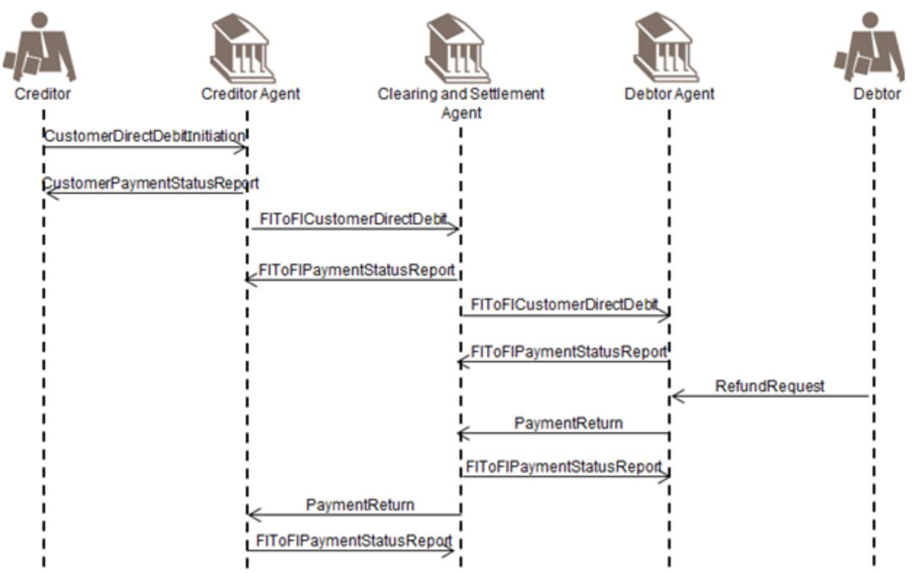

With respect to the RefundRequest, the payment return process can be triggered by a RefundRequest by the debtor or initiated by the debtor agent.

If the booking of the original instruction on the creditor's account has already taken place, the return of the funds will be notified to the creditor through return information included in a BankToCustomerNotification message and/or a BankToCustomerAccountReport or a BankToCustomerStatement message.

The creditor sends the CustomerDirectDebitInitiation message to its Agent (the creditor agent).

The creditor agent confirms the processability of the CustomerDirectDebitInitiation instruction by sending a positive CustomerPaymentStatusReport to the creditor.

The creditor agent sends an FIToFICustomerDirectDebit message to the clearing and settlement agent, in line with the clearing cycle. The Mandate Related Information (MRI) is also transported, when applicable.

The clearing and settlement agent confirms the processability of the FIToFICustomerDirectDebit instruction by sending a positive FIToFIPaymentStatusReport message to the creditor agent.

The clearing and settlement agent sends an FIToFICustomerDirectDebit message, optionally with the Mandate Related Reference (MRI) to the debtor agent immediately for information purposes only.

The debtor agent sends a positive FIToFIPaymentStatusReport message to the clearing and settlement agent.

If the debtor agent is unable to make the collection from the debtor Account for one or several reasons (for example, insufficient funds, customer deceased), the debtor agent will initiate a PaymentReturn message, and route it through the clearing and settlement agent to the creditor agent, giving the reason for the Return.

The clearing and settlement agent optionally confirms the receipt of the PaymentReturn message by sending a positive FIToFIPaymentStatusReport message to the debtor agent.

The clearing and settlement agent forwards the PaymentReturn message to the creditor agent.

If the clearing and settlement agent are two parties the Clearing Agent prepares the (returned) payment information for the Settlement Agent (the net position to be debited, the party to be debited, the net position to be credited, the party to be credited and the value date) in accordance with the agreed and published settlement cycle. The Settlement Agent performs the transfer of cash from the credit party to the debit party (in accordance with the agreed published settlement cycle). (Out of scope and not illustrated).

The creditor agent will optionally confirm receipt of the PaymentReturn message to the clearing and settlement agent. Depending on agreements between the creditor and the creditor agent, the creditor may be informed either through a negative CustomerPaymentStatusReport message, or through a

CustomerToBankDebitCreditNotification message ('notification') or through a BankToCustomerAccountReport and/or BankToCustomerStatement message ('statement') about the funds return and thus the debit on his account.

## **Refund by the Debtor**

This scenario is similar to the previous scenario, except that the PaymentReturn message by the debtor agent to the clearing and settlement agent is triggered by a Refund Request by the debtor to his agent, the debtor agent (in a non-automated manner). In this case, the PaymentReturn message will contain a code indicating that it was triggered by a request for refund by the debtor.

## <span id="page-39-0"></span>**Customer Payment Reversal with Direct Debit**

The creditor will initiate a CustomerPaymentReversal message, after settlement, when a paid direct debit should not have been processed.

The creditor agent will, in turn, initiate an FIToFIPaymentReversal message for the next agent in the payment chain. Consequently, the debtor will be credited.

The creditor agent may be the originator of a payment reversal - he will in this case initiate an FIToFIPaymentReversal message (only the potential messages that are part of the scope of the direct debit are illustrated in the diagram): 1.

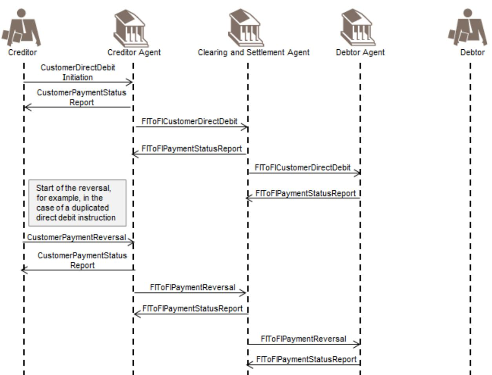

The creditor sends a CustomerDirectDebitInitiation message to its agent (the creditor agent).

The creditor agent confirms the processability of the CustomerDirectDebitInitiation instruction by sending a positive CustomerPaymentStatusReport message to the creditor.

The creditor agent sends an FIToFICustomerDirectDebit message to the clearing and settlement agent, in line with the clearing cycle. The Mandate Related Information (MRI) is also transported, when applicable.

The clearing and settlement agent confirms the processability of the FIToFICustomerDirectDebit instruction by sending a positive FIToFIPaymentStatusReport message to the creditor agent.

The clearing and settlement agent sends an FIToFICustomerDirectDebit message, optionally with the Mandate Related Reference (MRI), to the debtor agent immediately for information purposes only.

The debtor agent sends a positive FIToFIPaymentStatusReport message to the clearing and settlement agent. The creditor realises this was a duplicated CustomerDirectDebitInitiation instruction. He now wants to send a CustomerPaymentReversal message. He identifies the original CustomerDirectDebitInitiation message (or a file of direct debit instructions) and generates an offsetting transaction in favour of the debtor, under the quotation of the reversal reasons. The creditor agent may confirm the receipt of the CustomerPaymentReversal message by sending a positive CustomerPaymentStatusReport message to the creditor.

An FIToFIPaymentReversal message is submitted by the creditor agent to the clearing and settlement agent for settlement, under quotation of the original direct debit reference and the reason for the reversal.

The Clearing Agent confirms the processability of the reversal by sending a positive FIToFIPaymentStatusReport message to the creditor agent.

The clearing and settlement agent forwards the FIToFIPaymentReversal message to the debtor agent immediately for information purposes only.

In case the clearing and settlement agent are two parties the Clearing Agent prepares the payment information for the Settlement Agent (in accordance with the agreed and published settlement cycle). That process includes the calculation of the settlement positions.

The information provided to the Settlement Agent is the net position to be debited, the party to be debited, the net position to the credited, the party to be credited and the value date (Out of Scope).

The Settlement Agent performs the transfer of funds from the Credit Party to the Debit Party (in accordance with the agreed and published settlement cycle) (Out of Scope).

A positive FIToFIPaymentStatusReport message can optionally be initiated by the debtor agent and sent to the clearing and settlement agent to confirm the processability of the reversal message.

It may exceptionally occur that a PaymentReturn message and a CustomerPaymentReversal message would cross each other, this could only be avoided through value-added monitoring services that could be offered by the scheme manager and/or this might provoke exceptions/ investigation handling. 1.

# <span id="page-41-0"></span>**Business Examples**

# <span id="page-41-1"></span>**CustomerCreditTransferInitiation pain. 001.001.12**

### Description

ABC Corporation, New York has received three invoices:

### Invoice 1

An invoice with number 4562, dated 08 September 2012 from DEF Electronics, London: 10 million JPY needs to be paid to DEF Electronics account 23683707994215 with AAAA Bank, London (AAAAGB2L). ABC Corporation assigns reference ABC/4562/2012-09-08 to the payment. Payment transaction charges are shared between ABC Corporation and DEF Electronics.

### Invoice 2

An invoice with number ABC-13679, dated 15 September 2012 from GHI Semiconductors, Brussels: 500,000 EUR needs to be paid to GHI Semiconductors account BE30001216371411 with DDDD Bank, Belgium (DDDDBEBB). ABC Corporation assigns reference ABC/ABC-13679/2012-09-15 to the payment. The accounts receivable department of GHI Semiconductors needs to be advised when the funds have been credited on the account on telephone number +32/2/2222222. GHI Semiconductors will bear all payment transaction charges.

#### Invoice 3

An invoice with number 987-AC, dated 27 September 2012, from their branch ABC Corporation, California: 1 million USD needs to be paid to the branch account 4895623 with BBBB Bank, San Francisco (BBBBUS66). ABC assigns a reference ABC/987-AC/2012-09-27 to the payment. Payment transaction charges are shared.

ABC Corporation holds an account 00125574999 with BBBB Bank, New York (BBBBUS33) and instructs its bank to execute payment of the invoices with a CustomerCreditTransferInitiation message.

#### Business Data

CustomerCreditTransferInitiation from ABC Corporation, New York to BBBB Bank, New York:

| Element               | <xmltag></xmltag>     | Content             |
|-----------------------|-----------------------|---------------------|
| Group Header          | <grphdr></grphdr>     |                     |
| MessageIdentification | <msgid></msgid>       | ABC/120928/CCT001   |
| CreationDateTime      | <credttm></credttm>   | 2012-09-28T14:07:00 |
| NumberOfTransactions  | <nboftxs></nboftxs>   | 3                   |
| Controlsum            | <ctrlsum></ctrlsum>   | 11500000            |
| InitiatingParty       | <initgpty></initgpty> |                     |
| Name                  | <nm></nm>             | ABC Corporation     |
| PostalAddress         | <pstladr></pstladr>   |                     |
| StreetName            | <strtnm></strtnm>     | Times Square        |
| BuildingNumber        | <bldgnb></bldgnb>     | 7                   |
| PostCode              | <pstcd></pstcd>       | NY 10036            |

| TownName                         | <twnnm></twnnm>             | New York        |
|----------------------------------|-----------------------------|-----------------|
| Country                          | <ctry></ctry>               | US              |
| PaymentInformation               | <pmtinf></pmtinf>           |                 |
| PaymentInformationIdentification | <pmtinfid></pmtinfid>       | ABC/086         |
| PaymentMethod                    | <pmtmtd></pmtmtd>           | TRF             |
| BatchBooking                     | <btchbookg></btchbookg>     | FALSE           |
| RequestedExecutionDate           | <reqdexctndt></reqdexctndt> |                 |
| Date                             | <dt></dt>                   | 2012-09-29      |
| Debtor                           | <dbtr></dbtr>               |                 |
| Name                             | <nm></nm>                   | ABC Corporation |
| PostalAddress                    | <pstladr></pstladr>         |                 |
| StreetName                       | <strtnm></strtnm>           | Times Square    |
| BuildingNumber                   | <bldgnb></bldgnb>           | 7               |
| PostCode                         | <pstcd></pstcd>             | NY 10036        |
| TownName                         | <twnnm></twnnm>             | New York        |
| Country                          | <ctry></ctry>               | US              |

| DebtorAccount                        | <dbtracct></dbtracct>       |                     |
|--------------------------------------|-----------------------------|---------------------|
| Identification                       | <id></id>                   |                     |
| Other                                | <othr></othr>               |                     |
| Identification                       | <id></id>                   | 00125574999         |
| DebtorAgent                          | <dbtragt></dbtragt>         |                     |
| FinancialInstitutionIdentification   | <fininstnid></fininstnid>   |                     |
| BICFI                                | <bicfi></bicfi>             | BBBBUS33            |
| CreditTransferTransactionInformation | <cdttrftxinf></cdttrftxinf> |                     |
| PaymentIdentification                | <pmtid></pmtid>             |                     |
| InstructionIdentification            | <instrid></instrid>         | ABC/120928/CCT001/1 |
| EndToEndIdentification               | <endtoendid></endtoendid>   | ABC/4562/2012-09-08 |
| Amount                               | <amt></amt>                 |                     |
| InstructedAmount                     | <instamt></instamt>         | JPY 10000000        |
| ChargeBearer                         | <chrgbr></chrgbr>           | SHAR                |
| CreditorAgent                        | <cdtragt></cdtragt>         |                     |
| FinancialInstitutionIdentification   | <fininstnid></fininstnid>   |                     |

| BICFI                 | <bicfi></bicfi>       | AAAAGB2L                |
|-----------------------|-----------------------|-------------------------|
| Creditor              | <cdtr></cdtr>         |                         |
| Name                  | <nm></nm>             | DEF Electronics         |
| PostalAddress         | <pstladr></pstladr>   |                         |
| AddressLine           | <adrline></adrline>   | Corn Exchange 5th Floor |
| AddressLine           | <adrline></adrline>   | Mark Lane 55            |
| AddressLine           | <adrline></adrline>   | EC3R7NE London          |
| AddressLine           | <adrline></adrline>   | GB                      |
| CreditorAccount       | <cdtracct></cdtracct> |                         |
| Identification        | <id></id>             |                         |
| Other                 | <othr></othr>         |                         |
| Identification        | <id></id>             | 23683707994215          |
| Purpose               | <purp></purp>         |                         |
| Code                  | <cd></cd>             | GDDS                    |
| RemittanceInformation | <rmtinf></rmtinf>     |                         |
| Structured            | <strd></strd>         |                         |

| ReferredDocumentInformation          | <rfrddocinf></rfrddocinf>   |                          |
|--------------------------------------|-----------------------------|--------------------------|
| Type                                 | <type></type>               |                          |
| CodeOrProprietary                    | <cdorprtry></cdorprtry>     |                          |
| Code                                 | <cd></cd>                   | CINV                     |
| Number                               | <nb></nb>                   | 4562                     |
| RelatedDate                          | <rltddt></rltddt>           |                          |
| Type                                 | <tp></tp>                   |                          |
| Code                                 | <cd></cd>                   | INDA                     |
| Date                                 | <dt></dt>                   | 2012-09-08               |
| CreditTransferTransactionInformation | <cdttrftxinf></cdttrftxinf> |                          |
| PaymentIdentification                | <pmtid></pmtid>             |                          |
| InstructionIdentification            | <instrid></instrid>         | ABC/120928/CCT001/2      |
| EndToEndIdentification               | <endtoendid></endtoendid>   | ABC/ABC-13679/2012-09-15 |
| Amount                               | <amt></amt>                 |                          |
| InstructedAmount                     | <instdamt></instdamt>       | EUR 500000               |
| ChargeBearer                         | <chrgbr></chrgbr>           | CRED                     |

| CreditorAgent                      | <cdtragt></cdtragt>                 |                    |
|------------------------------------|-------------------------------------|--------------------|
| FinancialInstitutionIdentification | <fininstnid></fininstnid>           |                    |
| BICFI                              | <bicfi></bicfi>                     | DDDDBEBB           |
| Creditor                           | <cdtr></cdtr>                       |                    |
| Name                               | <nm></nm>                           | GHI Semiconductors |
| PostalAddress                      | <pstladr></pstladr>                 |                    |
| StreetName                         | <strtnm></strtnm>                   | Avenue Brugmann    |
| BuildingNumber                     | <bldgnb></bldgnb>                   | 415                |
| PostCode                           | <pstcd></pstcd>                     | 1180               |
| TownName                           | <twnnm></twnnm>                     | Brussels           |
| Country                            | <ctry></ctry>                       | BE                 |
| CreditorAccount                    | <cdtracct></cdtracct>               |                    |
| Identification                     | <id></id>                           |                    |
| IBAN                               | <iban></iban>                       | BE30001216371411   |
| InstructionForCreditorAgent        | <instrforcdtragt></instrforcdtragt> |                    |
| Code                               | <cd></cd>                           | PHOB               |

| InstructionInformation               | <instrinf></instrinf>       | +32/2/2222222 |
|--------------------------------------|-----------------------------|---------------|
| Purpose                              | <purp></purp>               |               |
| Code                                 | <cd></cd>                   | GDDS          |
| RemittanceInformation                | <rmtinf></rmtinf>           |               |
| Structured                           | <strd></strd>               |               |
| ReferredDocumentInformation          | <rfrddocinf></rfrddocinf>   |               |
| Type                                 | <rfrddoctype></rfrddoctype> |               |
| CodeOrProprietary                    | <cdorprtry></cdorprtry>     |               |
| Code                                 | <cd></cd>                   | CINV          |
| Number                               | <nb></nb>                   | ABC-13679     |
| RelatedDate                          | <rltddt></rltddt>           |               |
| Type                                 | <tp></tp>                   |               |
| Code                                 | <cd></cd>                   | INDA          |
| Date                                 | <dt></dt>                   | 2012-09-15    |
| CreditTransferTransactionInformation | <cdttrftxinf></cdttrftxinf> |               |
| PaymentIdentification                | <pmtid></pmtid>             |               |

| InstructionIdentification          | <instrid></instrid>       | ABC/120928/CCT001/3   |
|------------------------------------|---------------------------|-----------------------|
| EndToEndIdentification             | <endtoendid></endtoendid> | ABC/987-AC/2012-09-27 |
| Amount                             | <amt></amt>               |                       |
| InstructedAmount                   | <instdamt></instdamt>     | USD 1.000.000         |
| ChargeBearer                       | <chrgbr></chrgbr>         | SHAR                  |
| CreditorAgent                      | <cdtragt></cdtragt>       |                       |
| FinancialInstitutionIdentification | <fininstnid></fininstnid> |                       |
| BICFI                              | <bicfi></bicfi>           | BBBBUS66              |
| Creditor                           | <cdtr></cdtr>             |                       |
| Name                               | <nm></nm>                 | ABC Corporation       |
| PostalAddress                      | <pstladr></pstladr>       |                       |
| Department                         | <dept></dept>             | Treasury department   |
| StreetName                         | <strtnm></strtnm>         | Bush Street           |
| BuildingNumber                     | <bldgnb></bldgnb>         | 13                    |
| PostCode                           | <pstcd></pstcd>           | CA 94108              |
| TownName                           | <twnnm></twnnm>           | San Francisco         |

| Country                     | <ctry></ctry>             | US      |
|-----------------------------|---------------------------|---------|
| CreditorAccount             | <cdtracct></cdtracct>     |         |
| Identification              | <id></id>                 |         |
| Other                       | <othr></othr>             |         |
| Identification              | <id></id>                 | 4895623 |
| Purpose                     | <purp></purp>             |         |
| Code                        | <cd></cd>                 | INTC    |
| RemittanceInformation       | <rmtinf></rmtinf>         |         |
| Structured                  | <strd></strd>             |         |
| ReferredDocumentInformation | <rfrddocinf></rfrddocinf> |         |
| Type                        | <type></type>             |         |
| CodeOrProprietary           | <cdorprtry></cdorprtry>   |         |
| Code                        | <cd></cd>                 | CINV    |
| Number                      | <nb></nb>                 | 987-AC  |
| RelatedDate                 | <rltddt></rltddt>         |         |
| Type                        | <tp></tp>                 |         |

| Code | <cd></cd> | INDA       |
|------|-----------|------------|
| Date | <dt></dt> | 2012-09-27 |

Message Instance

<CstmrCdtTrfInitn>

<GrpHdr>

<MsgId>ABC/120928/CCT001</MsgId>

<CreDtTm>2012-09-28T14:07:00</CreDtTm>

<NbOfTxs>3</NbOfTxs>

<CtrlSum>11500000</CtrlSum>

<InitgPty>

<Nm>ABC Corporation</Nm>

<PstlAdr>

<StrtNm>Times Square</StrtNm>

<BldgNb>7</BldgNb>

<PstCd>NY 10036</PstCd>

<TwnNm>New York</TwnNm>

<Ctry>US</Ctry>

</PstlAdr>

</InitgPty>

</GrpHdr>

<PmtInf>

<PmtInfId>ABC/086</PmtInfId>

<PmtMtd>TRF</PmtMtd>

<BtchBookg>false</BtchBookg>

<ReqdExctnDt>

<Dt>2012-09-29</Dt>

</ReqdExctnDt>

<Dbtr>

<Nm>ABC Corporation</Nm>

<PstlAdr>

<StrtNm>Times Square</StrtNm>

<BldgNb>7</BldgNb>

<PstCd>NY 10036</PstCd>

<TwnNm>New York</TwnNm>

<Ctry>US</Ctry>

</PstlAdr>

</Dbtr>

<DbtrAcct>

<Id>

<Othr>

<Id>00125574999</Id>

</Othr>

</Id>

</DbtrAcct>

<DbtrAgt>

<FinInstnId>

<BICFI>BBBBUS33</BICFI>

</FinInstnId>

</DbtrAgt>

<CdtTrfTxInf>

<PmtId>

<InstrId>ABC/120928/CCT001/01</InstrId>

<EndToEndId>ABC/4562/2012-09-08</EndToEndId>

</PmtId>

<Amt>

<InstdAmt Ccy="JPY">10000000</InstdAmt>

</Amt>

<ChrgBr>SHAR</ChrgBr>

<CdtrAgt>

<FinInstnId>

<BICFI>AAAAGB2L</BICFI>

</FinInstnId>

</CdtrAgt>

<Cdtr>

<Nm>DEF Electronics</Nm>

<PstlAdr>

<AdrLine>Corn Exchange 5th Floor</AdrLine>

<AdrLine>Mark Lane 55</AdrLine>

<AdrLine>EC3R7NE London</AdrLine>

<AdrLine>GB</AdrLine>

</PstlAdr>

</Cdtr>

<CdtrAcct>

<Id>

<Othr>

<Id>23683707994125</Id>

</Othr>

</Id>

</CdtrAcct>

<Purp>

<Cd>GDDS</Cd>

</Purp>

<RmtInf>

<Strd>

<RfrdDocInf>

<Tp>

<CdOrPrtry>

<Cd>CINV</Cd>

</CdOrPrtry>

</Tp>

<Nb>4562</Nb>

<RltdDt>

<Tp>

<Cd>INDA</Cd>

</Tp>

<Dt>2012-09-08</Dt>

</RltdDt>

</RfrdDocInf>

</Strd>

</RmtInf>

</CdtTrfTxInf>

<CdtTrfTxInf>

<PmtId>

<InstrId>ABC/120928/CCT001/2</InstrId>

<EndToEndId>ABC/ABC-13679/2012-09-15</EndToEndId>

</PmtId>

<Amt>

<InstdAmt Ccy="EUR">500000</InstdAmt>

</Amt>

<ChrgBr>CRED</ChrgBr>

<CdtrAgt>

<FinInstnId>

<BICFI>DDDDBEBB</BICFI>

</FinInstnId>

</CdtrAgt>

<Cdtr>

<Nm>GHI Semiconductors</Nm>

<PstlAdr>

<StrtNm>Avenue Brugmann</StrtNm>

<BldgNb>415</BldgNb>

<PstCd>1180</PstCd>

<TwnNm>Brussels</TwnNm>

<Ctry>BE</Ctry>

</PstlAdr>

</Cdtr>

<CdtrAcct>

<Id>

<IBAN>BE30001216371411</IBAN>

</Id>

</CdtrAcct>

<InstrForCdtrAgt>

<Cd>PHOB</Cd>

<InstrInf>+32/2/2222222</InstrInf>

</InstrForCdtrAgt>

<Purp>

<Cd>GDDS</Cd>

</Purp>

<RmtInf>

<Strd>

<RfrdDocInf>

<Tp>

<CdOrPrtry>

<Cd>CINV</Cd>

</CdOrPrtry>

</Tp>

<Nb>ABC-13679</Nb>

<RltdDt>

<Tp>

<Cd>INDA</Cd>

</Tp>

<Dt>2012-09-15</Dt>

</RltdDt>

</RfrdDocInf>

</Strd>

</RmtInf>

</CdtTrfTxInf>

<CdtTrfTxInf>

<PmtId>

<InstrId>ABC/120928/CCT001/3</InstrId>

<EndToEndId>ABC/987-AC/2012-09-27</EndToEndId>

</PmtId>

<Amt>

```
<InstdAmt Ccy="USD">1000000</InstdAmt>
```
</Amt>

<ChrgBr>SHAR</ChrgBr>

<CdtrAgt>

<FinInstnId>

<BICFI>BBBBUS66</BICFI>

</FinInstnId>

</CdtrAgt>

<Cdtr>

<Nm>ABC Corporation</Nm>

<PstlAdr>

<Dept>Treasury department</Dept>

<StrtNm>Bush Street</StrtNm>

<BldgNb>13</BldgNb>

<PstCd>CA 94108</PstCd>

<TwnNm>San Francisco</TwnNm>

<Ctry>US</Ctry>

</PstlAdr>

</Cdtr>

<CdtrAcct>

<Id>

<Othr>

<Id>4895623</Id>

</Othr>

</Id>

</CdtrAcct>

<Purp>

<Cd>INTC</Cd>

</Purp>

<RmtInf>

<Strd>

<RfrdDocInf>

<Tp>

<CdOrPrtry> <Cd>CINV</Cd> </CdOrPrtry> </Tp> <Nb>987-AC</Nb> <RltdDt> <Tp> <Cd>INDA</Cd> </Tp> <Dt>2012-09-27</Dt> </RltdDt> </RfrdDocInf> </Strd> </RmtInf> </CdtTrfTxInf> </PmtInf> </CstmrCdtTrfInitn>

# <span id="page-57-0"></span>**CustomerPaymentStatusReport pain. 002.001.14 - 1**

### Description

As follow-up to the payment initiation by ABC Corporation, BBBBUS33 sends a CustomerPaymentStatusReport to acknowledge that the message passed technical validation and was accepted, based on the customer profile.

Business Data

CustomerPaymentStatusReport from BBBB Bank to ABC Corporation:

| Element               | XML Tag           | Content             |
|-----------------------|-------------------|---------------------|
| Group Header          | <grphdr></grphdr> |                     |
| MessageIdentification | <msgid></msgid>   | BBBB/120928-PSR/001 |

| CreationDateTime                   | <credttm></credttm>                     | 2012-09-28T14:09:00 |
|------------------------------------|-----------------------------------------|---------------------|
| InitiatingParty                    | <initgpty></initgpty>                   |                     |
| Name                               | <nm></nm>                               | ABC Corporation     |
| PostalAddress                      | <pstladr></pstladr>                     |                     |
| StreetName                         | <strtnm></strtnm>                       | Times Square        |
| BuildingNumber                     | <bldgnb></bldgnb>                       | 7                   |
| PostCode                           | <pstcd></pstcd>                         | NY 10036            |
| TownName                           | <twnnm></twnnm>                         | New York            |
| Country                            | <ctry></ctry>                           | US                  |
| DebtorAgent                        | <dbtragt></dbtragt>                     |                     |
| FinancialInstitutionIdentification | <fininstnid></fininstnid>               |                     |
| BICFI                              | <bicfi></bicfi>                         | BBBBUS33            |
| OriginalGroupInformationAndStatus  | <orgnlgrpinfandsts></orgnlgrpinfandsts> |                     |
| OriginalMessageIdentification      | <orgnlmsgid></orgnlmsgid>               | ABC/120928/CCT001   |
| OriginalMessageNameIdentification  | <orgnlmsgnmid></orgnlmsgnmid>           | pain.001.001.12     |
| OriginalCreationDateTime           | <orgnlcredttm></orgnlcredttm>           | 2012-09-28T14:07:00 |

| OriginalNumberOfTransactions | <orgnlnboftxs></orgnlnboftxs> | 3          |
|------------------------------|-------------------------------|------------|
| OriginalControlSum           | <orgnlctrlsm></orgnlctrlsm>   | 1.1500.000 |
| GroupStatus                  | <grpssts></grpssts>           | ACCP       |

Message Instance

- <CstmrPmtStsRpt>
- <GrpHdr>
- <MsgId>BBBB/120928-PSR/001</MsgId>
- <CreDtTm>2012-09-28T14:09:00</CreDtTm>
- <InitgPty>
- <Nm>ABC Corporation</Nm>
- <PstlAdr>
- <StrtNm>Times Square</StrtNm>
- <BldgNb>7</BldgNb>
- <PstCd>NY 10036</PstCd>
- <TwnNm>New York</TwnNm>
- <Ctry>US</Ctry>
- </PstlAdr>
- </InitgPty>
- <DbtrAgt>
- <FinInstnId>
- <BICFI>BBBBUS33</BICFI>
- </FinInstnId>
- </DbtrAgt>
- </GrpHdr>
- <OrgnlGrpInfAndSts>
- <OrgnlMsgId>ABC/120928/CCT001</OrgnlMsgId>
- <OrgnlMsgNmId>pain.001.001.12</OrgnlMsgNmId>
- <OrgnlCreDtTm>2012-09-28T14:07:00</OrgnlCreDtTm>
- <OrgnlNbOfTxs>3</OrgnlNbOfTxs>

<OrgnlCtrlSum>11500000</OrgnlCtrlSum>

<GrpSts>ACCP</GrpSts>

</OrgnlGrpInfAndSts>

</CstmrPmtStsRpt>

# <span id="page-60-0"></span>**CustomerPaymentStatusReport pain. 002.001.14 - 2**

#### Description

AAAAUS29 received an FIToFIPaymentStatusReport from its correspondent, ABABUS23, containing reject information about a previously sent FIToFICustomerDirectDebit. As AAAAUS29 has not yet credited the account of the original initiating party (Virgay) of the direct debit, AAAAUS29 in its turn informs Virgay about the rejection of the CustomerDirectDebitInitiation sent on 28 June 2012.

#### Business Description

CustomerPaymentStatusReport from AAAAUS29 to Virgay:

| Element               | <xmltag></xmltag>     | Content             |
|-----------------------|-----------------------|---------------------|
| Group Header          | <grphdr></grphdr>     |                     |
| MessageIdentification | <msgid></msgid>       | AAAAUS29_5678c      |
| CreationDateTime      | <credttm></credttm>   | 2012-06-29T15:49:00 |
| InitiatingParty       | <initgpty></initgpty> |                     |
| Name                  | <nm></nm>             | Virgay              |
| PostalAddress         | <pstladr></pstladr>   |                     |
| StreetName            | <strtnm></strtnm>     | Virginia Lane       |
| BuildingNumber        | <bldgnb></bldgnb>     | 36                  |

| PostCode                                     | <pstcd></pstcd>                       | NJ 07311            |
|----------------------------------------------|---------------------------------------|---------------------|
| TownName                                     | <twnnm></twnnm>                       | Jersey City         |
| Country                                      | <ctry></ctry>                         | US                  |
| CreditorAgent                                | <cdtragt></cdtragt>                   |                     |
| FinancialInstitutionIdentification           | <fininstnid></fininstnid>             |                     |
| BICFI                                        | <bicfi></bicfi>                       | AAAAUS29            |
| OriginalGroupInformationAndStat us           | <orgngrpinfandsts></orgngrpinfandsts> |                     |
| OriginalMessageIdentification                | <orgnlmsgid></orgnlmsgid>             | CAVAY1234           |
| OriginalMessageName Identification           | <orgnlmsgnmid></orgnlmsgnmid>         | pain.008.001.11     |
| OriginalCreationDateAndTime                  | <orgnlcredttm></orgnlcredttm>         | 2012-06-28T14:25:00 |
| OriginalPaymentInformationAndSt atus         | <orgnlpmmtinfsts></orgnlpmmtinfsts>   |                     |
| OriginalPaymentInformationIdentifica<br>tion | <orgnlpmtinfid></orgnlpmtinfid>       | JKL_774             |
| TransactionInformationAndStatus              | <txinfandsts></txinfandsts>           |                     |
| StatusID                                     | <stsid></stsid>                       | RJT2012_657B        |
| OriginalEndToEndIdentification               | <orgnlendtoendid></orgnlendtoendid>   | VA100327/0123       |

| TransactionStatus            | <txsts></txsts>               | RJCT       |
|------------------------------|-------------------------------|------------|
| StatusReasonInformation      | <stsrsninf></stsrsninf>       |            |
| Originator                   | <orgtr></orgtr>               |            |
| OrganisationIdentification   | <orgid></orgid>               |            |
| AnyBIC                       | <anybic></anybic>             | ABABUS23   |
| Reason                       | <stsrsn></stsrsn>             |            |
| Code                         | <cd></cd>                     | AM05       |
| OriginalTransactionReference | <orgnltxref></orgnltxref>     |            |
| Amount                       | <amt></amt>                   |            |
| InstructedAmount             | <instamt></instamt>           | USD 1025   |
| RequestedCollectionDate      | <reqdcolltndt></reqdcolltndt> | 2012-07-02 |
| MandateRelatedInformation    | <mndtrltdinf></mndtrltdinf>   |            |
| DirectDebitMandate           | <drctdbtmndt></drctdbtmndt>   |            |
| MandateIdentification        | <mndtid></mndtid>             | VIRGAY123  |
| Debtor                       | <dbtr></dbtr>                 |            |
| Name                         | <name></name>                 | Jones      |

| PostalAddress  | <pstladr></pstladr> |               |
|----------------|---------------------|---------------|
| StreetName     | <strtnm></strtnm>   | Hudson Street |
| BuildingNumber | <bldgnb></bldgnb>   | 19            |
| PostCode       | <pstcd></pstcd>     | NJ 07302      |
| TownName       | <twnnm></twnnm>     | Jersey City   |
| Country        | <ctry></ctry>       | US            |
| Creditor       | <cdtr></cdtr>       |               |
| Name           | <name></name>       | Virgay        |
| PostalAddress  | <pstladr></pstladr> |               |
| StreetName     | <strtnm></strtnm>   | Virginia Lane |
| BuildingNumber | <bldgnb></bldgnb>   | 36            |
| PostCode       | <pstcd></pstcd>     | NJ 07311      |
| TownName       | <twnnm></twnnm>     | Jersey City   |
| Country        | <ctry></ctry>       | US            |

Message Instance

<CstmrPmtStsRpt>

<GrpHdr>

<MsgId>AAAAUS29\_5678c</MsgId>

<CreDtTm>2012-06-29T15:49:00</CreDtTm>

<InitgPty>

<Nm>Virgay</Nm>

<PstlAdr>

<StrtNm>Virginia Lane</StrtNm>

<BldgNb>36</BldgNb>

<PstCd>NJ 07311</PstCd>

<TwnNm>Jersey City</TwnNm>

<Ctry>US</Ctry>

</PstlAdr>

</InitgPty>

<CdtrAgt>

<FinInstnId>

<BICFI>AAAAUS29</BICFI>

</FinInstnId>

</CdtrAgt>

</GrpHdr>

<OrgnlGrpInfAndSts>

<OrgnlMsgId>CAVAY1234</OrgnlMsgId>

<OrgnlMsgNmId>pain.008.001.11</OrgnlMsgNmId>

<OrgnlCreDtTm>2012-06-28T14:25:00</OrgnlCreDtTm>

</OrgnlGrpInfAndSts>

<OrgnlPmtInfAndSts>

<OrgnlPmtInfId>JKL\_774</OrgnlPmtInfId>

<TxInfAndSts>

<StsId>RIT2012 657B</StsId>

<OrgnlEndToEndId>VA100327/0123</OrgnlEndToEndId>

<TxSts>RJCT</TxSts>

<StsRsnInf>

<Orgtr>

<Id>

<OrgId>

<AnyBIC>ABABUS23</AnyBIC>

</OrgId>

</Id>

</Orgtr>

<Rsn>

<Cd>AM05</Cd>

</Rsn>

</StsRsnInf>

<OrgnlTxRef>

<Amt>

<InstdAmt Ccy="USD">1025</InstdAmt>

</Amt>

<ReqdColltnDt>2012-07-02</ReqdColltnDt>

<MndtRltdInf>

<DrctDbtMndt>

<MndtId>VIRGAY123</MndtId>

</DrctDbtMndt>

</MndtRltdInf>

<Dbtr>

<Pty>

<Nm>Jones</Nm>

<PstlAdr>

<StrtNm>Hudson Street</StrtNm>

<BldgNb>19</BldgNb>

<PstCd>NJ 07302</PstCd>

<TwnNm>Jersey City</TwnNm>

<Ctry>US</Ctry>

</PstlAdr>

</Pty>

</Dbtr>

<Cdtr>

<Pty>

<Nm>Virgay</Nm>

<PstlAdr>

<StrtNm>Virginia Lane</StrtNm>

<BldgNb>36</BldgNb>

<PstCd>NJ 07311</PstCd>

<TwnNm>Jersey City</TwnNm>

<Ctry>US</Ctry>

</PstlAdr>

</Pty>

</Cdtr>

</OrgnlTxRef>

</TxInfAndSts>

</OrgnlPmtInfAndSts>

</CstmrPmtStsRpt>

# <span id="page-66-0"></span>**CustomerPaymentReversal pain.007.001.12**

### Description

On 17 June 2012, date of the collection from debtor Schneider, Ritcom electricity company realises that the direct debit instruction sent on 9 June 2012 was a duplicated instruction. As settlement of the direct debit already took place, Ritcom electricity company initiates a CustomerPaymentReversal message and sends it to its account servicer AAAADEFF. Any potential charges relating to this reversal payment, paid by Schneider, will be deducted from the next invoice.

#### Business Data

CustomerPaymentReversal from Ritcom to AAAADEFF :

| Element               | <xmltag></xmltag>     | Content               |
|-----------------------|-----------------------|-----------------------|
| Group Header          | <grphdr></grphdr>     |                       |
| MessageIdentification | <msgid></msgid>       | RIT-REV-20120617-456f |
| CreationDateTime      | <credttm></credttm>   | 2012-06-17T15:38:00   |
| NumberOfTransactions  | <nboftxs></nboftxs>   | 1                     |
| InitiatingParty       | <initgpty></initgpty> |                       |

| Name                               | <nm></nm>                     | Ritcom            |
|------------------------------------|-------------------------------|-------------------|
| PostalAddress                      | <pstladr></pstladr>           |                   |
| StreetName                         | <strtnm></strtnm>             | Schueman Strasse  |
| BuildingNumber                     | <bldgnb></bldgnb>             | 18                |
| PostCode                           | <pstcd></pstcd>               | 60017             |
| TownName                           | <twnnm></twnnm>               | Frankfurt am Main |
| Country                            | <ctry></ctry>                 | DE                |
| DebtorAgent                        | <dbtragt></dbtragt>           |                   |
| FinancialInstitutionIdentification | <fininstnid></fininstnid>     |                   |
| BICFI                              | <bicfi></bicfi>               | BBBBDE33          |
| CreditorAgent                      | <cdtragt></cdtragt>           |                   |
| FinancialInstitutionIdentification | <fininstnid></fininstnid>     |                   |
| BICFI                              | <bicfi></bicfi>               | AAAADEFF          |
| OriginalGroupInformation           | <orgnlgrpinf></orgnlgrpinf>   |                   |
| OriginalMessageIdentification      | <orgnlmsgid></orgnlmsgid>     | RITCOM1234        |
| OriginalMessageName Identification | <orgnlmsgnmid></orgnlmsgnmid> | pain.008.001.11   |

| OriginalCreationDateAndTime                  | <orgnlcredttm></orgnlcredttm>             | 2012-06-09T09:18:00 |
|----------------------------------------------|-------------------------------------------|---------------------|
| OriginalPaymentInformationAndR<br>eversal    | <orgnlpmtinfandrvsl></orgnlpmtinfandrvsl> |                     |
| OriginalPaymentInformationIdentifica<br>tion | <orgnlpmtinfid></orgnlpmtinfid>           | RIT/0053            |
| TransactionInformation                       | <txinf></txinf>                           |                     |
| ReversalIdentification                       | <rvslid></rvslid>                         | RIT5467             |
| OriginalEndToEndIdentification               | <orgnlendtoend></orgnlendtoend>           | RIT/012010-2562C26  |
| OriginalInstructedAmount                     | <orgnlinstdamt></orgnlinstdamt>           | EUR 286             |
| ReversedInstructedAmount                     | <rvsdinstdamt></rvsdinstdamt>             | EUR 286             |
| ReversalReasonInformation                    | <rvslrsninf></rvslrsninf>                 |                     |
| Originator                                   | <orgtr></orgtr>                           |                     |
| Name                                         | <nm></nm>                                 | Ritcom              |
| PostalAddress                                | <pstladr></pstladr>                       |                     |
| StreetName                                   | <strtnm></strtnm>                         | Schueman Strasse    |
| BuildingNumber                               | <bldgnb></bldgnb>                         | 18                  |
| PostCode                                     | <pstcd></pstcd>                           | 60017               |

| TownName                     | <twnnm></twnnm>               | Frankfurt am Main |
|------------------------------|-------------------------------|-------------------|
| Country                      | <ctry></ctry>                 | DE                |
| Reason                       | <rsn></rsn>                   |                   |
| Code                         | <cd></cd>                     | AM05              |
| OriginalTransactionReference | <orgnltxref></orgnltxref>     |                   |
| RequestedCollectionDate      | <reqdcolltndt></reqdcolltndt> | 2012-06-16        |
| MandateRelatedInformation    | <mndtrltdinf></mndtrltdinf>   |                   |
| DirectDebitMandate           | <drctdbtmndt></drctdbtmndt>   |                   |
| MandateIdentification        | <mndtid></mndtid>             | RIT04/av002       |
| Debtor                       | <dbtr></dbtr>                 |                   |
| Name                         | <nm></nm>                     | Schneider         |
| PostalAddress                | <pstladr></pstladr>           |                   |
| StreetName                   | <strtnm></strtnm>             | Kuertman Strasse  |
| BuildingNumber               | <bldgnb></bldgnb>             | 45                |
| PostCode                     | <pstcd></pstcd>               | 50475             |
| TownName                     | <twnnm></twnnm>               | Koln              |

| Country        | <ctry></ctry>         | DE                     |
|----------------|-----------------------|------------------------|
| DebtorAccount  | <dbtracct></dbtracct> |                        |
| Identification | <id></id>             |                        |
| IBAN           | <iban></iban>         | DE89370400440332014000 |
| Creditor       | <cdtr></cdtr>         |                        |
| Name           | <nm></nm>             | Ritcom                 |
| PostalAddress  | <pstladr></pstladr>   |                        |
| StreetName     | <strtnm></strtnm>     | Schueman Strasse       |
| BuildingNumber | <bldgnb></bldgnb>     | 18                     |
| PostCode       | <pstcd></pstcd>       | 60017                  |
| TownName       | <twnnm></twnnm>       | Frankfurt am Main      |
| Country        | <ctry></ctry>         | DE                     |

Message Instance

<CstmrPmtRvsl>

<GrpHdr>

<MsgId>RIT-REV-20120617-456f</MsgId>

<CreDtTm>2012-06-17T15:38:00</CreDtTm>

<NbOfTxs>1</NbOfTxs>

- <InitgPty>
- <Nm>Ritcom</Nm>

<PstlAdr>

<StrtNm>Schueman Strasse</StrtNm>

<BldgNb>18</BldgNb>

<PstCd>60017</PstCd>

<TwnNm>Frankfurt am Main</TwnNm>

<Ctry>DE</Ctry>

</PstlAdr>

</InitgPty>

<DbtrAgt>

<FinInstnId>

<BICFI>BBBBDE33</BICFI>

</FinInstnId>

</DbtrAgt>

<CdtrAgt>

<FinInstnId>

<BICFI>AAAADEFF</BICFI>

</FinInstnId>

</CdtrAgt>

</GrpHdr>

<OrgnlGrpInf>

<OrgnlMsgId>RITCOM1234</OrgnlMsgId>

<OrgnlMsgNmId>pain.008.001.11</OrgnlMsgNmId>

<OrgnlCreDtTm>2012-06-09T09:18:00</OrgnlCreDtTm>

</OrgnlGrpInf>

<OrgnlPmtInfAndRvsl>

<OrgnlPmtInfId>RIT/0053</OrgnlPmtInfId>

<TxInf>

<RvslId>RIT5467</RvslId>

<OrgnlEndToEndId>RIT/012010-2562C26</OrgnlEndToEndId>

<OrgnlInstdAmt Ccy="EUR">286</OrgnlInstdAmt>

<RvsdInstdAmt Ccy="EUR">286</RvsdInstdAmt>

<RvslRsnInf>

<Orgtr>

<Nm>Ritcom</Nm>

<PstlAdr>

<StrtNm>Schueman Strasse</StrtNm>

<BldgNb>18</BldgNb>

<PstCd>60017</PstCd>

<TwnNm>Frankfurt am Main</TwnNm>

<Ctry>DE</Ctry>

- </PstlAdr>
- </Orgtr>

<Rsn>

<Cd>AM05</Cd>

</Rsn>

</RvslRsnInf>

<OrgnlTxRef>

<ReqdColltnDt>2010-06-16</ReqdColltnDt>

<MndtRltdInf>

<DrctDbtMndt>

<MndtId>RIT04/av002</MndtId>

</DrctDbtMndt>

</MndtRltdInf>

<Dbtr>

<Pty>

<Nm>Schneider</Nm>

<PstlAdr>

<StrtNm>Kuertman Strasse</StrtNm>

<BldgNb>45</BldgNb>

<PstCd>50475</PstCd>

<TwnNm>Koln</TwnNm>

<Ctry>DE</Ctry>

</PstlAdr>

</Pty>

</Dbtr>

<DbtrAcct>

<Id>

<IBAN>DE89370400440332014000</IBAN>

</Id>

</DbtrAcct>

<Cdtr>

<Pty>

<Nm>Ritcom</Nm>

<PstlAdr>

<StrtNm>Schueman Strasse</StrtNm>

<BldgNb>18</BldgNb>

<PstCd>60017</PstCd>

<TwnNm>Frankfurt am Main</TwnNm>

<Ctry>DE</Ctry>

</PstlAdr>

</Pty>

</Cdtr>

</OrgnlTxRef>

</TxInf>

</OrgnlPmtInfAndRvsl>

</CstmrPmtRvsl>

# <span id="page-73-0"></span>**CustomerDirectDebitInitiation pain. 008.001.11**

Narrative

On 2 June 2012, Virgay insurance company sends a CustomerDirectDebitInitiation message to its account servicer, AAAAUS29. AAAAUS29 offers a special service to Virgay, under agreement VERPA-1.

The direct debit initiation message contains two collection instructions from two different debtors.

The first direct debit instruction is for 1025 USD to be collected from account 123456, owned by debtor Jones and serviced by agent BBBBUS39. The mandate reference is VIRGAY123 and was signed by Jones on 13 July 2008. The last collection is due to take place on 13 July 2015. The payment is for a yearly life insurance fee.

The second direct debit instruction is for 985 USD to be collected from account 789101, owned by debtor Lee and serviced by agent CCCCUS27. This is a one-off direct debit which was notified to Lee on 8 June 2012, with reference VIRGAY2435/2012. The payment is for a car insurance premium.

The requested collection date for both collections is 13 July 2012 and charges related to the handling of the instruction will be shared between Virgay insurance company and the debtors.

#### Business Data

CustomerDirectDebitInitiation from Virgay to AAAAUS29:

| Element               | <xmltag></xmltag>     | Content             |
|-----------------------|-----------------------|---------------------|
| Group Header          | <grphdr></grphdr>     |                     |
| MessageIdentification | <msgid></msgid>       | CAVAY1234           |
| CreationDateTime      | <credttm></credttm>   | 2012-06-02T14:25:00 |
| NumberOfTransactions  | <nboftxs></nboftxs>   | 2                   |
| ControlSum            | <ctrlsum></ctrlsum>   | 2010                |
| InitiatingParty       | <initgpty></initgpty> |                     |
| Name                  | <nm></nm>             | Virgay              |
| PostalAddress         | <pstladr></pstladr>   |                     |
| StreetName            | <strtnm></strtnm>     | Virginia Lane       |
| BuildingNumber        | <bldgnb></bldgnb>     | 36                  |
| PostCode              | <pstcd></pstcd>       | NJ 07311            |
| TownName              | <twnnm></twnnm>       | Jersey City         |
| Country               | <ctry></ctry>         | US                  |

| Contactdetails                   | <ctctdtls></ctctdtls>       |                     |
|----------------------------------|-----------------------------|---------------------|
| Name                             | <nm></nm>                   | J. Thompson         |
| EmailAddress                     | <emailadr></emailadr>       | Thompson@virgay.com |
| PaymentInformation               | <pmtinf></pmtinf>           |                     |
| PaymentInformationIdentification | <pmtinfid></pmtinfid>       | CAVAY/88683         |
| PaymentMethod                    | <pmtmtd></pmtmtd>           | DD                  |
| BatchBooking                     | <btchbookg></btchbookg>     | FALSE               |
| RequestedCollectionDate          | <reqcolltndt></reqcolltndt> | 2012-07-13          |
| Creditor                         | <cdtr></cdtr>               |                     |
| Name                             | <nm></nm>                   | Virgay              |
| PostalAddress                    | <pstladr></pstladr>         |                     |
| StreetName                       | <strtnm></strtnm>           | Virginia Lane       |
| BuildingNumber                   | <bldgnb></bldgnb>           | 36                  |
| PostCode                         | <pstcd></pstcd>             | NJ 07311            |
| TownName                         | <twnnm></twnnm>             | Jersey City         |
| Country                          | <ctry></ctry>               | US                  |

| CreditorAccount                    | <cdtracct></cdtracct>         |               |
|------------------------------------|-------------------------------|---------------|
| Identification                     | <id></id>                     |               |
| Other                              | <othr></othr>                 |               |
| Identification                     | <id></id>                     | 789123        |
| CreditorAgent                      | <cdtragt></cdtragt>           |               |
| FinancialInstitutionIdentification | <fininstnid></fininstnid>     |               |
| BICFI                              | <bicfi></bicfi>               | AAAAUS29      |
| DirectDebitTransactionInformation  | <drctdbttxinf></drctdbttxinf> |               |
| PaymentIdentification              | <pmtid></pmtid>               |               |
| EndToEndIdentification             | <endtoendid></endtoendid>     | VA060327/0123 |
| PaymentTypeInformation             | <pmttpinf></pmttpinf>         |               |
| InstructionPriority                | <instrprty></instrprty>       | NORM          |
| ServiceLevel                       | <svclvl></svclvl>             |               |
| Proprietary                        | <prtry></prtry>               | VERPA-1       |
| SequenceType                       | <seqtp></seqtp>               | RCUR          |
| InstructedAmount                   | <instdamt></instdamt>         | USD 1025      |

| ChargeBearer                       | <chrbr></chrbr>             | SHAR          |
|------------------------------------|-----------------------------|---------------|
| DirectDebitTransaction             | <drctdbttx></drctdbttx>     |               |
| MandateRelatedInformation          | <mndtrltinf></mndtrltinf>   |               |
| MandateIdentification              | <mndtid></mndtid>           | VIRGAY123     |
| DateOfSignature                    | <dtofsgntr></dtofsgntr>     | 2008-07-13    |
| FinalCollectionDate                | <fnlcolltndt></fnlcolltndt> | 2015-07-13    |
| Frequency                          | <frqcy><tp></tp></frqcy>    | YEAR          |
| DebtorAgent                        | <dbtragt></dbtragt>         |               |
| FinancialInstitutionIdentification | <fininstnid></fininstnid>   |               |
| BICFI                              | <bicfi></bicfi>             | BBBBUS39      |
| Debtor                             | <dbtr></dbtr>               |               |
| Name                               | <nm></nm>                   | Jones         |
| PostalAddress                      | <pstladr></pstladr>         |               |
| StreetName                         | <strtnm></strtnm>           | Hudson Street |
| BuildingNumber                     | <bldgnb></bldgnb>           | 19            |
| PostCode                           | <pstcd></pstcd>             | NJ 07302      |

| TownName                          | <twnnm></twnnm>               | Jersey City                          |
|-----------------------------------|-------------------------------|--------------------------------------|
| Country                           | <ctry></ctry>                 | US                                   |
| DebtorAccount                     | <dbtracct></dbtracct>         |                                      |
| Identification                    | <id></id>                     |                                      |
| Other                             | <othr></othr>                 |                                      |
| Identification                    | <id></id>                     | 123456                               |
| Purpose                           | <purp></purp>                 |                                      |
| Code                              | <cd></cd>                     | LIFI                                 |
| RemittanceInformation             | <rmtinf></rmtinf>             |                                      |
| Unstructured                      | <ustrd></ustrd>               | LIFE INSURANCE PAYMENT/ JULY<br>2012 |
| DirectDebitTransactionInformation | <drctdbttxinf></drctdbttxinf> |                                      |
| PaymentIdentification             | <pmtid></pmtid>               |                                      |
| EndToEndIdentification            | <endtoendid></endtoendid>     | AY090327/456                         |
| PaymentTypeInformation            | <pmttpinf></pmttpinf>         |                                      |
| InstructionPriority               | <instrprty></instrprty>       | NORM                                 |

| ServiceLevel                       | <svclvl></svclvl>           |                 |  |
|------------------------------------|-----------------------------|-----------------|--|
| Proprietary                        | <prtry></prtry>             | VERPA-1         |  |
| SequenceType                       | <seqtp></seqtp>             | OOFF            |  |
| InstructedAmount                   | <instdamt></instdamt>       | USD 985         |  |
| ChargeBearer                       | <chrbr></chrbr>             | SHAR            |  |
| DirectDebitTransaction             | <drctdbttx></drctdbttx>     |                 |  |
| PreNotificationIdentification      | <prentfctnid></prentfctnid> | VIRGAY2435/2012 |  |
| PreNotificationDate                | <prentfctndt></prentfctndt> | 2012-06-08      |  |
| DebtorAgent                        | <dbtragt></dbtragt>         |                 |  |
| FinancialInstitutionIdentification | <fininstnid></fininstnid>   |                 |  |
| BICFI                              | <bicfi></bicfi>             | CCCCUS27        |  |
| Debtor                             | <dbtr></dbtr>               |                 |  |
| Name                               | <nm></nm>                   | Lee             |  |
| PostalAddress                      | <pstladr></pstladr>         |                 |  |
| StreetName                         | <strtnm></strtnm>           | Cross Road      |  |
| BuildingNumber                     | <bldgnb></bldgnb>           | 45              |  |

| PostCode              | <pstcd></pstcd>                | NJ 07399              |  |
|-----------------------|--------------------------------|-----------------------|--|
| TownName              | <twnnm></twnnm>                | Jersey City           |  |
| Country               | <ctry></ctry>                  | US                    |  |
| DebtorAccount         | <dbtracct></dbtracct>          |                       |  |
| Identification        | <id></id>                      |                       |  |
| Other                 | <othr< td=""><td></td></othr<> |                       |  |
| Identification        | <id></id>                      | 789101                |  |
| RemittanceInformation | <rmtinf></rmtinf>              |                       |  |
| Unstructured          | <ustrd></ustrd>                | CAR INSURANCE PREMIUM |  |

#### Message Instance

<CstmrDrctDbtInitn>

<GrpHdr>

<MsgId>CAVAY1234</MsgId>

<CreDtTm>2012-06-02T14:25:00</CreDtTm>

<NbOfTxs>2</NbOfTxs>

<CtrlSum>2010</CtrlSum>

<InitgPty>

<Nm>Virgay</Nm>

<PstlAdr>

<StrtNm>Virginia Lane</StrtNm>

<BldgNb>36</BldgNb>

<PstCd>NJ 07311</PstCd>

<TwnNm>Jersey City</TwnNm>

<Ctry>US</Ctry>

</PstlAdr>

<CtctDtls>

<Nm>J. Thompson</Nm>

<EmailAdr>Thompson@virgay.com</EmailAdr>

</CtctDtls>

</InitgPty>

</GrpHdr>

<PmtInf>

<PmtInfId>CAVAY/88683</PmtInfId>

<PmtMtd>DD</PmtMtd>

<BtchBookg>false</BtchBookg>

<ReqdColltnDt>2012-07-13</ReqdColltnDt>

<Cdtr>

<Nm>Virgay</Nm>

<PstlAdr>

<StrtNm>Virginia Lane</StrtNm>

<BldgNb>36</BldgNb>

<PstCd>NJ 07311</PstCd>

<TwnNm>Jersey City</TwnNm>

<Ctry>US</Ctry>

</PstlAdr>

</Cdtr>

<CdtrAcct>

<Id>

<Othr>

<Id>789123</Id>

</Othr>

</Id>

</CdtrAcct>

<CdtrAgt>

<FinInstnId>

<BICFI>AAAAUS29</BICFI>

</FinInstnId>

</CdtrAgt>

<DrctDbtTxInf>

<PmtId>

<EndToEndId>VA060327/0123</EndToEndId>

</PmtId>

<PmtTpInf>

<InstrPrty>NORM</InstrPrty>

<SvcLvl>

<Prtry>VERPA-1</Prtry>

</SvcLvl>

<SeqTp>RCUR</SeqTp>

</PmtTpInf>

<InstdAmt Ccy="USD">1025</InstdAmt>

<ChrgBr>SHAR</ChrgBr>

<DrctDbtTx>

<MndtRltdInf>

<MndtId>VIRGAY123</MndtId>

<DtOfSgntr>2008-07-13</DtOfSgntr>

<FnlColltnDt>2015-07-13</FnlColltnDt>

<Frqcy><Tp>YEAR</Tp></Frqcy>

</MndtRltdInf>

</DrctDbtTx>

<DbtrAgt>

<FinInstnId>

<BICFI>BBBBUS39</BICFI>

</FinInstnId>

</DbtrAgt>

<Dbtr>

<Nm>Jones</Nm>

<PstlAdr>

<StrtNm>Hudson Street</StrtNm>

<BldgNb>19</BldgNb>

<PstCd>NJ 07302</PstCd>

<TwnNm>Jersey City</TwnNm>

<Ctry>US</Ctry>

</PstlAdr>

</Dbtr>

<DbtrAcct>

<Id>

<Othr>

<Id>123456</Id>

</Othr>

</Id>

</DbtrAcct>

<Purp>

<Cd>LIFI</Cd>

</Purp>

<RmtInf>

<Ustrd>LIFE INSURANCE PAYMENT/ JULY 2012</Ustrd>

</RmtInf>

</DrctDbtTxInf>

<DrctDbtTxInf>

<PmtId>

<EndToEndId>AY090327/456</EndToEndId>

</PmtId>

<PmtTpInf>

<InstrPrty>NORM</InstrPrty>

<SvcLvl>

<Prtry>VERPA-1</Prtry>

</SvcLvl>

<SeqTp>OOFF</SeqTp>

</PmtTpInf>

<InstdAmt Ccy="USD">985</InstdAmt>

<ChrgBr>SHAR</ChrgBr>

<DrctDbtTx>

<PreNtfctnId>VIRGAY2435/2012</PreNtfctnId> <PreNtfctnDt>2012-06-08</PreNtfctnDt> </DrctDbtTx> <DbtrAgt> <FinInstnId> <BICFI>CCCCUS27</BICFI> </FinInstnId> </DbtrAgt> <Dbtr> <Nm>Lee</Nm> <PstlAdr> <StrtNm>Cross Road</StrtNm> <BldgNb>45</BldgNb> <PstCd>NJ07399</PstCd> <TwnNm>Jersey City</TwnNm> <Ctry>US</Ctry> </PstlAdr> </Dbtr> <DbtrAcct> <Id> <Othr> <Id>789101</Id> </Othr> </Id> </DbtrAcct> <RmtInf>

<Ustrd>CAR INSURANCE PREMIUM</Ustrd>

</RmtInf>

</DrctDbtTxInf>

</PmtInf>

</CstmrDrctDbtInitn>

# <span id="page-85-0"></span>**Revision Record**

| Revision | Date             | Author          | Description                     | Sections<br>affected |
|----------|------------------|-----------------|---------------------------------|----------------------|
| 1.0      | December<br>2023 | SWIFT           | Draft version for SEG<br>review | All                  |
| 2.0      | March 2024       | ISO 20022<br>RA | Approved version                | All                  |

Disclaimer:

Although the Registration Authority has used all reasonable efforts to ensure accuracy of the contents of the iso20022.org website and the information published thereon, the Registration Authority assumes no liability whatsoever for any inadvertent errors or omissions that may appear thereon. Moreover, the information is provided on an "as is" basis. The Registration Authority disclaims all warranties and conditions, either express or implied, including but not limited to implied warranties of merchantability, title, noninfringement and fitness for a particular purpose.

The Registration Authority shall not be liable for any direct, indirect, special or consequential damages arising out of the use of the information published on the iso20022.org website, even if the Registration Authority has been advised of the possibility of such damages.

Intellectual Property Rights:

The ISO 20022 MessageDefinitions described in this document were contributed by SWIFT, IFX, OAGi & TWIST as part of ISTH. The ISO 20022 IPR policy is available at www.ISO20022.org > About ISO 20022 > Intellectual Property Rights.